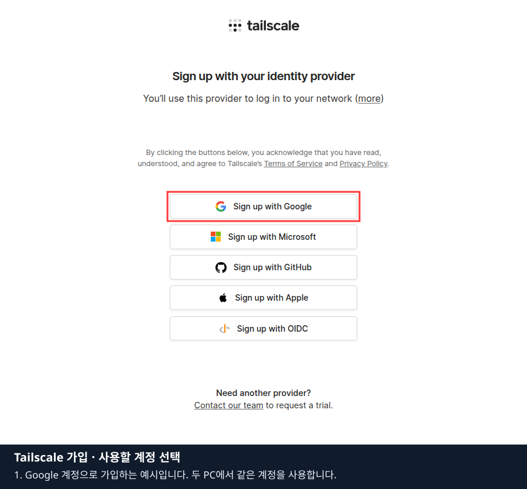
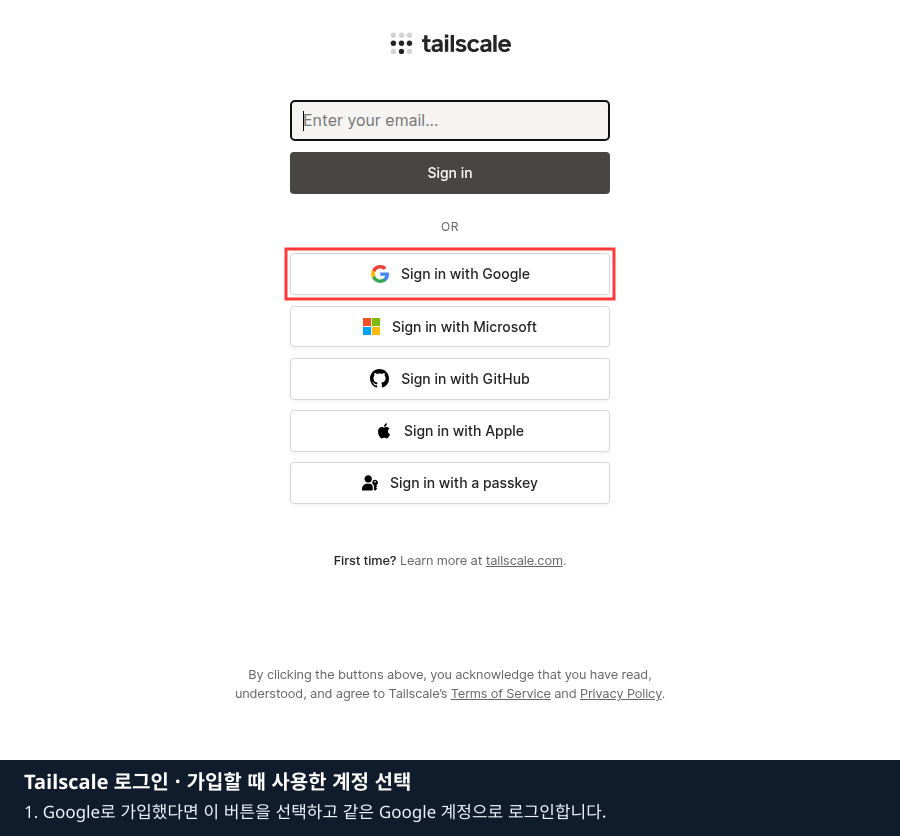
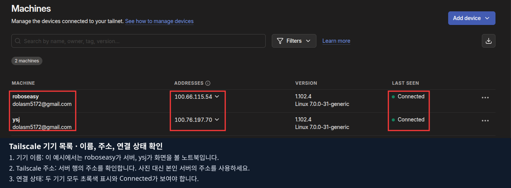
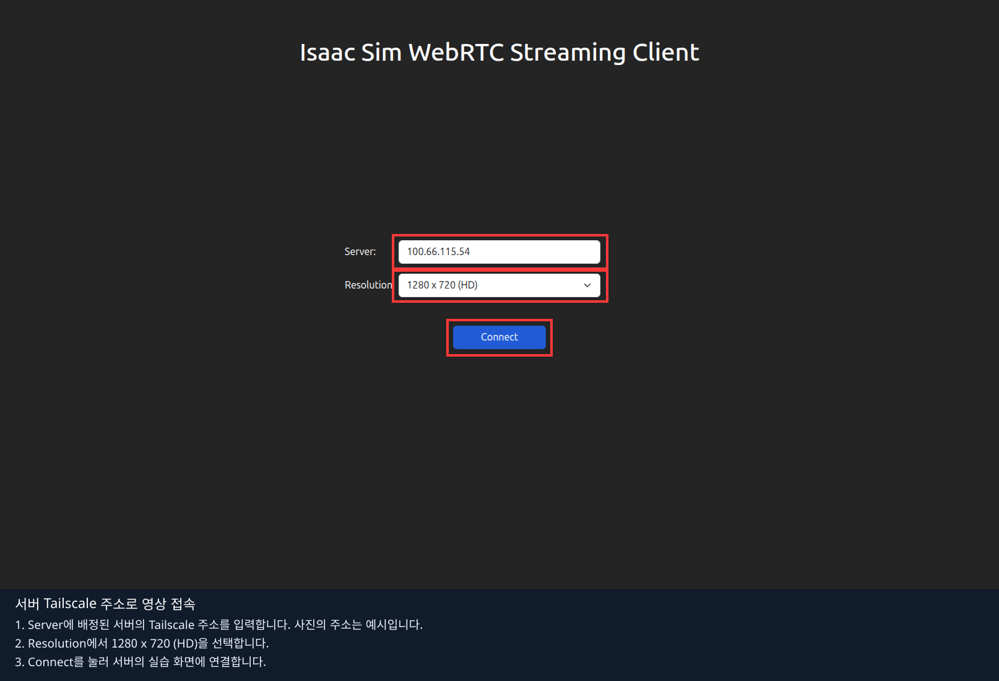

# 0장 · 환경 설정 — Tailscale로 두 컴퓨터 연결하기

**배정받은 데스크탑에서 Isaac Sim을 실행하고, 내 노트북에서 화면을 보고 조작할 수 있도록 준비합니다.**
서로 다른 와이파이나 다른 건물에서도 접속할 수 있도록 Tailscale을 사용합니다.
학생마다 자기 계정으로 **데스크탑 1대 + 노트북 1대**를 하나의 개인 네트워크에 연결합니다.

**처음 읽을 수업 문서는 이 0장 README입니다.** 아래의 **시작 전 · 배정 확인과 교재 받기**부터 순서대로 진행하세요.
저장소 맨 앞의 [README](../../README.md)는 프로젝트 개요와 설치·실행의 상세 참고 문서입니다. 이 장에서 설치 안내 링크를 열었다면 해당 준비를 마친 뒤 이 0장으로 돌아옵니다. 0장의 영상·Play/Stop 확인을 마치면 1장으로 이동합니다.

| 컴퓨터 | 역할 | 이 장에서 준비할 프로그램 |
|---|---|---|
| 배정된 Ubuntu 데스크탑 | GPU로 Isaac Sim 실행·영상 송출 | Tailscale, SSH 서버, 프로젝트 실행 환경 |
| 내 Ubuntu 노트북 | 코드 편집·영상 수신·Play 조작 | Tailscale, SSH 클라이언트, 브라우저, 공식 WebRTC 클라이언트 |

이 장은 Ubuntu 22.04/24.04 x86_64 두 대를 기준으로 합니다. 노트북에는 고성능 NVIDIA GPU가 필요하지 않습니다.
Tailscale은 두 PC의 연결을, WebRTC는 Isaac Sim 화면 전송을 담당합니다.
데스크탑 설치는 AnyDesk로 연 **데스크탑 터미널**, 노트북 설정은 **노트북의 로컬 터미널**에서 진행합니다.
브라우저 편집기 안의 터미널은 3절 이후 실습 명령을 실행할 때 사용합니다.

## 시작 전 · 배정 확인과 교재 받기

강사에게 데스크탑 번호, Ubuntu 로그인 계정, AnyDesk 접속 방법을 받습니다.
강사가 안내한 본인 계정으로 학생별 독립 네트워크를 사용합니다. 학교 계정으로 가입하면서 조직 네트워크가 선택된다면 개인 실습 구성과 같은지 먼저 확인합니다.
공용 데스크탑이 이미 다른 사람의 Tailscale에 연결되어 있다면 배정 상태를 강사와 확인합니다.

이 브랜치의 원격 수업은 다음 폴더에서 진행합니다. **데스크탑에서** 저장소를 받습니다.
Git이 없다면 먼저 `sudo apt update`와 `sudo apt install git`으로 준비합니다.
같은 이름의 폴더가 이미 있으면 새로 덮어쓰지 말고 그 폴더의 브랜치를 확인합니다.

```bash
git clone --branch develop --single-branch https://github.com/SJun99/lekiwi_isaacsim.git lekiwi_classroom
cd lekiwi_classroom
git branch --show-current
```

마지막 출력이 `develop`인지 확인합니다. 이후 데스크탑의 `./lekiwi` 명령은 이 폴더에서 실행합니다.
이 교재는 GitHub에서 읽을 수 있으며, 3절에서 편집기가 열리면 **교재와 Python 실습 → 00_env_setting → README.md**에서도 볼 수 있습니다.

데스크탑의 GPU·드라이버·Docker 설치는 [프로젝트 설치 안내](../../README.md#2-gpu드라이버docker-준비)를 따릅니다.
`test` 브랜치의 사전 점검을 마쳤다면 설치된 드라이버·Docker를 활용하고, 이 브랜치의 수업 이미지는 3절에서 준비합니다.
노트북은 이 장의 화면 확인을 위해 Isaac Sim이나 학습 이미지를 설치할 필요가 없습니다.

## 1. 양쪽 컴퓨터에 Tailscale 설치·같은 본인 계정으로 로그인

먼저 **데스크탑**, 다음으로 **노트북**에서 같은 절차를 진행합니다.

### 1.1. 설치 여부 확인

```bash
tailscale version
```

버전이 표시되면 로그인 단계로 이동합니다. `command not found`이면 아래 공식 설치 명령을 실행합니다.

```bash
sudo apt update
sudo apt install curl
curl -fsSL https://tailscale.com/install.sh | sh
```

설치 명령의 출처는 [Tailscale 공식 Linux 다운로드](https://tailscale.com/download/linux)입니다.

### 1.2. 터미널의 인증 링크를 열고 로그인

`sudo tailscale up`은 **이 PC를 Tailscale 네트워크에 연결하는 명령**입니다. 먼저 각 PC를 Wi-Fi나 유선 인터넷에 연결하세요.
두 PC가 같은 Wi-Fi에 있을 필요는 없습니다. 예를 들어 데스크탑은 회사 인터넷, 노트북은 휴대폰 핫스팟을 사용해도 같은 Tailscale 네트워크로 연결할 수 있습니다. [공식 기기 연결 안내](https://tailscale.com/docs/how-to/connect-to-devices)

설치를 마쳤거나 이미 설치되어 있다면 **등록할 PC의 터미널**에서 실행합니다.

```bash
sudo tailscale up
```

처음 연결하거나 로그아웃한 상태라면 **명령 실행 → 인증 링크 열기 → 브라우저 로그인·기기 인증 완료**까지 진행해야 합니다.
이미 로그인되어 연결된 PC에서는 인증 링크가 나오지 않을 수 있으므로 1.3절의 상태 확인으로 넘어갑니다.
로그인과 연결 상태를 유지한 채 Wi-Fi만 바꿨다면 보통 자동으로 재연결됩니다. 매번 이 명령을 다시 입력하기보다 `tailscale status`와 2절의 ping으로 확인합니다.

인증 링크가 표시되면 브라우저에서 엽니다. 데스크탑 터미널에 나온 링크를 본인 노트북 브라우저에서 열어도 **등록하는 기기는 그 링크를 만든 데스크탑**입니다.

**처음 가입하는 경우:** 사용할 계정의 버튼을 선택합니다. 아래는 Google 계정으로 가입하는 예시입니다. Microsoft·GitHub 등 다른 계정을 사용할 때는 해당 버튼을 선택합니다.



**이미 가입한 경우:** 가입할 때 사용한 방식으로 로그인합니다. Google로 가입했다면 아래의 **Sign in with Google**을 선택하고 같은 Google 계정으로 인증합니다.



계정 선택 화면에서는 **강사가 안내한 본인 계정**인지 확인합니다. 데스크탑과 노트북에서 같은 계정·같은 개인 네트워크를 선택해야 합니다.
Tailscale은 Google 등 기존 계정으로 인증하므로 별도의 Tailscale 비밀번호를 새로 만드는 단계는 없습니다. [공식 로그인 방식 안내](https://tailscale.com/docs/integrations/identity)
`User approval required`가 나오면 조직 관리자의 승인이 필요한 상태입니다. 강사에게 실습 계정·네트워크가 맞는지 확인하고, 승인 대기 화면을 연결 완료로 판단하지 않습니다.

사진은 공식 가입·로그인 페이지의 실제 캡처이며 Google 계정을 사용하는 예시입니다. 계정 선택 이후의 화면은 로그인 방식과 기존 가입 상태에 따라 달라질 수 있습니다.
가입·로그인 링크와 비밀번호는 실습 기록지나 캡처에 넣지 않습니다.

### 1.3. 두 기기가 등록되었는지 확인

브라우저의 인증 안내를 마친 뒤 **원래 명령을 실행한 PC의 터미널**로 돌아옵니다.
웹사이트 로그인만으로 PC 연결까지 완료됐다고 판단하지 말고, 아래 명령으로 각 PC의 상태를 확인합니다.

```bash
tailscale status
```

노트북 브라우저에서 [Tailscale 기기 목록(Machines)](https://login.tailscale.com/admin/machines)을 열어 같은 계정으로 로그인합니다. 데스크탑과 노트북의 이름을 각각 `hostname` 출력과 대조하고, 각 행의 주소와 **Connected** 상태를 확인합니다.
이번 실습의 대상은 **데스크탑과 노트북 두 대**이므로 두 행이 보이는 것이 정상입니다. 계정에 다른 기기가 이미 등록되어 있다면 총 개수 대신 본인의 실습 기기 두 대를 찾아 확인합니다.



사진은 두 Ubuntu PC를 실제로 연결한 예시입니다. `roboseasy`는 **서버 역할의 서브 노트북**, `ysj`는 **화면을 볼 메인 노트북**입니다.
각 행의 **기기 이름 → Tailscale 주소 → Connected**를 차례로 확인하세요. 사진 속 이름과 주소를 그대로 쓰지 말고 본인의 두 PC와 대조합니다.
두 기기가 Connected여도 영상 연결까지 끝난 것은 아닙니다. 이어서 2절의 통신 확인과 3·4절의 영상·조작 확인을 진행합니다.

**완료 기준:** 같은 개인 네트워크의 기기 목록에서 배정된 데스크탑과 노트북을 모두 확인하고, 두 PC의 연결 상태도 확인했습니다.
노트북의 Tailscale은 수업하는 동안 연결 상태로 둡니다.

## 2. 배정된 데스크탑의 Tailscale 주소 확인

**데스크탑 터미널**에서 실행합니다.

```bash
hostname
whoami
tailscale ip -4
```

세 출력은 각각 컴퓨터 이름, Ubuntu 로그인 계정, Tailscale IPv4 주소입니다.
[실습 기록지](worksheet.md)에 적습니다. Tailscale 계정과 Ubuntu 로그인 계정은 용도가 다릅니다.
아래에서는 `100.80.10.20`을 **주소 예시**로 사용합니다. 본인 데스크탑에서 확인한 주소로 바꾸세요.

이번에는 **노트북 로컬 터미널**에서 연결을 확인합니다.

```bash
tailscale ping 100.80.10.20
```

주소 예시를 실제 데스크탑 주소로 바꿔 실행합니다. 응답이 오면 표시되는 지연 시간과 연결 방식을 기록합니다.
직접 연결은 두 PC가 직접 통신하는 방식이고, `DERP`나 relay 표시는 중계 경로를 사용한다는 뜻입니다.
처음 중계를 거치다가 직접 연결로 바뀔 수도 있습니다. **ping 응답만으로 영상 수신 완료를 표시하지 않습니다.**

서로 다른 와이파이 이름이어도 회사 내부에서는 같은 망일 수 있습니다.
외부 접속 검증이 필요하면 노트북을 휴대폰 핫스팟 등 다른 회선에 연결한 조건도 기록합니다.
회선을 바꾼 뒤에는 연결 상태를 확인하고 3·4절의 접속을 다시 확인합니다.

## 3. 기존 LAN 주소 대신 Tailscale 주소로 송출·접속

### 데스크탑 · 수업 실행 환경 준비

데스크탑에서 기존 실습과 GPU 작업의 종료를 확인한 뒤 진행합니다.
`docker info`에 권한 오류가 나지만 `sudo docker info`는 성공하면 같은 터미널에 다음을 설정합니다.

```bash
export LEKIWI_DOCKER_SUDO=1
```

[NVIDIA 라이선스](https://www.nvidia.com/en-us/agreements/enterprise-software/nvidia-software-license-agreement/)에 동의하고,
이 브랜치의 이미지를 아직 준비하지 않았다면 다음을 실행합니다. 최초 준비에는 다운로드·빌드 시간이 필요합니다.

```bash
export ACCEPT_EULA=Y
./lekiwi setup all
./lekiwi remote setup-editor
```

이미 현재 코드로 이미지를 준비했다면 매 수업마다 다시 빌드할 필요는 없습니다.
기존 수업 폴더의 코드를 갱신한 경우에는 [업데이트 절차](../../README.md#업데이트와-브랜치)를 따릅니다.
이번 시작 오류 우회 변경은 `./lekiwi setup sim`으로 이미지를 다시 빌드해야 적용됩니다.
새 터미널에서는 라이선스 동의와 필요한 Docker 권한 설정을 다시 적용합니다.
편집기에 연결할 SSH 서버도 데스크탑에서 한 번 준비합니다.

```bash
sudo apt install openssh-server
sudo systemctl enable --now ssh
```

### 데스크탑 · 편집기 시작

Tailscale이 연결된 데스크탑에서 실행합니다.

```bash
export ACCEPT_EULA=Y
./lekiwi remote workspace --host "$(tailscale ip -4)"
```

이 명령은 **데스크탑 자신의 Tailscale 주소**를 읽어 편집기와 실습 실행기에 전달합니다.
브라우저 편집기는 **VS Code 기반의 code-server**입니다. 노트북 브라우저에서 서버의 수업 파일을 편집하고 실습 명령을 실행합니다.
**편집기용 비밀번호를 만드는 단계는 없습니다.** 아래에서 서버의 Ubuntu 계정으로 SSH 인증을 마치면 브라우저에서 편집기를 바로 엽니다.
`LEKIWI_WORKSPACE ready`가 표시되면 이 터미널을 열어 둡니다. 이어서 **실제 서버 계정과 주소가 채워진 SSH 명령**이 출력됩니다.
아직 본 노트북의 브라우저를 열 단계는 아닙니다. 아래 SSH 연결을 먼저 진행합니다.

### 노트북 · 브라우저 편집기 연결

**본 노트북에서 새 로컬 터미널을 열고, 서버에 출력된 `ssh -N ...` 한 줄을 그대로 복사해 실행합니다.** 서버에 SSH로 접속해 둔 터미널과 구분하세요.
`127.0.0.1`은 브라우저를 연 컴퓨터 자신을 뜻합니다. SSH 연결이 본 노트북의 8080을 서버 편집기에 이어 주므로 이 단계가 먼저 필요합니다.

아래는 직접 작성할 때 참고하는 **명령 형식**입니다. 마지막의 `데스크탑계정@데스크탑_Tailscale_IP`를 2절에서 기록한 값으로 바꿉니다.
예를 들어 Ubuntu 계정이 `student`이고 주소가 `100.80.10.20`이면 `student@100.80.10.20`입니다.
`ssh`가 없으면 노트북에서 `sudo apt update` 후 `sudo apt install openssh-client`로 준비합니다.

```bash
ssh -N -o ExitOnForwardFailure=yes -o ServerAliveInterval=30 \
  -L 127.0.0.1:8080:127.0.0.1:8080 데스크탑계정@데스크탑_Tailscale_IP
```

첫 접속의 서버 키를 확인하고 데스크탑 Ubuntu 계정으로 인증합니다.
비밀번호를 묻는 줄의 `계정@주소`가 본인 서버 정보와 일치하는지 확인합니다. `사용자명@...`이나 `데스크탑계정@...`이 그대로 보이면 예시 문구를 입력한 것이므로 `Ctrl+C`로 취소하고 실제 계정으로 다시 실행합니다.
이 실습에서 서버의 `whoami`가 `roboseasy`였다면 접속 계정도 `roboseasy`입니다. 비밀번호 입력 중 화면에 글자가 표시되지 않는 것은 정상입니다.
오류 없이 대기하면 터널이 열린 것이므로 터미널을 유지합니다.
노트북 브라우저에서 **http://127.0.0.1:8080**을 열면 **별도 로그인 없이 편집기가 표시**됩니다.
편집기는 서버 내부 주소에만 열려 있으므로 수업하는 동안 SSH 터널을 유지합니다.

이전 버전의 비밀번호 입력이나 로그인 화면이 보인다면 실행기를 종료하고,
코드를 갱신한 서버에서 `./lekiwi remote setup-editor`를 실행해 편집기 이미지를 다시 빌드한 뒤 실행기를 시작합니다.

8080이 이미 사용 중이면 위 명령의 `127.0.0.1:8080:127.0.0.1:8080`을 `127.0.0.1:8081:127.0.0.1:8080`으로 바꾸고
브라우저에서도 **http://127.0.0.1:8081**을 엽니다. 다른 프로그램은 임의로 종료하지 않습니다.

### 브라우저 편집기 · 확인용 장면 실행

편집기에서 **Terminal → New Terminal**을 엽니다. 연결 확인에는 1장의 중력·충돌 예제를 사용합니다.

```bash
lesson run --experiment 3
lesson status
```

`STARTING`은 Isaac Sim이 장면을 준비 중이라는 뜻입니다. **처음 실행하거나 새 수업 폴더에서 시작하면 GPU 화면 처리에 필요한 자료(셰이더 캐시)를 만들면서 몇 분 걸릴 수 있습니다.** [NVIDIA의 최초 실행 안내](https://docs.isaacsim.omniverse.nvidia.com/5.1.0/installation/install_container.html#container-deployment)
**이미 출력된 상태는 자동으로 갱신되지 않습니다.** 20~30초 정도 기다린 뒤 `lesson status`만 다시 입력해 확인합니다. `READY`가 나오면 영상 클라이언트로 넘어갑니다.
`FAILED`가 나오거나 오래 기다려도 준비 상태가 계속되면 `lesson logs`의 출력과 표시된 Isaac 로그 경로를 강사에게 전달합니다. `lesson run`을 반복해 새 실습을 중복으로 띄우지 않습니다.

### 노트북 · Isaac Sim 영상 연결

노트북에서 [공식 다운로드](https://docs.isaacsim.omniverse.nvidia.com/5.1.0/installation/download.html)의
**Isaac Sim WebRTC Streaming Client 1.1.5 → Linux (x86_64)**를 받습니다.
`test` 사전 점검에서 같은 클라이언트를 이미 준비했다면 그 프로그램을 사용해도 됩니다.
처음 실행한다면 **본 노트북에서 AppImage 파일이 있는 폴더**를 엽니다. 파일 관리자의 빈 공간을 우클릭 → **터미널에서 열기**를 선택합니다.
예를 들어 Downloads에 받았다면 `~/Downloads`에서 실행합니다. 수업 프로젝트 폴더와는 별개이며, 아래 파일명이 실제 다운로드한 파일명과 같은지 확인하세요.

```bash
chmod u+x isaacsim-webrtc-streaming-client-1.1.5-linux-x64.AppImage
./isaacsim-webrtc-streaming-client-1.1.5-linux-x64.AppImage --appimage-extract
APPDIR="$PWD/squashfs-root" ./squashfs-root/AppRun
```

이 방법은 FUSE 설치 없이 실행 파일을 풉니다. 다음에는 같은 폴더에서 마지막 줄만 실행합니다.
`No usable sandbox` 또는 `chrome-sandbox` 오류가 나온 경우에는 다음 방법을 사용합니다.

```bash
APPDIR="$PWD/squashfs-root" ./squashfs-root/AppRun --no-sandbox
```

`APPDIR`은 압축이 풀린 프로그램 폴더의 위치입니다. 이 버전의 실행 스크립트가 옵션을 받으면 경로를 잘못 찾을 수 있어 명시합니다.
`/isaacsim-webrtc-streaming-client: No such file or directory`가 나왔다면, `squashfs-root`가 있는 폴더에서 위 명령 전체를 다시 실행합니다.

`--no-sandbox`는 해당 클라이언트 프로세스의 Chromium sandbox를 해제합니다. 시스템 전체 보안 설정은 변경하지 않으며,
오류가 있을 때만 사용합니다. [공식 클라이언트 안내](https://docs.isaacsim.omniverse.nvidia.com/5.1.0/installation/manual_livestream_clients.html)

클라이언트의 **Server**에 2절의 **데스크탑 Tailscale 주소**를 입력하고 **Connect**합니다.



사진의 주소는 검증 장비의 예시입니다. 본인에게 배정된 데스크탑 주소를 입력합니다.
브라우저 편집기는 코드를, 별도의 WebRTC 클라이언트는 Isaac Sim 화면을 보여줍니다.

| 주소를 넣는 곳 | 넣을 주소 |
|---|---|
| 데스크탑 `remote workspace --host` | 데스크탑의 Tailscale IPv4 |
| 노트북 SSH의 `계정@주소` | 같은 데스크탑의 Tailscale IPv4 |
| WebRTC 클라이언트의 Server | 같은 데스크탑의 Tailscale IPv4 |
| 노트북 브라우저 주소창 | `http://127.0.0.1:8080` 또는 선택한 로컬 포트 |

## 4. 영상과 Play 조작 확인 후 결과 제출

**WebRTC 영상 창**에서 다음을 직접 관찰합니다.

1. 바닥과 공중에 있는 파란 큐브, Stage·Property·Play/Stop이 보입니다.
2. 영상 안을 클릭해 입력 초점을 주고 왼쪽 **Play**를 누릅니다.
3. 큐브가 떨어져 바닥에 멈춥니다.
4. **Stop**을 누르면 시작 위치로 돌아오고, 다시 **Play**를 누르면 같은 동작을 합니다.

**완료 기준은 노트북에서 영상과 Play·Stop 동작을 모두 확인하는 것입니다.**
`READY`나 ping 성공은 이 관찰 결과를 대신하지 않습니다.

[실습 기록지](worksheet.md)를 본인 노트북이나 강사가 지정한 제출 공간에 복사해 작성합니다.
브라우저의 교재 폴더는 읽기 전용이므로 원본 기록지에 직접 저장하지 않습니다.
강사가 지정한 방식으로 **데스크탑 번호 / 사용한 네트워크 / 연결 지연 / 영상 수신 / Play·Stop 결과 / 오류**를 제출합니다.
화면을 첨부할 때 계정 로그인 화면이나 인증 링크 대신 큐브가 보이는 실습 화면을 사용합니다.

계속 수업한다면 브라우저 터미널에서 확인용 실습을 종료하고 [1장](../01_object_physics/README.md)으로 이동합니다.

```bash
lesson stop
```

1장은 빈 편집 화면에서 시작합니다. [1장 본문](../01_object_physics/README.md)의 첫 실행 명령으로 화면을 열고
마우스로 바닥·큐브·물리 속성을 직접 만든 뒤, 장 마지막에서 코드 구현을 확인합니다.
**아래 5절은 수업을 모두 마치고 공용 데스크탑을 반납할 때 진행합니다.**

### 다음 날 또는 Wi-Fi를 바꾼 뒤 다시 시작하기

설치와 계정 등록을 마친 두 PC를 다시 사용할 때는 다음 순서로 진행합니다.

1. 양쪽 인터넷 연결과 `tailscale status`를 확인하고, 데스크탑에서 `tailscale ip -4`로 주소를 다시 확인합니다.
2. 노트북에서 그 주소로 `tailscale ping`을 확인합니다. 로그인 상태가 유지돼 있으면 `tailscale up`을 다시 실행할 필요는 없습니다.
3. 3절의 **데스크탑 편집기 시작 → 노트북 SSH 터널 → 브라우저 → 확인용 장면 → WebRTC 연결**을 순서대로 진행합니다.
4. 4절의 Play·Stop을 확인하고 `lesson stop` 후 1장으로 이동합니다.

기존 편집기·터널이 실행 중이면 같은 것을 사용합니다. 연결이 끊겨 종료됐다면 해당 실행만 다시 시작합니다.
이전에 저장한 USD·시연·학습 결과는 보존하고, 다시 실습할 때는 새 파일·데이터셋·학습 이름을 사용합니다.
휴대폰 핫스팟으로 별도 회선을 검사할 때는 휴대폰의 Wi-Fi를 끄고 모바일 데이터를 사용합니다.

## 5. 공용 데스크탑 반납 시 개인 Tailscale 연결 해제

수집·학습 결과와 필요한 실습 파일을 먼저 보관하고 제출합니다.
로그아웃 뒤에는 Tailscale을 통한 SSH와 영상 연결이 끊기므로, 마지막 확인은 데스크탑에서 직접 하거나 AnyDesk로 진행합니다.

1. 브라우저 터미널에서 `lesson stop`으로 실습을 종료합니다. 학습 중이라면 `lesson train stop`으로 종료하고 상태를 확인합니다.
2. WebRTC 클라이언트를 닫습니다. 데스크탑의 편집기 실행 터미널에서 Ctrl+C로 편집기를 종료합니다.
3. 노트북에서 SSH 터널을 유지하던 터미널도 Ctrl+C로 종료합니다.
4. **데스크탑 터미널**에서 본인 Tailscale 로그인을 해제합니다.

```bash
sudo tailscale logout
tailscale status
```

`Logged out` 등 로그인되지 않은 상태인지 확인합니다. `tailscale down`은 연결만 잠시 끄는 명령이므로 반납 시에는 `logout`을 사용합니다.
노트북에서 본인의 [Tailscale 관리 페이지](https://login.tailscale.com/admin/machines)를 열어,
기록해 둔 이름·주소와 일치하는 **반납 데스크탑**의 메뉴에서 **Remove**를 선택하고 목록에서 제거됐는지 확인합니다.
본인 노트북과 다른 사람의 기기는 제거하지 않습니다.

데스크탑 브라우저에 본인의 Tailscale·Google·GitHub 로그인 세션을 사용했다면 로그아웃하고 개인 창을 닫습니다.
Docker·NVIDIA 드라이버·다른 사람의 파일은 다음 수업에도 쓰이므로 유지합니다.
반납 기록에 **데스크탑 로그아웃 확인 / 관리 목록에서 해당 기기 제거 확인**을 남깁니다.

## 연결이 안 될 때

| 상태 | 확인할 내용 |
|---|---|
| Tailscale 목록에 상대 PC가 없음 | 양쪽 로그인 계정과 선택한 개인 네트워크, 상대 PC 전원·Tailscale 연결 |
| ping 응답 없음 | 서버 주소를 다시 확인하고 양쪽 Tailscale·인터넷 상태 확인 |
| SSH 연결 실패 | 데스크탑 Ubuntu 계정, SSH 서비스, TCP 22 접근 가능 여부 |
| 편집기는 열리지만 영상이 안 나옴 | `lesson status`, 클라이언트 Server 주소, TCP 49100·UDP 47998 통신 |
| 영상은 보이지만 큐브가 떨어지지 않음 | 영상 창 클릭 후 Play, 실행한 예제가 `--experiment 3`인지 확인 |
| 중계 연결 또는 영상 지연 | 연결 방식·지연·증상을 기록하고 강사에게 전달. 서버 유선 연결과 다른 회선에서도 비교 |
| 반납 전 연결이 끊겨 로그아웃 확인 불가 | 데스크탑 직접 접속 또는 AnyDesk로 현재 상태 확인 |

방화벽을 전체 해제하거나 공유기 설정을 임의로 바꾸지 않습니다. 필요한 통신을 강사·관리자와 확인합니다.
0장의 확인 범위는 두 PC의 접속·영상·Play/Stop입니다.
수업 중 조작 지연·끊김 대처는 [4장 텔레옵](../04_teleoperation/README.md#47-실습-중-늦어지거나-끊기면),
녹화 중단 후 저장·재시작은 [6장 데이터 취득](../06_lekiwi_dataset/README.md#기록-중-연결이-끊기면)에서 다룹니다.
15쌍 동시 사용 성능은 별도 리허설에서 확인합니다.

[실습 기록지](worksheet.md) · [공식 자료와 확인 범위](SOURCES.md) · [교재 목차](../README.md) · [다음: 1장](../01_object_physics/README.md)
