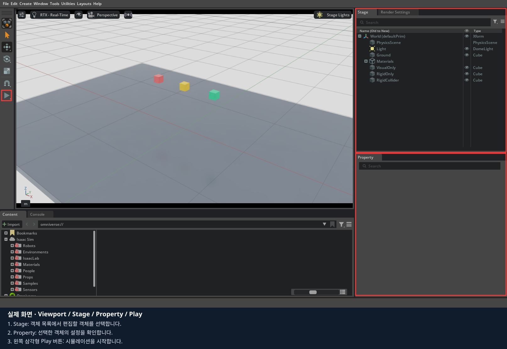

# 0장 · 환경 설정 — 노트북 한 대로 수업 준비하기

**배정받은 Ubuntu NVIDIA GPU 노트북 한 대에서 코드 편집, Isaac Sim 화면, 리더암 조작, 데이터 수집과 학습을 진행합니다.**
리더암 USB도 이 노트북에 연결합니다. 장비 연결과 보정은 4장에서 확인하고 5장 데이터 취득에도 같은 리더를 사용합니다.

처음에는 **이 README를 위에서 아래로** 따라갑니다. 저장소 맨 앞의 [README](../../README.md)는 전체 기능을 찾아보는 참고 문서입니다.
**0장에서는 학생이 직접 교재를 받고 VS Code 설치 → GPU·Docker 준비 → 이미지 빌드 → 실행 검사를 진행합니다.**
강사가 이미 설치·빌드한 노트북을 전제로 하지 않습니다. 화면·Play/Stop 확인까지 마친 뒤 1장으로 넘어갑니다.
VS Code 설치 전에는 강사가 제공한 이 교재 링크를 브라우저에서 읽고 Ubuntu 터미널에서 명령을 입력합니다.

| 준비물 | 용도 |
|---|---|
| Ubuntu 22.04/24.04 x86_64 NVIDIA GPU 노트북과 전원 어댑터 | 실습 전체 실행. 수업 중 전원 연결 |
| 인터넷 | 저장소·Docker 이미지·필요한 모델 다운로드, 선택한 데이터셋 업로드 |
| Ubuntu 로그인 계정과 sudo 사용 권한 | VS Code·드라이버·Docker 설치. 본인 노트북의 로그인 비밀번호 사용 |
| VS Code | 이 장에서 설치하고 교재 읽기·Python 파일 수정에 사용 |
| SO101 리더암·USB·전원 | 4장 텔레옵·5장 데이터 취득에서 같은 노트북에 연결 |

대여 RTX 3070 노트북도 아래 실행 검사로 준비 상태를 확인합니다. GPU 이름만으로 모든 실습과 학습의 성능을 보장하지 않습니다.
Tailscale, AnyDesk, SSH 터널, 브라우저 편집기, WebRTC 클라이언트 설치 단계는 이번 수업에 없습니다.
최초 다운로드·빌드·재부팅 시간은 노트북과 인터넷 환경에 따라 달라집니다. 15대가 동시에 내려받으면 더 오래 걸릴 수 있습니다.
각 단계의 완료 메시지를 확인하고 진행합니다. 설치가 끝나기 전에 다음 실행 명령을 겹쳐 입력하지 않습니다.

## 1. 교재 받기

노트북의 Ubuntu 바탕화면에서 `Ctrl+Alt+T`로 터미널을 엽니다. Git이 없다면 `sudo apt update`와 `sudo apt install git`으로 준비합니다.
로보시지 멤버스의 공개 수업 저장소를 받습니다. GitHub 로그인이나 별도 접근 권한 없이 내려받을 수 있습니다.
교재를 둘 폴더에서 실행합니다. 기존 폴더를 덮어쓰거나 지우지 않습니다.

```bash
git clone --branch develop --single-branch https://github.com/roboseasy-members/lekiwi_isaacsim.git lekiwi_classroom
cd lekiwi_classroom
git branch --show-current
pwd
ls lekiwi
```

브랜치는 `develop`, 마지막 출력은 `lekiwi`인지 확인합니다.
**이후 `./lekiwi` 명령은 항상 이 저장소 최상위 폴더에서 실행합니다.**
`isaacsim_basic` 폴더 안에서 실행하면 `No such file or directory`가 납니다.
새 터미널을 열었다면 방금 `pwd`에 나온 실제 폴더로 `cd`한 뒤 실행하세요.

## 2. VS Code 설치하고 교재 열기

**지금 사용하는 Ubuntu 노트북에 VS Code 앱을 설치합니다.** Docker 안이나 다른 컴퓨터에 설치하는 단계가 아닙니다.
1절에서 사용한 터미널에서 먼저 확인합니다.

```bash
code --version
```

버전이 나오면 설치되어 있으므로 아래 설치 명령을 건너뜁니다. `code: command not found`이면 다음으로 진행합니다.

### 2.1. VS Code가 없으면 설치하기

Ubuntu의 Snap을 사용합니다. 아래는 [VS Code 공식 Linux 설치 안내](https://code.visualstudio.com/docs/setup/linux)의 설치 방법입니다.

```bash
snap --version
```

버전이 표시되면 설치합니다.

```bash
sudo snap install --classic code
```

`sudo` 비밀번호는 **지금 노트북의 Ubuntu 로그인 비밀번호**입니다. 입력 중 글자나 별표가 보이지 않아도 입력되고 있습니다.
설치 완료 후 `code --version`을 다시 실행해 버전을 확인합니다. 설치가 진행 중이면 같은 명령을 반복하지 않습니다.

`snap: command not found`이거나 Snap 다운로드가 차단된 경우에는 [공식 Linux 설치 안내](https://code.visualstudio.com/docs/setup/linux)의
**Debian and Ubuntu-based distributions** 항목에 있는 `.deb` 설치 방법을 강사와 함께 사용합니다. 실패한 설치의 마지막 오류를 보여 주세요.
VS Code가 정상 설치됐다면 두 방법을 모두 실행할 필요는 없습니다.

### 2.2. 프로젝트 폴더와 교재 열기

저장소 최상위 폴더에서 실행합니다. `.`은 지금 터미널이 위치한 폴더를 뜻합니다.

```bash
pwd
ls lekiwi
code .
```

1. 같은 노트북에 VS Code 창이 열리는지 확인합니다.
2. 다른 폴더가 열렸다면 `File > Open Folder`에서 1절의 `pwd`에 나온 실제 `lekiwi_classroom` 폴더를 선택합니다.
3. 왼쪽 탐색기에서 `isaacsim_basic > 00_env_setting > README.md`를 엽니다.
4. `Ctrl+Shift+V`를 눌러 Markdown 미리보기로 교재를 읽습니다.
5. `Terminal > New Terminal`로 VS Code 터미널을 열고 `pwd`, `ls lekiwi`로 저장소 최상위 폴더인지 확인합니다.

**완료 기준:** VS Code 창에서 교재가 보이고, 터미널의 `ls lekiwi`가 실행 파일을 찾습니다.
처음 열었던 Ubuntu 터미널을 계속 사용해도 됩니다. 다음 설치는 선택한 터미널 한 곳에서 진행합니다.
편집기 접속 주소나 별도 비밀번호를 만들지 않습니다. Python 파일 수정은 각 장 마지막에서 합니다.

## 3. GPU·Docker 준비와 이미지 빌드

### 3.1. 설치할 항목 확인하기

먼저 읽기 전용 검사로 현재 상태를 확인합니다.

```bash
./lekiwi install --check
```

`check=PASS`는 준비 절차를 진행할 수 있다는 뜻입니다. Isaac Sim 창이 실행됐다는 뜻은 아닙니다.
터미널에 나온 GPU·OS와 설치 계획을 읽습니다. 실패하면 마지막 오류를 강사에게 보여 주고 원인부터 확인합니다.
이미 작업하던 수업 폴더를 업데이트하는 경우에는 먼저 [업데이트 절차](../../README.md#업데이트와-브랜치)에 따라 기존 작업을 보관합니다.

### 3.2. 학생이 직접 설치·빌드 실행하기

[NVIDIA 라이선스](https://www.nvidia.com/en-us/agreements/enterprise-software/nvidia-software-license-agreement/)를 읽고 동의한 경우, 실습할 터미널에 설정합니다.

```bash
export ACCEPT_EULA=Y
export LEKIWI_DISPLAY_MODE=local
./lekiwi install
```

**설치 도구가 수행하는 순서**는 다음과 같습니다. 각 단계의 설치 계획을 읽고 동의할 때 `y`를 직접 입력합니다.

| 단계 | 하는 일 | 학생이 확인할 것 |
|---|---|---|
| 드라이버 | GPU에 맞는 프로젝트 지원 드라이버를 준비 | 교체·재부팅 안내가 있는지 |
| Docker | Docker Engine·Compose·Buildx와 NVIDIA Container Toolkit을 준비 | 필요한 설치와 Docker 재시작 확인 |
| 이미지 빌드 | Isaac Sim·LeRobot 실행 환경을 내려받아 이미지 생성 | 빌드 로그가 진행 중인지, 오류로 끝났는지 |
| 실행 검사 | CUDA 연산·두 카메라·짧은 기록 검사 | 마지막 `verification=PASS` |

`./lekiwi install`이 내부에서 `./lekiwi setup all`을 실행하므로 **같은 빌드를 별도로 다시 실행하지 않습니다.**
이미 준비된 항목은 확인해 재사용하며 이미지 빌드는 캐시를 사용합니다. 드라이버 정책·지원 범위는 [설치 상세 안내](../../docs/student-setup.md)를 참고합니다.

전체 명령을 `sudo ./lekiwi install`로 실행하지 않습니다. 필요한 단계에서 도구가 sudo 인증을 요청합니다.
APT·Secure Boot에서 추가 질문이 나올 수 있으므로 안내를 읽고 진행합니다. 여러 터미널에서 설치를 동시에 실행하지 않습니다.

### 3.3. 재부팅 안내가 나오면 이어서 진행하기

드라이버 설치 또는 운영체제 상태 때문에 재부팅을 요청하면 다음 순서로 진행합니다. 자동으로 재부팅되지는 않습니다.

1. 편집 중인 파일을 저장하고 실행 중인 작업을 정상 종료합니다.
2. Ubuntu 메뉴에서 재시작합니다. Secure Boot의 파란 MOK 등록 화면이 나오면 [아래 등록 화면 안내](#mok-boot-screen)에 따라 진행합니다. 이때 드라이버 설치 중 정한 임시 비밀번호가 필요합니다.
3. 로그인 후 VS Code에서 같은 프로젝트 폴더를 다시 엽니다.
4. 새 터미널을 열고 `pwd`, `ls lekiwi`로 위치를 확인합니다.
5. 라이선스 동의 설정과 로컬 화면 설정을 다시 적용하고 설치를 이어갑니다.

```bash
export ACCEPT_EULA=Y
export LEKIWI_DISPLAY_MODE=local
./lekiwi install
```

저장소를 다시 clone하거나 기존 폴더를 지우지 않습니다. 재부팅 후에도 아래 오류가 나오면 설치를 반복하지 말고 다음 절차로 원인을 확인합니다.

```text
중단: 재부팅 후에도 580 계열(580.65.06 이상) 드라이버가 준비되지 않았습니다.
nvidia-smi의 실제 버전과 Secure Boot의 MOK 등록을 확인하세요. 자동 재설치는 하지 않습니다.
```

#### 3.3.1. 드라이버 설치 상태와 MOK 등록 여부 확인하기

**오류가 발생한 노트북의 Ubuntu 터미널**에서 실행합니다. 폴더 위치는 상관없으며 아래 명령은 상태만 확인합니다.

```bash
nvidia-smi
uname -r
dkms status
mokutil --sb-state
sudo mokutil --test-key /var/lib/shim-signed/mok/MOK.der
```

`sudo` 비밀번호는 지금 노트북의 Ubuntu 로그인 비밀번호입니다. 입력 중 글자나 별표가 보이지 않아도 정상입니다.

다음은 실제 수업 준비 중 확인한 **MOK 미등록 사례**입니다. 버전·커널 번호는 노트북마다 다를 수 있습니다.

| 확인한 출력 | 뜻 |
|---|---|
| `nvidia-smi`에서 `couldn't communicate with the NVIDIA driver` | GPU 드라이버와 통신하지 못함 |
| `uname -r`에서 `6.17.0-35-generic` | 현재 실행 중인 커널 버전 |
| `dkms status`에서 `nvidia/580.178.04, 6.17.0-35-generic, x86_64: installed` | 이 커널용 드라이버는 설치됨. 실제 로드 성공과는 다름 |
| `SecureBoot enabled` | 부팅 시 드라이버 서명을 검사하는 보안 기능이 켜져 있음 |
| `MOK.der is not enrolled` | 해당 드라이버 서명을 신뢰하도록 하는 키가 아직 등록되지 않음 |

**현재 커널용 드라이버가 설치돼 있고, Secure Boot가 켜져 있으며, 키가 `not enrolled`인 경우** 아래 등록 절차를 진행합니다.
MOK는 이 노트북에서 만든 드라이버의 서명을 신뢰하도록 등록하는 키입니다. 등록하지 않으면 Secure Boot가 해당 드라이버의 로드를 막을 수 있습니다.
[Ubuntu Secure Boot 설명](https://documentation.ubuntu.com/security/security-features/platform-protections/secure-boot/)

파일이 없다는 오류, `dkms: command not found`, 현재 커널과 다른 DKMS 결과, `SecureBoot disabled`, 이미 등록됐다는 결과라면
이 사례와 조건이 다릅니다. **MOK 미등록으로 단정하지 말고 위 출력 전체를 강사에게 보여 주세요.**
`nvidia-smi`가 정상이어도 드라이버가 580 계열이 아니면 설치기의 준비 완료 조건을 충족하지 않습니다.

#### 3.3.2. 등록을 요청하고 임시 비밀번호 정하기

위 조건에 해당하면 같은 터미널에서 한 번 실행합니다.

```bash
sudo mokutil --import /var/lib/shim-signed/mok/MOK.der
```

| 터미널에 나타나는 문구 | 입력할 내용 |
|---|---|
| `[sudo] password for ...:` | Ubuntu 로그인 비밀번호. 최근에 인증했다면 생략될 수 있음 |
| `input password:` | **재부팅 때 사용할 임시 비밀번호를 새로 정해** 입력 |
| `input password again:` | 방금 정한 임시 비밀번호를 한 번 더 입력 |

임시 비밀번호는 영문·숫자로 정하고 기억해 둡니다. Ubuntu 로그인 비밀번호를 변경하는 과정이 아닙니다.
입력 중 문자가 보이지 않아도 정상입니다. 비밀번호 자체를 채팅·교재·저장소에 기록하지 않습니다.

오류 없이 원래 터미널 프롬프트로 돌아오면 아래 단계로 진행합니다. 별도의 `Success` 문구가 없어도 됩니다.
**이 명령은 등록 요청만 만듭니다. 재부팅 화면에서 승인해야 등록이 완료됩니다.**
[Ubuntu mokutil 명령 설명](https://manpages.ubuntu.com/manpages/noble/man1/mokutil.1.html)

<a id="mok-boot-screen"></a>

#### 3.3.3. 재부팅 화면에서 Enroll MOK 선택하기

열어 둔 파일을 저장하고 실행 중인 작업을 정상 종료합니다. 아래 순서를 읽어 둔 뒤 재부팅합니다.
부팅 화면은 **이 노트북의 화면과 키보드로 직접 조작**합니다.

```bash
sudo reboot
```

1. 부팅 중 `Press any key…` 안내가 나오면 시간이 지나기 전에 아무 키나 누릅니다.
2. 파란색 **Perform MOK management** 화면에서 방향키로 **Enroll MOK**를 선택하고 Enter를 누릅니다.
3. 다음 화면에서 **Continue**를 선택하고 Enter를 누릅니다.
4. 키 등록 여부를 묻는 화면에서 **Yes**를 선택하고 Enter를 누릅니다.
5. Password 입력 화면에서 **방금 `mokutil --import`에 입력한 임시 비밀번호**를 입력하고 Enter를 누릅니다.
6. 관리 메뉴로 돌아오면 **Reboot**를 선택합니다. Ubuntu 로그인 화면이 나올 때까지 기다립니다.

선택 순서는 **Enroll MOK → Continue → Yes → 임시 비밀번호 → Reboot**입니다.
처음 메뉴의 **Continue boot**는 등록을 건너뛰고 부팅하는 항목입니다. 중간 단계의 **Continue**와 구분합니다.
드라이버 설치 중 이미 임시 비밀번호를 정하고 처음 재부팅하는 경우에는 그때 정한 비밀번호를 사용합니다.
[Ubuntu 공식 MOK 등록 화면 순서](https://iso.qa.ubuntu.com/qatracker/testcases/1771/revisions/2031/info)

파란 화면이 나타나지 않았거나 `Enroll MOK`가 없었다면 Ubuntu에 로그인한 뒤 아래 두 결과를 강사에게 보여 주세요.
첫 명령은 이미 등록됐는지, 두 번째는 등록을 기다리는 요청이 있는지 확인합니다.

```bash
sudo mokutil --test-key /var/lib/shim-signed/mok/MOK.der
sudo mokutil --list-new
```

#### 3.3.4. 등록과 GPU 인식을 확인하고 설치 이어가기

Ubuntu 바탕화면으로 돌아오면 터미널에서 실행합니다.

```bash
sudo mokutil --test-key /var/lib/shim-signed/mok/MOK.der
nvidia-smi
```

**두 가지를 모두 확인합니다.**

- 첫 명령에 **`MOK.der is already enrolled`**가 표시됩니다.
- `nvidia-smi`에 GPU 정보 표가 나오고 **Driver Version이 580 계열이며 580.65.06 이상**입니다. `CUDA Version` 칸과 구분합니다.

두 항목을 확인했으면 VS Code에서 기존 수업 폴더를 열고 새 터미널에서 `pwd`, `ls lekiwi`로 저장소 최상위 위치인지 확인합니다.
같은 터미널에서 설정을 다시 적용하고 설치를 이어갑니다.

```bash
export ACCEPT_EULA=Y
export LEKIWI_DISPLAY_MODE=local
./lekiwi install
```

정상이라면 현재 드라이버를 유지하고 Docker·이미지 빌드·실행 검사로 넘어갑니다.
키는 등록됐는데 GPU 정보가 나오지 않거나 같은 중단 메시지가 반복되면, 결과를 강사에게 보여 주고 원인을 확인합니다.
드라이버 설치 상태 파일을 지워 강제로 재설치하지 않습니다. **MOK 등록만으로 설치 전체가 완료된 것은 아니며**, 다음 절의 `verification=PASS`까지 확인합니다.

### 3.4. 설치 완료 확인과 이후 Docker 권한 설정

**완료 기준:** 설치 마지막에 `LEKIWI_INSTALL verification=PASS`가 표시됩니다.
이 명령은 창 없이 GPU·카메라·짧은 기록을 검사하며 USB 리더에는 연결하지 않습니다. GUI와 Play/Stop은 다음 절에서 직접 확인합니다.

설치 도구 안에서 사용한 Docker 권한 설정은 부모 터미널에 자동으로 남지 않습니다. 이후 실습 전에 확인합니다.

```bash
docker info
```

권한 오류가 나면 `sudo docker info`를 확인합니다. **일반 명령은 권한 오류이고 sudo 명령은 성공하는 경우에만** 같은 터미널에서 설정합니다.

```bash
export LEKIWI_DOCKER_SUDO=1
```

`sudo docker info`도 실패하면 단순 권한 문제로 판단하지 말고 오류를 강사에게 보여 줍니다.
프로젝트 전체를 `sudo ./lekiwi ...`로 실행하지 않습니다. 새 터미널이나 재부팅 후에는 필요한 `export` 설정을 다시 적용합니다.

설치가 PASS로 끝났다면 다음 GUI 확인으로 이동합니다. **이미 설치를 마친 노트북에서 나중에 검사만 다시 할 때** 아래 명령을 사용합니다.
이미지가 없는 노트북은 `--verify`만 실행해도 이미지가 만들어지지 않으므로 먼저 `./lekiwi install`을 완료해야 합니다.

```bash
./lekiwi install --verify
```

실패하면 마지막 오류와 로그 경로를 강사에게 보여줍니다. 설치와 검사가 완료되면 매 실습마다 다시 빌드할 필요는 없습니다.
호스트에 Isaac Sim·LeRobot·Conda·CUDA Toolkit을 따로 설치하는 수업이 아닙니다. 실습 의존성은 Docker 이미지에 있습니다.

## 4. Isaac Sim 화면과 Play/Stop 확인

저장소 최상위 폴더의 터미널에서 실행합니다.

```bash
./lekiwi basic --experiment 3
```

**같은 노트북에 Isaac Sim 창이 직접 열립니다.** 처음에는 캐시·셰이더 준비로 시간이 걸릴 수 있습니다.
터미널을 유지하며 기다리고, 같은 명령을 여러 번 실행하지 않습니다.
**이 명령의 시작 화면에는 넓은 회색 바닥과 공중에 떠 있는 파란 큐브 한 개가 보입니다.**
파란 큐브 한 개가 맞습니다. 중력과 바닥 충돌을 확인하는 예제를 미리 열어 둔 것이며, 학생이 큐브를 추가할 필요는 없습니다.
화면이 나타나고 마우스 조작이 가능해지면 아래를 따라갑니다.

### 4.1. 뷰포트가 어디인지 찾기

**뷰포트(Viewport)는 바닥과 파란 큐브가 보이는 큰 3D 화면 영역입니다.** 기본 배치에서는 화면 가운데에서 왼쪽까지 차지하며,
위쪽에 `Perspective`가 보입니다. 오른쪽 `Stage`는 물체 이름 목록이고, 그 아래 `Property`는 선택한 물체의 설정 영역입니다.
아래 사진의 **큰 빨간 테두리 안쪽 전체가 뷰포트**, **왼쪽 작은 빨간 테두리가 Play 버튼**입니다.



사진은 같은 `PracticeCube` 한 개를 사용하는 1장 예제의 실제 실행 전 화면입니다.
사진 속 큐브에 붙은 색깔 화살표는 선택한 물체의 위치를 바꾸는 손잡이입니다. 이 단계에서는 손잡이를 드래그하지 않습니다.

### 4.2. 클릭해서 낙하와 복원 확인하기

1. **큰 빨간 테두리 안에서 큐브와 화살표를 피해 빈 바닥을 마우스 왼쪽 버튼으로 한 번 클릭**합니다. 이것이 “뷰포트를 클릭한다”는 뜻입니다.
2. **화면 맨 왼쪽 세로 도구막대에서 ▶ 모양의 Play 버튼**을 찾습니다. 마우스를 올려 `Play`라는 설명이 나오는지 확인한 뒤 한 번 클릭합니다.
3. 가운데 뷰포트에서 **파란 큐브가 아래로 떨어져 회색 바닥 위에 멈추는지** 봅니다.
4. 같은 왼쪽 도구막대에서 **■ 모양의 Stop 버튼**을 찾아 누릅니다. 마우스를 올려 `Stop` 표시를 확인합니다. **Pause(일시정지)는 현재 위치에서 멈추는 기능**이고, 여기서 사용할 Stop은 큐브를 실행 전 공중 위치로 되돌립니다.
5. 큐브가 처음 높이로 돌아왔으면 **Play → 낙하 관찰 → Stop**을 한 번 더 수행합니다.

낙하·바닥 충돌·Stop 후 복원이 모두 동작하는지 화면에서 확인합니다. 문제가 있으면 해당 화면과 마지막 오류를 강사에게 보여 주세요.

**완료 기준:** 창이 열리고, 큐브 낙하·바닥 충돌·Stop 후 복원을 직접 확인했습니다.
로그에 준비됐다는 문구가 나온 것만으로 완료 표시하지 않습니다.

### 창이 안 뜨거나 느릴 때

- 터미널에 명확한 오류가 있으면 그 오류부터 확인합니다. 프로그램을 중복 실행하지 않습니다.
- `DISPLAY`·X11·XAUTHORITY 오류이면 Ubuntu 그래픽 화면 안에서 연 로컬 터미널인지 확인합니다. 임의의 주소를 넣거나 `xhost +`로 풀지 말고 강사에게 화면과 오류를 보여줍니다.
- CUDA·메모리 오류이면 다른 GPU 작업을 정상 종료하고 강사와 로그를 확인합니다. 드라이버 설치를 반복하지 않습니다.
- 파란 큐브 한 개와 바닥이 보이면 이 예제의 장면이 열린 것입니다. 오른쪽 Stage에서 `World`를 펼치면 `Ground`와 `PracticeCube`를 찾을 수 있습니다.
- 화면이 열렸지만 물체가 안 움직이면 가운데 뷰포트의 빈 바닥을 클릭하고 왼쪽 Play를 눌렀는지 확인합니다. 이미 바닥에 도착했다면 Stop으로 처음 위치로 되돌린 뒤 Play합니다.

## 5. 종료하고 1장 시작하기

Isaac Sim 창을 닫습니다. 터미널 프롬프트가 돌아온 뒤 확인합니다.

```bash
./lekiwi status
```

실행 중인 실습 컨테이너가 없는지 확인하고 [1장 · 객체와 물리](../01_object_physics/README.md)로 넘어갑니다.
1장은 빈 화면에서 마우스로 물체를 만드는 것부터 시작합니다.

수업 중에는 노트북의 인터넷 주소를 입력하거나 다른 컴퓨터에 접속하지 않습니다.
결과는 저장소의 `data/`에 남습니다. Isaac Sim 안의 `/data`와 노트북의 `data/`는 같은 저장 공간입니다.
전체 수업이 끝나면 결과와 개인 보정 파일을 보관하고 프로그램을 정상 종료합니다. 공용 노트북 브라우저의 개인 계정도 로그아웃합니다.
