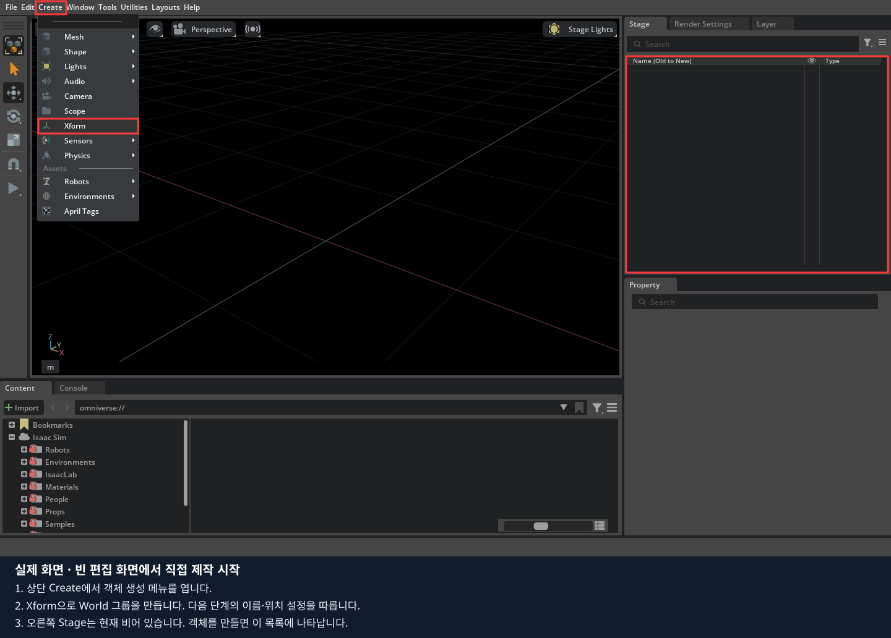
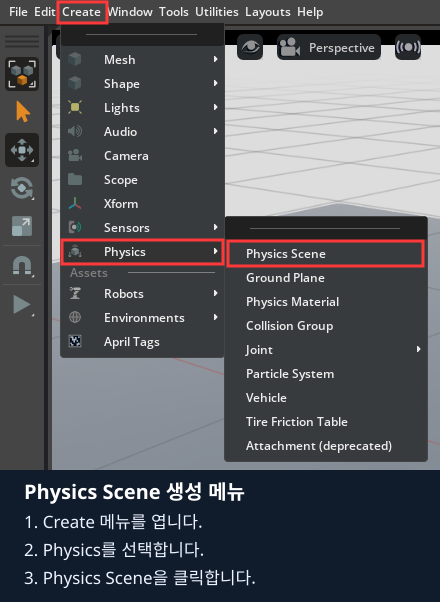
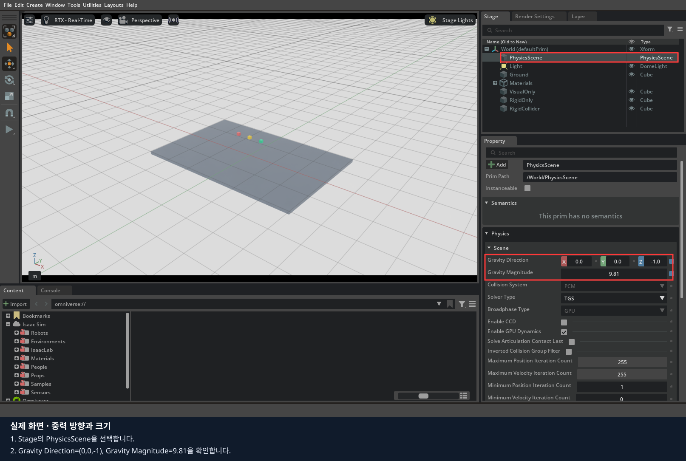
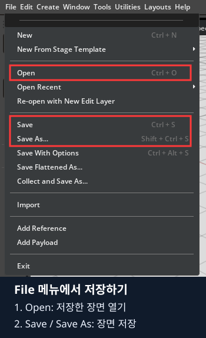
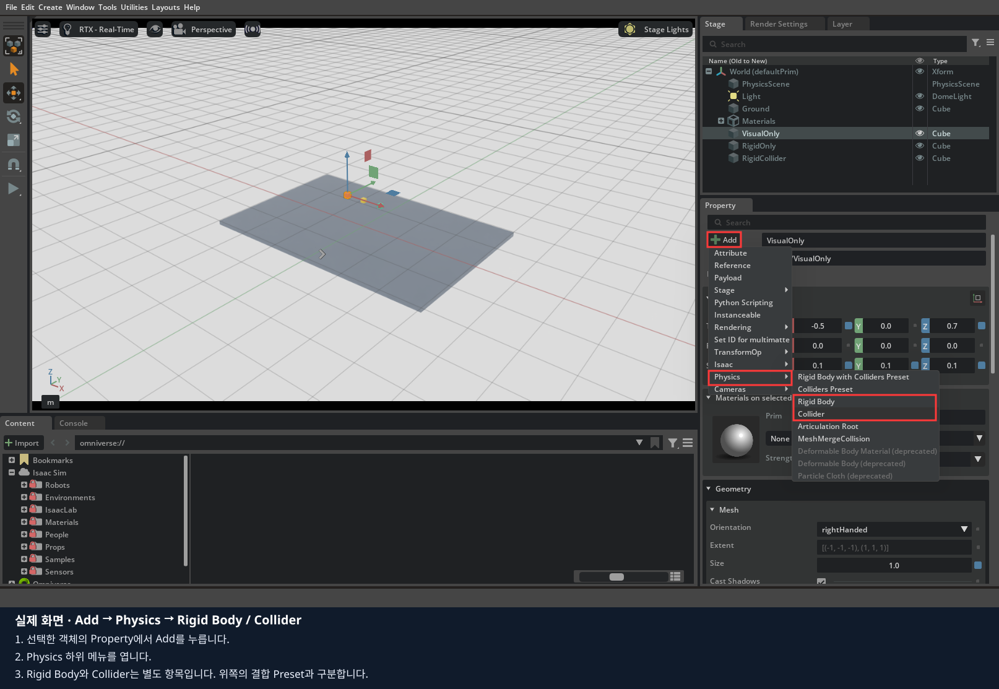
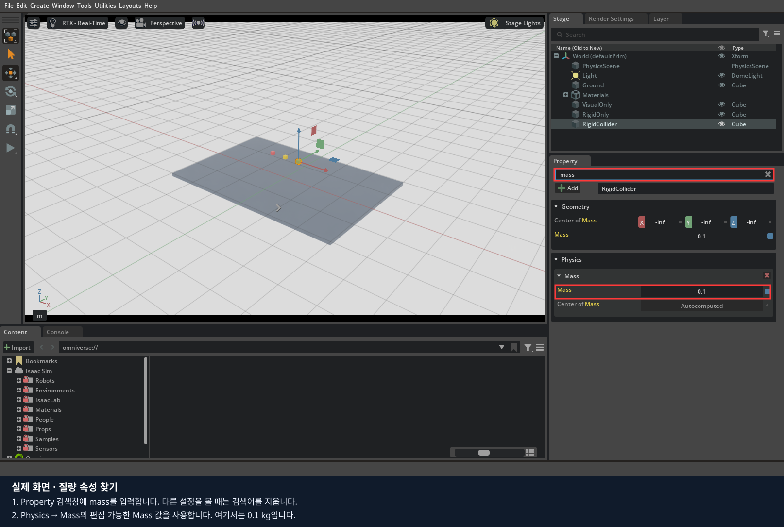
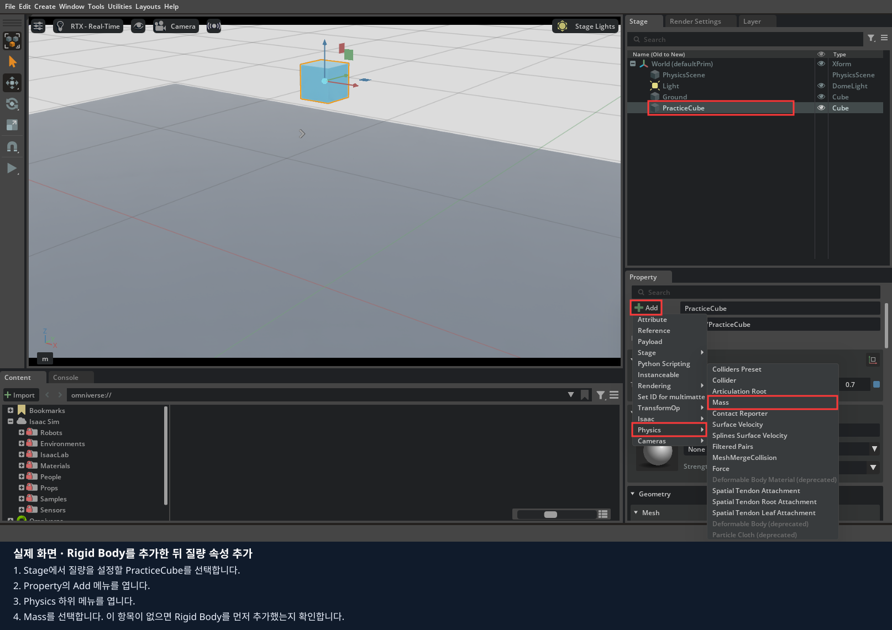
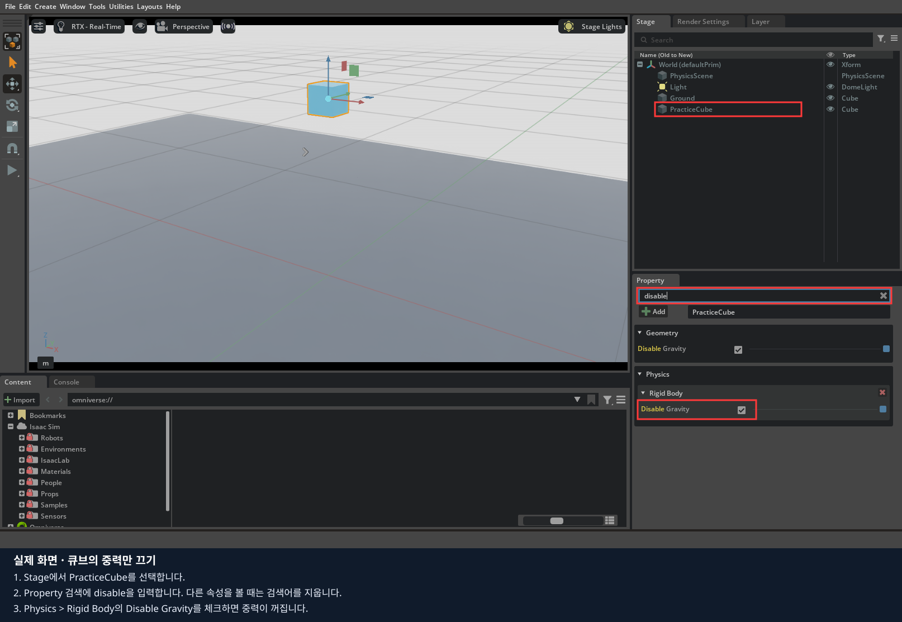
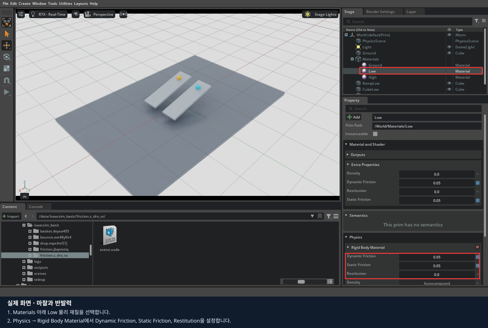
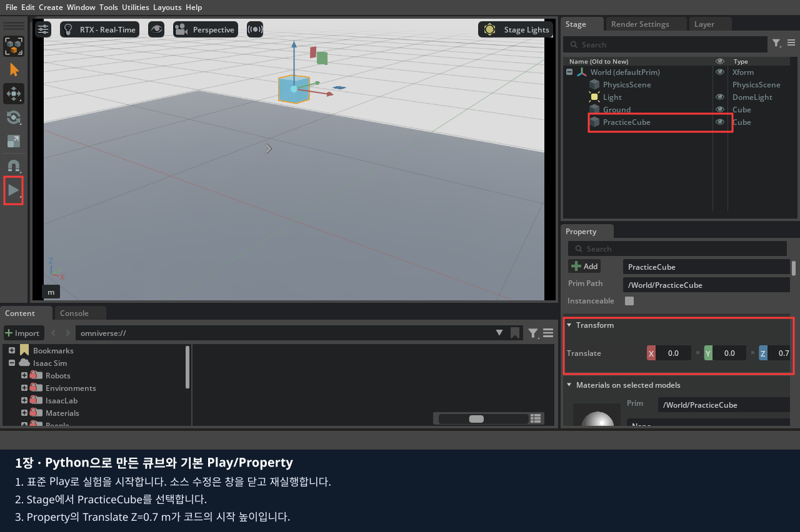

# 1장 · 마우스로 배우는 객체와 물리 성질

빈 Isaac Sim 화면에서 바닥과 큐브를 직접 만들고 중력·충돌·질량·마찰·반발을 실험합니다.
**1~7절은 마우스로 제작하고 관찰하는 실습입니다. 모두 마친 뒤 마지막 8절에서 같은 작업을 Python으로 구현합니다.**
이 본문을 위에서 아래로 따라갑니다. 스크린샷은 메뉴·속성을 찾는 참고이며, 입력값은 바로 옆 표를 따릅니다.

순서: 화면 익히기 → 바닥과 큐브 만들기 → 물리 속성 실험 → 저장·정리 → 코드로 구현하기.
[기록지](worksheet.md)는 먼저 ‘마우스 실습 기록’을 작성하고 코드 부분은 마지막에 채웁니다.

## 1. 빈 편집 화면과 기본 도구 익히기

이미 빈 편집 화면을 열었다면 아래 실행 명령은 건너뛰고 화면 설명부터 읽습니다.
다른 실습이 열려 있으면 저장하고 종료합니다. 0장의 원격 접속을 마쳤다면 **브라우저 터미널**에서 실행합니다.

```bash
lesson run --file /workspace/isaacsim_basic/01_object_physics/experiments/00_empty_stage.py
```

화면은 WebRTC 클라이언트에서 조작합니다. 데스크탑에서 직접 실행하는 경우에는 **저장소 루트의 터미널**에서 아래 명령을 대신 사용합니다.

```bash
./lekiwi basic --script 01_object_physics/experiments/00_empty_stage.py
```

원격으로 새 실행을 시작했다면 `lesson status`가 READY가 될 때까지 기다린 뒤 WebRTC에서 같은 서버 주소로 다시 Connect합니다.
영상 창을 클릭한 상태에서 마우스와 키보드를 조작합니다. 이후 코드 예제를 재실행할 때도 같은 순서로 접속합니다.

이 명령은 빈 편집 화면을 여는 준비입니다. 파일을 열거나 수정할 필요는 없습니다. 바닥·물체·물리 장면은 아래에서 마우스로 만듭니다.



처음에는 Stage에 실습 객체가 없고 검은 배경에 격자가 보입니다. 다음 단계에서 World·조명·바닥을 직접 추가합니다.
일반 Isaac Sim 5.1 앱을 직접 연 경우에는 `File > New`로 시작해도 됩니다.
`Edit > Preferences > Stage`에서 길이 단위는 m, 위쪽 축은 Z인지 확인합니다. 기본 생성된 World·조명은 재사용합니다.


화면은 기본 도구의 위치를 보여 주는 기존 촬영본입니다. 현재 빈 장면에는 사진 속 물체들이 아직 없습니다.
| 화면 이름 | 하는 일 |
|---|---|
| Stage | 만든 객체를 이름으로 찾아 선택하는 목록 |
| Property | 선택한 객체의 위치·크기·물리 속성을 바꾸는 창 |
| Viewport | 장면을 보고 결과를 관찰하는 화면 |
| Play / Pause / Stop | 실행 / 현재 상태에서 일시정지 / 실행 전 상태로 돌아가기 |

화면의 격자는 위치를 가늠하는 표시입니다. 물체를 받치는 바닥은 다음 절에서 직접 만들어야 합니다.
객체 이름은 Stage에서 우클릭 → Rename으로 바꿉니다. 이름 왼쪽 삼각형을 누르면 자식 객체가 펼쳐집니다.
Transform의 Translate는 위치, Rotate는 회전, Scale은 크기 배율이며 숫자 세 칸은 X·Y·Z 순서입니다.
이 장의 위치·크기는 m, 질량은 kg, 회전은 도 단위입니다.
설정은 **Stop 상태**에서 바꿉니다. 숫자 칸은 `Ctrl+클릭`으로 입력하고 Enter로 확정합니다.
Property 검색어는 항목을 바꿀 때 지웁니다.

## 2. World·조명·중력·바닥 만들기



이 사진은 메뉴 위치를 보여 줍니다. World는 객체를 모아 둘 상위 그룹, Light는 조명,
PhysicsScene은 중력 같은 물리 규칙, Ground는 실제 바닥입니다. 네 객체를 차례로 만듭니다.

1. Stage에 `World`가 없다면 `Create > Xform`으로 만들고 이름을 `World`로 바꿉니다. Transform은 위치·회전 0, Scale 1로 둡니다.
2. World를 선택하고 `Create > Lights > Dome Light`로 조명을 만듭니다. 이름은 `Light`, Intensity는 `800`입니다. 기존 조명을 쓰면 중복 생성하지 않습니다.
3. World를 선택하고 `Create > Physics > Physics Scene`을 누릅니다. 이름을 `PhysicsScene`으로 맞춥니다.
4. PhysicsScene의 Property에서 Gravity Direction을 `(0, 0, -1)`, Gravity Magnitude를 `9.81`로 입력합니다.
5. World를 선택하고 `Create > Shape > Cube`를 눌러 `Ground`를 만듭니다. 아래 값을 입력합니다.
6. Ground를 선택한 채 `Property > Add > Physics > Collider`를 추가합니다. 바닥에는 Rigid Body를 추가하지 않습니다.

| Ground 속성 | 값 |
|---|---|
| Geometry의 Size | `1` |
| Transform의 Translate | `(0, 0, -0.05)` m |
| Rotate | `(0, 0, 0)` 도 |
| Scale | `(6, 4, 0.1)` |

최종 크기는 Size × Scale로 `6 × 4 × 0.1 m`, 바닥 윗면은 Z=0입니다.
생성 후 **Prim Path가 `/World/Ground`인지 확인**합니다. 다른 위치에 생겼다면 Stage에서 World 아래로 옮긴 뒤 Transform 값을 다시 입력합니다.
이후 모든 생성에서도 부모 경로를 확인합니다.



Gravity Direction은 중력이 향하는 방향, Gravity Magnitude는 그 크기입니다. `(0,0,-1)`은 아래쪽이고 `9.81`은 지구 중력입니다.
사진의 다른 물리 옵션은 그대로 둡니다.

**다음 장에서도 쓸 공통 바닥을 지금 저장합니다.** `File > Save As`를 누르고 Docker 수업에서는
`/data/isaacsim_basic/base_scene.usda`로 저장합니다. 폴더가 없으면 저장 창에서 먼저 만듭니다.
일반 설치에서는 본인이 쓸 수 있는 폴더를 사용합니다. 이름이 이미 있으면 새 이름을 정하고 기록합니다.
이 파일에는 World·Light·PhysicsScene·Ground만 있어야 합니다.



아래부터는 실험별로 `Save As`를 사용하므로 이 공통 바닥 파일을 덮어쓰지 않습니다.

## 3. 큐브를 만들고 세 조건 비교하기

1. World를 선택하고 `Create > Shape > Cube`로 `PracticeCube`를 만듭니다.
2. Geometry의 Size=`0.1`, Translate=`(0, 0, 0.7)`, Rotate=`(0, 0, 0)`, Scale=`(1, 1, 1)`을 입력합니다.
3. `Add > Physics > Rigid Body`를 추가합니다. 합쳐진 `Rigid Body with Colliders Preset` 대신 개별 항목을 선택해야 충돌 없는 조건부터 비교할 수 있습니다.
4. `Add > Physics > Mass`로 질량 속성을 추가하고, Physics의 Mass를 `0.1` kg으로 설정합니다.
5. Property에서 `Disable Gravity`를 찾아 체크합니다. 기본 Rigid Body 항목이 접혀 있으면 펼칩니다.


사진은 바구니 장면에서 **메뉴 위치**를 촬영한 것입니다. 여기서는 World 아래에 큐브 하나를 만듭니다.
이 실습은 `Shape > Cube`를 사용합니다. `Mesh > Cube`를 선택하면 Size처럼 아래에서 사용할 속성 구성이 달라집니다.
Rigid Body는 힘을 받아 움직이는 물체로 만들고, Collider는 다른 물체와 닿는 형상을 정합니다.
Mass는 질량, Disable Gravity는 중력만 끄는 선택 항목입니다. 체크하면 중력이 꺼집니다.







Mass 메뉴가 보이지 않으면 해당 객체에 Rigid Body가 먼저 추가되었는지 확인합니다.



위 사진은 기준 장면의 큐브에서 속성을 연 화면입니다. Physics > Rigid Body 아래의 체크박스와 본인이 만든 큐브의 값을 비교합니다.

아래 표를 한 행씩 수행합니다. 실행 전 결과를 예상하고, Play로 관찰한 뒤 **Stop을 눌러 시작 위치로 돌아온 상태에서** 다음 설정을 바꿉니다.

| 조건 | 화면에서 바꿀 것 | 예상 관찰 |
|---|---|---|
| 중력 OFF·충돌 없음 | Disable Gravity 체크, Collider 없음 | 높이 0.7 m 유지 |
| 중력 ON·충돌 없음 | Disable Gravity 체크 해제 | 큐브가 바닥을 통과 |
| 중력 ON·충돌 있음 | `Add > Physics > Collider` 추가 | 바닥 위에 멈춤, 중심 Z≈0.05 m |

화면에서 사라진 물체는 Stage에서 선택해 Translate Z를 확인합니다.
Collider를 이미 추가했다면 해당 설정의 `Collision Enabled`를 꺼서 접촉을 비활성화할 수도 있습니다. 이 경우 속성 자체가 없는 첫 예제와 USD 구성은 다르지만 접촉을 끈 조건을 비교할 수 있습니다.

## 4. 질량과 지구·달 중력 비교하기

1. Stop 후 `File > Save As`로 `my_drop.usda`를 저장합니다. 세 조건에서 찍은 화면도 함께 보관합니다.
2. Stage에서 PracticeCube를 우클릭 → Duplicate로 한 번 복제합니다. 원본은 `CubeLight`, 복제본은 `CubeHeavy`로 이름을 바꿉니다.
3. 둘의 Size=`0.1`, Scale=`(1,1,1)`, Disable Gravity=해제를 확인합니다. 아래 위치·질량을 입력합니다.
4. PhysicsScene의 Gravity Magnitude=`9.81`에서 Play로 낙하를 비교합니다.
5. Stop 후 `1.62`로 바꿔 다시 Play합니다. 실험이 끝나면 `9.81`로 복원합니다.

| 객체 | Translate (m) | Mass (kg) |
|---|---|---|
| CubeLight | `(-0.3, 0, 1)` | `0.1` |
| CubeHeavy | `(0.3, 0, 1)` | `1` → `5` |

같은 높이에서 출발하며 공기 저항이 없는 실험입니다. 질량만으로 자유 낙하 가속도가 달라지지 않습니다.
질량을 0으로 바꿔 중력을 끄지 않습니다. 실험 후 Stop하고 `my_mass.usda`로 따로 저장합니다.
무거운 물체가 더 빨리 떨어졌는지, 달 중력에서 두 물체가 어떻게 달라졌는지 기록합니다.

## 5. 경사면과 마찰 만들기

앞 실험을 저장했는지 확인하고 `File > Open`으로 2절의 `base_scene.usda`를 엽니다.
공통 바닥만 있는 상태에서 마찰 실험을 만듭니다. 완성본은 다른 이름으로 저장합니다.
아래 네 객체를 `Create > Shape > Cube`로 만들고 **Size=1**로 설정합니다.
램프에는 Collider만, 큐브에는 Rigid Body·Collider·Mass=0.1을 추가합니다. 중력은 켜 둡니다.

| 객체 | Translate (m) | Rotate (도) | Scale |
|---|---|---|---|
| RampLow | `(0, -0.4, 0.4)` | `(0, 15, 0)` | `(1.6, 0.5, 0.06)` |
| RampHigh | `(0, 0.4, 0.4)` | `(0, 15, 0)` | `(1.6, 0.5, 0.06)` |
| CubeLow | `(-0.461999, -0.4, 0.607650)` | `(0, 15, 0)` | `(0.1, 0.1, 0.1)` |
| CubeHigh | `(-0.461999, 0.4, 0.607650)` | `(0, 15, 0)` | `(0.1, 0.1, 0.1)` |

큐브 위치는 경사면 위에 겹치지 않게 놓기 위한 값입니다. 임의로 같은 Z=0.4를 입력하면 경사면 안에서 시작할 수 있습니다.

1. `Create > Physics > Physics Material`에서 Rigid Body Material을 선택해 물리 재질 두 개를 만듭니다. 이름은 `Low`, `High`로 둡니다.
2. 각 재질의 Physics > Rigid Body Material에서 아래 값을 입력합니다.
3. RampLow를 선택하고 Collider의 **Physics Materials on Selected Models**에서 Low를 지정합니다. CubeLow에도 Low를 지정합니다.
4. RampHigh·CubeHigh에는 각각 High를 지정합니다. 외형용 Materials 칸과 구분합니다.
5. Play로 비교한 뒤 Stop합니다. Low의 마찰 두 값을 `0.8`로 바꿔 재실험합니다.

| 물리 재질 | Static Friction | Dynamic Friction | Restitution |
|---|---|---|---|
| Low | `0.05` | `0.05` | `0` |
| High | `0.8` | `0.8` | `0` |



물리 재질은 **접촉하는 양쪽**에 연결합니다. 색만 바꿔서는 마찰이 변하지 않습니다.
Static Friction은 미끄러지기 시작하는 조건에, Dynamic Friction은 미끄러지는 동안의 저항에 영향을 줍니다.
어느 큐브가 더 미끄러지는지 기록합니다. Stop 후 Low를 `0.05`로 복원하고 `my_friction.usda`로 저장합니다.

## 6. 공과 반발계수 비교하기

마찰 실험 저장 후 `File > Open`으로 `base_scene.usda`를 다시 엽니다.
공통 바닥 위에 아래 받침대와 공을 만듭니다.
받침대는 `Shape > Cube`의 Size=1, 공은 `Shape > Sphere`의 Radius=0.05, Scale=1입니다.
받침대에는 Collider만, 공에는 Rigid Body·Collider·Mass=0.1을 추가합니다.

| 객체 | Translate (m) | Scale |
|---|---|---|
| PadLow | `(-0.5, 0, 0.05)` | `(0.7, 0.7, 0.1)` |
| PadHigh | `(0.5, 0, 0.05)` | `(0.7, 0.7, 0.1)` |
| BallLow | `(-0.5, 0, 1)` | `(1, 1, 1)` |
| BallHigh | `(0.5, 0, 1)` | `(1, 1, 1)` |

5절과 같은 방법으로 물리 재질 두 개를 만듭니다. 둘 다 Static/Dynamic Friction=0.5로 두고 Restitution을 Low=0, High=0.8로 설정합니다.
각 공과 받침대에 같은 이름의 재질을 연결합니다. Play로 첫 반동을 관찰하고 Stop합니다.
High의 Restitution만 0.3으로 낮춰 비교합니다. **0.8은 시작 높이의 80%까지 튄다는 뜻이 아닙니다.**
Restitution은 부딪친 뒤 튀어 오르는 정도에 영향을 주는 반발계수입니다.
첫 반동의 높이를 비교해 기록하고, Stop 후 High를 `0.8`로 복원하여 `my_bounce.usda`로 저장합니다.

## 7. 직접 만든 환경을 저장하고 배운 내용 정리하기

지금까지 만든 파일을 확인합니다. `File > Open`으로 하나를 다시 열어 객체와 설정이 남아 있는지 봅니다.

| 저장 파일 예시 | 들어 있어야 하는 내용 |
|---|---|
| base_scene.usda | 다음 실습에서 재사용할 공통 바닥·조명·중력 |
| my_drop.usda | 중력·충돌을 비교한 큐브 |
| my_mass.usda | 질량이 다른 두 큐브 |
| my_friction.usda | 두 경사면·큐브·마찰 재질 |
| my_bounce.usda | 공·받침대·반발 재질 |

[기록지](worksheet.md)에 본인이 저장한 경로, 속성 화면, Play 관찰 결과를 적습니다.
다음 세 가지를 자신의 말로 설명한 뒤 코드 실습으로 넘어갑니다.

- 큐브에 중력을 켜도 Collider가 없으면 바닥을 통과하는 이유
- 같은 높이의 무거운 큐브가 더 빨리 자유 낙하하지 않는 이유
- 색상·마찰·반발계수 중 어떤 속성을 바꿔야 각 현상이 달라지는지

## 8. 마지막: 같은 작업을 코드로 구현하기

지금까지 마우스로 만들고 관찰한 내용을 코드로 연결합니다. 먼저 직접 만든 USD를 저장합니다.
원격 수업은 브라우저 터미널에서 `lesson stop`, 데스크탑은 Isaac Sim 창을 닫아 현재 실행을 종료합니다.

각 예제의 `build_scene()`은 새 장면에 객체를 만듭니다. 화면에서 저장한 USD가 Python 소스를 자동으로 바꾸지는 않습니다.

| 화면에서 한 일 | Python에서 찾을 부분 |
|---|---|
| Shape Cube 생성, Size·Transform 입력 | `Cube.Define`, `CreateSizeAttr`, `AddTranslateOp`, `AddScaleOp` |
| Rigid Body·Collider·Mass 추가 | `RigidBodyAPI`, `CollisionAPI`, `MassAPI` |
| Disable Gravity 변경 | `CreateDisableGravityAttr` |
| PhysicsScene 중력 변경 | `CreateGravityMagnitudeAttr` |
| 물리 재질 생성·속성·연결 | `MaterialAPI`, `CreateStaticFrictionAttr`, `CreateRestitutionAttr`, `MaterialBindingAPI` |

### 코드 실행과 수정 순서

설치는 0장에서 마쳤다고 가정합니다. 아래 명령 중 본인 환경의 한 가지만 사용합니다.

원격 수업 — 브라우저 터미널:

```bash
lesson run 1
```

데스크탑 직접 실행 — 저장소 루트 터미널:

```bash
./lekiwi basic --chapter 1
```

1. 실행하면 Stop 상태로 열립니다. 화면의 Play로 관찰하고 Stop으로 돌아옵니다. 이 절에 연결된 Python 파일을 열고, 앞에서 클릭했던 속성에 해당하는 줄을 찾습니다.
2. 기본 실행 결과를 직접 만든 환경의 결과와 비교합니다.
3. 실행을 종료한 뒤 지정된 기본 줄에 `#`를 붙이고 비교할 줄의 `#`를 지웁니다. 들여쓰기는 유지합니다.
4. 파일을 저장하고 같은 명령으로 다시 실행합니다. 화면에서 값을 바꾸는 실험과 구분해 기록합니다.

원격 수업은 코드 수정 후 `lesson stop` → `lesson run 1`로 재실행합니다.
학생 파일은 호스트에서 저장하면 다음 실행에 반영되며, 코드만 수정할 때 Docker 이미지 재빌드는 필요 없습니다.
아래 `./lekiwi ...` 예시는 데스크탑 터미널용입니다. 원격 수업에서는 위 `lesson` 명령을 사용합니다.

### 8.1. 중력도 충돌도 없는 기본 실행

[학생 파일: 01_no_gravity.py](experiments/01_no_gravity.py)

파일 안 `build_scene(stage)`가 장면을 만듭니다. `main()`은 Isaac Sim을 시작하고 창을 유지합니다.
`SimulationApp`을 만든 **다음**에 `omni`와 `pxr` 모듈을 읽는 순서를 지킵니다.

```python
cube = UsdGeom.Cube.Define(stage, "/World/PracticeCube")
cube.CreateSizeAttr(.1)
cube.AddTranslateOp().Set(Gf.Vec3d(0, 0, .7))
cube.CreateDisplayColorAttr([Gf.Vec3f(.2, .6, .95)])
```

`Define`은 Stage의 경로에 객체를 만듭니다. 한 변은 0.1 m, 중심 높이는 0.7 m입니다.
색상 RGB는 0~1입니다. 이 네 줄만으로는 움직이는 물체가 되지 않습니다.

```python
UsdPhysics.RigidBodyAPI.Apply(cube.GetPrim())
UsdPhysics.MassAPI.Apply(cube.GetPrim()).CreateMassAttr(.1)
body = PhysxSchema.PhysxRigidBodyAPI.Apply(cube.GetPrim())
body.CreateDisableGravityAttr(True)
# body.CreateDisableGravityAttr(False)
# UsdPhysics.CollisionAPI.Apply(cube.GetPrim())
```

동적 강체는 유지하되 `DisableGravity=True`로 중력을 끕니다. Collider 줄은 주석이므로 큐브의 접촉은 없습니다.
Play를 눌러도 큐브는 높이 0.7 m에 머뭅니다. 바닥의 Collider는 이미 켜져 있지만 **큐브에도 Collider가 있어야** 접촉합니다.



먼저 주황색 `CreateDisplayColorAttr` 줄의 주석을 해제하고 기본 파란색 줄을 주석 처리합니다.
재실행하여 색상만 달라지는지 확인합니다. 두 줄을 모두 활성화하면 뒤의 값이 앞의 값을 덮어씁니다.

### 8.2. 중력만 켜기

같은 파일에서 다음과 같이 한 줄씩 교체합니다.

```python
# body.CreateDisableGravityAttr(True)
body.CreateDisableGravityAttr(False)
# UsdPhysics.CollisionAPI.Apply(cube.GetPrim())
```

재실행 → Play. 큐브는 떨어져 바닥을 통과합니다. 화면에서 사라졌다고 삭제된 것은 아닙니다.
Stage의 `/World/PracticeCube`를 선택하고 Property의 높이를 확인한 다음 Stop을 누릅니다.
비교용 정답 파일은 [02_gravity_only.py](experiments/02_gravity_only.py)입니다.

```bash
./lekiwi basic --experiment 2
```

### 8.3. 접촉까지 켜기

```python
body.CreateDisableGravityAttr(False)
UsdPhysics.CollisionAPI.Apply(cube.GetPrim())
```

다시 실행하면 큐브가 바닥에 멈춥니다. 바닥 윗면이 Z=0이고 큐브 한 변이 0.1 m이므로 중심 높이는 약 **0.05 m**입니다.
정답 파일 [03_gravity_collision.py](experiments/03_gravity_collision.py)은 `./lekiwi basic --experiment 3`으로 실행합니다.

| 조건 | 동적 강체 | 중력 | 큐브 접촉 | 예상 |
|---|---|---|---|---|
| 1 | O | X | X | 공중 유지 |
| 2 | O | O | X | 바닥 통과 |
| 3 | O | O | O | 바닥에 정지 |

바닥은 움직이지 않으므로 `RigidBodyAPI` 없이 `CollisionAPI`만 적용합니다.
큐브와 바닥의 크기·좌표는 m, 질량은 kg, 중력 가속도는 m/s²입니다.

### 8.4. 질량과 중력 가속도

[04_mass_gravity.py](experiments/04_mass_gravity.py)를 열고 실행합니다.

```bash
./lekiwi basic --experiment 4
```

주황 큐브 0.1 kg, 파랑 큐브 1 kg이 같은 높이에서 출발합니다. 이 예제에는 공기 저항이 없습니다.
질량이 다르다고 무거운 큐브가 더 빨리 자유 낙하하지는 않습니다.

```python
scene.CreateGravityMagnitudeAttr(9.81)
# scene.CreateGravityMagnitudeAttr(1.62)
```

기본 줄 대신 아래 줄을 사용해 달 중력으로 바꾸고 낙하 속도를 비교합니다.
파일 아래 `CubeHeavy` 질량을 5 kg으로 바꾸는 줄도 주석 해제해 봅니다.
**질량을 0으로 만들어 중력을 끄지 않습니다.** USD의 0 질량은 자동 계산 의미가 있으므로 중력의 ON/OFF API와 구분합니다.

### 8.5. 마찰과 경사면

[05_friction.py](experiments/05_friction.py) → `./lekiwi basic --experiment 5`

두 경사면은 같은 15도이며 큐브의 크기·질량도 같습니다. 마찰계수만 0.05 / 0.8입니다.
`material()` 안의 실제 API를 확인합니다.

```python
physics = UsdPhysics.MaterialAPI.Apply(mat.GetPrim())
physics.CreateStaticFrictionAttr(friction)
physics.CreateDynamicFrictionAttr(friction)
UsdShade.MaterialBindingAPI.Apply(prim).Bind(mat, materialPurpose="physics")
```

정지 마찰은 미끄러지기 시작하는 조건, 동적 마찰은 미끄러지는 동안의 저항입니다.
`materialPurpose="physics"`는 물리 재질을 연결합니다. 화면 색상과는 별개입니다.
같은 재질을 해당 큐브와 경사면 **양쪽**에 적용하여 혼합 규칙이 비교를 흐리지 않게 했습니다.

파일 맨 아래 Low 재질의 두 마찰값을 .8로 바꾸는 세 줄을 주석 해제합니다.
다시 실행하면 두 큐브의 미끄러짐이 비슷해져야 합니다. 한 번에 경사각까지 바꾸지 않습니다.

### 8.6. 반발계수

[06_restitution.py](experiments/06_restitution.py) → `./lekiwi basic --experiment 6`

공 두 개가 동일한 높이에서 떨어집니다. 공과 받침대의 반발계수는 각 쌍이 0 / 0.8입니다.
아래쪽의 `.CreateRestitutionAttr(.3)` 줄을 해제하여 높은 쪽만 0.3으로 낮춥니다.
반발계수 범위는 0~1이며 접촉 전후 수직 상대 속도에 관련됩니다. **0.8이 원래 높이의 80%로 튄다는 뜻은 아닙니다.**
중력·초기 높이·질량을 유지하고 첫 반동의 높이를 비교합니다.


### 8.7. 실험 파일을 골라 실행하고 비교하기

| 마우스로 한 실험 | 학생 파일 | 원격 실행 | 데스크탑 실행 |
|---|---|---|---|
| 중력 OFF | [01_no_gravity.py](experiments/01_no_gravity.py) | `lesson run 1` | `./lekiwi basic --experiment 1` |
| 중력 ON·충돌 없음 | [02_gravity_only.py](experiments/02_gravity_only.py) | `lesson run --experiment 2` | `./lekiwi basic --experiment 2` |
| 중력·충돌 ON | [03_gravity_collision.py](experiments/03_gravity_collision.py) | `lesson run --experiment 3` | `./lekiwi basic --experiment 3` |
| 질량·중력 크기 | [04_mass_gravity.py](experiments/04_mass_gravity.py) | `lesson run --experiment 4` | `./lekiwi basic --experiment 4` |
| 마찰 | [05_friction.py](experiments/05_friction.py) | `lesson run --experiment 5` | `./lekiwi basic --experiment 5` |
| 반발 | [06_restitution.py](experiments/06_restitution.py) | `lesson run --experiment 6` | `./lekiwi basic --experiment 6` |

각 실행을 종료한 뒤 다음 파일을 실행합니다. 실험 번호와 장 번호는 다릅니다.
코드 실행은 새 장면을 만듭니다. 직접 제작 결과는 앞에서 저장한 USD를 다시 열어 비교합니다.
객체 경로·단위·물리 조건과 관찰 결과를 비교하며, USD 파일의 모든 바이트가 같을 필요는 없습니다.

바구니 보충 예제는 데스크탑에서 `./lekiwi basic --lesson basket`으로 실행합니다.
직접 만드는 과정은 6장에서 진행합니다. 바닥과 네 벽을 각각 Collider로 만들어 입구를 비워 둡니다.

[기록지](worksheet.md)의 코드 구현·비교 부분까지 작성합니다.
[공식 자료와 촬영 기록](SOURCES.md) · [다음: 2장](../02_robot_joints/README.md)
