# 1장 · 마우스로 배우는 객체와 물리 성질

빈 Isaac Sim 화면에서 바닥과 큐브를 직접 만들고 중력·충돌·질량·마찰·반발을 실험합니다.
**1~7절은 마우스로 만드는 실습입니다. 마지막 8절에서 같은 작업을 Python 코드로 구현합니다.**

사진 아래 설명의 번호 순서대로 진행합니다. 빨간 박스는 클릭하거나 확인할 곳입니다.
입력 사진은 **값을 입력한 뒤의 모습**입니다. 사진처럼 값이 되어 있는지 확인하고 다음으로 넘어갑니다.
작은 입력 칸을 읽기 쉽도록 메뉴나 Property 부분만 확대해 보여 주는 사진도 있습니다.

## 1. 빈 편집 화면과 기본 도구 익히기

### 1.1. 빈 화면 열기

0장의 파란 큐브 예제가 열려 있다면 Isaac Sim 창을 닫습니다. 이미 빈 편집기를 열어 둔 경우에는 다시 실행하지 않습니다.
같은 노트북의 **저장소 최상위 폴더(`lekiwi` 파일이 있는 곳)**에서 아래 명령을 실행합니다.

```bash
./lekiwi basic --script 01_object_physics/experiments/00_empty_stage.py
```

이 명령은 빈 편집기와 수업의 단위(m, kg, 위쪽 +Z)를 준비합니다. 바닥과 물체는 자동으로 만들어 주지 않습니다.
처음 로딩에는 시간이 걸립니다. 같은 명령을 여러 번 실행하지 말고 창이 반응할 때까지 기다립니다.

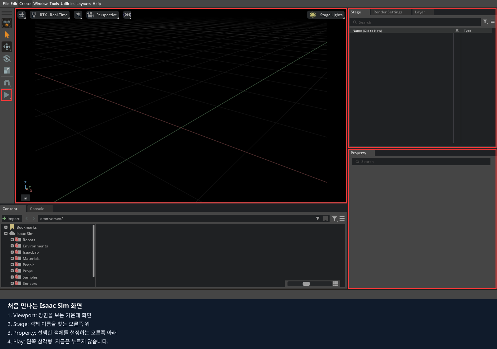

| 화면 이름 | 위치와 역할 |
|---|---|
| Viewport(뷰포트) | 가운데 큰 화면. 만든 물체와 움직임을 봅니다. |
| Stage(스테이지) | 오른쪽 위 목록. 객체 이름을 클릭해서 선택합니다. |
| Property(프로퍼티) | 오른쪽 아래. 선택한 객체의 이름·위치·물리 설정을 바꿉니다. |
| Play | 왼쪽 세로 도구막대의 삼각형. 물리 실험을 시작합니다. |
| Stop | 실행 중 Play 아래에 나타나는 사각형. 실행 전 위치로 돌아갑니다. |

지금 Stage에 물체가 없고 Viewport에 격자만 보이면 맞습니다. **격자는 바닥이 아닙니다.** 실제 바닥은 2절에서 만듭니다.

### 1.2. 이 장에서 반복할 마우스 조작

1. **선택:** Stage에서 객체 이름을 한 번 클릭합니다. Property 위쪽의 이름이 같은지 확인합니다.
2. **이름 변경:** Stage의 객체 이름 위에서 마우스 오른쪽 버튼을 누르고 `Rename`을 클릭합니다. 새 이름을 입력한 뒤 Enter를 누릅니다.
3. **펼치기:** 객체 이름이나 설정 제목 왼쪽의 펼치기 표시(`+` 또는 삼각형)를 누릅니다. 제목 아래 항목이 나오면 펼쳐진 상태입니다.
4. **숫자 입력:** 숫자가 적힌 칸을 Ctrl 키를 누른 채 클릭합니다. 기존 숫자를 선택하고 새 값을 입력한 뒤 Enter를 누릅니다. 표의 괄호·쉼표·단위는 입력하지 않습니다.
5. **검색:** Property 맨 위 검색창에 `size`, `mass` 등을 입력하면 해당 속성을 찾을 수 있습니다. 다음 속성을 찾기 전에는 검색창 오른쪽 `×`로 지웁니다.
6. **스크롤:** Property 안에 마우스를 놓고 휠을 내리면 아래 설정이 보입니다. Stage와 Property의 경계선을 위로 끌어 Property를 넓혀도 됩니다.

Translate·Rotate·Scale의 세 칸은 **왼쪽부터 X, Y, Z**입니다. `(0, 0, 0.7)`이면 X 칸에 `0`, Y 칸에 `0`, Z 칸에 `0.7`을 각각 입력합니다.
Translate는 위치(m), Rotate는 회전(도), Scale은 크기 배율입니다.
회전 줄이 `Rotate` 대신 **`Orient`**로 보이는 객체도 있습니다. 이 장에서는 그 줄의 X·Y·Z 각도 칸을 사용하면 됩니다.
설정을 바꿀 때는 **Stop 상태**로 돌아옵니다. Play 중 바꾼 위치는 Stop할 때 되돌아갈 수 있습니다.

## 2. World·조명·중력·바닥 만들기

이 절에서는 **World·Light·PhysicsScene·Ground 네 개만** 만듭니다. 떨어뜨릴 작은 큐브는 아직 만들지 않습니다.
World는 객체를 모아 둘 그룹, Light는 조명, PhysicsScene은 중력 규칙, Ground는 실제 바닥입니다.

### 2.1. World 그룹 만들고 이름 바꾸기

1. 화면 맨 위 `Create`를 클릭합니다.
2. 펼쳐진 메뉴에서 `Xform`을 클릭합니다.

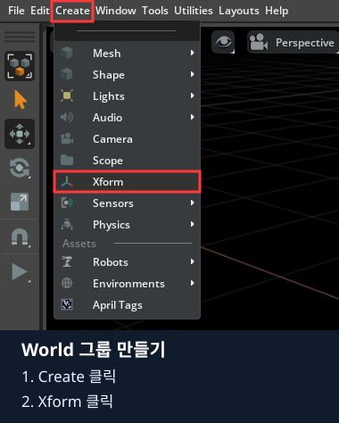

3. 오른쪽 Stage에 나타난 `Xform` 이름 위에서 **우클릭 → Rename**을 선택합니다.

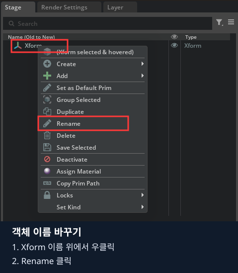

4. 기존 이름을 지우고 **`World`**를 입력한 뒤 Enter를 누릅니다. `Word`가 아니라 `World`입니다.

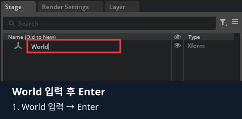

5. World를 클릭합니다. Property의 **Prim Path가 `/World`**이면 맞습니다. World의 Translate·회전은 모두 `0`, Scale은 모두 `1`로 둡니다.

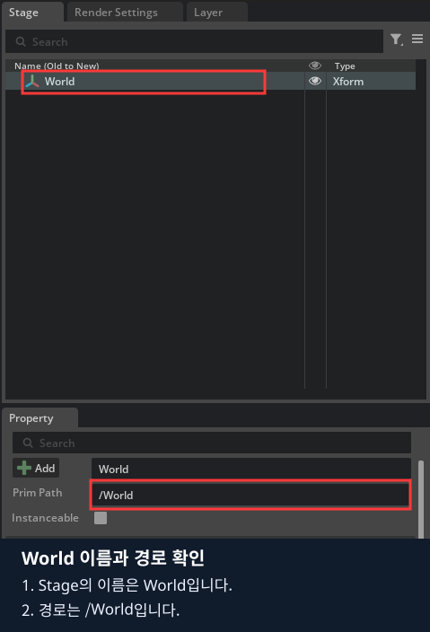

World는 그룹이므로 이름을 만들어도 화면에 큐브가 나타나지 않습니다. 이미 World가 있다면 하나 더 만들지 않습니다.

### 2.2. 조명 Light 만들기

1. `Create → Lights → Dome Light`를 선택합니다. `Lights` 위에 마우스를 올리면 오른쪽에 다음 메뉴가 열립니다.

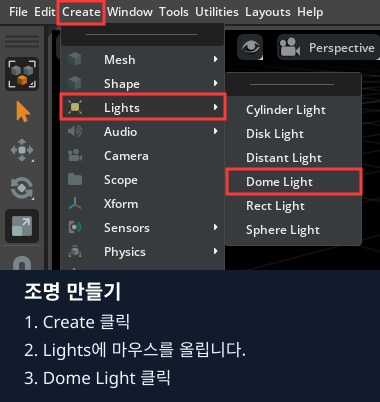

2. Stage의 새 `DomeLight`를 **우클릭 → Rename**으로 `Light`로 바꿉니다.
3. Light가 World 밖에 있다면 **Light 이름을 잡아 World 이름 위에 놓습니다.** World 왼쪽 펼치기 표시를 눌렀을 때 Light가 한 칸 안쪽에 보여야 합니다.
4. Light를 선택하고 Property의 Prim Path가 **`/World/Light`**인지 확인합니다.

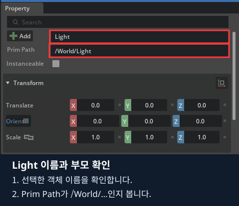

5. Property 검색창에 `intensity`를 입력합니다.
6. `Intensity` 오른쪽 숫자 칸에 **`800`**을 입력하고 Enter를 누릅니다. 화면이 밝아지는 것을 확인합니다.
7. 검색창 오른쪽 `×`를 눌러 검색어를 지웁니다.

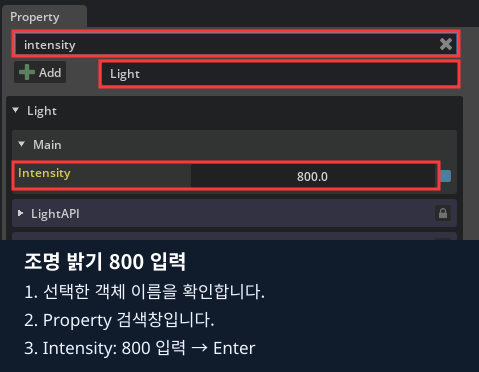

### 2.3. PhysicsScene 만들고 World 아래로 옮기기

1. `Create → Physics → Physics Scene`을 클릭합니다.

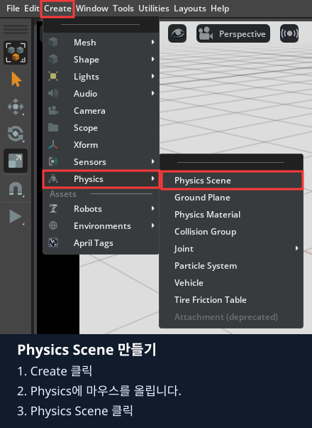

2. Stage에 새 `PhysicsScene`이 나타납니다. **World를 선택하고 만들었더라도 World 밖에 생성될 수 있습니다.** 이것만으로 잘못 만든 것은 아닙니다.

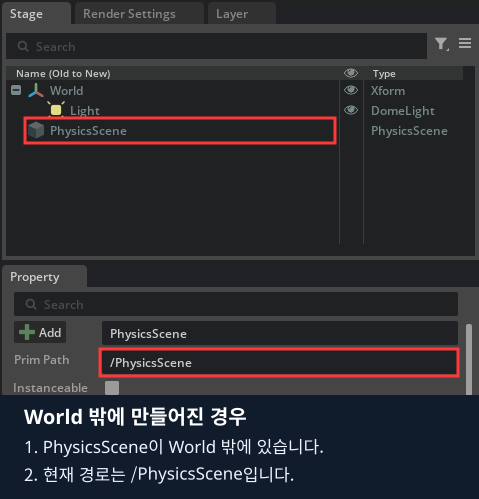

3. World 밖에 있다면 **PhysicsScene 이름에서 마우스 왼쪽 버튼을 누른 채 World 이름 위로 끌어가서 놓습니다.** 아래 사진의 두 박스가 출발점과 도착점입니다.

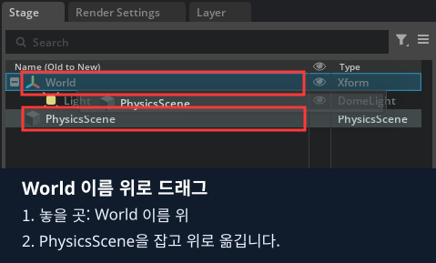

드래그 중 마우스를 따라오는 반투명 이름은 이동 표시입니다. PhysicsScene을 한 개 더 만든 것이 아닙니다.

4. World 왼쪽 펼치기 표시(`+` 또는 삼각형)를 눌러 자식 목록을 엽니다. Light와 PhysicsScene이 World보다 한 칸 안쪽에 있는지 봅니다.
5. PhysicsScene을 클릭했을 때 Prim Path가 **`/World/PhysicsScene`**이면 이동이 끝난 것입니다.

### 2.4. 중력 방향과 크기 설정하기

1. Stage의 PhysicsScene을 클릭합니다. Property 검색창은 비웁니다.
2. Property를 아래로 내려 **Physics → Scene**을 펼칩니다.
3. `Gravity Direction`의 X·Y·Z 칸에 각각 **`0`, `0`, `-1`**을 입력합니다. 아래쪽으로 중력이 작용한다는 뜻입니다.

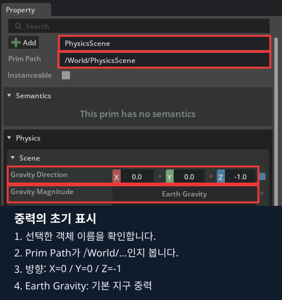

4. `Gravity Magnitude`에 **Earth Gravity**라고 보이면 기본 지구 중력입니다. 지구 중력만 실험할 때는 이 상태로도 진행할 수 있습니다.
5. 뒤에서 달 중력으로 바꿀 수 있도록 숫자 입력도 연습합니다. 직접 숫자를 입력할 수 없다면 **왼쪽 Gravity Magnitude 항목 이름을 우클릭 → Set Minimum**을 선택합니다.

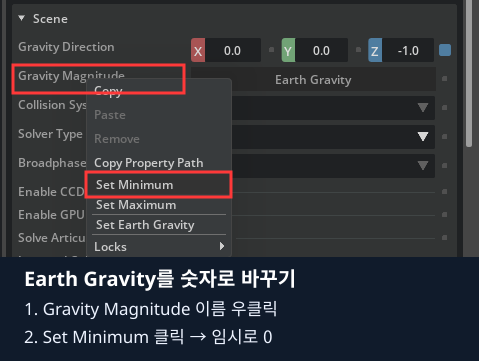

6. 표시가 `0`으로 바뀌면 같은 숫자 칸을 Ctrl+클릭하고 **`9.81`**을 입력한 뒤 Enter를 누릅니다. `0`인 상태는 무중력이므로 그대로 Play하지 않습니다.
7. 아래 사진처럼 방향 `(0, 0, -1)`, 크기 `9.81`인지 확인합니다. 다른 물리 옵션은 그대로 둡니다.

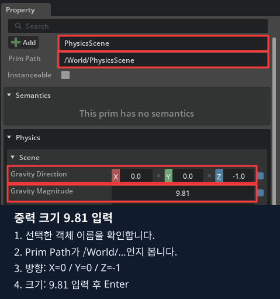

입력이 되지 않으면 같은 동작을 계속 반복하지 말고 PhysicsScene의 Property 화면을 강사에게 보여 주세요.

### 2.5. 실제 바닥 Ground 만들기

1. `Create → Shape → Cube`를 클릭합니다. **Mesh가 아니라 Shape**를 선택해야 아래의 Size 항목이 있습니다.

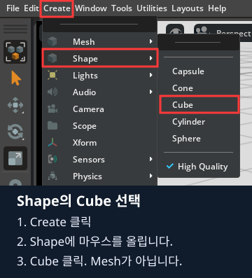

2. 새 Cube를 `Ground`로 이름을 바꿉니다. World 밖이면 Ground를 World 이름 위로 드래그합니다.
3. Ground를 클릭하고 Prim Path가 **`/World/Ground`**인지 확인합니다.
4. Property에서 **Transform**을 펼치고 다음 값을 한 칸씩 입력합니다.

| 줄 | X | Y | Z |
|---|---|---|---|
| Translate | `0` | `0` | `-0.05` |
| Rotate 또는 Orient | `0` | `0` | `0` |
| Scale | `6` | `4` | `0.1` |

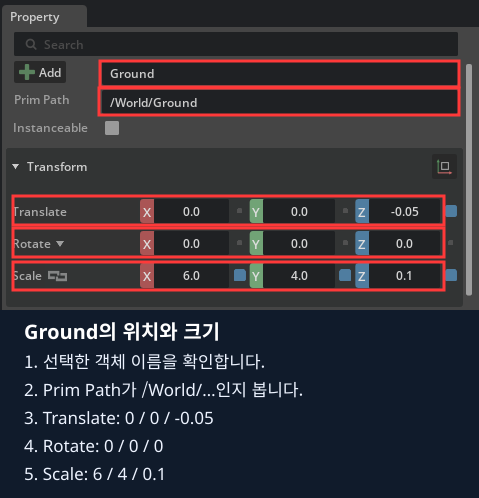

5. Property 검색창에 `size`를 입력합니다. **Size에 `1`**을 입력하고 Enter를 누릅니다. 검색창의 `×`로 검색어를 지웁니다.

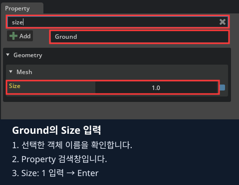

이 바닥은 가로 6 m, 세로 4 m, 두께 0.1 m이며 윗면 높이가 Z=0입니다.
크기는 `Size × Scale`로 결정되므로 Size와 Scale을 모두 확인해야 합니다.

6. Ground를 선택한 채 Property 위쪽 **Add → Physics → Collider**를 클릭합니다.

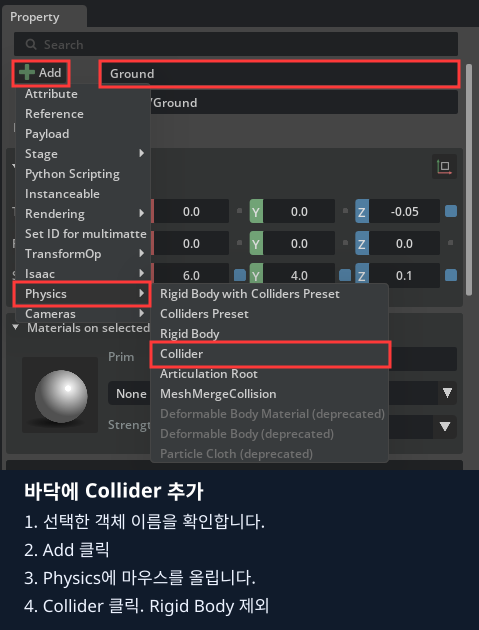

7. 검색창에 `collision`을 입력합니다. **Collision Enabled가 체크**되어 있는지 보고 검색어를 지웁니다.

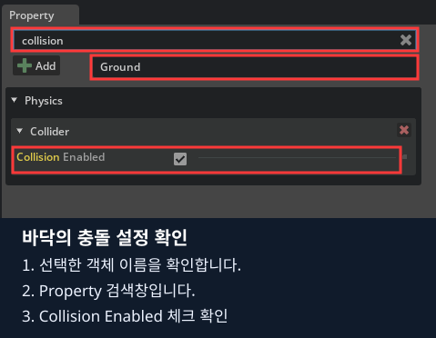

**바닥에는 Rigid Body를 추가하지 않습니다.** Collider는 물체를 받치는 충돌 표면입니다. Rigid Body까지 추가하면 바닥도 중력을 받아 움직일 수 있습니다.

### 2.6. 네 객체를 확인하고 공통 바닥 저장하기

World 왼쪽 펼치기 표시(`+` 또는 삼각형)를 눌러 자식 목록을 엽니다. 이 시점의 Stage는 아래와 같습니다. 항목의 표시 순서는 달라도 괜찮습니다.

```text
World
├── Light
├── PhysicsScene
└── Ground
```

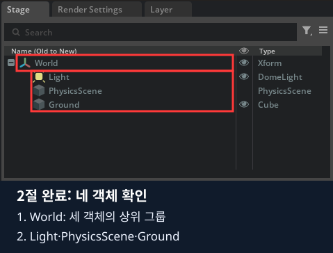

World 아래 세 객체는 각각 `/World/Light`, `/World/PhysicsScene`, `/World/Ground` 경로를 가집니다.
아직 PracticeCube나 물리 재질은 없습니다.

1. 맨 위 **File → Save As**를 클릭합니다.

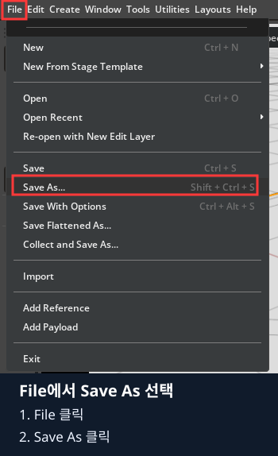

2. 저장 창 맨 위 주소 칸에 **`/data/isaacsim_basic/`**을 입력하고 Enter를 누릅니다. Docker 안의 `/data`는 노트북 저장소의 `data` 폴더에 연결됩니다.
3. 아래쪽 파일 형식 목록을 열고 **`*.usda`**를 선택합니다. 파일 이름에만 확장자를 적으면 다른 형식으로 저장될 수 있으므로 이 목록도 확인합니다.

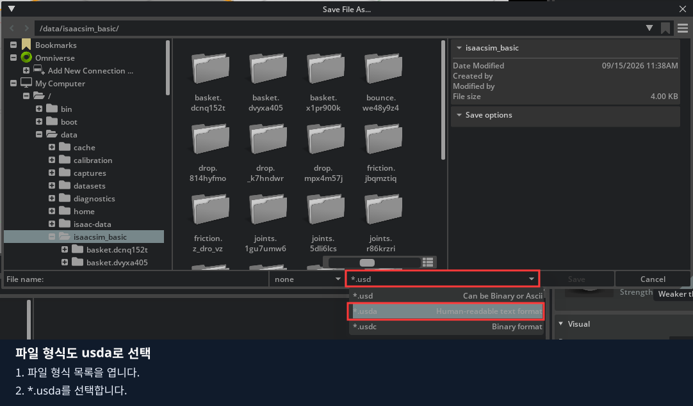

4. 아래쪽 **File name**에는 `base_scene`을 입력합니다.
5. 주소·파일 이름·형식을 확인하고 **Save**를 클릭합니다.

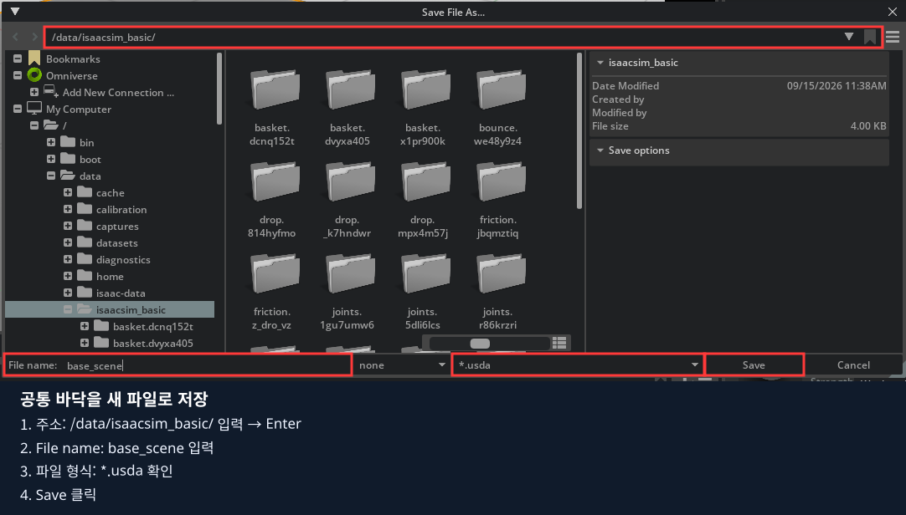

저장할 파일은 **`/data/isaacsim_basic/base_scene.usda`**입니다. 같은 이름의 기존 파일이 있다면 덮어쓰기 전에 확인하고, 필요한 파일이면 다른 이름을 사용합니다.
일반 설치로 수업하는 경우에는 본인이 저장할 수 있는 폴더를 사용합니다.
이후 실험은 다른 이름으로 Save As 합니다. 다음 실습에서 다시 쓸 공통 바닥을 덮어쓰지 않습니다.

## 3. 큐브를 만들고 세 조건 비교하기

### 3.1. 작은 큐브 PracticeCube 만들기

1. `Create → Shape → Cube`를 클릭합니다. 생성 메뉴는 바로 위 Ground를 만들 때와 같습니다.
2. 새 큐브를 **PracticeCube**로 이름을 바꾸고 World 아래로 옮깁니다.
3. PracticeCube를 클릭합니다. Prim Path가 `/World/PracticeCube`인지 봅니다.
4. Transform에 다음 값을 입력합니다.

| 줄 | X | Y | Z |
|---|---|---|---|
| Translate | `0` | `0` | `0.7` |
| Rotate 또는 Orient | `0` | `0` | `0` |
| Scale | `1` | `1` | `1` |

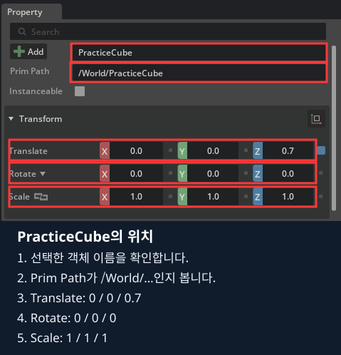

5. 검색창에 `size`를 입력하고 **Size를 `0.1`**로 바꿉니다. 검색어를 지웁니다.

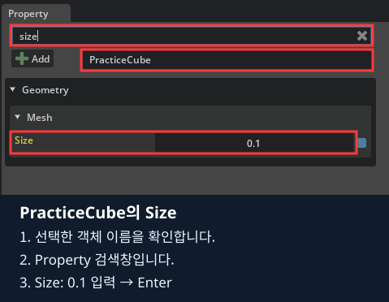

큐브의 한 변은 0.1 m, 시작 높이는 0.7 m입니다. 작게 보이는 것이 맞습니다.

### 3.2. Rigid Body와 Mass 추가하기

1. PracticeCube를 선택한 채 **Add → Physics → Rigid Body**를 클릭합니다.
   `Rigid Body with Colliders Preset`을 선택하면 충돌도 한꺼번에 추가됩니다. 지금은 **Rigid Body 단독 항목**을 고릅니다.

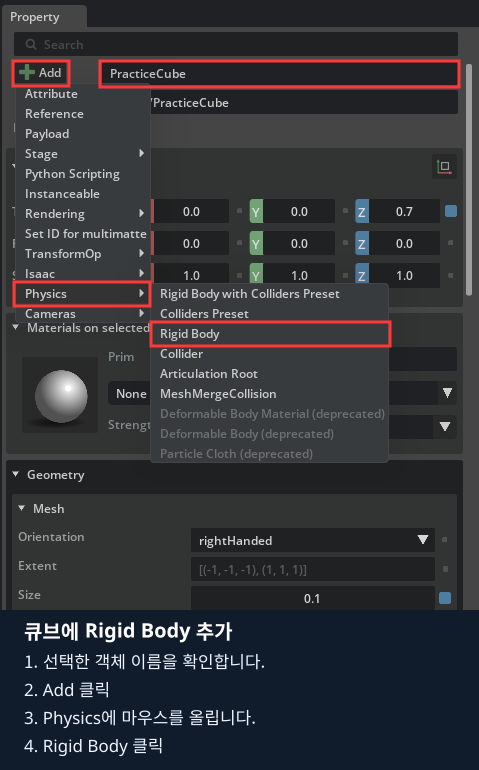

2. 다시 **Add → Physics → Mass**를 클릭합니다. Mass가 없으면 Rigid Body를 먼저 추가했는지 확인합니다.

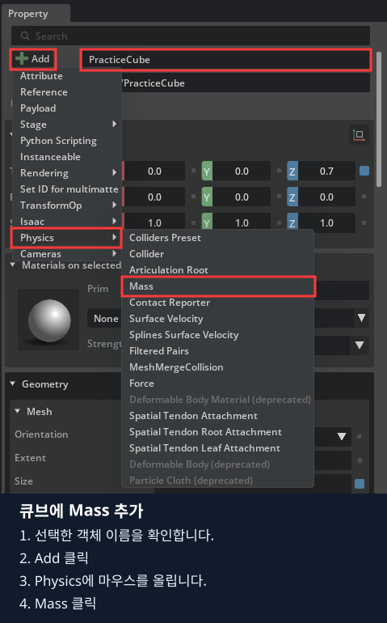

3. 검색창에 `mass`를 입력합니다. **Mass에 `0.1`**을 입력하고 Enter를 누릅니다. 초기에는 `Autocomputed`라고 보일 수 있습니다.
4. 값이 `0.1`인지 확인하고 검색어를 지웁니다. 질량의 단위는 kg입니다.

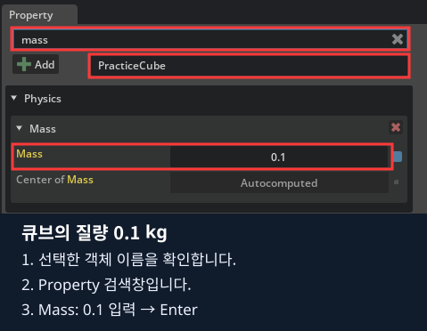

Rigid Body는 움직일 수 있는 물체로 만드는 설정입니다. Mass는 그 물체의 질량입니다.
**Rigid Body·Mass·Collider는 큐브에 붙이는 속성**이므로 Stage에 그 이름의 객체를 따로 만드는 것이 아닙니다.

```text
World
├── Light
├── PhysicsScene
├── Ground
└── PracticeCube
```

### 3.3. 첫 번째 조건: 중력 끄기

1. PracticeCube를 선택합니다. 검색창에 **`disable gravity`**를 입력합니다.
2. **Disable Gravity를 체크**합니다. 이름이 “중력을 끈다”는 뜻이므로 체크하면 중력이 꺼집니다.

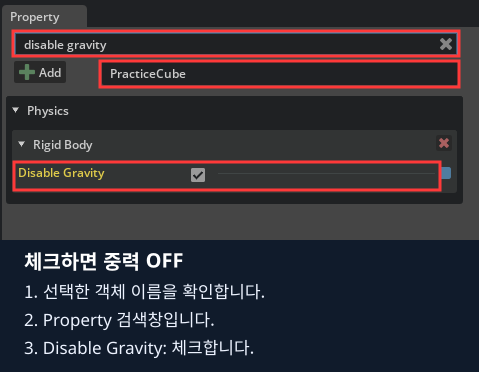

3. 검색어를 지우고 왼쪽 **Play(삼각형)**를 클릭합니다. 큐브가 공중에 그대로 있는지 봅니다.
4. 왼쪽 **Stop(사각형)**을 눌러 실행을 끝냅니다.

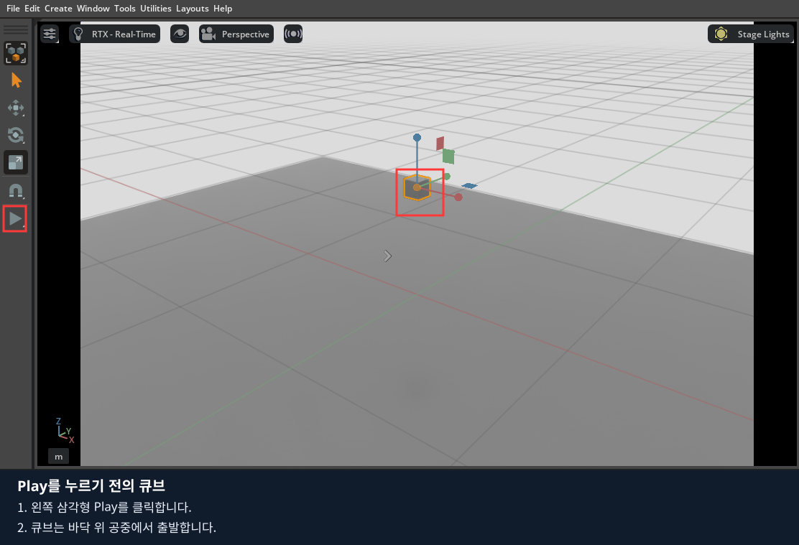

위 사진은 Play 버튼과 출발 위치를 보여 줍니다. 설정은 지금 단계의 **Disable Gravity 체크·Collider 없음**을 유지합니다.
Pause는 잠깐 멈추는 기능입니다. 다음 조건으로 바꿀 때는 Pause가 아니라 **Stop**을 사용합니다.

### 3.4. 두 번째 조건: 중력만 켜기

1. Stop 상태에서 PracticeCube를 선택하고 `disable gravity`를 검색합니다.
2. 이번에는 **Disable Gravity 체크를 해제**합니다. 검색어를 지웁니다.

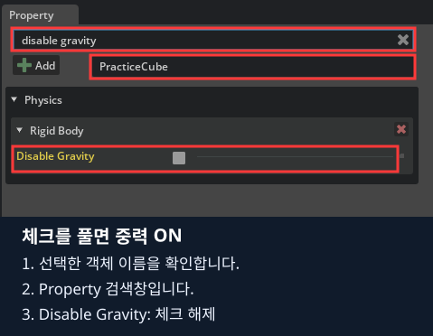

3. Play를 클릭합니다. 큐브가 떨어지지만 **바닥을 통과해 사라지는 것**을 봅니다.
4. Stop을 눌러 큐브가 처음 높이로 돌아오는지 확인합니다.

Ground에는 Collider가 있지만, PracticeCube에는 아직 Collider가 없습니다. 두 물체가 서로 닿으려면 **양쪽에 Collider**가 필요합니다.

### 3.5. 세 번째 조건: 큐브에도 Collider 추가하기

1. Stop 후 PracticeCube를 선택합니다.
2. **Add → Physics → Collider**를 클릭합니다.

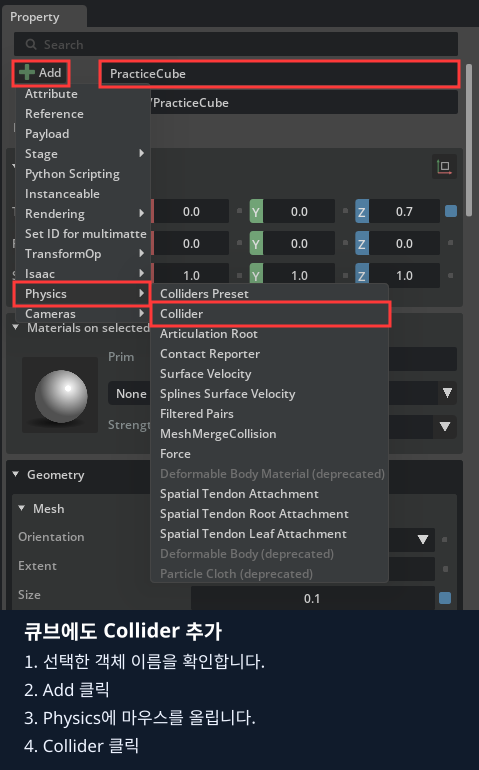

3. `collision`을 검색해 **Collision Enabled 체크**를 확인하고 검색어를 지웁니다.

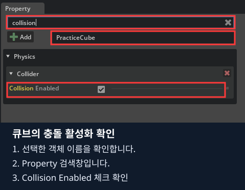

4. Disable Gravity는 **해제 상태**로 둡니다. Play를 클릭합니다.
5. 이제 큐브가 바닥 위에 멈추는지 봅니다. 중심 높이 Z는 약 `0.05` m입니다.
6. 관찰 후 **Stop**을 클릭합니다.

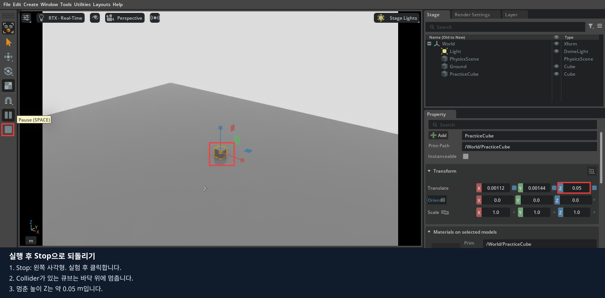

| 방금 비교한 조건 | Disable Gravity | 큐브 Collider | 결과 |
|---|---|---|---|
| 중력 OFF | 체크 | 없음 | 공중에 유지 |
| 중력 ON·충돌 없음 | 해제 | 없음 | 바닥을 통과 |
| 중력 ON·충돌 있음 | 해제 | 있음 | 바닥 위에 멈춤 |

이미 Collider를 추가한 뒤 두 번째 조건을 다시 보고 싶다면 `Collision Enabled`를 잠깐 해제합니다. 비교 후 다시 체크합니다.
Stop한 뒤 **File → Save As**, 형식 `*.usda`, 이름 `my_drop`으로 저장합니다.

## 4. 질량과 지구·달 중력 비교하기

### 4.1. 큐브 복제하기

1. Stop 상태인지, `my_drop.usda`를 저장했는지 확인합니다.
2. Stage의 **PracticeCube 이름 위에서 우클릭 → Duplicate**를 한 번 클릭합니다.
3. 같은 자리에 복제되므로 처음에는 한 개처럼 보일 수 있습니다. Stage에서 원본과 `_01` 등이 붙은 복제본을 찾습니다.
4. 각각 **우클릭 → Rename**으로 원본은 `CubeLight`, 복제본은 `CubeHeavy`로 바꿉니다.

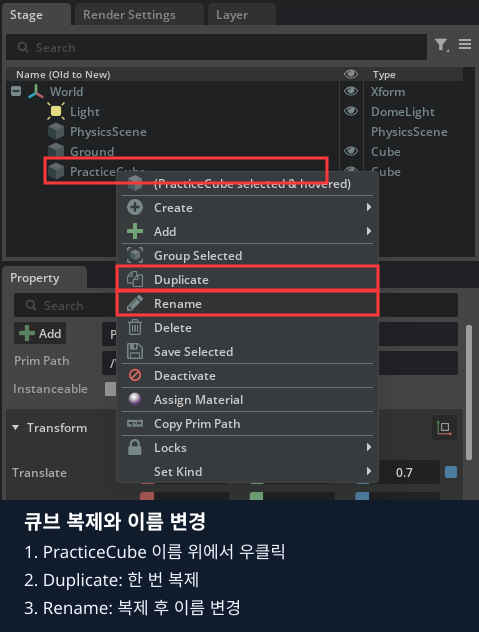

### 4.2. 같은 높이, 다른 질량 입력하기

CubeLight를 선택하고 아래 사진처럼 **Translate `(-0.3, 0, 1)`**, Scale `(1, 1, 1)`을 입력합니다.

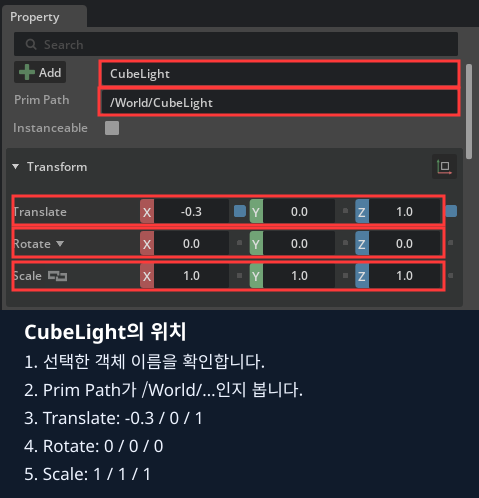

`mass`를 검색하고 **Mass `0.1`**을 확인한 뒤 검색어를 지웁니다.

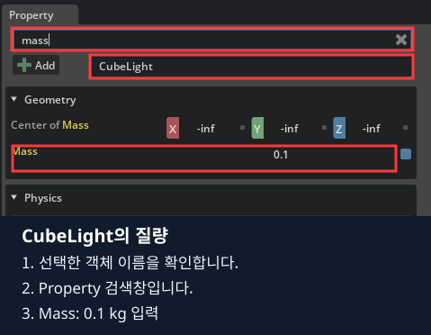

CubeHeavy를 선택하고 **Translate `(0.3, 0, 1)`**, Scale `(1, 1, 1)`을 입력합니다.

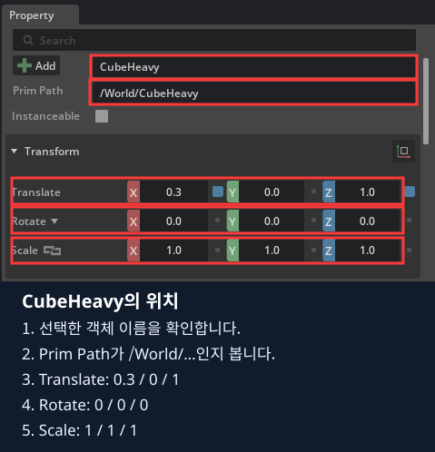

`mass`를 검색하고 **Mass `1`**을 입력한 뒤 검색어를 지웁니다.

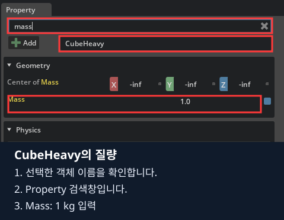

두 큐브 모두 Size `0.1`, Disable Gravity **해제**, Collision Enabled **체크** 상태를 확인합니다.
Play로 낙하를 비교한 뒤 Stop합니다. CubeHeavy의 Mass만 `5`로 바꿔 같은 비교를 한 번 더 합니다.
공기 저항이 없는 이 실험에서 무겁다는 이유만으로 자유 낙하 가속도가 커지지는 않습니다.

### 4.3. 달 중력으로 바꾸기

1. Stop 후 Stage의 **PhysicsScene**을 선택합니다.
2. **Physics → Scene → Gravity Magnitude**를 `9.81`에서 **`1.62`**로 바꾸고 Enter를 누릅니다.

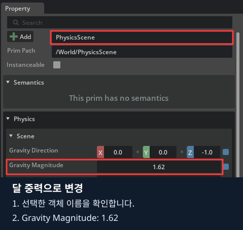

3. Play로 두 큐브가 떨어지는 속도를 비교합니다. 지구 중력일 때보다 어떻게 달라졌나요?
4. Stop 후 Gravity Magnitude를 **`9.81`로 복원**합니다.
5. **File → Save As**, 형식 `*.usda`, 이름 `my_mass`로 저장합니다.

중력을 끄려고 Mass를 `0`으로 만들지 않습니다. Mass의 `0`은 자동 계산을 뜻합니다.

## 5. 경사면과 마찰 만들기

### 5.1. 공통 바닥 다시 열기

1. 앞 실험을 `my_mass.usda`로 저장했는지 확인합니다.
2. **File → Open**을 클릭합니다.

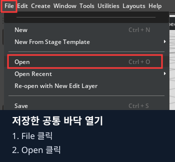

3. 주소 칸에 `/data/isaacsim_basic/`을 입력하고 Enter를 누릅니다.
4. File name에 **`base_scene.usda`**를 입력하거나 목록에서 그 파일을 선택하고 **Open File**을 클릭합니다.

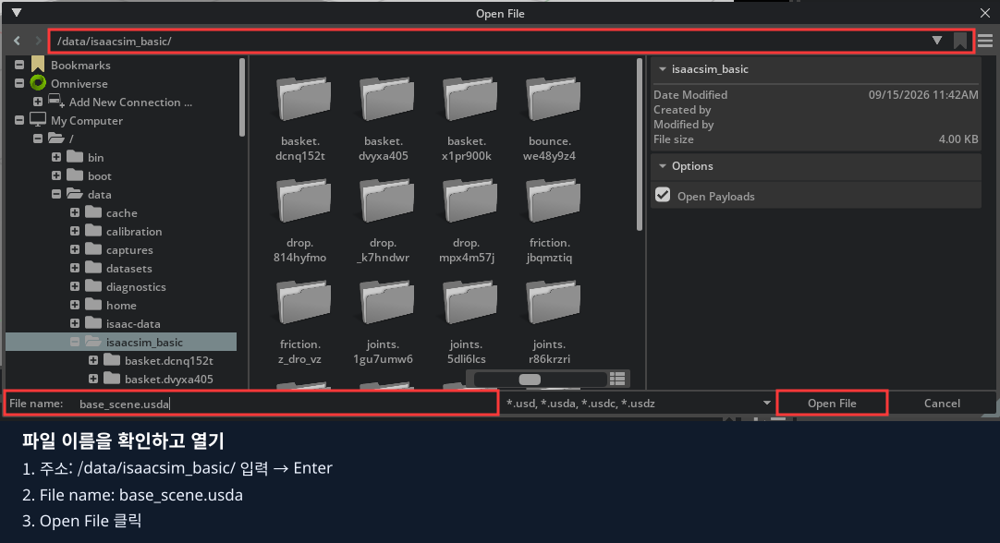

5. 저장 여부를 묻는 창이 나오면 아래 설명을 읽고 선택합니다. 앞 실험을 다른 파일에 저장한 것이 확실할 때만 `Don't Save`로 열기를 계속합니다.

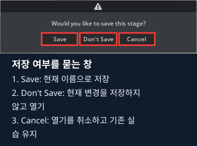

| 버튼 | 의미 |
|---|---|
| Save | 현재 열려 있는 파일 이름으로 저장합니다. 공통 바닥을 덮어쓰지 않도록 주의합니다. |
| Don't Save | 현재 창의 저장하지 않은 변경을 버리고 선택한 파일을 엽니다. |
| Cancel | 열기를 취소합니다. 저장이 불확실하면 이것을 누르고 Save As로 먼저 보관합니다. |

열린 Stage에 **World·Light·PhysicsScene·Ground만** 있는지 확인합니다.

### 5.2. 경사면 두 개와 큐브 두 개 만들기

1. `Create → Shape → Cube`로 네 개를 차례로 만듭니다. 매번 Rename으로 아래 이름을 붙이고 World 아래로 옮깁니다.
2. 네 객체 모두 `size`를 검색해 **Size `1`**로 설정하고 검색어를 지웁니다.
3. Stage에서 각 객체를 선택하고 다음 사진과 표대로 Transform을 입력합니다. 사진은 네 객체를 만든 뒤 각각 선택한 모습입니다.

| 객체 | Translate X / Y / Z | Rotate 또는 Orient X / Y / Z | Scale X / Y / Z |
|---|---|---|---|
| RampLow | `0 / -0.4 / 0.4` | `0 / 15 / 0` | `1.6 / 0.5 / 0.06` |
| RampHigh | `0 / 0.4 / 0.4` | `0 / 15 / 0` | `1.6 / 0.5 / 0.06` |
| CubeLow | `-0.461999 / -0.4 / 0.607650` | `0 / 15 / 0` | `0.1 / 0.1 / 0.1` |
| CubeHigh | `-0.461999 / 0.4 / 0.607650` | `0 / 15 / 0` | `0.1 / 0.1 / 0.1` |

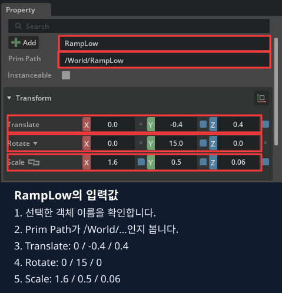

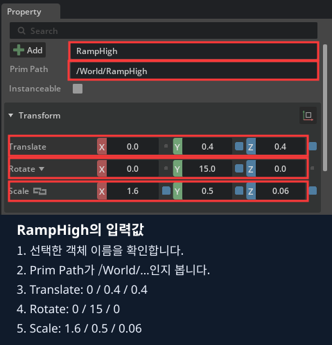

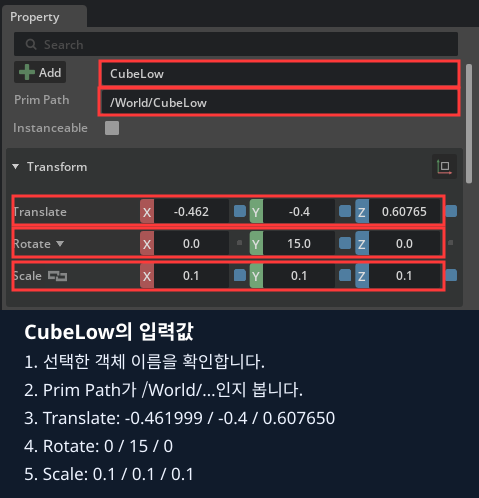

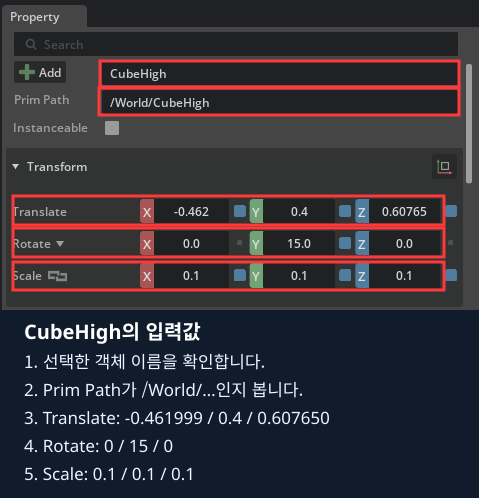

숫자 칸이 좁으면 `-0.461999`가 `-0.462`, `0.607650`이 `0.60765`처럼 짧게 표시될 수 있습니다. 입력할 때는 표의 값을 사용합니다.
회전 줄이 **Orient**인 경우도 Y 칸에 `15`도를 입력합니다. Rotate 줄을 추가로 만들 필요는 없습니다.

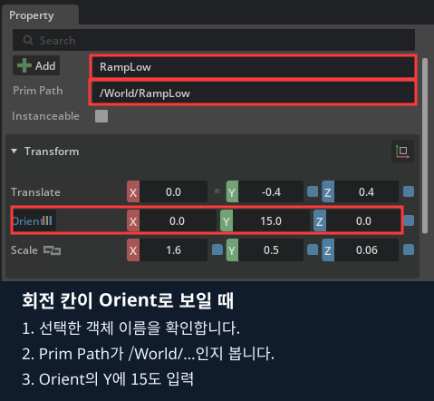

4. **RampLow와 RampHigh 각각:** 선택 → `Add → Physics → Collider`만 추가합니다.
5. **CubeLow와 CubeHigh 각각:** 선택 → `Add → Physics → Rigid Body` → `Collider` → `Mass`를 추가합니다. `mass`를 검색해 `0.1`, `disable gravity`를 검색해 **해제**를 확인합니다.

큐브의 긴 소수 위치값은 경사면 속에 파묻히지 않게 하기 위한 값입니다. Z를 임의로 `0.4`로 바꾸지 않습니다.

### 5.3. Low와 High 물리 재질 만들기

1. **Create → Physics → Physics Material**을 클릭합니다.

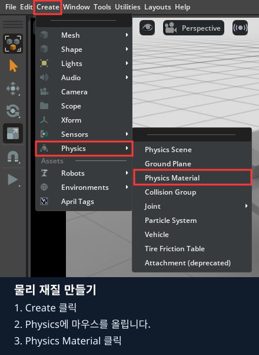

2. 작은 창에서 **Rigid Body Material을 체크**하고 **Ok**를 클릭합니다.

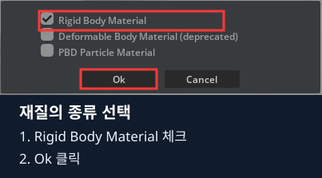

3. Stage의 새 `PhysicsMaterial`을 **Low**로 이름을 바꾸고 World 아래로 옮깁니다. Prim Path는 `/World/Low`입니다.
4. 같은 메뉴로 재질을 한 개 더 만들고 **High**로 이름을 바꿔 World 아래로 옮깁니다. Prim Path는 `/World/High`입니다.
5. Low를 선택하고 Property 아래쪽의 **Physics → Rigid Body Material**을 펼칩니다. 아래 값을 입력합니다.

| 재질 | Dynamic Friction | Static Friction | Restitution |
|---|---|---|---|
| Low | `0.05` | `0.05` | `0` |
| High | `0.8` | `0.8` | `0` |

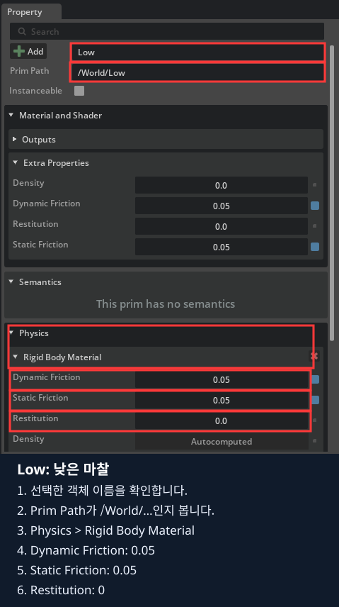

6. High도 선택해서 표의 값을 입력합니다. 위쪽 Extra Properties에 같은 이름이 보일 수도 있습니다. 사진의 빨간 박스처럼 아래쪽 **Physics → Rigid Body Material** 영역을 사용합니다.

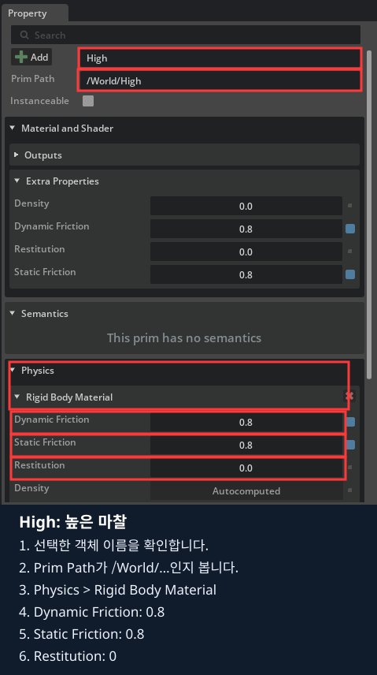

Static Friction은 미끄러지기 시작하는 조건에, Dynamic Friction은 미끄러지는 동안의 저항에 영향을 줍니다.
지금은 반발을 비교하지 않으므로 Restitution은 둘 다 `0`입니다.

### 5.4. 재질을 네 물체에 연결하기

**재질을 만들기만 해서는 물체에 적용되지 않습니다.** 경사면과 큐브 각각에 연결합니다.

1. Stage에서 **RampLow**를 선택합니다. Property 검색창은 비웁니다.
2. Property 안에서 휠을 내려 **Physics materials on selected models**를 찾습니다. 위쪽의 일반 `Materials on selected models`와 구분합니다.
3. 목록이 창 아래로 잘리면 바로 위 **Collider 제목의 삼각형**을 눌러 접어 공간을 확보합니다.
4. `None` 오른쪽 **▼**를 클릭하고 **`/World/Low`**를 선택합니다.

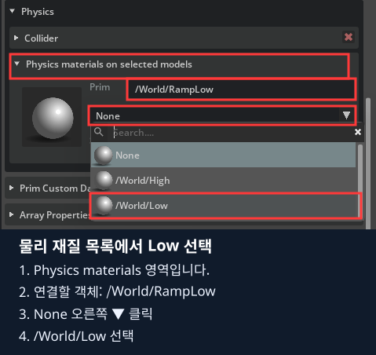

5. Prim에 `/World/RampLow`, 그 아래 재질 칸에 **`/World/Low`**가 보이면 연결된 것입니다.

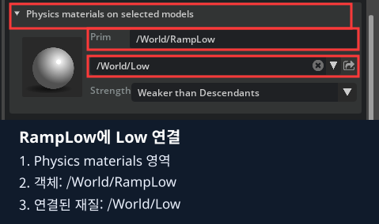

6. **CubeLow**를 선택해 같은 방법으로 Low를 연결합니다.

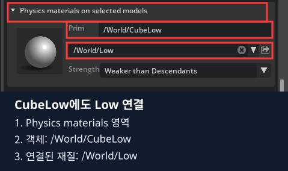

7. **RampHigh와 CubeHigh**를 각각 선택해서 High를 연결합니다. 두 물체를 모두 확인합니다.

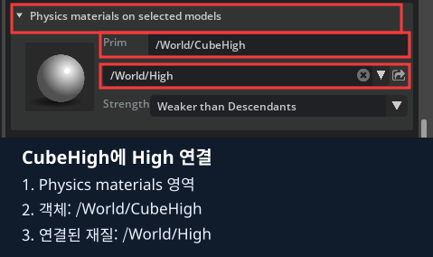

| 물체 | 연결할 물리 재질 |
|---|---|
| RampLow | `/World/Low` |
| CubeLow | `/World/Low` |
| RampHigh | `/World/High` |
| CubeHigh | `/World/High` |

접촉하는 **양쪽 물체**에 연결해야 합니다. 물체의 색만 바꾸는 것으로는 마찰이 바뀌지 않습니다.

### 5.5. Play로 마찰 비교하기

1. 화면에 경사면 두 개와 그 위의 큐브 두 개가 있는지 확인합니다.

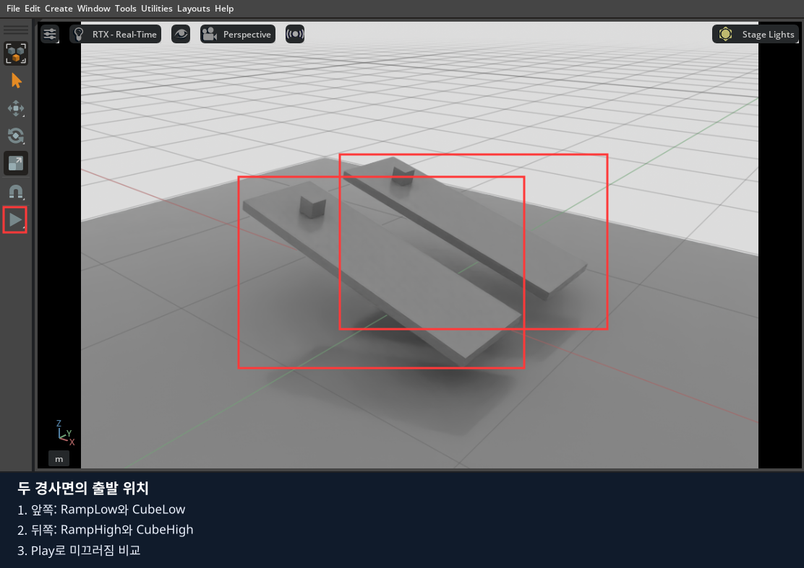

2. Play를 누릅니다. Low 쪽 큐브가 더 쉽게 미끄러지는지 관찰합니다.

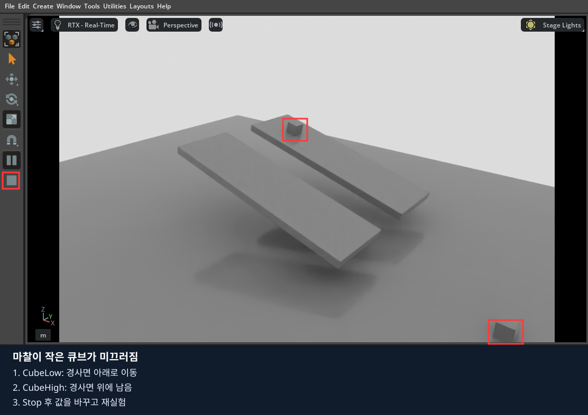

3. Stop 후 **재질 Low**를 선택합니다. Dynamic Friction과 Static Friction을 모두 `0.8`로 바꿉니다.
4. 다시 Play하여 두 큐브를 비교하고 Stop합니다.
5. Low의 두 마찰 값을 **`0.05`로 복원**합니다.
6. **File → Save As**, 형식 `*.usda`, 이름 `my_friction`으로 저장합니다.

## 6. 공과 반발계수 비교하기

### 6.1. 공통 바닥과 받침대 준비하기

1. 마찰 실험을 저장한 뒤 **File → Open**으로 `base_scene.usda`를 엽니다. 5.1절의 파일 열기 사진과 같은 순서입니다.
2. Stage에 World·Light·PhysicsScene·Ground만 있는지 확인합니다.
3. `Create → Shape → Cube`로 **PadLow**, **PadHigh**를 만들고 World 아래로 옮깁니다.
4. 각 받침대의 Size를 **`1`**로 설정하고 다음 Transform을 입력합니다. 회전은 모두 `0`입니다.

| 받침대 | Translate X / Y / Z | Scale X / Y / Z |
|---|---|---|
| PadLow | `-0.5 / 0 / 0.05` | `0.7 / 0.7 / 0.1` |
| PadHigh | `0.5 / 0 / 0.05` | `0.7 / 0.7 / 0.1` |

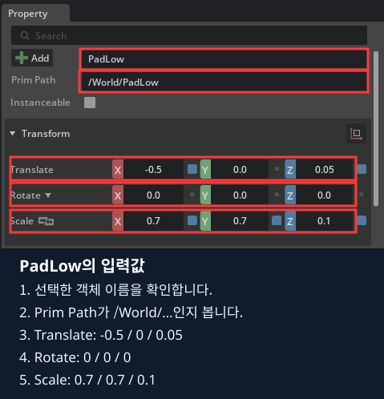

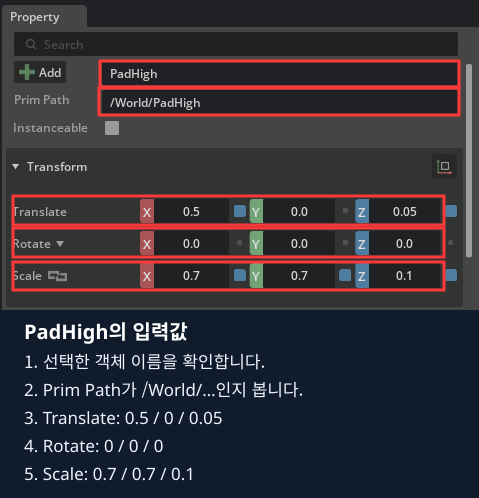

5. 두 받침대에 각각 **Add → Physics → Collider**만 추가합니다. 바닥처럼 Rigid Body는 추가하지 않습니다.

### 6.2. Sphere로 공 두 개 만들기

1. **Create → Shape → Sphere**를 클릭합니다.

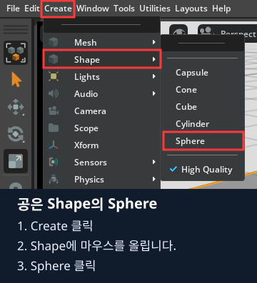

2. 첫 공은 **BallLow**로 이름을 바꾸고 World 아래로 옮깁니다. Translate `(-0.5, 0, 1)`, 회전 `(0, 0, 0)`, Scale `(1, 1, 1)`을 입력합니다.

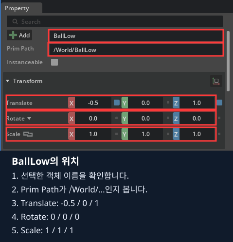

3. `radius`를 검색하고 **Radius `0.05`**를 입력합니다. 이것은 공의 반지름입니다. 검색어를 지웁니다.

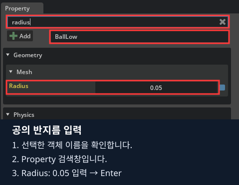

4. Sphere를 하나 더 만들어 **BallHigh**로 이름을 바꾸고 World 아래로 옮깁니다. Translate `(0.5, 0, 1)`, 회전 `(0, 0, 0)`, Scale `(1, 1, 1)`, Radius `0.05`를 입력합니다.

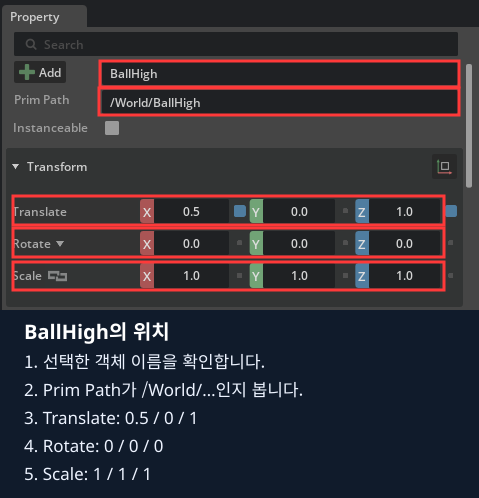

5. **공 각각에** `Add → Physics → Rigid Body`, `Collider`, `Mass`를 추가합니다.
6. 각 공에서 `mass`를 검색해 **`0.1`**, `disable gravity`를 검색해 **해제**, `collision`을 검색해 **체크**를 확인합니다. 마지막 검색어도 지웁니다.

### 6.3. 반발 재질 만들고 공·받침대에 연결하기

1. **Create → Physics → Physics Material → Rigid Body Material 체크 → Ok**로 재질 두 개를 만듭니다. 5.3절의 메뉴·선택 창과 같습니다.
2. 이름은 **Low**, **High**로 바꾸고 World 아래로 옮깁니다. 공통 바닥을 다시 열었으므로 이전 마찰 재질은 없는 상태입니다.
3. 각 재질의 **Physics → Rigid Body Material**에 다음 값을 입력합니다.

| 재질 | Dynamic Friction | Static Friction | Restitution |
|---|---|---|---|
| Low | `0.5` | `0.5` | `0` |
| High | `0.5` | `0.5` | `0.8` |

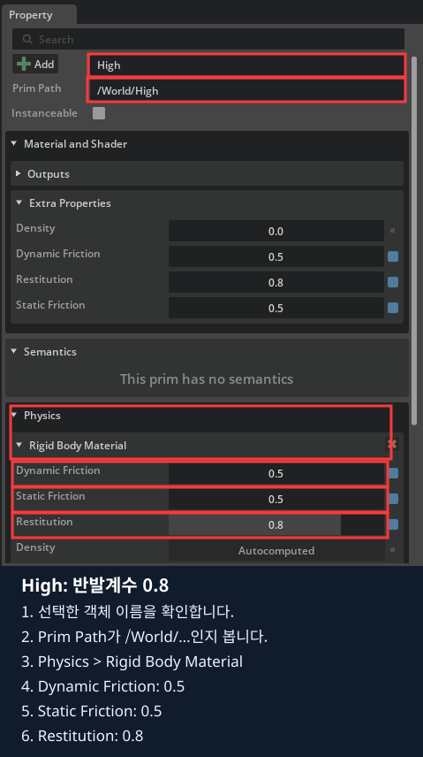

4. **PadLow와 BallLow**를 각각 선택하여 Property 아래의 **Physics materials on selected models → ▼ → `/World/Low`**를 연결합니다.
5. **PadHigh와 BallHigh**에는 각각 **`/World/High`**를 연결합니다.

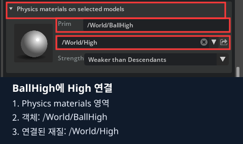

| 물체 | 연결할 물리 재질 |
|---|---|
| PadLow, BallLow | `/World/Low` |
| PadHigh, BallHigh | `/World/High` |

### 6.4. 첫 반동 관찰하기

1. 각 받침대 위에 공이 떠 있는지 확인합니다.

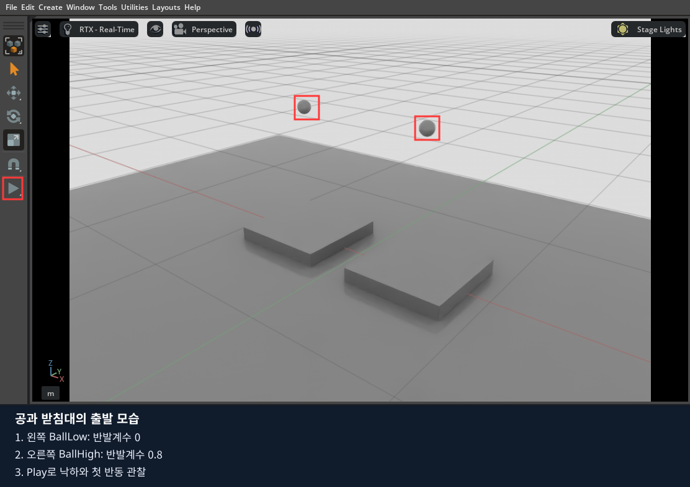

2. Play를 누르고 **바닥에 처음 부딪친 뒤** 두 공의 움직임을 비교합니다. High 쪽 공이 더 크게 튀어 오르는지 봅니다.

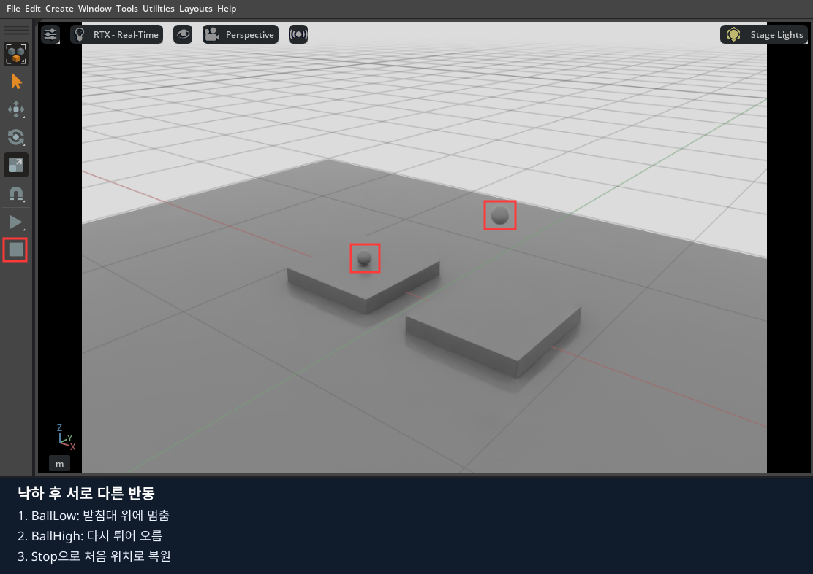

3. Stop 후 **재질 High**의 Restitution만 `0.3`으로 낮춰 다시 Play합니다.
4. Stop 후 `0.8`로 복원합니다. **File → Save As**, 형식 `*.usda`, 이름 `my_bounce`로 저장합니다.

Restitution은 부딪친 뒤 튀어 오르는 정도에 영향을 주는 반발계수입니다.
**0.8은 시작 높이의 80%까지 튄다는 뜻이 아닙니다.** 첫 반동의 높이가 어떻게 바뀌는지 비교합니다.

## 7. 직접 만든 환경을 저장하고 배운 내용 정리하기

아래 파일들이 같은 저장 폴더에 있는지 File → Open 창에서 확인합니다. 파일을 열기 전에는 현재 실험을 Save As로 보관합니다.

| 저장 파일 | 들어 있어야 하는 내용 |
|---|---|
| base_scene.usda | World·Light·PhysicsScene·Ground만 있는 공통 바닥 |
| my_drop.usda | 중력·충돌을 비교한 PracticeCube |
| my_mass.usda | CubeLight·CubeHeavy |
| my_friction.usda | 두 경사면·두 큐브·마찰 재질 Low와 High |
| my_bounce.usda | 두 공·두 받침대·반발 재질 Low와 High |

한 파일을 다시 열고 Stage에서 객체를 선택해 입력값이 남아 있는지 확인합니다. Play와 Stop도 한 번 실행합니다.
메뉴와 저장 창은 2.6절, 파일을 다시 여는 창은 5.1절의 사진을 참고합니다.

다음 세 가지를 자신의 말로 설명한 뒤 코드 실습으로 넘어갑니다.

- 큐브에 중력을 켜도 Collider가 없으면 바닥을 통과하는 이유
- 같은 높이의 무거운 큐브가 더 빨리 자유 낙하하지 않는 이유
- 색상·마찰·반발계수 중 어떤 속성을 바꿔야 각 현상이 달라지는지

## 8. 마지막: 같은 작업을 코드로 구현하기

지금까지 마우스로 만들고 관찰한 내용을 코드로 연결합니다. 먼저 직접 만든 USD를 저장합니다.
Isaac Sim 창을 닫아 현재 실행을 종료합니다.

각 예제의 `build_scene()`은 새 장면에 객체를 만듭니다. 화면에서 저장한 USD가 Python 소스를 자동으로 바꾸지는 않습니다.

| 화면에서 한 일 | Python에서 찾을 부분 |
|---|---|
| Shape Cube 생성, Size·Transform 입력 | `Cube.Define`, `CreateSizeAttr`, `AddTranslateOp`, `AddScaleOp` |
| Rigid Body·Collider·Mass 추가 | `RigidBodyAPI`, `CollisionAPI`, `MassAPI` |
| Disable Gravity 변경 | `CreateDisableGravityAttr` |
| PhysicsScene 중력 변경 | `CreateGravityMagnitudeAttr` |
| 물리 재질 생성·속성·연결 | `MaterialAPI`, `CreateStaticFrictionAttr`, `CreateRestitutionAttr`, `MaterialBindingAPI` |

### 코드 실행과 수정 순서

설치는 0장에서 마쳤다고 가정합니다. 다음 명령을 저장소 루트에서 실행합니다.

같은 노트북의 저장소 루트 터미널:

```bash
./lekiwi basic --chapter 1
```

1. 실행하면 Stop 상태로 열립니다. 화면의 Play로 관찰하고 Stop으로 돌아옵니다. 이 절에 연결된 Python 파일을 열고, 앞에서 클릭했던 속성에 해당하는 줄을 찾습니다.
2. 기본 실행 결과를 직접 만든 환경의 결과와 비교합니다.
3. 실행을 종료한 뒤 지정된 기본 줄에 `#`를 붙이고 비교할 줄의 `#`를 지웁니다. 들여쓰기는 유지합니다.
4. 파일을 저장하고 같은 명령으로 다시 실행합니다. 화면에서 값을 바꾸는 실험과 결과를 비교합니다.

코드 수정 전 Isaac Sim 창을 닫고, 수정 파일을 저장한 뒤 같은 명령으로 재실행합니다.
학생 파일은 호스트에서 저장하면 다음 실행에 반영되며, 코드만 수정할 때 Docker 이미지 재빌드는 필요 없습니다.

### 8.1. 중력도 충돌도 없는 기본 실행

[학생 파일: 01_no_gravity.py](experiments/01_no_gravity.py)

파일 안 `build_scene(stage)`가 장면을 만듭니다. `main()`은 Isaac Sim을 시작하고 창을 유지합니다.
`SimulationApp`을 만든 **다음**에 `omni`와 `pxr` 모듈을 읽는 순서를 지킵니다.

```python
cube = UsdGeom.Cube.Define(stage, "/World/PracticeCube")
cube.CreateSizeAttr(.1)
cube.AddTranslateOp().Set(Gf.Vec3d(0, 0, .7))
cube.CreateDisplayColorAttr([Gf.Vec3f(.2, .6, .95)])
```

`Define`은 Stage의 경로에 객체를 만듭니다. 한 변은 0.1 m, 중심 높이는 0.7 m입니다.
색상 RGB는 0~1입니다. 이 네 줄만으로는 움직이는 물체가 되지 않습니다.

```python
UsdPhysics.RigidBodyAPI.Apply(cube.GetPrim())
UsdPhysics.MassAPI.Apply(cube.GetPrim()).CreateMassAttr(.1)
body = PhysxSchema.PhysxRigidBodyAPI.Apply(cube.GetPrim())
body.CreateDisableGravityAttr(True)
# body.CreateDisableGravityAttr(False)
# UsdPhysics.CollisionAPI.Apply(cube.GetPrim())
```

동적 강체는 유지하되 `DisableGravity=True`로 중력을 끕니다. Collider 줄은 주석이므로 큐브의 접촉은 없습니다.
Play를 눌러도 큐브는 높이 0.7 m에 머뭅니다. 바닥의 Collider는 이미 켜져 있지만 **큐브에도 Collider가 있어야** 접촉합니다.


먼저 주황색 `CreateDisplayColorAttr` 줄의 주석을 해제하고 기본 파란색 줄을 주석 처리합니다.
재실행하여 색상만 달라지는지 확인합니다. 두 줄을 모두 활성화하면 뒤의 값이 앞의 값을 덮어씁니다.

### 8.2. 중력만 켜기

같은 파일에서 다음과 같이 한 줄씩 교체합니다.

```python
# body.CreateDisableGravityAttr(True)
body.CreateDisableGravityAttr(False)
# UsdPhysics.CollisionAPI.Apply(cube.GetPrim())
```

재실행 → Play. 큐브는 떨어져 바닥을 통과합니다. 화면에서 사라졌다고 삭제된 것은 아닙니다.
Stage의 `/World/PracticeCube`를 선택하고 Property의 높이를 확인한 다음 Stop을 누릅니다.
비교용 정답 파일은 [02_gravity_only.py](experiments/02_gravity_only.py)입니다.

```bash
./lekiwi basic --experiment 2
```

### 8.3. 접촉까지 켜기

```python
body.CreateDisableGravityAttr(False)
UsdPhysics.CollisionAPI.Apply(cube.GetPrim())
```

다시 실행하면 큐브가 바닥에 멈춥니다. 바닥 윗면이 Z=0이고 큐브 한 변이 0.1 m이므로 중심 높이는 약 **0.05 m**입니다.
정답 파일 [03_gravity_collision.py](experiments/03_gravity_collision.py)은 `./lekiwi basic --experiment 3`으로 실행합니다.

| 조건 | 동적 강체 | 중력 | 큐브 접촉 | 예상 |
|---|---|---|---|---|
| 1 | O | X | X | 공중 유지 |
| 2 | O | O | X | 바닥 통과 |
| 3 | O | O | O | 바닥에 정지 |

바닥은 움직이지 않으므로 `RigidBodyAPI` 없이 `CollisionAPI`만 적용합니다.
큐브와 바닥의 크기·좌표는 m, 질량은 kg, 중력 가속도는 m/s²입니다.

### 8.4. 질량과 중력 가속도

[04_mass_gravity.py](experiments/04_mass_gravity.py)를 열고 실행합니다.

```bash
./lekiwi basic --experiment 4
```

주황 큐브 0.1 kg, 파랑 큐브 1 kg이 같은 높이에서 출발합니다. 이 예제에는 공기 저항이 없습니다.
질량이 다르다고 무거운 큐브가 더 빨리 자유 낙하하지는 않습니다.

```python
scene.CreateGravityMagnitudeAttr(9.81)
# scene.CreateGravityMagnitudeAttr(1.62)
```

기본 줄 대신 아래 줄을 사용해 달 중력으로 바꾸고 낙하 속도를 비교합니다.
파일 아래 `CubeHeavy` 질량을 5 kg으로 바꾸는 줄도 주석 해제해 봅니다.
**질량을 0으로 만들어 중력을 끄지 않습니다.** USD의 0 질량은 자동 계산 의미가 있으므로 중력의 ON/OFF API와 구분합니다.

### 8.5. 마찰과 경사면

[05_friction.py](experiments/05_friction.py) → `./lekiwi basic --experiment 5`

두 경사면은 같은 15도이며 큐브의 크기·질량도 같습니다. 마찰계수만 0.05 / 0.8입니다.
`material()` 안의 실제 API를 확인합니다.

```python
physics = UsdPhysics.MaterialAPI.Apply(mat.GetPrim())
physics.CreateStaticFrictionAttr(friction)
physics.CreateDynamicFrictionAttr(friction)
UsdShade.MaterialBindingAPI.Apply(prim).Bind(mat, materialPurpose="physics")
```

정지 마찰은 미끄러지기 시작하는 조건, 동적 마찰은 미끄러지는 동안의 저항입니다.
`materialPurpose="physics"`는 물리 재질을 연결합니다. 화면 색상과는 별개입니다.
같은 재질을 해당 큐브와 경사면 **양쪽**에 적용하여 혼합 규칙이 비교를 흐리지 않게 했습니다.

파일 맨 아래 Low 재질의 두 마찰값을 .8로 바꾸는 세 줄을 주석 해제합니다.
다시 실행하면 두 큐브의 미끄러짐이 비슷해져야 합니다. 한 번에 경사각까지 바꾸지 않습니다.

### 8.6. 반발계수

[06_restitution.py](experiments/06_restitution.py) → `./lekiwi basic --experiment 6`

공 두 개가 동일한 높이에서 떨어집니다. 공과 받침대의 반발계수는 각 쌍이 0 / 0.8입니다.
아래쪽의 `.CreateRestitutionAttr(.3)` 줄을 해제하여 높은 쪽만 0.3으로 낮춥니다.
반발계수 범위는 0~1이며 접촉 전후 수직 상대 속도에 관련됩니다. **0.8이 원래 높이의 80%로 튄다는 뜻은 아닙니다.**
중력·초기 높이·질량을 유지하고 첫 반동의 높이를 비교합니다.


### 8.7. 실험 파일을 골라 실행하고 비교하기

| 마우스로 한 실험 | 학생 파일 | 노트북 실행 |
|---|---|---|
| 중력 OFF | [01_no_gravity.py](experiments/01_no_gravity.py) | `./lekiwi basic --experiment 1` |
| 중력 ON·충돌 없음 | [02_gravity_only.py](experiments/02_gravity_only.py) | `./lekiwi basic --experiment 2` |
| 중력·충돌 ON | [03_gravity_collision.py](experiments/03_gravity_collision.py) | `./lekiwi basic --experiment 3` |
| 질량·중력 크기 | [04_mass_gravity.py](experiments/04_mass_gravity.py) | `./lekiwi basic --experiment 4` |
| 마찰 | [05_friction.py](experiments/05_friction.py) | `./lekiwi basic --experiment 5` |
| 반발 | [06_restitution.py](experiments/06_restitution.py) | `./lekiwi basic --experiment 6` |

각 실행을 종료한 뒤 다음 파일을 실행합니다. 실험 번호와 장 번호는 다릅니다.
코드 실행은 새 장면을 만듭니다. 직접 제작 결과는 앞에서 저장한 USD를 다시 열어 비교합니다.
객체 경로·단위·물리 조건과 관찰 결과를 비교하며, USD 파일의 모든 바이트가 같을 필요는 없습니다.

바구니 보충 예제는 같은 노트북에서 `./lekiwi basic --lesson basket`으로 실행합니다.
직접 만드는 과정은 6장에서 진행합니다. 바닥과 네 벽을 각각 Collider로 만들어 입구를 비워 둡니다.

마우스로 만든 환경과 코드가 만든 환경의 객체 경로·물리 속성·Play 결과를 같은 조건에서 비교합니다.

[공식 자료](SOURCES.md) · [다음: 2장](../02_robot_joints/README.md)
