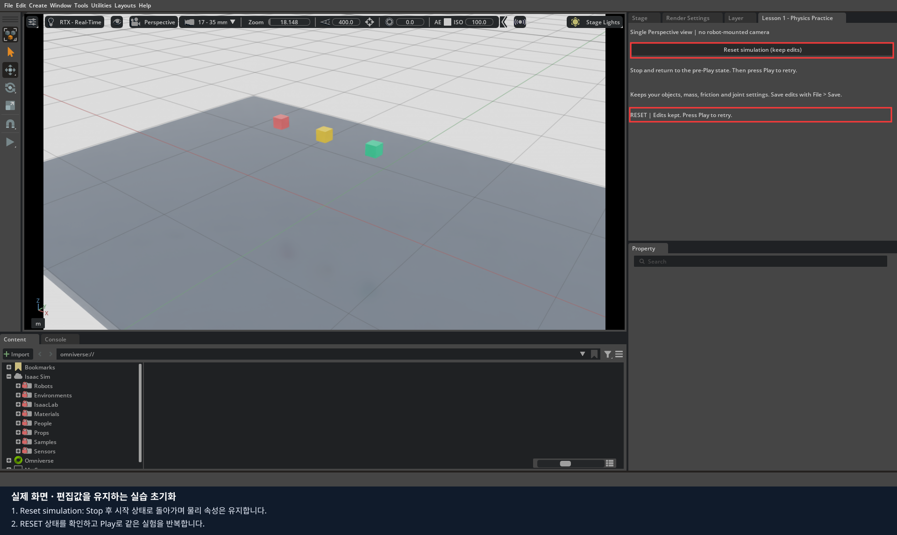
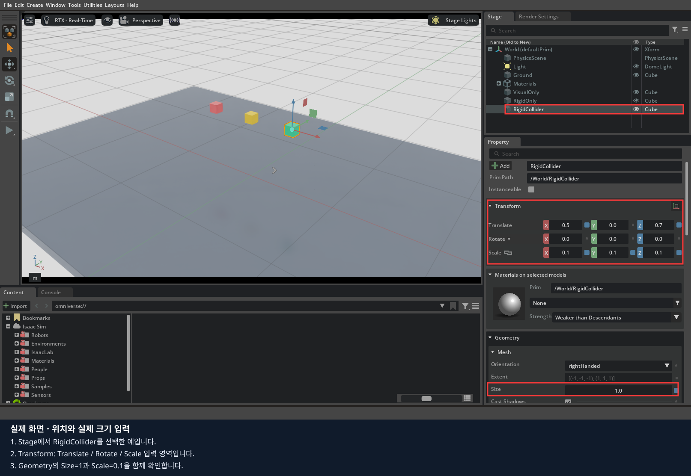
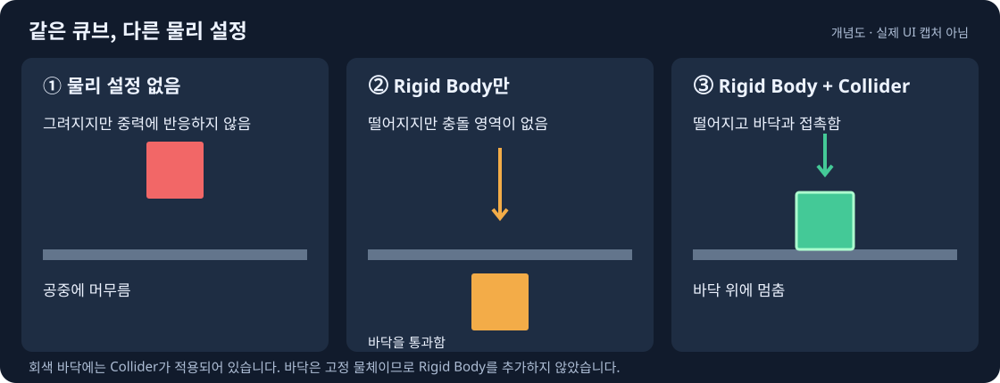
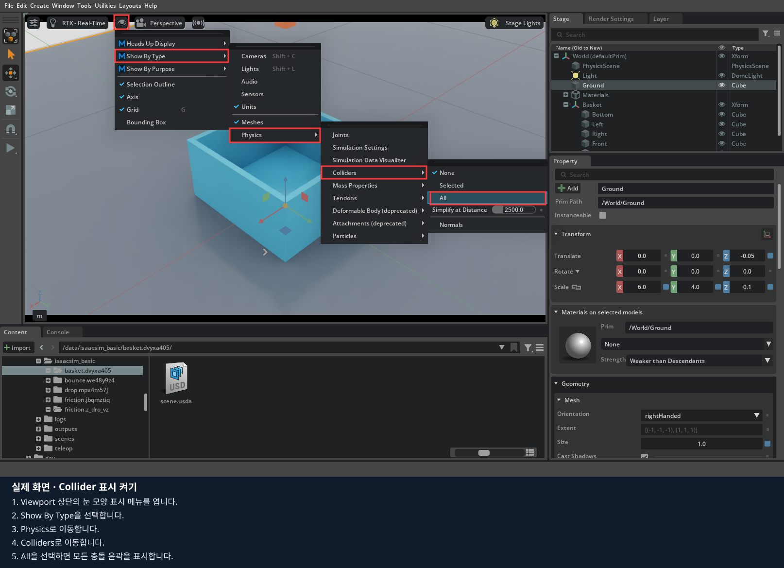
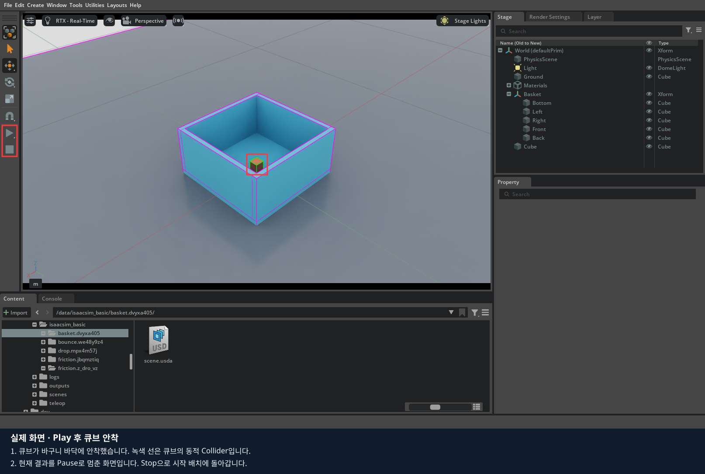

# 01. 객체 생성과 물리 속성

**완료 목표:** 4 cm 큐브가 열린 바구니 안으로 떨어지고 멈추는 장면을 만들고,
왜 그런 결과가 나왔는지 설명한 뒤 저장한다.

예상 시간은 **90~150분**입니다. 기본 실습 60~90분, 바구니·오류 진단·심화·저장 30~60분으로 나눕니다.
이 자료는 Isaac Sim 5.1.0의 영문 UI를 기준으로 합니다.
처음 실행은 [실행 안내](../README.md)를 사용합니다. 메뉴가 보이지 않으면 선택한 객체가 맞는지 먼저 확인하세요.
UI 배치와 메뉴 명칭은 버전·활성 확장에 따라 다를 수 있습니다.

아래 빨간 테두리 그림은 **이 프로젝트를 실행한 실제 Isaac Sim 화면**입니다.
테두리 아래의 번호 설명 순서로 확인하세요. 그림을 클릭하거나 새 탭에서 열면 원래 크기로 볼 수 있습니다.
스크린샷 속 고유 폴더 이름은 예시이며 자신의 터미널에 출력된 경로를 사용합니다.

이 편은 기본 도형의 물리 실습입니다. LeKiwi 장착 카메라 TF는 3·4·6편의 로봇 실행에 공통 적용되며, 여기서 직접 만든 Camera는 별도 실습 객체입니다.
[1~6편의 카메라 적용 범위](../README.md#1~6편의-카메라-설정-적용-범위)를 참고하세요.

## 반복 실습과 초기화

기본 화면은 **Perspective 하나**입니다. 이 교육 모형에는 LeKiwi 전방 카메라가 없습니다.
Stage 옆 `Lesson 1 - Physics Practice` 탭의
**Reset simulation (keep edits)**를 누르면 시뮬레이션을 Stop하고 Play 이전 상태로 돌아갑니다.
추가한 객체와 질량·마찰·Drive 설정은 유지됩니다. 값을 수정한 뒤 Play로 같은 실험을 반복하세요.
Drive 목표 각도를 바꾸었다면 그 값도 유지되므로, 다음 Play에서 다시 해당 각도로 움직입니다.
원본 파일을 다시 여는 기능이 아니며, 수정본 저장은 `File > Save`로 별도로 수행합니다.



## 1. 화면과 실습 파일 확인

```bash
./lekiwi basic
```

**준비된 것:** `/World` 아래 `Ground`, `Light`, `PhysicsScene`, `Materials`.
바닥 윗면은 Z=0 m이고, 중력은 -Z 방향 9.81 m/s²입니다. 아직 큐브는 없습니다.


위 화면은 패널 위치를 보여주기 위해 `--lesson drop` 장면에서 촬영했습니다.
기본 `./lekiwi basic` 실습대에는 세 큐브가 없으며 다음 단계에서 직접 만듭니다.

| 화면 | 하는 일 | 먼저 해볼 조작 |
|---|---|---|
| Viewport | 장면을 보는 화면 | 바닥을 선택하고 시점을 돌려 보기 |
| Stage | 객체의 계층 목록 | `World`를 펼쳐 `Ground` 선택 |
| Property | 선택한 객체의 설정 | `Transform`의 위치·회전·크기 확인 |
| Play / Pause / Stop | 시뮬레이션 제어 | Play 후 Pause와 Stop의 차이 확인 |

Pause는 현재 상태에서 잠시 멈추는 용도입니다. Stop은 이 실습에서 시작 상태로 돌아가 다시 실험할 때 사용합니다.
매번 **Stop → 값 수정 → Play → 관찰 → Stop** 순서로 진행하세요.
재실행한 프로세스는 새 작업 파일을 만들기 때문에, 이전 수정본은 `File > Open`으로 다시 열어야 합니다.

**확인:** Stage에서 선택한 이름과 Property 맨 위의 객체 이름이 일치하는가?
화면에서 물체를 클릭했을 때 부모가 선택될 수도 있으므로, 처음에는 Stage에서 정확한 객체를 선택하세요.

## 2. 좌표·단위·크기

이 실습은 길이 m, 질량 kg, 위쪽 Z를 명시해서 생성됩니다. Transform의 회전 입력은 degree입니다.
중력은 단위 없는 ‘중력계수’가 아니라 **중력가속도의 크기와 방향**으로 다룹니다.

| 실제 값 | 실습에서 사용하는 값 |
|---|---|
| 10 cm | 0.1 m |
| 4 cm | 0.04 m |
| 100 g | 0.1 kg |
| 35 g | 0.035 kg |
| 90도 회전 | Rotate에 90 |

Scale은 길이가 아니라 배율입니다. 예를 들어 Cube의 `Size`가 2라면 Scale 0.1의 실제 변 길이는 0.2 m입니다.
아래 실습에서는 **Size=1로 먼저 정한 뒤 Scale로 크기를 맞춰** 이 혼동을 피합니다.
숫자 칸이 드래그 방식으로 동작하면 **Ctrl+클릭 → 숫자 입력 → Enter**로 값을 확정합니다.
다른 USD를 가져왔을 때는 단위와 부모의 Scale도 확인해야 합니다.

### 직접 큐브 만들기

1. Stop 상태에서 Stage의 `World`를 선택합니다.
2. `Create > Shape > Cube`를 선택합니다. 구성에 따라 `Create > Mesh > Cube`로 표시될 수 있습니다.
3. Stage에서 생성된 큐브의 이름을 `PracticeCube`로 바꿉니다.
4. Property의 `Geometry`에서 `Size=1`을 설정합니다.
5. `Transform`을 다음과 같이 설정합니다.

| 항목 | X | Y | Z |
|---|---:|---:|---:|
| Translate | 0 | 0 | 0.7 |
| Rotate | 0 | 0 | 0 |
| Scale | 0.1 | 0.1 | 0.1 |




Transform 캡처는 비교용 `RigidCollider`를 선택한 예라 X=0.5입니다.
직접 만드는 `PracticeCube`는 위 표대로 X=0을 입력하세요. 공통으로 Size=1, Scale=0.1을 확인합니다.

**예상 결과:** 바닥 위 0.7 m 위치에 한 변 10 cm 큐브가 보입니다. 0.7 m는 큐브 **중심**의 높이입니다.
바닥에 바로 놓으려면 회전이 없는 이 큐브의 중심 Z는 약 0.05 m여야 합니다.
Z=0으로 놓으면 큐브 절반이 바닥에 묻힙니다.

**확인 문제:** 한 변 4 cm 큐브를 같은 바닥에 놓을 때 중심 높이는? → 약 0.02 m.
시뮬레이션 접촉 여유 거리 때문에 관측 위치에는 작은 오차가 있을 수 있습니다.

### 부모와 자식의 위치

1. 별도 연습용 Xform을 만들고 이름을 `Group`으로 정합니다.
2. 물리 설정 전의 연습용 큐브를 `Group` 아래에 둡니다.
3. 큐브의 로컬 Translate를 `(0, 0, 0.1)`로 명시합니다.
4. 부모 `Group`을 `(0.5, 0, 0)`으로 이동합니다. 부모 회전은 0, Scale은 1로 둡니다.

**예상 결과:** 큐브의 장면 전체 기준 중심은 `(0.5, 0, 0.1)`입니다.
자식의 Translate만 보고 장면 전체 위치라고 해석하면 안 됩니다.
계층 이동 시 로컬 좌표가 보존되는지 월드 좌표가 보존되는지는 편집 동작에 따라 달라질 수 있으므로,
옮긴 뒤 위 값을 직접 입력합니다. 이 연습용 객체는 다음 낙하 실습과 겹치지 않게 둡니다.

## 3. Rigid Body와 Collider

Rigid Body는 중력과 힘에 따라 움직이게 하는 설정입니다.
Collider는 다른 물체와 부딪히는 영역입니다. 바닥에도, 떨어지는 물체에도 충돌 설정이 필요합니다.



### 한 큐브를 단계적으로 바꾸기

1. `PracticeCube`를 선택하고 아직 물리 설정이 없는 상태에서 Play합니다.
   **관찰:** 큐브가 공중에 남습니다. Stop합니다.
2. Stage에서 큐브 우클릭 → `Add > Physics > Rigid Body`를 선택합니다.
   Play하면 떨어지지만 바닥을 통과합니다. Stop합니다.
3. 같은 큐브에 `Add > Physics > Collider` 또는 `Collider Presets`를 추가합니다.
   Play하면 바닥에 부딪혀 멈춥니다. Stop합니다.

메뉴의 `Rigid Body With Colliders Preset`처럼 두 속성을 한 번에 추가하는 항목은
두 번째 단계의 ‘Rigid Body만 있는 상태’와 다릅니다. Property에서 실제 적용된 항목을 확인하세요.


우클릭 메뉴 외에 위처럼 **Property의 Add 버튼**에서도 같은 물리 속성을 추가할 수 있습니다.
기초 실행기는 이 메뉴에 필요한 PhysX 편집 확장을 자동으로 켭니다.

### 완성된 비교 장면

창을 닫은 뒤 실행합니다.

```bash
./lekiwi basic --lesson drop
```

| 객체 | 색 | Rigid Body | Collider | Play 결과 |
|---|---|---|---|---|
| `/World/VisualOnly` | 빨강 | 없음 | 없음 | Z=0.7 근처에 머묾 |
| `/World/RigidOnly` | 주황 | 있음 | 없음 | 바닥을 통과해 낙하 |
| `/World/RigidCollider` | 초록 | 있음 | 있음 | 중심 Z≈0.05에 안착 |
| `/World/Ground` | 회색 | 없음 | 있음 | 고정 바닥으로 접촉을 받음 |

이 비교 순서는 [NVIDIA Adding Props](https://docs.isaacsim.omniverse.nvidia.com/5.1.0/core_api_tutorials/tutorial_core_adding_props.html)의
기본 실험을 참고해 자체 기본 도형으로 구성했습니다.

### 충돌 모양 표시

Viewport의 눈 모양 표시 메뉴 → `Show By Type > Physics > Colliders > Selected` 또는 `All`을 선택합니다.
메뉴가 바로 열리지 않으면 눈 아이콘의 메뉴/우클릭을 확인합니다.
초록 큐브와 바닥의 충돌 윤곽이 있는지, 주황 큐브에는 없는지 비교하세요.
**화면에서 숨기는 것과 충돌을 비활성화하는 것은 다릅니다.** 눈 아이콘만 꺼도 충돌은 남을 수 있습니다.



위 캡처의 배경은 바구니 장면이지만 표시 메뉴의 경로는 모든 실습에서 같습니다.

## 4. 질량·밀도·중력

```bash
./lekiwi basic --lesson mass
```

### 질량 비교

`/World/Light`는 0.1 kg, `/World/Heavy`는 1 kg이며, 두 큐브의 크기와 중심 높이는 같습니다.
Property의 `Physics > Mass` 영역에서 값을 확인합니다.
직접 만든 큐브에 영역이 없으면 `Add > Physics > Mass`로 추가합니다.


항목이 많으면 Property 검색창에 `mass`를 입력합니다.
위쪽 Geometry의 계산 정보와 구분하여 **Physics → Mass**의 입력란을 편집하세요.
캡처는 질량 0.1 kg인 비교 장면의 큐브입니다. 다음 실습으로 넘어갈 때는 검색창 오른쪽 X로 검색어를 지웁니다.

1. 두 큐브가 같은 Z=1 m에서 시작하는지 확인합니다.
2. Play하고 두 큐브가 떨어지는 모습을 비교합니다.
3. Stop한 뒤 질량만 바꾸어 다시 실행합니다.

**예상 결과:** 공기 저항을 별도로 모델링하지 않은 자유낙하에서 질량 차이만으로 낙하가 빨라지지 않습니다.
질량 차이는 같은 힘을 받거나 다른 물체와 충돌하는 상황에서 별도로 관찰합니다.

밀도는 `질량 / 부피`입니다. 한 변 0.1 m인 정육면체의 부피는 0.001 m³이고,
밀도 100 kg/m³이면 질량은 0.1 kg입니다. 이 계산은 크기와 단위 확인용으로 활용하세요.
명시적 질량과 밀도를 동시에 변경해 효과를 혼동하지 않도록 첫 실습은 질량만 사용합니다.
Isaac Sim에서 `Mass=0`은 무게가 없다는 뜻이 아니라 부피와 밀도 등에 따른 자동 계산을 요청하는 값입니다.
[공식 질량 설명](https://docs.isaacsim.omniverse.nvidia.com/5.1.0/core_api_tutorials/tutorial_core_adding_props.html#add-mass)

### 중력 비교

1. Stop하고 `/World/PhysicsScene`을 선택합니다.
2. Gravity Direction이 `(0, 0, -1)`인지 확인합니다.
3. Gravity Magnitude를 9.81에서 1.62로 바꿉니다. 이 Stage에서 단위는 m/s²입니다.
4. 같은 시작 위치에서 Play합니다.
5. Stop 후 0으로 바꾸어 다시 비교하고, 마지막에 9.81로 복원합니다.


**예상 결과:** 1.62에서는 더 천천히 낙하합니다. 중력이 0이고 초기 속도·다른 힘이 없으면 위치를 유지합니다.
‘중력 0’은 이미 움직이던 물체를 즉시 정지시키는 기능이 아닙니다.
중력을 바꾼 뒤 모든 동적 물체에 영향이 가는지 확인하세요.

## 5. 외관 재질과 물리 재질

색상·광택을 정하는 재질과 마찰·반발력을 정하는 **Physics Material**은 용도가 다릅니다.
파란색으로 바꿨다고 미끄럽게 되지는 않습니다.

직접 만들 때는 `Create > Physics > Physics Material`에서 강체용 재질을 만들고 이름을 정합니다.
이후 **Collider가 있는 객체를 선택해서** Property의 Physics Material 연결 항목에 그 재질을 지정합니다.
버전에 따라 항목이 `Physics material on selected Material` 또는 물리 재질 바인딩으로 표시될 수 있습니다.
재질이 Stage에 존재하는 것만으로는 물체에 적용되지 않습니다.

비교 실습은 큐브와 상대 표면 **양쪽에 같은 값의 재질을 연결**해 접촉 조합의 영향을 줄였습니다.
각 객체에 어떤 재질이 연결되어 있는지 먼저 확인하세요.

## 6. 경사로에서 마찰 비교

```bash
./lekiwi basic --lesson friction
```

두 경사로는 Y축으로 15° 기울어져 있으며 큐브는 경사면에 맞춰 배치되어 있습니다.
`RampLow`와 `CubeLow`, `RampHigh`와 `CubeHigh`가 각각 한 쌍입니다.

| 재질 | Static Friction | Dynamic Friction | 예상 동작 |
|---|---:|---:|---|
| `/World/Materials/Low` | 0.05 | 0.05 | 큐브가 +X 쪽으로 미끄러짐 |
| `/World/Materials/High` | 0.8 | 0.8 | 큐브가 시작 위치 부근에 머묾 |


캡처의 `Low` 재질은 두 마찰 값이 0.05, 반발력이 0입니다.
Physics의 **Rigid Body Material** 영역까지 아래로 스크롤하면 세 값을 함께 볼 수 있습니다.

정지 마찰은 미끄러지기 시작하는 데 저항하는 정도이고, 운동 마찰은 이미 미끄러지는 동안 저항하는 정도입니다.
두 값은 단위가 없습니다. 기본 실습에서는 `Static Friction ≥ Dynamic Friction`으로 설정합니다.

1. 재질 연결과 표의 값을 확인합니다.
2. Play 후 2초 정도 관찰하고 Stop합니다.
3. `Low` 재질의 정지·운동 마찰을 둘 다 0.8로 바꿉니다.
4. 다시 실행해 두 큐브의 동작 차이가 줄어드는지 확인합니다.
5. 값을 복원한 후, 운동 마찰은 고정하고 정지 마찰만 바꾸는 실험을 진행합니다.

**주의:** 이미 정지한 큐브에서 운동 마찰만 바꿔도 움직임이 생기는 것은 아닙니다.
운동 마찰 실험은 먼저 미끄러지는 조건을 만들고 수행합니다.
경사각을 바꾸면 큐브의 초기 위치·회전도 경사면에 맞춰 다시 배치해야 합니다.
처음에는 경사각을 고정해 겹침이나 낙하 충격을 피하세요.

## 7. 낙하와 반발력 비교

```bash
./lekiwi basic --lesson bounce
```

회전과 모서리 접촉의 영향을 줄이기 위해 큐브 대신 구를 사용합니다.
두 공의 반지름은 0.05 m, 질량은 0.1 kg, 시작 중심 높이는 1 m입니다.
받침의 윗면은 0.1 m입니다.

1. `/World/Materials/Low`의 Restitution=0, `High`의 Restitution=0.8을 확인합니다.
2. `PadLow`·`BallLow`, `PadHigh`·`BallHigh`에 각 재질이 연결되어 있는지 확인합니다.
3. Play하고 충돌 후 다시 올라오는 높이를 비교합니다.
4. Stop 후 `High`의 값만 0.3으로 바꾸고 반복합니다.

**예상 결과:** 반발력이 큰 쪽이 더 높이 튀어 오릅니다. 0.8은 ‘시작 높이의 정확히 80%까지 오른다’는 뜻이 아닙니다.
수치 계산, 접촉 조건과 에너지 손실 때문에 이상적인 계산과 관측에는 차이가 있습니다.
반발력 설정 범위는 이 실습에서 0~1로 제한합니다.
[공식 물리 재질 설명](https://docs.isaacsim.omniverse.nvidia.com/5.1.0/physics/simulation_fundamentals.html#contacts-and-friction)

## 8. 열린 바구니와 충돌 모양

```bash
./lekiwi basic --lesson basket
```

`/World/Basket`은 정리용 Xform이고, `Bottom`, `Left`, `Right`, `Front`, `Back`이 실제 충돌 도형입니다.
각 부품은 고정 Collider이며 바구니에는 Rigid Body가 없습니다.
큐브는 한 변 0.04 m, 질량 0.035 kg, 시작 중심 Z=0.6 m입니다.

1. Stage에서 Basket을 펼칩니다.
2. Colliders 표시를 켜고 다섯 부품을 각각 선택합니다.
3. 바구니 중앙의 입구가 충돌 도형에서도 비어 있는지 확인합니다.
4. Play합니다. 큐브가 안으로 들어가 바닥 위에 멈추는지 확인합니다.

**예상 결과:** 바구니 바닥 윗면 Z=0.02 m + 큐브 반변 0.02 m이므로 큐브 중심 Z≈0.04 m에 안착합니다.




앞 그림은 Stop 상태, 뒤 그림은 Play 후 안착한 결과를 Pause로 멈춘 상태입니다.
바구니가 작게 보이면 Stage에서 Basket을 선택하고 Viewport 위에 마우스를 둔 채 **F**로 확대할 수 있습니다.
확대 후 큐브가 화면 밖에 있으면 마우스 휠로 조금 축소하세요.

### 직접 바구니 만들 때 사용할 치수

모든 Cube는 Size=1, Rotate=(0,0,0)으로 설정합니다. 위치는 Basket의 로컬 좌표입니다.
Basket 부모는 위치·회전 0, Scale 1로 둡니다.

| 부품 | Translate (m) | Scale — 실제 크기 (m) |
|---|---|---|
| Bottom | `(0, 0, 0.01)` | `(0.44, 0.44, 0.02)` |
| Left | `(0, -0.21, 0.12)` | `(0.44, 0.02, 0.20)` |
| Right | `(0, 0.21, 0.12)` | `(0.44, 0.02, 0.20)` |
| Front | `(0.21, 0, 0.12)` | `(0.02, 0.40, 0.20)` |
| Back | `(-0.21, 0, 0.12)` | `(0.02, 0.40, 0.20)` |

### 입구가 막히는 오류 재현

Stop한 뒤 임시 큐브 `BlockingCollider`를 바구니 입구 높이에 만듭니다.
Size=1, Scale=(0.4,0.4,0.02), Translate=(0,0,0.21)로 놓고 Collider만 추가합니다.
Play하면 낙하 큐브가 입구에 걸립니다. Stop 후 BlockingCollider를 제거하고 다시 비교합니다.
이 실험은 ‘안 보이는 충돌 덮개’의 영향을 재현하는 것으로, Convex Hull 계산 자체를 재현한 것은 아닙니다.

복잡한 바구니 Mesh 전체를 하나의 **Convex Hull**로 감싸면 오목한 부분과 입구가 메워질 수 있습니다.
이때는 지금처럼 여러 기본 도형으로 구성하거나 **Convex Decomposition**으로 여러 볼록 도형으로 나눕니다.
분해를 선택했다고 항상 정확한 입구가 생기는 것은 아니므로 충돌 표시로 다시 확인합니다.
일반 삼각형 Mesh 충돌은 동적 강체에서 제약이 있으므로 복잡한 동적 물체에는 별도 검토가 필요합니다.
[공식 충돌 모양 비교](https://docs.isaacsim.omniverse.nvidia.com/5.1.0/physics/simulation_fundamentals.html#convex-hull)

## 9. 잘못된 설정 진단

아래 표의 첫 항목부터 확인하고, 한 번에 한 설정만 바꿉니다.

| 증상 | 먼저 확인 | 다음 확인 |
|---|---|---|
| 공중에 멈춤 | Play 상태, Rigid Body 존재 | 중력, Kinematic/중력 비활성 설정 |
| 바닥 통과 | 양쪽 Collider와 활성 여부 | 얇은 표면·빠른 이동, CCD |
| 바구니 입구에 걸림 | 충돌 모양 표시 | 전체를 덮는 Collider/Convex Hull |
| 시작하자마자 튀어 오름 | 초기 물체 겹침 | 크기·단위, 과한 반발력 |
| 재질을 바꿔도 동일함 | 실제 Collider에 연결된 재질 | 상대 표면 재질, 비교 조건 |
| 바닥 위에서 떠 보임 | 표시 Mesh와 충돌 모양 차이 | Rest Offset |
| 재실행 후 수정이 사라짐 | 저장 여부·열어 둔 파일 경로 | 새 실행이 만든 다른 작업 폴더인지 |

**연습:** 정상 장면을 다른 이름으로 저장하고 Collider 하나를 제거한 뒤,
짝에게 증상만 보여주고 설정을 찾아 복구하도록 합니다.

## 10. 심화: 작은 물체를 안정적으로 다루기

기본 실습을 통과한 뒤 진행하는 항목입니다. 먼저 원본을 저장하고 별도 복사본에서 비교합니다.

### 무게중심과 회전 관성

무게중심은 질량이 집중된 것으로 볼 수 있는 위치이며, 관성은 회전 변화에 저항하는 정도입니다.
처음에는 형상·질량을 기준으로 자동 계산되는 값을 사용합니다.
길쭉한 상자를 경계에 걸쳐 놓고 지지 범위와 무게중심에 따라 넘어지는 모습을 관찰할 수 있습니다.
수동으로 Center of Mass를 바꿀 때는 해당 강체의 로컬 좌표라는 점을 확인하세요.
관성값은 임의의 음수나 0으로 바꾸지 말고, 단위와 실제 형상에 맞는 계산을 배우는 후속 실습으로 다룹니다.

### 빠른 이동과 CCD

충돌 계산은 시간 간격을 두고 이루어집니다. 그 사이 빠른 물체가 얇은 판을 지나가면 접촉을 놓칠 수 있습니다.
이 현상을 비교하려면 무한 Ground Plane 대신 두께가 있는 Cube 판을 사용합니다.
Physics Scene과 해당 Rigid Body 양쪽의 **CCD(연속 충돌 감지)**를 켜고 결과를 비교합니다.
속도·두께·계산 간격에 따라 오류 재현 여부가 달라지므로 통과 현상이 항상 발생한다고 가정하지 않습니다.

### Contact Offset / Rest Offset

- Contact Offset: 충돌 표면에 가까워질 때 접촉 처리를 시작하는 거리와 관련됩니다.
- Rest Offset: 정지 접촉 시 표면 간 간격에 영향을 줍니다.

둘은 서로 다른 값입니다. ‘작을수록 정확하다’고 보고 모두 0으로 바꾸지 않습니다.
먼저 충돌 모양과 초기 겹침을 해결하고, 작은 물체에서 남는 문제에 한해 비교 실험합니다.

### 물리 계산 간격과 화면 갱신

Physics Scene의 Simulation Steps per Second와 화면 FPS는 같은 개념이 아닙니다.
한 프레임 사이에 물리 계산이 여러 번 일어날 수 있습니다.
60에서 120으로 바꿔 작은 물체의 접촉을 비교할 수 있지만 계산량도 증가합니다.
버벅이는 화면만으로 물리 계산이 틀렸다고 판단하지 말고 물체 위치와 접촉 결과를 함께 확인합니다.
[NVIDIA 물리 계산·충돌 설명](https://docs.isaacsim.omniverse.nvidia.com/5.1.0/physics/simulation_fundamentals.html)

## 11. 저장과 다시 열기

1. Stop한 뒤 초기 배치와 설정이 원하는 값인지 확인합니다.
2. `File > Save`로 현재 작업 파일에 저장하거나 `File > Save As`로 과제 파일을 저장합니다.
3. Save As 위치는 `/data/isaacsim_basic/` 아래로 지정합니다. 예: `my_basket.usda`.
4. Isaac Sim을 닫고 종료를 기다립니다.
5. `./lekiwi basic`으로 다시 실행하고 `File > Open`으로 저장한 파일을 엽니다.
6. 물리 설정을 확인하고 Play로 같은 결과가 나오는지 확인합니다.


파일 선택 창에서는 **위쪽 주소란**에 `/data/isaacsim_basic/` 또는 작업 폴더 경로를 넣고 Enter를 누릅니다.
그 뒤 파일을 선택하거나 **아래 File name에는 파일명만** 입력합니다.
예를 들어 주소란이 `omniverse://`인 상태에서 아래 칸에 `/data/...` 전체 경로만 넣으면 잘못된 경로로 해석될 수 있습니다.
저장 확인 창이 이어서 나오면 저장할 작업 파일을 확인하고 `Save Selected`를 누릅니다.

`/opt/lekiwi/isaacsim_basic`은 이미지에 포함된 교재 위치입니다. 과제 저장 위치가 아닙니다.
시뮬레이션 중간 상태를 캡처하는 것과 시작 장면을 저장하는 것은 다릅니다.
최종 낙하 결과는 스크린샷으로, 재실행할 초기 배치는 USD로 제출합니다.

## 12. 최종 과제와 확인표

**과제:** 직접 만든 바구니에 4 cm·35 g 큐브를 떨어뜨려 안착시키세요.

- [ ] Stage 단위와 위쪽 축을 설명할 수 있다.
- [ ] 큐브와 바구니가 시작할 때 겹치지 않는다.
- [ ] 움직이는 큐브에는 Rigid Body와 Collider가 있다.
- [ ] 고정 바구니의 다섯 부품에는 Collider가 있다.
- [ ] 바구니 중앙은 충돌 모양에서도 열려 있다.
- [ ] 마찰과 반발력 재질이 실제 충돌 도형에 연결되어 있다.
- [ ] Play 후 큐브가 바구니 안에 안착한다.
- [ ] Stop → 다시 Play했을 때 같은 조건으로 시작한다.
- [ ] 저장 파일을 다시 열어 결과를 재현했다.

제출물은 시작 장면 `my_basket.usda`, 안착 결과 스크린샷, 설정표입니다.
설정표에는 크기·질량·중력·마찰·반발력·충돌 구성과 그 값을 선택한 이유를 적습니다.
관측 결과가 예상과 달랐다면 바꾼 설정과 결과도 함께 기록하세요.
