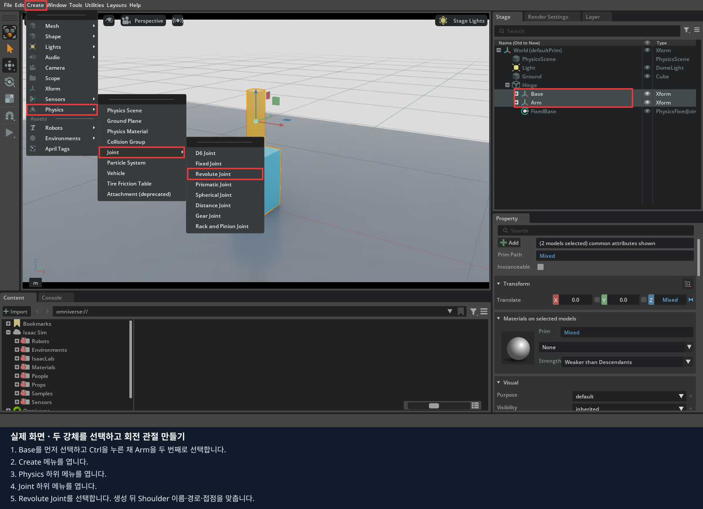
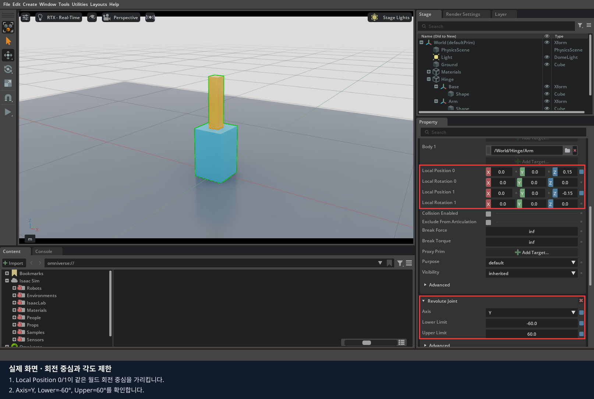
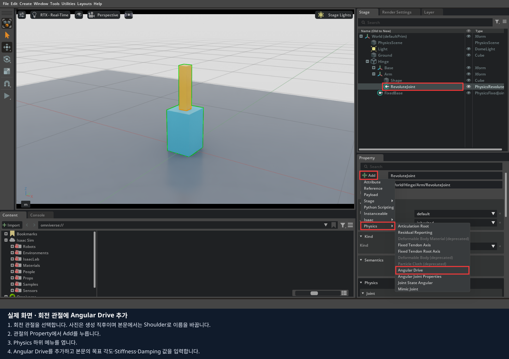
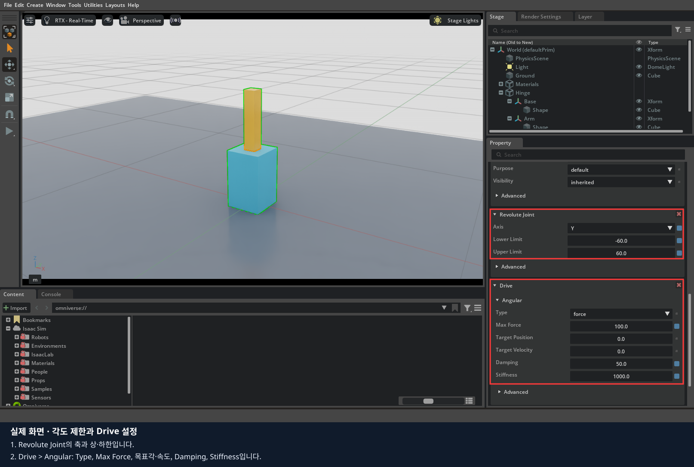
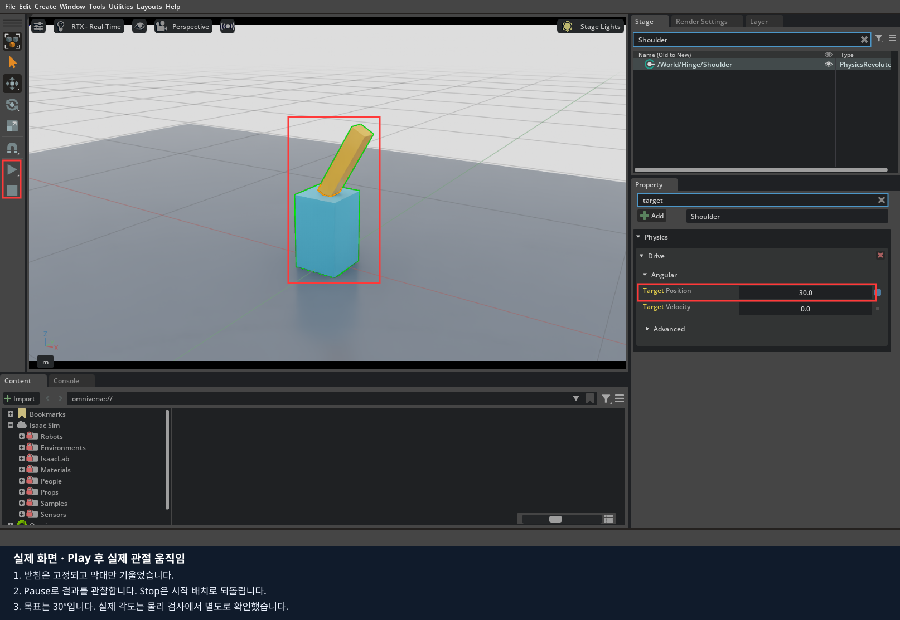

# 2장 · 마우스로 관절과 모터 만들기

받침과 팔을 직접 만들고 회전 관절로 연결한 뒤, 목표 각도와 응답을 비교합니다. 실물 장비는 사용하지 않습니다.
**1~5절은 마우스로 제작·조작·저장하고, 마지막 6절에서 같은 모형을 코드로 구현합니다.**
[기록지](worksheet.md)의 마우스 실습 부분부터 작성합니다.

## 1. 공통 바닥과 두 강체 만들기

마우스 실습용 빈 편집기를 사용 중이면 그대로 이어갑니다. 앞 장의 코드 예제가 열려 있으면 결과를 저장하고 종료합니다.
원격 수업은 `lesson stop`, 데스크탑은 Isaac Sim 창을 닫습니다. 이후 아래에서 본인 환경의 **한 가지 명령만** 실행합니다.
이 명령은 편집 화면만 열며, 실습 객체는 이후 메뉴로 직접 만듭니다.

원격 수업 — 브라우저 터미널:

```bash
lesson run --file /workspace/isaacsim_basic/01_object_physics/experiments/00_empty_stage.py
```

데스크탑 직접 실행 — 저장소 루트 터미널:

```bash
./lekiwi basic --script 01_object_physics/experiments/00_empty_stage.py
```

원격으로 새 실행을 시작했다면 `lesson status`가 READY가 될 때까지 기다린 뒤 WebRTC에서 같은 서버 주소로 다시 Connect합니다.
영상 창을 클릭한 상태에서 마우스와 키보드를 조작합니다. 이후 코드 예제를 재실행할 때도 같은 순서로 접속합니다.

일반 Isaac Sim 설치에서는 앱을 직접 엽니다. 이전 실습이 실행 중이면 저장을 마치고 종료한 뒤 시작합니다.

`File > Open`으로 1장에서 저장한 `base_scene.usda`를 엽니다.
World·PhysicsScene·Light·Ground만 있는지 확인합니다. 파일이 없다면 [1장](../01_object_physics/README.md) 1~2절을 먼저 마칩니다.
`File > Save As`로 `my_joint.usda`라는 새 파일을 만든 뒤 아래 작업을 이어갑니다.
Xform은 위치·회전을 묶어 관리하는 그룹입니다. Base는 받침, Arm은 움직일 팔입니다.
**이 장의 제작은 Stop 상태에서 진행**합니다.

1. World 아래에 `Create > Xform`으로 `Hinge`를 만듭니다.
2. Hinge 아래에 Xform 두 개를 만들고 `Base`, `Arm`으로 이름을 정합니다. 생성 후 Property의 Prim Path를 확인합니다.
3. Base와 Arm에 각각 `Add > Physics > Rigid Body`, `Add > Physics > Mass`를 추가합니다. 아래 값을 입력합니다.
4. 각각의 Xform 아래에 `Create > Shape > Cube`를 만들어 `Shape`로 이름을 정합니다. Shape의 **Size는 1**로 바꾸고 아래 Scale을 입력합니다.
5. 각 Shape에 Collider를 추가합니다. **Rigid Body는 부모 Xform에만**, Collider는 자식 Shape에 둡니다.

| 객체 경로 | Translate (m) | Scale | Mass (kg) |
|---|---|---|---|
| `/World/Hinge` | `(0,0,0)` | `(1,1,1)` | 없음 |
| `/World/Hinge/Base` | `(0,0,0.15)` | `(1,1,1)` | `1` |
| `/World/Hinge/Base/Shape` | `(0,0,0)` | `(0.18,0.18,0.3)` | 부모에 설정 |
| `/World/Hinge/Arm` | `(0,0,0.45)` | `(1,1,1)` | `0.1` |
| `/World/Hinge/Arm/Shape` | `(0,0,0)` | `(0.06,0.06,0.3)` | 부모에 설정 |

모든 Rotate는 `(0,0,0)`입니다. 객체를 Stage에서 부모 아래로 옮기면 위치가 보정될 수 있으므로 **옮긴 뒤 표의 로컬 Transform을 입력**합니다.
Base 윗면과 Arm 아랫면이 모두 월드 Z=0.3에서 만납니다.


사진은 완성된 구조입니다. 여기까지 만들었으면 Base·Arm·자식 Shape가 같은 계층에 있는지 확인합니다. 관절은 다음 단계에서 추가합니다.

## 2. 받침을 월드에 고정하기

1. Base Xform 하나만 선택합니다. `Create > Physics > Joint > Fixed Joint`로 고정 관절을 만듭니다.
2. 이름을 `FixedBase`로 바꾸고 Hinge 바로 아래로 옮깁니다. 최종 경로는 `/World/Hinge/FixedBase`입니다.
3. 관절 Property의 Body 0은 비우고 Body 1에 `/World/Hinge/Base`를 지정합니다. 관계 입력의 폴더 버튼·Add Target으로 Stage의 Base를 선택합니다.
4. Local Position 0=`(0,0,0.15)`, Local Position 1=`(0,0,0)`을 입력합니다. Local Rotation 0·1은 모두 `(0,0,0)`으로 둡니다.
5. FixedBase에 `Add > Physics > Articulation Root`를 추가합니다. 다른 객체에 중복 추가하지 않습니다.

Body 0이 비어 있으면 월드가 상대입니다. 따라서 첫 접점은 월드 Z=0.15, 두 번째 접점은 Base 중심을 가리켜 서로 일치합니다.
다음 단계까지 마친 뒤 Play합니다. 아직 Arm이 연결되지 않은 상태에서 실행하면 Arm이 떨어집니다.

## 3. 팔을 회전 관절로 연결하기



1. Stage에서 **Base Xform을 먼저**, Ctrl을 누른 채 **Arm Xform을 두 번째로** 선택합니다. 자식 Shape를 선택하지 않습니다.
2. `Create > Physics > Joint > Revolute Joint`를 누릅니다. 교재의 5.1 촬영 화면에서는 메뉴 이름이 `Joint`입니다.
3. 생성된 관절을 `Shoulder`로 이름 짓고 Hinge 바로 아래로 옮깁니다.
4. Shoulder의 Property를 다음과 같이 설정합니다. 자동 생성값을 그대로 쓰지 말고 두 Body와 접점을 확인합니다.

| Shoulder 속성 | 값 |
|---|---|
| Body 0 | `/World/Hinge/Base` |
| Body 1 | `/World/Hinge/Arm` |
| Local Position 0 | `(0,0,0.15)` |
| Local Position 1 | `(0,0,-0.15)` |
| Local Rotation 0 / 1 | 둘 다 `(0,0,0)` |
| Collision Enabled | 체크 해제 |
| Revolute Joint > Axis | `Y` |
| Lower Limit / Upper Limit | `-60` / `60` 도 |



두 접점의 월드 높이를 계산합니다. Base는 `0.15 + 0.15 = 0.3`, Arm은 `0.45 - 0.15 = 0.3`입니다.
접점이 다르면 시작 순간에 모형이 튀거나 벌어질 수 있습니다. 사진과 표를 확인한 뒤 진행합니다.

## 4. 모터 역할을 하는 Angular Drive 추가하기



이 사진은 메뉴로 생성한 직후의 `RevoluteJoint`를 보여 줍니다. 본인의 관절은 앞 단계대로 Hinge 아래 `Shoulder`로 이름과 경로를 맞춥니다.

1. Shoulder를 선택하고 `Add > Physics > Angular Drive`를 추가합니다.
2. Property의 `Physics > Drive > Angular`를 펼쳐 아래 값을 입력합니다. 보이지 않는 항목은 Advanced를 펼칩니다.

| 속성 | 기본값 |
|---|---|
| Type | `force` |
| Target Position / Target Velocity | `0` / `0` |
| Stiffness | `1000` |
| Damping | `50` |
| Max Force | `100` |



Play를 눌러 팔이 세워진 상태를 유지하는지 확인하고 Stop합니다.
Target Position을 `30`, `-30`, `80`으로 하나씩 바꾸며 같은 과정을 반복합니다. 80도 목표는 관절 상한 60도와 비교합니다.




사진은 기존 모형의 관측 예시입니다. 본인의 결과를 따로 기록합니다. Target Position은 명령값이므로 그것만 보고 실제 도달각이라고 적지 않습니다.
Stiffness는 목표로 되돌리는 반응의 세기, Damping은 흔들림을 줄이는 정도, Max Force는 구동 토크의 상한입니다.
목표 30도에서 Stiffness만 `1000 → 20`으로 낮춰 보고, `1000`으로 복원한 뒤 Damping만 `50 → 5`로 낮춰 응답을 비교합니다.
각 변경은 Stop 상태에서 하고 Play로 확인합니다. 목표값과 실제 팔의 모습이 같다고 가정하지 않습니다.

## 5. 저장하고 연결 관계 정리하기

Stop 상태에서 Target Position=0, Target Velocity=0, Stiffness=1000, Damping=50, Max Force=100으로 복원합니다.
Axis=Y, 제한=-60/60도, Base·Arm의 위치도 앞 표와 같은지 확인하고 `File > Save`로 저장합니다.
Docker 수업의 경로 예시는 `/data/isaacsim_basic/my_joint.usda`입니다. 기존 파일이 있으면 새 이름을 사용합니다.
`File > Open`으로 다시 열어 같은 구조인지 확인합니다. 이 파일을 4·5장에서 재사용합니다.

[기록지](worksheet.md)의 마우스 실습 표를 채우고 다음을 설명합니다.

- FixedBase가 없을 때 받침이 어떻게 될지
- Shoulder의 두 접점이 같은 위치에 있어야 하는 이유
- 목표 80도를 넣어도 관절이 약 60도까지만 움직이는 이유

## 6. 마지막: 같은 작업을 코드로 구현하기

지금까지 마우스로 만들고 관찰한 내용을 코드로 연결합니다. 먼저 직접 만든 USD를 저장합니다.
원격 수업은 브라우저 터미널에서 `lesson stop`, 데스크탑은 Isaac Sim 창을 닫아 현재 실행을 종료합니다.

각 예제의 `build_scene()`은 새 장면에 객체를 만듭니다. 화면에서 저장한 USD가 Python 소스를 자동으로 바꾸지는 않습니다.

| 직접 한 일 | [01_joint_drive.py](experiments/01_joint_drive.py)에서 찾을 코드 |
|---|---|
| Xform·자식 Shape, 강체·충돌 추가 | `Xform.Define`, `box`, `RigidBodyAPI`, `CollisionAPI` |
| 월드에 받침 고정 | `FixedJoint.Define`, `CreateBody1Rel`, `CreateLocalPos0Attr` |
| 관절 계통 시작점 지정 | `ArticulationRootAPI.Apply(fixed.GetPrim())` |
| 회전 관절·두 접점·제한 지정 | `RevoluteJoint.Define`, `CreateLocalPos0Attr`, `CreateLocalPos1Attr`, `CreateAxisAttr` |
| Drive·목표·응답 변경 | `DriveAPI.Apply`, `CreateTargetPositionAttr`, `CreateStiffnessAttr` |

### 코드 실행과 수정 순서

설치는 0장에서 마쳤다고 가정합니다. 아래 명령 중 본인 환경의 한 가지만 사용합니다.

원격 수업 — 브라우저 터미널:

```bash
lesson run 2
```

데스크탑 직접 실행 — 저장소 루트 터미널:

```bash
./lekiwi basic --chapter 2
```

1. 실행하면 Stop 상태로 열립니다. 화면의 Play로 관찰하고 Stop으로 돌아옵니다. 이 절에 연결된 Python 파일을 열고, 앞에서 클릭했던 속성에 해당하는 줄을 찾습니다.
2. 기본 실행 결과를 직접 만든 환경의 결과와 비교합니다.
3. 실행을 종료한 뒤 지정된 기본 줄에 `#`를 붙이고 비교할 줄의 `#`를 지웁니다. 들여쓰기는 유지합니다.
4. 파일을 저장하고 같은 명령으로 다시 실행합니다. 화면에서 값을 바꾸는 실험과 구분해 기록합니다.

원격 수업은 코드 수정 후 `lesson stop` → `lesson run 2`로 재실행합니다.
학생 파일은 호스트에서 저장하면 다음 실행에 반영되며, 코드만 수정할 때 Docker 이미지 재빌드는 필요 없습니다.
아래 `./lekiwi ...` 예시는 데스크탑 터미널용입니다. 원격 수업에서는 위 `lesson` 명령을 사용합니다.

### 6.1. 기준 모형 실행

[01_joint_drive.py](experiments/01_joint_drive.py)

`build_scene()`에는 Base·Arm 강체 생성, 바닥에 고정하는 FixedJoint, 두 강체 사이 RevoluteJoint가 들어 있습니다.
먼저 기본 0도 상태를 Play로 확인합니다.


### 6.2. 연결 관계 읽기

```python
fixed = UsdPhysics.FixedJoint.Define(stage, "/World/Hinge/FixedBase")
fixed.CreateBody1Rel().SetTargets(["/World/Hinge/Base"])
UsdPhysics.ArticulationRootAPI.Apply(fixed.GetPrim())
joint = UsdPhysics.RevoluteJoint.Define(stage, "/World/Hinge/Shoulder")
joint.CreateBody0Rel().SetTargets(["/World/Hinge/Base"])
joint.CreateBody1Rel().SetTargets(["/World/Hinge/Arm"])
```

FixedJoint의 반대쪽 Body가 비어 있으면 월드에 고정합니다. RevoluteJoint는 Base와 Arm 사이에 하나의 회전 자유도를 만듭니다.
ArticulationRoot는 이 연결을 로봇 관절 계통으로 해석하는 시작점입니다.

`LocalPos0`, `LocalPos1`은 각 Body 기준의 접점 위치입니다. 모형에서는 Base 윗부분과 Arm 아랫부분이 같은 월드 위치에 놓입니다.
모양을 만드는 Scale은 자식 Shape에 적용했습니다. 강체 자체를 확대하면 관절 기준 거리까지 달라져 혼동하기 쉽습니다.

### 6.3. 회전축과 제한

```python
joint.CreateAxisAttr("Y")
joint.CreateLowerLimitAttr(-60)
joint.CreateUpperLimitAttr(60)
```

이 값들은 **degree**입니다. 축은 해당 관절 프레임 기준입니다.
Stage의 `/World/Hinge/Shoulder`를 선택하여 Property의 Axis와 Lower/Upper Limit을 찾아 코드와 비교합니다.
연결된 두 강체의 자기 충돌은 `CreateCollisionEnabledAttr(False)`로 껐습니다.

### 6.4. 목표 각도 바꾸기

파일 끝의 기본 줄을 주석 처리하고 +30도 줄을 활성화합니다.

```python
# drive.CreateTargetPositionAttr(0)
drive.CreateTargetPositionAttr(30)
# drive.CreateTargetPositionAttr(-30)
# drive.CreateTargetPositionAttr(80)
```

창을 닫고 재실행 → Play. 같은 방법으로 -30도도 확인합니다.
마지막에는 80도를 명령하여 실제 관절이 상한인 약 60도에서 멈추는지 봅니다.
목표값과 실제 상태가 다를 수 있다는 점이 핵심입니다.

### 6.5. Stiffness·Damping·Max Force

```python
drive = UsdPhysics.DriveAPI.Apply(joint.GetPrim(), "angular")
drive.CreateTypeAttr("force")
drive.CreateStiffnessAttr(1000)
# drive.CreateStiffnessAttr(20)
drive.CreateDampingAttr(50)
drive.CreateMaxForceAttr(100)
```

Stiffness는 목표 오차에 대한 복원 반응, Damping은 속도에 대한 감쇠, Max Force는 구동 힘/토크 상한입니다.
회전 관절에서는 토크를 생각합니다. 목표 30도를 유지하고 Stiffness만 20으로 바꿔 느린 응답·처짐을 관찰합니다.
다음에는 원래 값으로 복원한 뒤 Damping만 낮춰 흔들림을 비교합니다.

수치가 크다고 무조건 좋은 제어가 아닙니다. 물리 시간 간격·질량·관성도 영향을 줍니다.
처음부터 여러 값을 바꾸면 어느 변화가 원인인지 구분하기 어렵습니다.

### 6.6. 저장과 다시 시작

동일한 설정으로 다시 보려면 표준 Stop → Play를 사용합니다.
코드 수정은 재실행합니다. GUI에서 바꾼 USD를 남기려면 `File > Save As`에서 `/data/isaacsim_basic/` 아래 새 파일에 저장합니다.
**USD 저장이 Python 소스까지 수정하지는 않습니다.** 제출할 때 변경한 `.py`도 함께 보관합니다.

완료 기준: [기록지](worksheet.md)에 0/+30/-30/80도의 목표·관측 각도와 Stiffness 실험 결과를 남깁니다.

[공식 자료](SOURCES.md) · [다음: 3편](../03_robot_cameras/README.md)
