# 2장 · 마우스로 관절과 모터 만들기

받침과 팔을 만들고 관절로 연결한 뒤, 목표 각도를 바꾸어 움직임을 관찰합니다. **실물 리더암은 연결하지 않습니다.**
**1~5절은 마우스 실습, 마지막 6절은 같은 작업을 Python으로 구현하는 실습입니다.**

사진의 빨간 박스는 클릭하거나 확인할 곳입니다. 숫자는 Ctrl 키를 누른 채 칸을 클릭하고 입력한 뒤 Enter로 확정합니다.
X·Y·Z는 왼쪽부터 한 칸씩 입력합니다. 위치는 m, 회전은 도, 질량은 kg입니다.
메뉴만 확대한 사진은 메뉴 위치를 보여 줍니다. **현재 선택할 객체와 입력값은 각 단계에 따로 적었습니다.**

## 1. 공통 바닥과 두 강체 만들기

### 1.1. 편집 화면 열기

1. 앞 장의 코드를 실행 중이면 결과를 저장하고 Isaac Sim 창을 닫습니다. 이미 빈 편집 화면을 사용 중이면 그대로 진행합니다.
2. 같은 노트북의 **저장소 최상위 폴더(`lekiwi` 파일이 있는 폴더)**에서 다음 명령을 실행합니다.

```bash
./lekiwi basic --script 01_object_physics/experiments/00_empty_stage.py
```

3. 창이 반응할 때까지 기다립니다. 명령을 중복 실행하지 않습니다. 이 명령은 편집 화면만 열며 팔을 만들어 주지는 않습니다.
4. 화면 왼쪽 ▶는 Play, 실행 중 나타나는 ■는 Stop입니다. **관절 연결을 끝내는 4절까지 Stop 상태를 유지**합니다.

### 1.2. 공통 바닥을 열고 작업용 사본 저장하기

1. 상단 **File → Open**을 클릭합니다.


2. 파일 창 위쪽 주소 칸에 **`/data/isaacsim_basic/`**를 입력하고 Enter를 누릅니다.
3. 아래 File name에 **`base_scene.usda`**를 입력하고 **Open File**을 클릭합니다. 직접 다른 이름으로 저장했다면 그 파일 이름을 사용합니다.

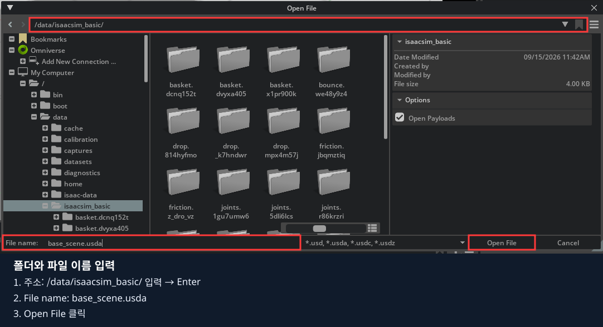

4. 현재 장면을 저장할지 묻는 창이 뜨면 필요한 변경을 먼저 저장합니다. 판단이 어려우면 Cancel로 돌아옵니다.
5. 오른쪽 Stage에서 World 왼쪽의 펼치기 표시를 누릅니다. **Light·PhysicsScene·Ground만 있고, 실험 큐브는 없는지** 확인합니다. 파일이 없으면 [1장 2절](../01_object_physics/README.md#2-world조명중력바닥-만들기)을 먼저 마칩니다.
6. **File → Save As**를 클릭합니다. 주소는 같은 폴더, File name은 **`my_joint`**, 형식은 **`*.usda`**로 선택하고 Save를 누릅니다.

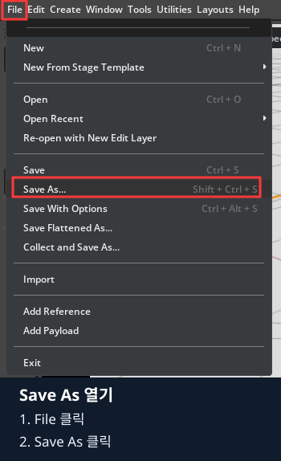

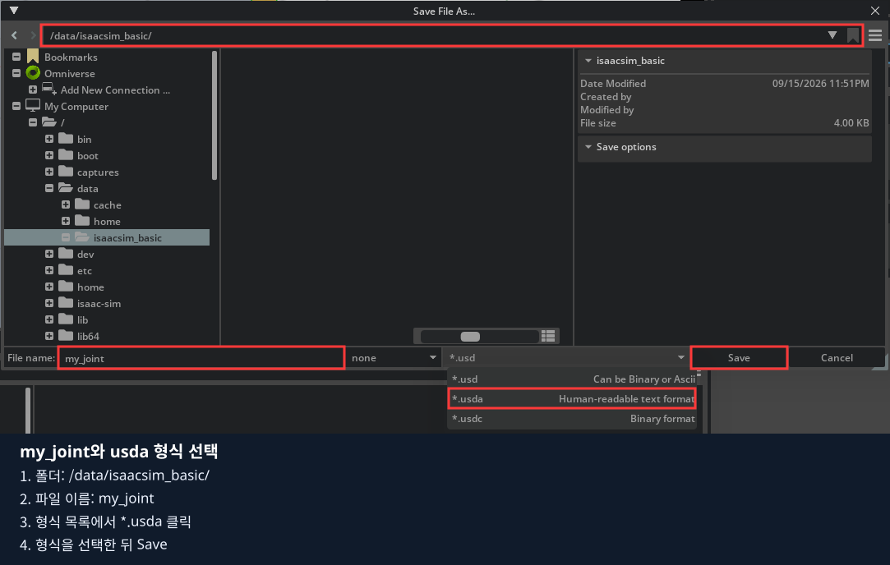

사진처럼 새 파일 이름은 **my_joint**, 형식은 ***.usda**로 선택합니다.
`base_scene`를 덮어쓰지 않습니다. 호스트에서는 저장소의 `data/isaacsim_basic/my_joint.usda`에 해당합니다.

### 1.3. Hinge 그룹 만들기

1. Stage에서 **World**를 한 번 클릭합니다.
2. 상단 **Create → Xform**을 클릭합니다. Xform은 여러 부품을 묶는 그룹입니다.


3. 새 Xform 이름 위에서 **우클릭 → Rename**을 선택하고 **`Hinge`**를 입력한 뒤 Enter를 누릅니다.

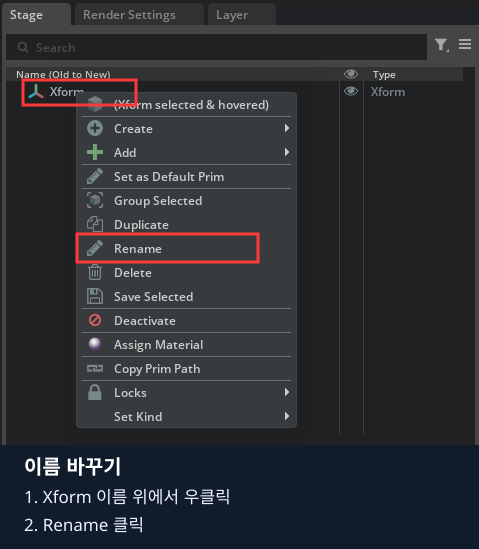

4. Hinge가 World 밖에 있으면 Hinge 이름을 잡고 World 이름 위로 끌어 놓습니다.
5. Hinge를 선택하고 Property의 **Prim Path가 `/World/Hinge`**인지 확인합니다.
6. Property의 Transform에서 Translate·Rotate 또는 Orient는 모두 `0`, Scale은 모두 `1`로 맞춥니다.

지금은 그룹만 만들었으므로 뷰포트에 팔이 보이지 않아도 맞습니다.

### 1.4. 받침의 중심 Base 만들기

1. Hinge를 선택하고 **Create → Xform**으로 새 그룹을 만듭니다.
2. 새 객체를 Rename으로 **`Base`**로 바꿉니다. Hinge 밖에 생겼으면 Hinge 위로 드래그합니다.
3. Base를 선택하고 **Prim Path=`/World/Hinge/Base`**를 확인합니다. 이후 값은 이 경로의 Base에 입력합니다.
4. Property의 Transform을 펼치고 아래 값을 각각 입력합니다. 회전 줄이 Orient이면 그 줄의 세 각도 칸을 사용합니다.

| Base의 줄 | X | Y | Z |
|---|---|---|---|
| Translate | `0` | `0` | `0.15` |
| Rotate 또는 Orient | `0` | `0` | `0` |
| Scale | `1` | `1` | `1` |

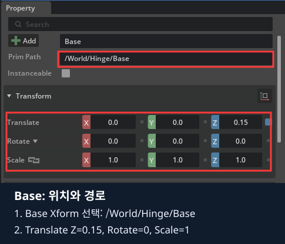

**객체를 부모 아래로 옮긴 다음 값을 입력**합니다. 옮길 때 위치가 보정될 수 있기 때문입니다.

### 1.5. Base에 강체와 질량 추가하기

1. Stage에서 **Base Xform**을 선택합니다. 아직 자식 Shape는 만들지 않았습니다.
2. 오른쪽 Property의 **Add → Physics → Rigid Body**를 클릭합니다.


3. 같은 Base를 선택한 상태에서 **Add → Physics → Mass**를 클릭합니다.

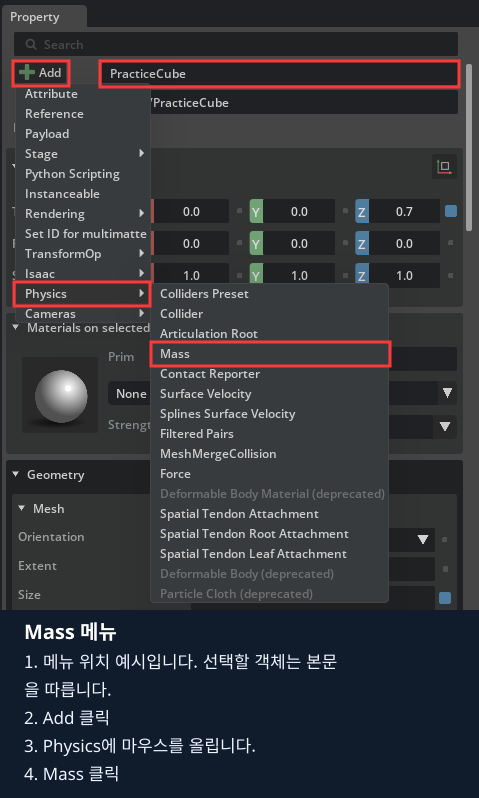

4. Property 맨 위 검색창에 `mass`를 입력합니다. Physics의 **Mass 숫자 칸에 `1`**을 입력하고 Enter를 누릅니다.
5. 검색창 오른쪽 `×`로 검색어를 지웁니다. 검색창이 남아 있으면 다음 Transform·Rigid Body 항목이 안 보일 수 있습니다.
6. Rigid Body의 **Rigid Body Enabled는 체크**, **Disable Gravity는 해제** 상태인지 확인합니다.

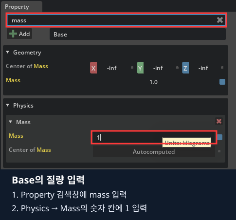

검색 결과 위쪽 Geometry의 Mass는 표시용입니다. **아래 Physics → Mass의 검은 숫자 칸**을 수정합니다.

질량 `0`은 무중력이라는 뜻이 아닙니다. 여기서는 표에 적힌 `1 kg`을 직접 입력합니다.

### 1.6. Base의 눈에 보이는 Shape 만들기

1. Base를 선택하고 **Create → Shape → Cube**를 클릭합니다. Mesh가 아닌 **Shape**입니다.

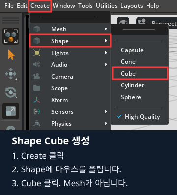

2. 새 Cube를 **`Shape`**로 이름을 바꿉니다. Base 아래로 옮겨 **`/World/Hinge/Base/Shape`**인지 확인합니다.
3. Shape의 Transform을 아래처럼 입력합니다. 이 위치는 **부모 Base 기준**입니다.

| Base/Shape의 줄 | X | Y | Z |
|---|---|---|---|
| Translate | `0` | `0` | `0` |
| Rotate 또는 Orient | `0` | `0` | `0` |
| Scale | `0.18` | `0.18` | `0.3` |

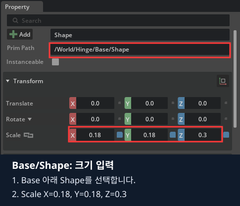

4. Property 검색창에 `size`를 입력하고 Geometry의 **Size를 `1`**로 바꿉니다. 검색어를 지웁니다.
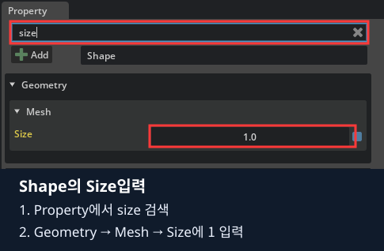

5. **Shape를 선택한 채 Add → Physics → Collider**를 클릭합니다.


6. 검색창에 `collision`을 입력해 **Collision Enabled가 체크**인지 확인하고 검색어를 지웁니다.

**Base에는 Rigid Body·Mass, Base/Shape에는 Collider**가 붙습니다. Shape에 Rigid Body를 또 추가하지 않습니다.
색상을 따로 바꾸지 않았으면 회색으로 보여도 맞습니다. 뒤 사진의 파란색·주황색은 부품 구분용입니다.

### 1.7. 같은 순서로 움직일 Arm 만들기

1. **Hinge를 다시 선택**합니다. Base를 선택한 채 진행하면 Arm이 Base 아래에 생길 수 있습니다.
2. Create → Xform으로 **`Arm`**을 만듭니다. Prim Path를 **`/World/Hinge/Arm`**으로 맞춥니다.
3. Arm의 Transform을 입력하고 Rigid Body·Mass를 추가합니다.

| Arm의 줄 | X | Y | Z |
|---|---|---|---|
| Translate | `0` | `0` | `0.45` |
| Rotate 또는 Orient | `0` | `0` | `0` |
| Scale | `1` | `1` | `1` |

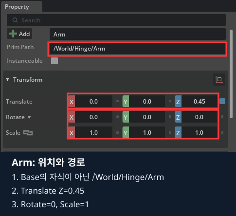

4. Arm의 **Mass는 `0.1` kg**입니다. Base의 `1`과 구분합니다.
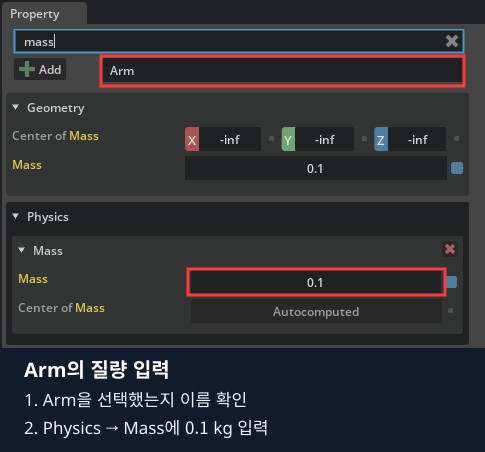

5. Arm 아래에 Shape Cube를 만들고 **`Shape`**로 이름을 바꿉니다. 경로는 **`/World/Hinge/Arm/Shape`**입니다.
6. Arm/Shape의 **Size=`1`**, Translate·회전=`0`, **Scale=`(0.06, 0.06, 0.3)`**을 입력합니다.
7. Arm/Shape에 Collider를 추가하고 Collision Enabled를 확인합니다.

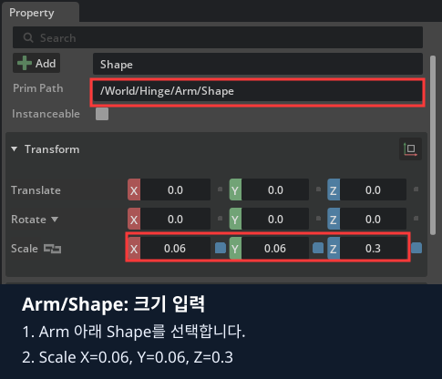

이제 Stage가 다음과 같아야 합니다. **FixedBase·Shoulder는 아직 없습니다.**

```text
World
├─ Light
├─ PhysicsScene
├─ Ground
└─ Hinge
   ├─ Base           ← Xform, 강체·질량 1 kg
   │  └─ Shape       ← Cube, 충돌·크기
   └─ Arm            ← Xform, 강체·질량 0.1 kg
      └─ Shape       ← Cube, 충돌·크기
```

뷰포트에는 넓은 받침 위에 가느다란 팔이 세워져 있습니다. 잘 안 보이면 Stage의 Hinge를 선택하고 뷰포트에 마우스를 놓은 뒤 **F**로 선택한 모형을 화면에 맞춥니다.
Base 윗면과 Arm 아랫면은 높이 Z=`0.3 m`에서 만납니다. **아직 Play하지 않습니다.** Arm을 연결할 관절이 없기 때문입니다.

## 2. 받침을 월드에 고정하기

### 2.1. Fixed Joint 생성과 이름 정리

1. Stage에서 **Base 이름 하나만 클릭**합니다. Shape가 아닌 Base입니다.
2. 상단 **Create → Physics → Joint → Fixed Joint**를 클릭합니다.

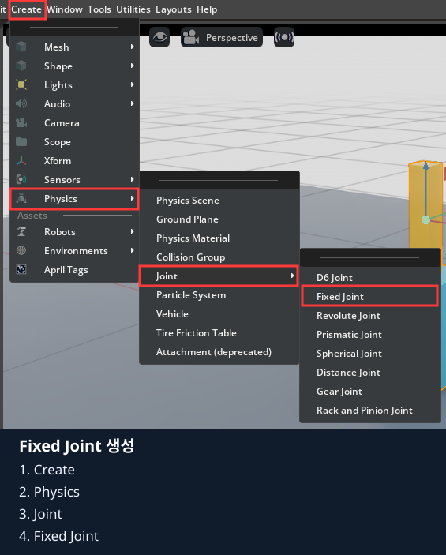

3. 새 관절을 Rename으로 **`FixedBase`**로 바꿉니다.
4. Hinge 바로 아래로 옮깁니다. **`/World/Hinge/FixedBase`**인지 확인합니다. Base 안쪽이 아닙니다.

### 2.2. Body 0과 Body 1 연결하기

Body는 관절이 연결하는 강체입니다. 이 고정 관절은 **월드와 Base**를 연결합니다.

1. Stage에서 FixedBase를 선택합니다. Property 검색창을 비우고 **Physics → Joint**를 펼칩니다.
2. **Body 0**에 경로가 들어 있으면 그 경로 줄의 오른쪽 `×`로 대상을 제거합니다. Body 0은 비워 둡니다.
3. **Body 1**에 `/World/Hinge/Base`가 이미 있으면 그대로 둡니다.
4. 다른 경로가 있으면 제거한 뒤 Body 1의 **Add Target**을 클릭합니다. 기존 대상 줄 오른쪽의 **폴더 버튼**으로 대상을 다시 선택할 수도 있습니다.
5. 대상 선택 창에서 **World → Hinge → Base**를 찾아 선택하고 창의 선택 완료 버튼으로 확정합니다. **Base 아래 Shape를 선택하지 않습니다.**
6. 창이 닫힌 뒤 Body 1에 표시된 실제 경로가 **`/World/Hinge/Base`**인지 다시 읽습니다.

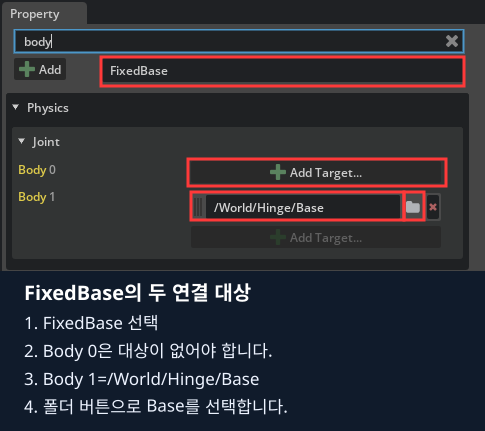

사진처럼 Property 검색창에 `body`를 입력하면 두 연결 대상만 찾기 쉽습니다. 폴더 버튼을 누른 뒤 **Base → Select** 순서로 선택합니다.

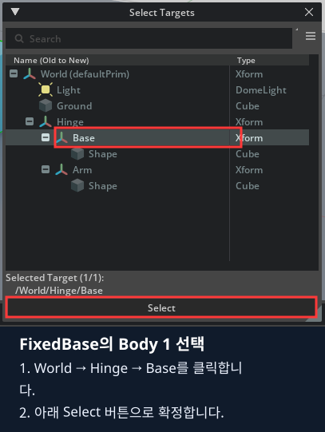

확정 후 Body 1의 경로를 다시 확인하고, 다음 단계에서는 검색어를 지웁니다.

### 2.3. 접점과 Articulation Root 설정하기

1. 같은 FixedBase의 Joint 속성에서 다음 값을 입력합니다.

| FixedBase의 줄 | X | Y | Z |
|---|---|---|---|
| Local Position 0 | `0` | `0` | `0.15` |
| Local Position 1 | `0` | `0` | `0` |
| Local Rotation 0 | `0` | `0` | `0` |
| Local Rotation 1 | `0` | `0` | `0` |

Property 검색창에 `local`을 입력하면 네 접점·회전 줄만 볼 수 있습니다. 입력을 마치면 검색어를 지웁니다.

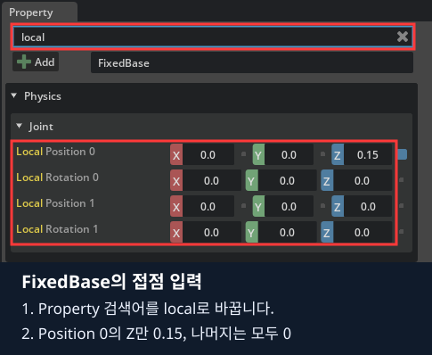

Body 0이 비어 있으므로 Local Position 0은 **월드 기준**입니다. Body 1의 접점은 Base 중심입니다.
두 접점이 모두 월드 높이 `0.15 m`를 가리킵니다.

2. **FixedBase를 선택한 상태**에서 Property의 **Add → Physics → Articulation Root**를 클릭합니다.

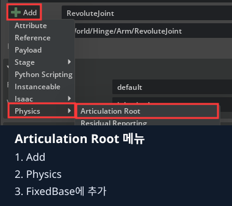

3. Property에서 Articulation 관련 항목이 나타나는지 확인합니다. Hinge·Base·Arm·Shoulder에 중복으로 추가하지 않습니다.

`articulation`을 검색하면 아래 항목이 나타납니다. 확인 후 검색어를 지웁니다.

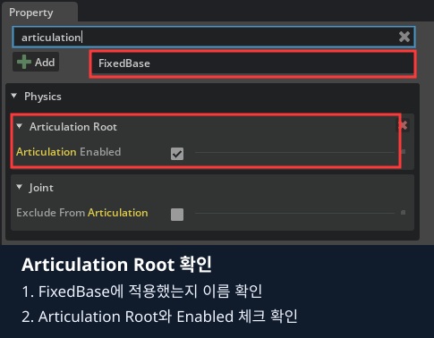

Articulation Root는 이 관절 묶음을 로봇의 관절 계통으로 다루는 시작점입니다. 아래 회전 관절까지 만들고 실행합니다.

## 3. 팔을 회전 관절로 연결하기

### 3.1. 두 강체를 선택하고 Revolute Joint 만들기

1. Stage에서 **Base Xform을 먼저 클릭**합니다.
2. **Ctrl 키를 누른 채 Arm Xform을 한 번 클릭**합니다. Base·Arm 두 줄이 모두 선택되어야 합니다. Shape를 선택하지 않습니다.
3. 상단 **Create → Physics → Joint → Revolute Joint**를 클릭합니다.

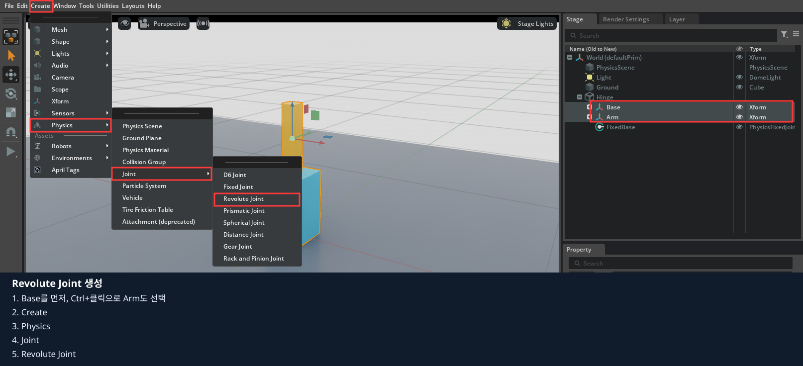

4. 생성된 관절을 **`Shoulder`**로 이름 바꾸고 **Hinge 바로 아래**로 옮깁니다.
5. Shoulder를 선택한 뒤 Prim Path가 **`/World/Hinge/Shoulder`**인지 확인합니다.

### 3.2. 연결 대상과 접점 입력하기

1. Property 검색창을 비우고 **Physics → Joint**를 펼칩니다.
2. **Body 0=`/World/Hinge/Base`**, **Body 1=`/World/Hinge/Arm`**인지 확인합니다. 잘못 연결됐으면 2.2절의 폴더 버튼으로 바꿉니다.
`body` 검색으로 연결 대상을 확인합니다. 다음 값은 `local`로 바꾸어 검색합니다.

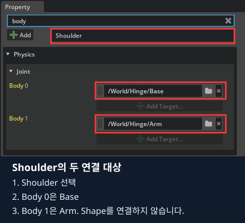

3. Local Position·Rotation은 다음처럼 입력합니다. 사진의 네 줄을 한 줄씩 비교합니다.

| Shoulder의 줄 | X | Y | Z |
|---|---|---|---|
| Local Position 0 | `0` | `0` | `0.15` |
| Local Position 1 | `0` | `0` | `-0.15` |
| Local Rotation 0 | `0` | `0` | `0` |
| Local Rotation 1 | `0` | `0` | `0` |

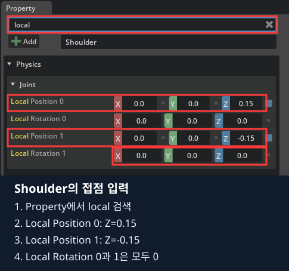

4. 검색어를 지우고 **Collision Enabled의 체크를 해제**합니다. 찾기 어려우면 `collision`을 검색합니다. 연결된 Base와 Arm끼리 충돌하지 않도록 하는 설정입니다. 자식 Shape의 Collider를 끄는 작업과 다릅니다.

Base 쪽 접점은 `0.15 + 0.15 = 0.3`, Arm 쪽 접점은 `0.45 - 0.15 = 0.3`입니다.
이 두 높이가 다르면 Play 순간 모형이 튀거나 벌어질 수 있습니다.

### 3.3. 회전축과 제한 입력하기

1. Property를 아래로 내려 **Revolute Joint**를 펼칩니다.
2. **Axis 오른쪽 목록 → Y**를 선택합니다.
3. **Lower Limit=`-60`**, **Upper Limit=`60`**을 각각 입력하고 Enter를 누릅니다. 두 값의 단위는 도입니다.


이제 완성된 연결 구조를 확인합니다.

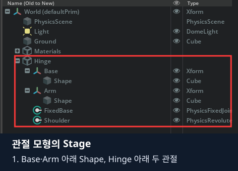

사진의 Materials는 색상 표시용 객체입니다. 직접 만든 장면에 없어도 됩니다. 필수 구조는 다음과 같습니다.

```text
Hinge
├─ Base
│  └─ Shape
├─ Arm
│  └─ Shape
├─ FixedBase         ← Body 0=월드, Body 1=Base; Articulation Root
└─ Shoulder          ← Body 0=Base, Body 1=Arm; Y축 회전
```

## 4. 모터 역할을 하는 Angular Drive 추가하기

### 4.1. Drive 추가와 기준값 입력

1. Stage에서 **Shoulder만 선택**합니다.
2. Property 위쪽 **Add → Physics → Angular Drive**를 클릭합니다.

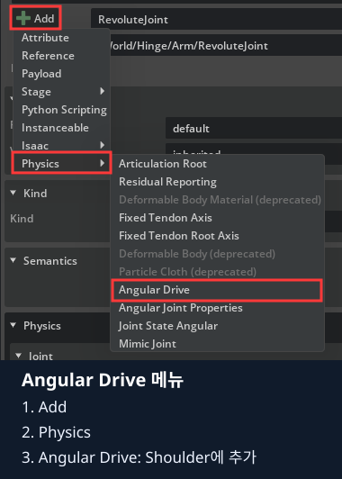

3. Property를 아래로 내려 **Drive → Angular**를 펼칩니다. 검색창에 남은 글자가 있으면 먼저 지웁니다.
4. 사진의 칸에 아래 값을 한 개씩 입력합니다. 펼침 항목에 숨겨져 있으면 Advanced도 확인합니다.

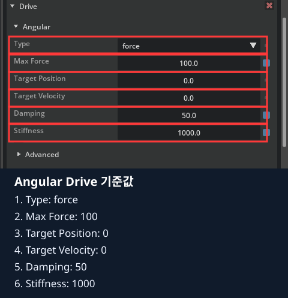

| 항목 | 입력값 | 의미 |
|---|---|---|
| Type | 목록에서 `force` | 힘·토크로 목표를 따라갑니다. |
| Max Force | `100` | 구동 토크 상한입니다. |
| Target Position | `0` | 목표 각도입니다. |
| Target Velocity | `0` | 목표 각속도입니다. |
| Damping | `50` | 흔들림을 줄이는 정도입니다. |
| Stiffness | `1000` | 목표로 되돌리는 반응의 세기입니다. |

### 4.2. 처음 Play하고 0도 확인하기

1. 왼쪽 **▶ Play**를 한 번 누릅니다.
2. 받침이 바닥에 고정되고 팔이 세워진 상태를 유지하는지 봅니다.
3. **■ Stop**을 눌러 실행 전 상태로 돌아옵니다. Pause는 현재 자세에서 잠깐 멈추므로 여기서는 Stop을 사용합니다.

받침까지 떨어지면 FixedBase의 Body 0·1과 접점을, 팔이 떨어지면 Shoulder의 두 Body와 Rigid Body를 확인합니다.
고쳐지지 않으면 같은 실행을 반복하지 말고 해당 Property 화면을 강사에게 보여 주세요.

### 4.3. 30도·-30도·80도 비교하기

1. Stop 상태에서 Shoulder를 선택합니다.
2. Property 검색창에 **`target`**을 입력합니다.
3. **Target Position 숫자 칸을 Ctrl+클릭 → `30` 입력 → Enter** 순서로 조작합니다.

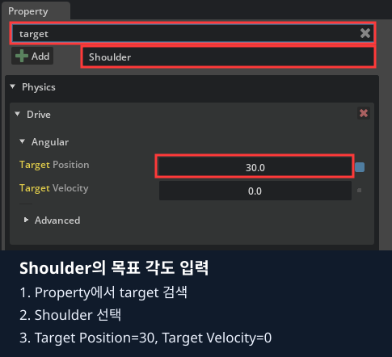

4. Play를 눌러 팔만 기울어지는지 봅니다. 움직임을 살펴본 뒤 Stop합니다.


5. 같은 방법으로 **`-30` → Play → Stop**, **`80` → Play → Stop**을 각각 수행합니다.
6. 마지막 목표 80도에서는 실제 팔이 상한인 약 60도까지만 움직이는지 봅니다.

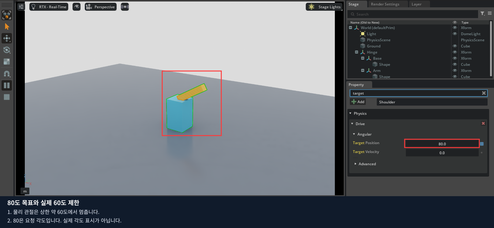

**Target Position은 요청한 값이며 실제 도달각을 표시하는 측정값이 아닙니다.** 80이라고 보여도 물리 관절은 제한을 받습니다.
사진은 위 설정으로 실행한 결과입니다. Stop 뒤 선택 대상이 World 등으로 바뀌면 **Shoulder를 다시 선택하고 `target`을 검색한 다음** 다음 각도를 입력합니다.

### 4.4. 응답을 바꾸어 비교하기

각 실험 전에 Stop하고 Property 검색어를 지웁니다. 목표 각도는 `30`으로 맞춥니다.

1. **Stiffness만 `1000 → 20`**으로 바꿉니다. Play 후 움직임을 보고 Stop합니다.
2. Stiffness를 **`1000`으로 복원**합니다.
3. **Damping만 `50 → 5`**로 바꿉니다. Play 후 흔들림과 멈추는 과정을 보고 Stop합니다.
4. Damping을 **`50`으로 복원**합니다. 여러 값을 동시에 바꾸지 않습니다.

## 5. 저장하고 연결 관계 정리하기

1. Stop 상태인지 확인합니다.
2. Shoulder의 **Target Position=0, Target Velocity=0, Stiffness=1000, Damping=50, Max Force=100**으로 복원합니다.
3. Axis=Y, 제한=-60/60도, Base Z=0.15, Arm Z=0.45를 확인합니다.
4. **File → Save** 또는 Ctrl+S로 `my_joint.usda`를 저장합니다. 아직 새 이름으로 저장하지 않았다면 **Save As → 이름 my_joint → 형식 *.usda**를 사용합니다.
5. **File → Open**으로 `/data/isaacsim_basic/my_joint.usda`를 다시 엽니다.
6. Hinge의 여섯 객체(Base·Arm·두 Shape·FixedBase·Shoulder)와 목표 0도를 확인합니다. 이 파일은 관절 입력·JSON 기록 **보충 예제**에서 재사용할 수 있습니다. 4장 본 수업은 준비된 빨주노초 코스로 진행합니다.

다음을 화면에서 짚어 설명할 수 있으면 코드 실습으로 넘어갑니다.

- Base·Arm과 자식 Shape에 서로 다른 물리 속성을 붙인 이유
- FixedBase가 고정하는 두 대상과 Shoulder가 연결하는 두 대상
- 80도를 요청해도 약 60도에서 제한되는 이유

## 6. 마지막: 같은 작업을 코드로 구현하기

지금까지 마우스로 만들고 관찰한 내용을 코드로 연결합니다. 먼저 직접 만든 USD를 저장합니다.
Isaac Sim 창을 닫아 현재 실행을 종료합니다.

각 예제의 `build_scene()`은 새 장면에 객체를 만듭니다. 화면에서 저장한 USD가 Python 소스를 자동으로 바꾸지는 않습니다.

| 직접 한 일 | [01_joint_drive.py](experiments/01_joint_drive.py)에서 찾을 코드 |
|---|---|
| Xform·자식 Shape, 강체·충돌 추가 | `Xform.Define`, `box`, `RigidBodyAPI`, `CollisionAPI` |
| 월드에 받침 고정 | `FixedJoint.Define`, `CreateBody1Rel`, `CreateLocalPos0Attr` |
| 관절 계통 시작점 지정 | `ArticulationRootAPI.Apply(fixed.GetPrim())` |
| 회전 관절·두 접점·제한 지정 | `RevoluteJoint.Define`, `CreateLocalPos0Attr`, `CreateLocalPos1Attr`, `CreateAxisAttr` |
| Drive·목표·응답 변경 | `DriveAPI.Apply`, `CreateTargetPositionAttr`, `CreateStiffnessAttr` |

### 코드 실행과 수정 순서

설치는 0장에서 마쳤다고 가정합니다. 다음 명령을 저장소 루트에서 실행합니다.

같은 노트북의 저장소 루트 터미널:

```bash
./lekiwi basic --chapter 2
```

1. 실행하면 Stop 상태로 열립니다. 화면의 Play로 관찰하고 Stop으로 돌아옵니다. 이 절에 연결된 Python 파일을 열고, 앞에서 클릭했던 속성에 해당하는 줄을 찾습니다.
2. 기본 실행 결과를 직접 만든 환경의 결과와 비교합니다.
3. 실행을 종료한 뒤 지정된 기본 줄에 `#`를 붙이고 비교할 줄의 `#`를 지웁니다. 들여쓰기는 유지합니다.
4. 파일을 저장하고 같은 명령으로 다시 실행합니다. 화면에서 값을 바꾸는 실험과 결과를 비교합니다.

코드 수정 전 Isaac Sim 창을 닫고, 수정 파일을 저장한 뒤 같은 명령으로 재실행합니다.
학생 파일은 호스트에서 저장하면 다음 실행에 반영되며, 코드만 수정할 때 Docker 이미지 재빌드는 필요 없습니다.

### 6.1. 기준 모형 실행

[01_joint_drive.py](experiments/01_joint_drive.py)

`build_scene()`에는 Base·Arm 강체 생성, 바닥에 고정하는 FixedJoint, 두 강체 사이 RevoluteJoint가 들어 있습니다.
먼저 기본 0도 상태를 Play로 확인합니다.

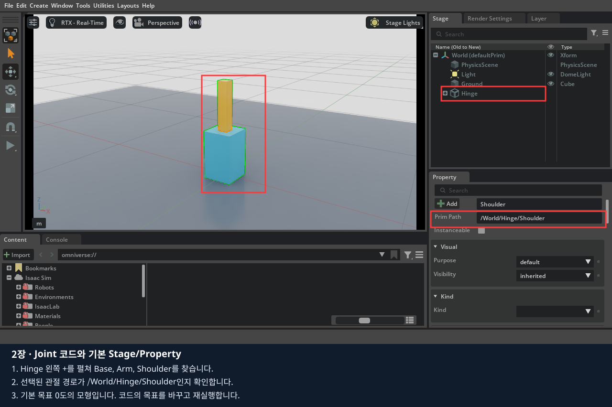

### 6.2. 연결 관계 읽기

```python
fixed = UsdPhysics.FixedJoint.Define(stage, "/World/Hinge/FixedBase")
fixed.CreateBody1Rel().SetTargets(["/World/Hinge/Base"])
UsdPhysics.ArticulationRootAPI.Apply(fixed.GetPrim())
joint = UsdPhysics.RevoluteJoint.Define(stage, "/World/Hinge/Shoulder")
joint.CreateBody0Rel().SetTargets(["/World/Hinge/Base"])
joint.CreateBody1Rel().SetTargets(["/World/Hinge/Arm"])
```

FixedJoint의 반대쪽 Body가 비어 있으면 월드에 고정합니다. RevoluteJoint는 Base와 Arm 사이에 하나의 회전 자유도를 만듭니다.
ArticulationRoot는 이 연결을 로봇 관절 계통으로 해석하는 시작점입니다.

`LocalPos0`, `LocalPos1`은 각 Body 기준의 접점 위치입니다. 모형에서는 Base 윗부분과 Arm 아랫부분이 같은 월드 위치에 놓입니다.
모양을 만드는 Scale은 자식 Shape에 적용했습니다. 강체 자체를 확대하면 관절 기준 거리까지 달라져 혼동하기 쉽습니다.

### 6.3. 회전축과 제한

```python
joint.CreateAxisAttr("Y")
joint.CreateLowerLimitAttr(-60)
joint.CreateUpperLimitAttr(60)
```

이 값들은 **degree**입니다. 축은 해당 관절 프레임 기준입니다.
Stage의 `/World/Hinge/Shoulder`를 선택하여 Property의 Axis와 Lower/Upper Limit을 찾아 코드와 비교합니다.
연결된 두 강체의 자기 충돌은 `CreateCollisionEnabledAttr(False)`로 껐습니다.

### 6.4. 목표 각도 바꾸기

파일 끝의 기본 줄을 주석 처리하고 +30도 줄을 활성화합니다.

```python
# drive.CreateTargetPositionAttr(0)
drive.CreateTargetPositionAttr(30)
# drive.CreateTargetPositionAttr(-30)
# drive.CreateTargetPositionAttr(80)
```

창을 닫고 재실행 → Play. 같은 방법으로 -30도도 확인합니다.
마지막에는 80도를 명령하여 실제 관절이 상한인 약 60도에서 멈추는지 봅니다.
목표값과 실제 상태가 다를 수 있다는 점이 핵심입니다.

### 6.5. Stiffness·Damping·Max Force

```python
drive = UsdPhysics.DriveAPI.Apply(joint.GetPrim(), "angular")
drive.CreateTypeAttr("force")
drive.CreateStiffnessAttr(1000)
# drive.CreateStiffnessAttr(20)
drive.CreateDampingAttr(50)
drive.CreateMaxForceAttr(100)
```

Stiffness는 목표 오차에 대한 복원 반응, Damping은 속도에 대한 감쇠, Max Force는 구동 힘/토크 상한입니다.
회전 관절에서는 토크를 생각합니다. 목표 30도를 유지하고 Stiffness만 20으로 바꿔 느린 응답·처짐을 관찰합니다.
다음에는 원래 값으로 복원한 뒤 Damping만 낮춰 흔들림을 비교합니다.

수치가 크다고 무조건 좋은 제어가 아닙니다. 물리 시간 간격·질량·관성도 영향을 줍니다.
처음부터 여러 값을 바꾸면 어느 변화가 원인인지 구분하기 어렵습니다.

### 6.6. 저장과 다시 시작

동일한 설정으로 다시 보려면 표준 Stop → Play를 사용합니다.
코드 수정은 재실행합니다. GUI에서 바꾼 USD를 남기려면 `File > Save As`에서 `/data/isaacsim_basic/` 아래 새 파일에 저장합니다.
**USD 저장이 Python 소스까지 수정하지는 않습니다.** 변경한 `.py`도 함께 저장합니다.

완료 기준: 0/+30/-30/80도의 목표와 실제 움직임을 비교하고, 관절 제한과 Stiffness가 결과에 주는 영향을 설명할 수 있습니다.

[공식 자료](SOURCES.md) · [다음: 3편](../03_robot_cameras/README.md)
