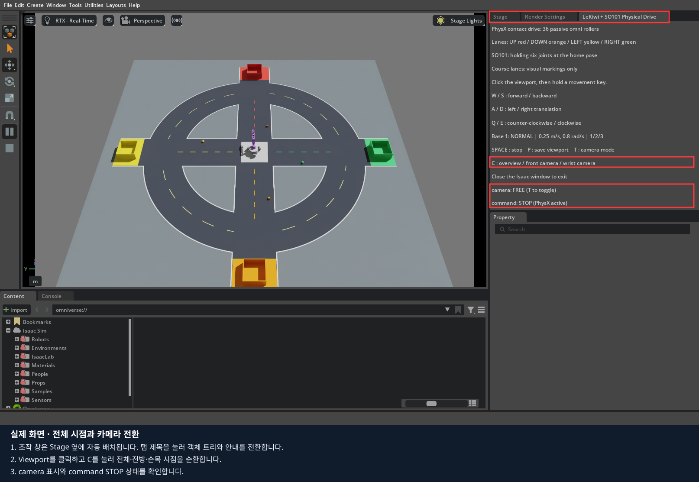
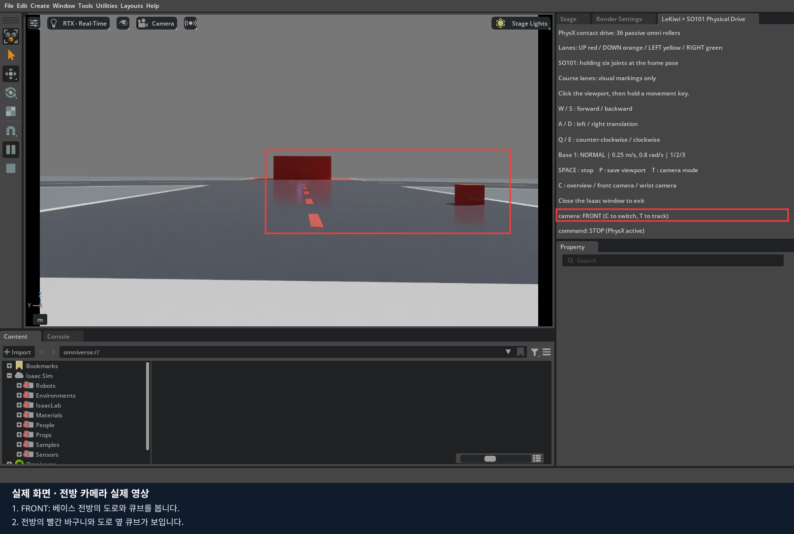
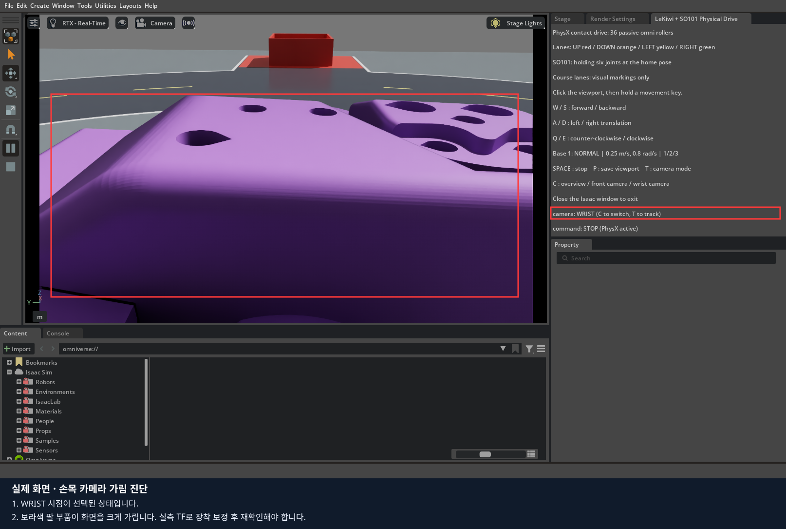
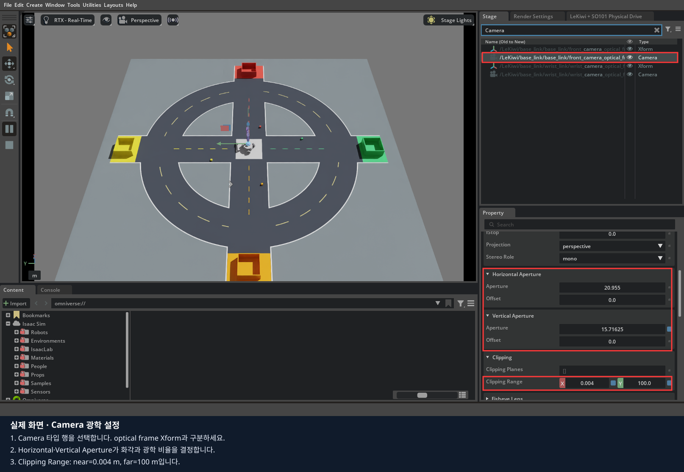
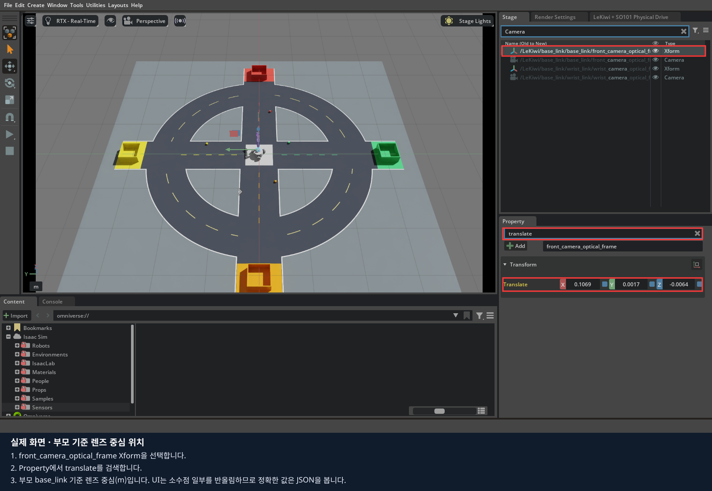
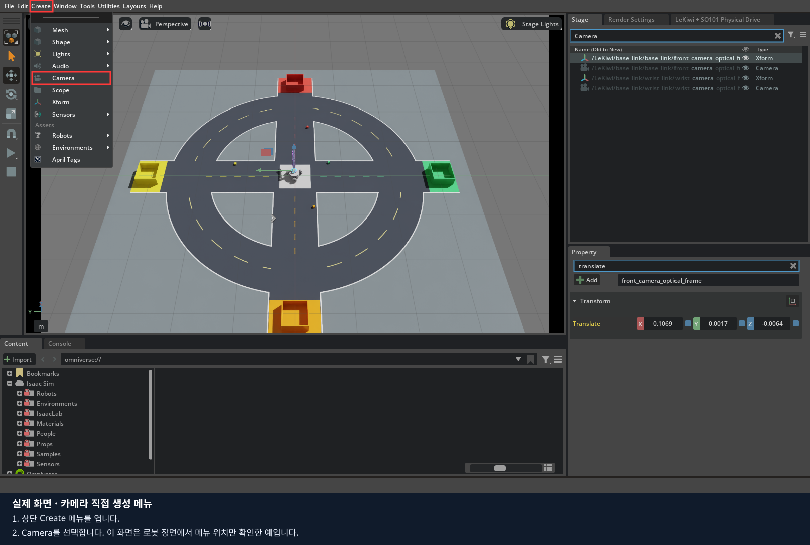
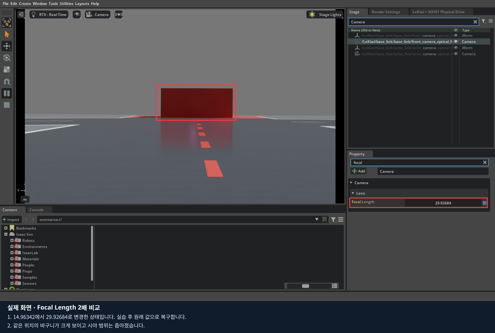

# 3편 · 전방·손목 카메라와 좌표 이해하기

**목표:** 두 카메라 영상을 전환하고, 렌즈 중심·촬영 방향·부모 링크·화각을 구분하여 확인합니다.
Isaac Sim 5.1.0 Docker 기준, 예상 60~90분입니다. ROS/RViz는 필요하지 않습니다.
현재 장착값은 모델 형상에 맞춘 **임시값**입니다. 실물 렌즈 위치를 측정한 보정값은 아닙니다.

## 1. 가상 로봇과 카메라 열기

[전체 설치 안내](../README.md)를 마친 뒤 저장소 최상위에서 실행합니다.
이전 Isaac Sim 창을 닫고 종료를 기다린 다음 시작합니다.

```bash
export LEKIWI_DOCKER_SUDO=1  # Docker에 sudo가 필요한 PC에서만
export ACCEPT_EULA=Y       # NVIDIA 라이선스를 읽고 동의한 경우
./lekiwi setup sim
LEKIWI_COURSE_LAYOUT=random ./lekiwi sim
```

중앙에 LeKiwi, 네 색의 도로와 큐브·바구니가 보입니다. 큐브 위치·바닥 위 회전 방향은 실행마다 달라집니다.
이 명령은 **키보드 베이스 조작 + 팔 기본 자세 유지**이며, 실제 리더에 연결하지 않습니다.
로봇이 바닥에 안정적으로 놓인 뒤 조작 패널이 나타날 때까지 기다립니다.
`LeKiwi + SO101 Physical Drive` 창은 오른쪽 **Stage 옆 탭**에 자동 배치됩니다.
객체 트리와 조작 안내는 탭 제목을 눌러 전환합니다.
1·2편의 `basic` 장면과 달리 이 실행은 물리 계산이 자동으로 시작됩니다.

## 2. 카메라 시점 전환

1. 입력란에 글자를 쓰고 있으면 Enter로 마칩니다. Viewport의 빈 바닥을 클릭합니다.
2. **C**를 한 번 눌러 전방 카메라로 전환합니다.
3. 다시 **C**를 눌러 손목 카메라로 전환합니다.
4. 한 번 더 누르면 전체 시점으로 돌아갑니다.
5. 패널의 `camera:` 표시와 실제 영상을 함께 확인합니다.

| 시점 | 관찰할 내용 | 장착 기준 |
|---|---|---|
| OVERVIEW | 로봇과 코스 전체 배치 | 자유 관찰용 카메라 |
| FRONT | 베이스 앞의 도로·장애물 | `base_link` |
| WRIST | 손목 앞·아래의 작업 영역 | `wrist_link` |







촬영한 기본 자세에서는 보라색 팔 부품이 손목 화면을 크게 가립니다. 이것은 정상 장착의 완성 예가 아니라
**가림을 발견한 진단 예**입니다. 촬영 정면·실제 고정 링크·렌즈 중심을 실측 TF와 맞춘 뒤 다시 확인해야 합니다.
물체를 보이게 하려고 로봇 Collider를 끄거나 외형을 숨기는 것으로 장착 보정을 대신하지 않습니다.

**T**는 전체 시점으로 돌아가 로봇 추적을 전환합니다. 고정 카메라 화각 실습 중에는 C로 원하는 시점을 다시 고르세요.
카메라로 보는 중 마우스 탐색으로 장착 카메라의 Transform을 바꾸지 않도록 주의합니다.
시점 선택과 카메라 장착 위치 편집은 서로 다른 작업입니다.

## 3. Stage에서 실제 카메라 찾기

오른쪽 **Stage** 탭을 눌러 객체 트리를 표시합니다.
Stage 검색창에 `Camera`를 입력하고 **Enter**를 누릅니다.
같은 Camera라는 이름이 여러 개이므로 전체 경로를 보고 선택합니다.

```text
/LeKiwi/base_link/base_link/front_camera_optical_frame/Camera
/LeKiwi/base_link/wrist_link/wrist_camera_optical_frame/Camera
```

`front_camera_optical_frame`, `wrist_camera_optical_frame`은 렌즈 중심과 방향을 표현하는 Xform입니다.
그 아래 `Camera`는 영상을 만드는 USD 카메라입니다. `Housing`과 `Lens`는 위치를 보기 위한 외형이며
Collider·질량을 추가하지 않습니다.



`Camera`를 선택해 Property를 보면 Projection, Focal Length, Horizontal/Vertical Aperture,
Clipping Range를 확인할 수 있습니다. 검색어를 지우고 아래로 스크롤하면 나머지 항목도 보입니다.
장착 위치를 찾을 때는 Camera 자체가 아니라 **부모 optical frame**을 선택합니다.



### 빈 장면에 카메라를 직접 만드는 메뉴

직접 생성 연습은 현재 로봇 실행을 닫고 `./lekiwi basic`으로 새 장면을 열어 진행할 수 있습니다.
`Create > Camera`로 생성한 후 Stage에서 선택해 Transform을 조정합니다.
Viewport의 카메라 선택 메뉴에서 새 Camera를 선택해야 그 시점으로 렌더링합니다.
현재 로봇 실행의 **C 단축키는 프로젝트가 등록한 두 카메라만 전환**합니다.



[NVIDIA 공식 카메라 생성·시점 전환 안내](https://docs.isaacsim.omniverse.nvidia.com/5.1.0/sensors/isaacsim_sensors_camera.html)

## 4. 화각·해상도·클리핑 구분하기

| 항목 | 현재 설정 | 의미 |
|---|---|---|
| Projection | perspective | 가까운 물체가 크게 보이는 원근 카메라 |
| Horizontal FOV | 70° | 수평으로 볼 수 있는 각도, 설정 JSON에 기록 |
| Resolution | 640×480 | 설정상 영상 크기와 4:3 광학 비율 |
| Horizontal Aperture | 20.955 | Focal Length와 함께 화각 결정 |
| Vertical Aperture | 15.71625 | 수평 Aperture의 3/4 |
| Focal Length | 약 14.9634 | 위 Aperture에서 약 70° 화각이 되도록 계산 |
| Clipping Range | 0.004~100 m | 렌즈에서 너무 가깝거나 먼 물체 제외 |
| F Stop | 0 | 현재 설정에서 심도 흐림 비활성 |

USD의 Aperture와 Focal Length는 동일한 **장면 단위의 1/10** 규약을 씁니다.
화각은 두 값의 비율로 정해집니다. 이 숫자를 실물 렌즈의 mm 측정값으로 그대로 해석하지 마세요.
Clipping Range는 장면 길이 단위입니다. [OpenUSD 카메라 속성·단위](https://openusd.org/release/api/class_usd_geom_camera.html)

화각 관계식: `수평 화각 = 2 × atan(수평 Aperture / (2 × Focal Length))`.
Aperture가 같다면 Focal Length를 키울수록 보이는 범위가 좁아집니다.

**비교 실습:** 이동키를 모두 놓고 왼쪽 **Pause**를 누릅니다. 현재 실행의 조작 단축키가 숫자·문자 입력에도 반응할 수 있어, 속성을 편집할 때는 물리를 일시 정지합니다.
현재 값을 적어 둔 뒤 Focal Length 숫자를 Ctrl+클릭하여 약 2배로 설정합니다.
같은 카메라 시점에서 대상이 크게 보이는지 확인하고, 다시 전체 시점에서 Camera를 선택해 원래 값으로 복구합니다.
재개 전 숫자키 **1**로 베이스 속도를 복구하고 이동키를 놓은 상태에서 Play를 누릅니다.
물체가 화면에서 없어졌다고 충돌·물리까지 사라진 것은 아닙니다.


GUI에서 바꾼 값은 이번 실행의 장면 편집입니다. 지속적인 설정 변경은 다음 절의 JSON을 사용합니다.

현재 C/P 기능은 **Viewport 한 개를 전환·캡처**합니다.
P로 저장되는 PNG 크기는 실제 Viewport 크기를 따르므로 640×480 고정 출력이라고 가정하면 안 됩니다.
두 영상의 동시 렌더링·시간 동기화·데이터셋 녹화는 아직 구현하지 않았습니다.

## 5. 렌즈 좌표축과 부모 링크

| 기준 | 오른쪽/위/정면 규약 | 주의점 |
|---|---|---|
| optical frame | +X 오른쪽, +Y 아래, +Z 촬영 정면 | 설정 JSON이 사용하는 규약 |
| USD Camera | +X 오른쪽, +Y 위, -Z 촬영 정면 | 자식 Camera에 X축 180° 변환 적용 |
| 로봇 base_link | +X 전방, +Y 왼쪽, +Z 위 | 카메라의 정면축과 구분 |

**렌즈 중심은 optical frame의 원점**입니다. 외형 상자의 가운데를 원점으로 맞추면 렌즈가 어긋날 수 있습니다.
JSON에는 optical 기준 quaternion을 넣습니다. 자식 Camera의 X축 180° 변환을 다시 곱해 넣지 않습니다.

| 카메라 | 물리 부모 | 부모 기준 렌즈 중심 (m) |
|---|---|---|
| front | base_link | (0.110, 0.0017, -0.0063) |
| wrist | wrist_link | (-0.035, -0.045, 0.0181) |

손목 카메라는 현재 **wrist_roll 이전 링크**에 달려 있습니다.
실제 카메라가 집게 회전과 함께 돌아가는 구조라면 `gripper_link`를 부모로 지정하고 변환을 다시 구해야 합니다.
이 편은 기본 자세에서 영상을 확인합니다. 여러 팔 자세에서의 실제 영상 가림 검사는
4편에서 사용자가 리더 조작을 준비한 뒤 이어서 수행합니다.

## 6. 나중에 soarm base 기준 TF를 반영하기

TF는 여기서 **두 좌표계 사이의 위치와 회전 관계**를 뜻합니다. ROS 설치 자체가 필수인 것은 아닙니다.
실측 때 아래 정보를 함께 남깁니다.

- 기준: `soarm_base_link`, 카메라의 렌즈 중심과 촬영 정면.
- translation 길이 단위: m 또는 mm를 명시.
- quaternion 순서: 이 프로젝트는 **x, y, z, w**.
- 좌표축 규약: optical인지 다른 규약인지 명시.
- 손목 카메라를 측정한 **동일 시점의 6개 관절각**과 단위.
- 카메라가 실제로 고정된 링크.

S=soarm base, L=부착 링크, C=optical frame이라 할 때:

```text
T_L_C = inverse(T_S_L(q)) × T_S_C
```

`T_A_B`는 B 좌표를 A 좌표로 바꾸는 변환입니다. q는 측정 당시 팔 자세입니다.
손목 카메라의 측정값을 soarm base에 그대로 고정하면 팔을 움직여도 카메라가 따라가지 않습니다.
측정 자세에서 **부착 링크 기준으로 환산**해야 합니다.

front의 예로, 현재 URDF의 `base_link → soarm_base_link`는
(0.019988279335, 0.001703025019, 0.052884) m이고 회전은 0입니다.
같은 축 방향으로 표현한 점이라면 base 기준 위치는 이 이동값과 soarm base 기준 위치를 더해 구합니다.
손목에는 관절 회전이 포함되므로 같은 단순 덧셈을 적용하면 안 됩니다.

### 설정 파일의 작업 복사본 만들기

저장소 최상위에서 실행합니다. 기존 파일을 덮어쓰지 않는 명령입니다.

```bash
mkdir -p data/cameras
cp -n isaac_sim/assets/cameras/mounts.json data/cameras/mounts.json
```

호스트 `data/cameras/mounts.json`을 편집합니다.
이 파일은 컨테이너에서 `/data/cameras/mounts.json`으로 보입니다.
측정하지 않은 상태에서는 `calibrated: false`를 유지합니다.

```bash
LEKIWI_CAMERA_CONFIG=/data/cameras/mounts.json LEKIWI_COURSE_LAYOUT=random ./lekiwi sim
```

기존 Isaac Sim을 종료한 뒤 실행해야 합니다. JSON의 quaternion 길이는 1이어야 하며,
허용 범위와 숫자 형식이 잘못되면 로더가 오류를 냅니다. 이것만으로 실측 보정 정확성이 보장되지는 않습니다.
이번 과정에서 TF 실측값을 임의로 만들거나 원본 장착값을 보정 완료로 표시하지 않습니다.

## 7. 화면 저장과 문제 해결

Viewport를 클릭하고 **P**를 누릅니다. 기본 경로는 다음과 같습니다.

- 컨테이너: `/data/captures/lekiwi_viewport.png`
- 호스트: `data/captures/lekiwi_viewport.png`

**같은 경로를 덮어씁니다.** front를 저장한 뒤 파일을 `front.png` 등으로 따로 복사하고,
그 다음 wrist를 저장합니다. 초기 자동 캡처도 같은 경로를 사용합니다.
강의의 버튼 표시 스크린샷은 UI 전체를 별도로 촬영한 것이며 P의 Viewport 캡처와 다릅니다.

| 증상 | 확인 순서 |
|---|---|
| C를 눌러도 안 바뀜 | 검색창 입력 종료 → Viewport 클릭 → camera 표시 확인 |
| 엉뚱한 방향·상하 반전 | optical/USD 축 구분 → quaternion 순서 → 중복 180° 변환 |
| 손목 카메라가 팔을 안 따라감 | 실제 부모 링크와 장면의 부모 경로 |
| 렌즈 바로 앞 물체가 잘림 | Clipping Range의 near 값과 렌즈 중심 |
| 사진 크기가 640×480이 아님 | P는 창의 Viewport 크기를 사용함 |
| 수정한 JSON이 반영되지 않음 | 컨테이너 경로, 환경변수, 기존 실행 종료 여부 |

## 8. 과제

1. 전체·전방·손목 화면을 각각 저장합니다. 커서와 선택 윤곽이 관찰 대상을 가리지 않게 합니다.
2. 두 Camera와 부모 optical frame의 경로를 기록합니다.
3. Focal Length를 바꾸기 전후의 시야 차이를 비교하고 기본값으로 복구합니다.
4. 손목 카메라에 고정 변환을 쓰려면 왜 측정 당시 관절각이 필요한지 설명합니다.
5. 실측 TF 전달에 필요한 항목을 [기록지](worksheet.md)에 채웁니다. 측정하지 않은 항목은 미측정으로 남깁니다.

[출처·검증 범위](SOURCES.md) · [다음: 4편 조작](../04_teleoperation/README.md)
