# 3장 · 마우스로 카메라 만들고 시점 바꾸기

관찰용 큐브와 카메라를 직접 만들고 위치·방향·렌즈를 바꾸어 봅니다.
**1~5절은 마우스 실습, 마지막 6절은 같은 작업을 코드로 구현하고 LeKiwi 카메라로 확장하는 실습입니다.**
이 장의 큐브는 움직이지 않게 둡니다. 물체 움직임과 카메라 움직임을 동시에 바꾸지 않기 위해서입니다.

## 1. 카메라가 볼 환경 만들기

### 1.1. 공통 바닥 열기

1. 앞 장의 실행 창을 저장 후 닫습니다. 빈 편집기가 이미 열려 있으면 그대로 사용합니다.
2. 같은 노트북의 **저장소 최상위 폴더**에서 실행합니다.

```bash
./lekiwi basic --script 01_object_physics/experiments/00_empty_stage.py
```

3. 로딩 후 상단 **File → Open**을 클릭합니다.


4. 주소 칸에 **`/data/isaacsim_basic/`**를 입력하고 Enter를 누릅니다. File name에 **`base_scene.usda`**를 입력하고 **Open File**을 클릭합니다.


5. Stage의 World 아래에 Light·PhysicsScene·Ground만 있는지 확인합니다. 없다면 [1장 2절](../01_object_physics/README.md#2-world조명중력바닥-만들기)을 먼저 마칩니다.
6. **File → Save As**로 주소는 같은 폴더, 이름은 **`my_camera`**, 형식은 **`*.usda`**로 저장합니다.


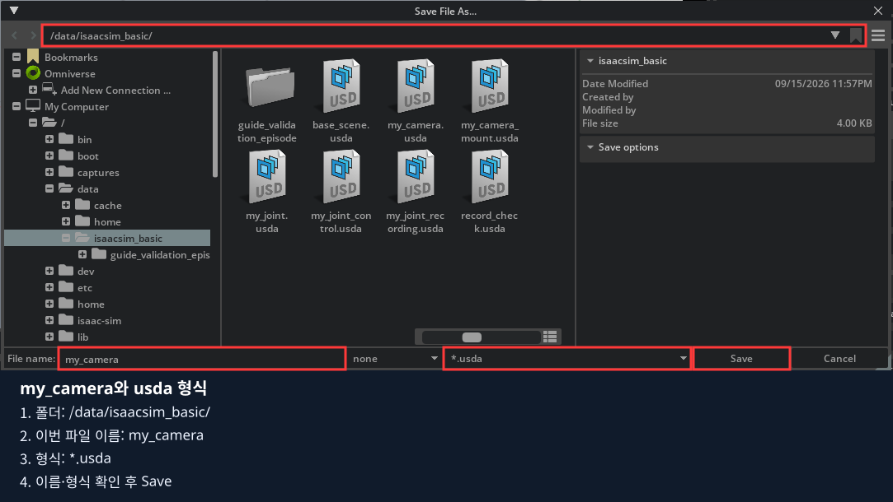

공통 바닥 `base_scene`를 덮어쓰지 않습니다. 사진의 파일 목록은 예시이고, 이번 새 이름은 **my_camera**입니다.

### 1.2. 관찰용 큐브 만들기

1. **Stop 상태**에서 Stage의 World를 클릭합니다.
2. **Create → Shape → Cube**를 선택합니다.


3. 새 Cube 이름 위에서 **우클릭 → Rename**을 누르고 **`PracticeCube`**를 입력한 뒤 Enter를 누릅니다.
4. World 밖에 생겼으면 World 위로 드래그합니다. 선택 후 Prim Path가 **`/World/PracticeCube`**인지 봅니다.
5. Property의 **Transform**을 펼치고 다음 값을 입력합니다. Ctrl+클릭으로 기존 숫자를 바꾼 뒤 Enter로 확정합니다.

| PracticeCube의 줄 | X | Y | Z |
|---|---|---|---|
| Translate | `0` | `0` | `0.7` |
| Rotate 또는 Orient | `0` | `0` | `0` |
| Scale | `1` | `1` | `1` |

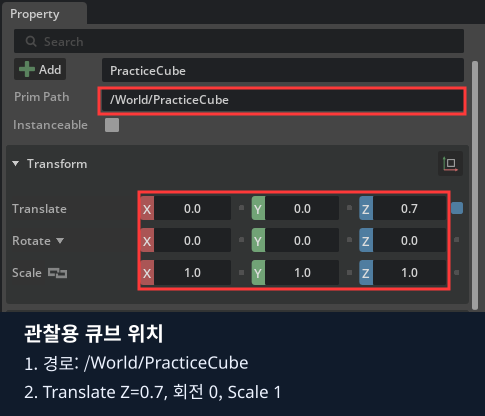

6. Property 검색창에 `size`를 입력하고 **Size=`0.1`**을 입력합니다. 검색창 오른쪽 `×`를 누릅니다.
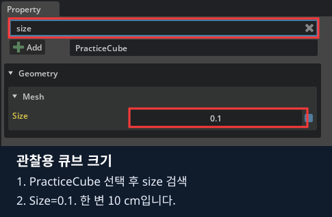

7. **이 큐브에는 Rigid Body를 추가하지 않습니다.** 관찰하는 동안 공중의 같은 위치에 있어야 합니다.

사진에서는 색을 칠한 큐브가 보입니다. 직접 만든 큐브가 회색이어도 위치·크기가 같으면 진행할 수 있습니다.

## 2. Camera 생성과 위치 입력

### 2.1. Camera 만들고 경로 확인하기

1. Stage의 **World**를 클릭합니다.
2. 상단 **Create → Camera**를 클릭합니다.

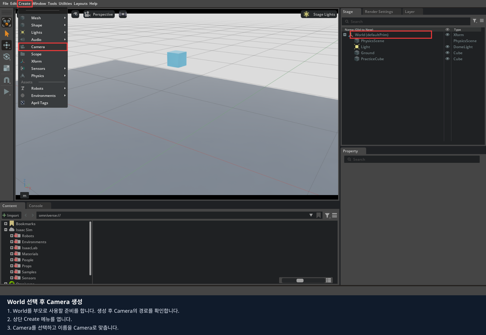

3. 새 객체의 이름을 **`Camera`**로 맞춥니다. World 밖이면 World 아래로 옮깁니다.
4. Camera를 클릭해 Property의 **Prim Path=`/World/Camera`**를 확인합니다. Stage의 Type은 **Camera**여야 합니다.

Xform은 부모 그룹이고 Camera는 렌즈를 가진 객체입니다. Xform을 선택하면 다음 절의 Focal Length 항목이 보이지 않습니다.

### 2.2. 위치와 크기 입력하기

1. Camera를 선택한 채 Property의 **Transform**을 펼칩니다.
2. **Translate X=`1.2`, Y=`-1.6`, Z=`1.1`**을 각각 입력합니다.
3. **Scale X·Y·Z는 모두 `1`**로 둡니다.

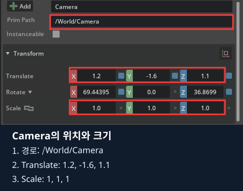

### 2.3. 회전을 한 번만 적용하기

1. Transform에서 **Orient** 줄이 있는지 확인합니다. 있으면 표시된 X·Y·Z 각도를 모두 **`0`**으로 맞춥니다.
2. **Rotate** 줄이 이미 있으면 다시 추가하지 않습니다. 없으면 Property 위쪽 **Add → TransformOp → Rotate**를 선택합니다.

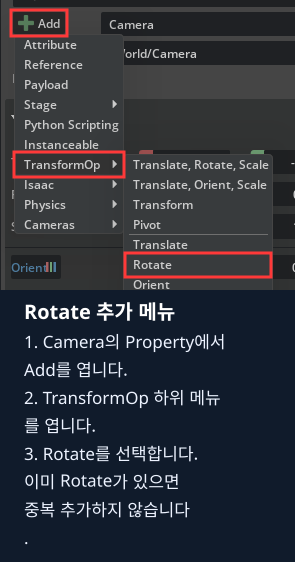

3. Rotate 항목 옆의 순서 선택 메뉴에서 **XYZ**인지 확인합니다. 다른 순서이면 XYZ로 맞춘 뒤 아래 숫자를 입력합니다.
4. **Rotate X=`69.443955`, Y=`0`, Z=`36.869898`**을 입력하고 각 칸에서 Enter를 누릅니다.

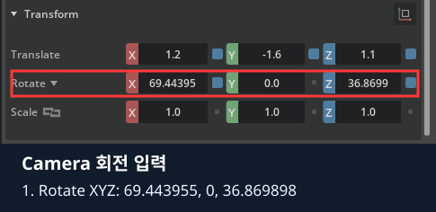

5. Translate는 `(1.2,-1.6,1.1)`, Scale은 `(1,1,1)`, 기존 Orient는 `(0,0,0)`인지 다시 확인합니다.

이 방향은 카메라가 `(0,0,0.35)` 쪽을 보도록 정한 값입니다. 사진에서는 소수점이 짧게 보일 수 있으니 **본문의 전체 숫자**를 입력합니다.
Orient와 Rotate 양쪽에 같은 회전을 넣으면 회전이 두 번 적용될 수 있습니다.

## 3. 렌즈 값을 넣고 카메라 시점 선택하기

### 3.1. Camera 속성 찾고 렌즈 입력하기

1. Stage에서 **Camera 타입 객체**를 클릭합니다. 검색어가 남아 있으면 지웁니다.
2. Property를 아래로 내려 **Camera → Lens**를 펼칩니다.
3. **Focal Length 칸에 `24`**를 입력합니다.

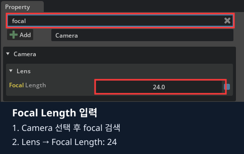

4. 같은 Camera 항목에서 아래 값을 한 칸씩 맞춥니다. 보이지 않으면 Property 안에서 스크롤하거나 검색창에 항목 이름을 입력합니다.

| 항목 | 입력값 |
|---|---|
| Projection | 목록에서 `perspective` |
| Focal Length | `24` |
| Horizontal Aperture | `20.955` |
| Vertical Aperture | `15.2908` |
| Clipping Range | 왼쪽 `0.01`, 오른쪽 `100` |

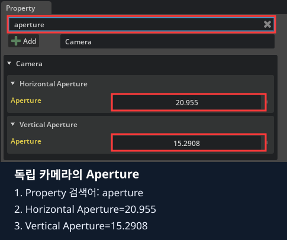

사진처럼 `aperture`를 검색하면 가로·세로 Aperture를 찾기 쉽습니다. 이어 검색어를 `clipping`으로 바꿔 **Clipping Range**의 두 칸을 입력합니다. **Clipping Planes**와 구분합니다.

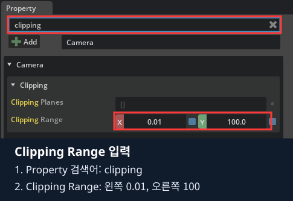

입력 후 검색창 오른쪽 `×`를 누릅니다. 속성이 접혀 있으면 항목 왼쪽의 작은 삼각형을 펼칩니다.

### 3.2. 카메라를 선택한 것과 카메라로 보는 것 구분하기

**Stage에서 Camera를 클릭하는 것은 설정 대상을 선택하는 동작**입니다. 그것만으로 뷰포트 시점이 바뀌지는 않습니다.

1. 뷰포트 위쪽에서 카메라 아이콘 옆 **Perspective** 글자를 클릭합니다.
2. 열린 목록에서 **Cameras에 마우스를 올리고**, 오른쪽에 나타난 **`/World/Camera`에 해당하는 Camera**를 선택합니다. 경로가 아니라 마지막 이름만 표시될 수도 있습니다.
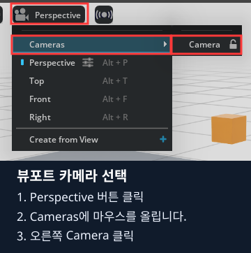

3. 메뉴를 닫고 뷰포트 위쪽 이름이 **Camera**로 바뀌었는지 확인합니다.

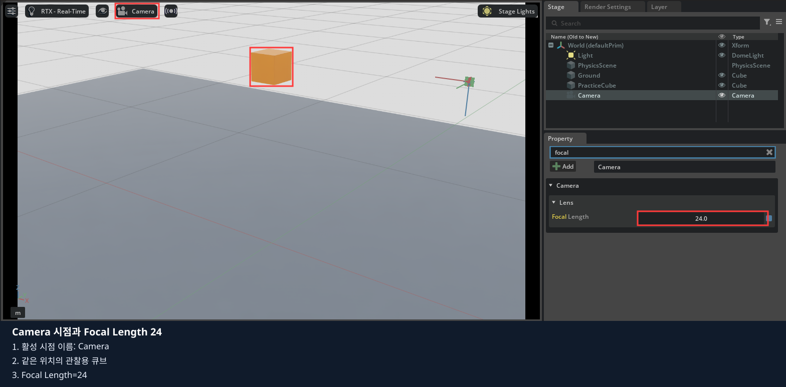

4. 가운데 영상에 큐브와 바닥이 보이는지 확인합니다. 지금은 Play를 누르지 않아도 카메라 시점을 볼 수 있습니다.
5. Camera 시점에서는 마우스 드래그로 시점을 조절하지 않습니다. 카메라 자체의 위치·방향이 바뀔 수 있습니다.

큐브가 안 보이면 **활성 시점 이름 → Camera 경로 → Translate → Rotate·Orient → Clipping** 순서로 확인합니다.
화면이 다르다고 큐브나 Camera를 추가로 만들지 않습니다.

## 4. 화각·위치·부모를 한 가지씩 바꾸기

### 4.1. 같은 자리에서 Focal Length 24와 48 비교

1. 뷰포트의 활성 시점은 Camera로 유지합니다. 창 크기도 그대로 둡니다.
2. Stage의 Camera를 클릭하고 Property 검색창에 **`focal`**을 입력합니다.
3. Focal Length만 **`24 → 48`**로 바꾸고 Enter를 누릅니다.
4. 큐브가 더 크게 보이고 주변이 덜 보이는지 비교합니다.
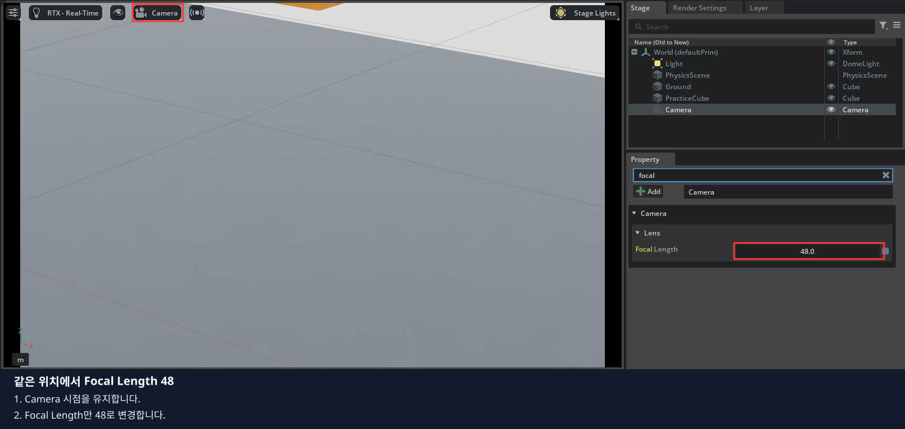

5. **`24`로 복원**하고 검색어를 지웁니다.

카메라 위치를 옮긴 것이 아닙니다. 같은 자리에서 보이는 범위가 바뀐 것입니다.

### 4.2. 방향은 유지하고 위치만 변경

1. 뷰포트 위쪽 Camera 메뉴를 열고 **Perspective**로 돌아옵니다.
2. Stage의 Camera를 클릭하고 Transform의 **Translate X만 `1.2 → 1.5`**로 바꿉니다.
3. 다시 뷰포트 메뉴에서 **Camera**를 선택하고 큐브가 화면의 어느 쪽으로 이동했는지 봅니다.
4. Perspective로 돌아와 X를 **`1.2`로 복원**합니다. Y·Z와 회전값은 유지합니다.
5. **File → Save**로 독립 카메라 장면 `my_camera.usda`를 저장합니다.

### 4.3. CameraMount 그룹 만들기

1. **File → Save As**로 새 파일을 만듭니다. 주소는 `/data/isaacsim_basic/`, 이름은 **`my_camera_mount`**, 형식은 **`*.usda`**입니다.
2. Stage에서 World를 선택하고 **Create → Xform**을 클릭합니다.


3. 새 Xform을 **`CameraMount`**로 이름 바꾸고 **`/World/CameraMount`**인지 확인합니다.
4. CameraMount의 Translate·회전은 모두 `0`, Scale은 모두 `1`로 둡니다.
5. Stage에서 **Camera 이름을 CameraMount 이름 위로 드래그**합니다.
6. Camera를 다시 선택했을 때 Prim Path가 **`/World/CameraMount/Camera`**인지 확인합니다.
7. 이동 후 Camera의 Translate·Rotate·Orient·Scale이 2절 값인지 확인합니다. 부모가 단위 변환이면 같은 값으로 유지됩니다.

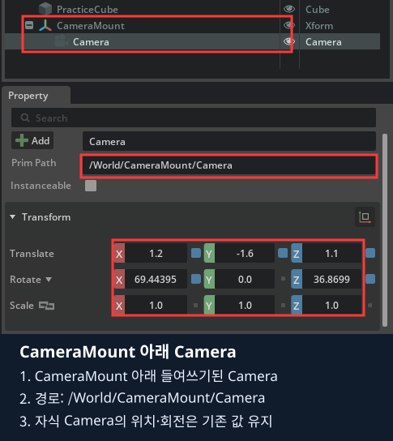

```text
World
├─ Light
├─ PhysicsScene
├─ Ground
├─ PracticeCube
└─ CameraMount       ← 부모 그룹: Xform
   └─ Camera         ← 렌즈를 가진 자식: Camera
```

### 4.4. 부모를 움직여 자식 카메라 관찰

1. 활성 시점을 Perspective로 바꾸고 **CameraMount**를 선택합니다. Camera를 선택하지 않습니다.
2. CameraMount의 **Translate X만 `0 → 0.3`**으로 바꿉니다.
3. Camera 시점으로 전환해 영상이 달라지는지 봅니다. 부모를 옮기면 자식도 함께 움직입니다.
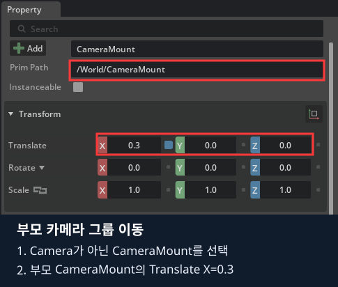

4. Perspective로 돌아와 CameraMount의 X를 **`0`으로 복원**합니다.
5. CameraMount의 회전 줄(Rotate 또는 Orient)에서 **Z만 `0 → 15`**로 바꿉니다.
6. Camera 시점에서 비교한 뒤 Perspective로 돌아와 Z를 **`0`으로 복원**합니다.

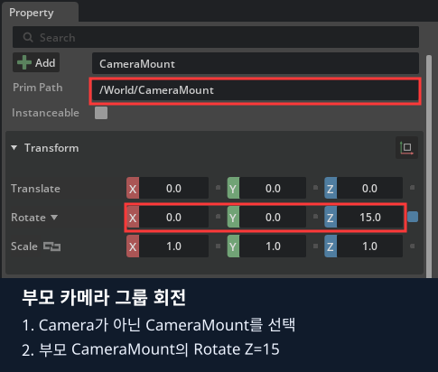

CameraMount를 선택하면 렌즈 항목이 안 보이는 것이 정상입니다. 실제 로봇에서는 이런 부모가 base_link·wrist_link 역할을 합니다.

## 5. 저장하고 카메라의 역할 정리하기

1. CameraMount의 위치·회전=`0`, Scale=`1`인지 확인합니다.
2. 자식 Camera의 위치·회전은 2절 값, Focal Length=`24`로 복원합니다.
3. **File → Save**로 `my_camera_mount.usda`를 저장합니다.
4. File → Open으로 같은 파일을 다시 열고 **Stage의 부모·자식 경로**를 확인합니다.
5. 뷰포트 메뉴에서 Camera를 다시 선택해 큐브와 바닥을 봅니다. 시점이 Perspective로 열렸다고 파일 저장 실패는 아닙니다.

다음 세 가지를 비교하고 마지막 코드 실습으로 넘어갑니다.

- Focal Length 24/48: 물체 크기와 주변이 보이는 범위
- Camera의 Translate 변경: 카메라 위치 이동
- CameraMount 변경: 부모와 함께 움직이는 자식 카메라

**USD를 저장하면 카메라 설정을 가진 장면이 저장됩니다. 시간별 영상 파일은 아직 기록되지 않습니다.** RGB 영상 수집은 6장에서 진행합니다.

## 6. 마지막: 같은 작업을 코드로 구현하기

지금까지 마우스로 만들고 관찰한 내용을 코드로 연결합니다. 먼저 직접 만든 USD를 저장합니다.
Isaac Sim 창을 닫아 현재 실행을 종료합니다.

각 예제의 `build_scene()`은 새 장면에 객체를 만듭니다. 화면에서 저장한 USD가 Python 소스를 자동으로 바꾸지는 않습니다.

| 화면 작업 | 코드 |
|---|---|
| Create Camera | `UsdGeom.Camera.Define(stage, "/World/Camera")` |
| Translate·Rotate로 자세 지정 | `SetLookAt(eye, target, up).GetInverse()`와 `AddTransformOp()` |
| Focal Length 24/48 | `CreateFocalLengthAttr(24)` / `CreateFocalLengthAttr(48)` |
| Horizontal Aperture | `CreateHorizontalApertureAttr(20.955)` |
| Clipping Range | `CreateClippingRangeAttr(Gf.Vec2f(.01, 100))` |
| Stage에서 부모 아래로 이동 | 부모 경로 아래에 Camera 생성, 부모 기준 변환 지정 |

GUI의 Translate·Rotate와 코드의 4×4 변환 행렬은 표현 방식이 다릅니다. 같은 자세를 나타내는지 영상과 좌표로 비교합니다.
USD Camera의 정면은 -Z, 위는 +Y입니다. 로봇의 optical frame과 연결하는 규칙은 아래 LeKiwi 좌표 실습에서 이어집니다.
카메라를 생성한 것만으로 RGB 데이터셋이 저장되지는 않습니다. 매 프레임 영상 수집과 저장은 6장의 코드에서 다룹니다.


앞의 GUI 실험에서는 Camera의 X만 바꾸고 회전은 유지했습니다. 아래 코드의 `SetLookAt`에서 eye만 바꾸면
같은 target을 바라보도록 회전도 재계산됩니다. 위치만 바꾸는 실험과 같은 조건으로 혼동하지 않습니다.

### 코드 실행과 수정 순서

설치는 0장에서 마쳤다고 가정합니다. 다음 명령을 저장소 루트에서 실행합니다.

같은 노트북의 저장소 루트 터미널:

```bash
./lekiwi basic --chapter 3
```

1. 실행하면 Stop 상태로 열립니다. 화면의 Play로 관찰하고 Stop으로 돌아옵니다. 이 절에 연결된 Python 파일을 열고, 앞에서 클릭했던 속성에 해당하는 줄을 찾습니다.
2. 기본 실행 결과를 직접 만든 환경의 결과와 비교합니다.
3. 실행을 종료한 뒤 지정된 기본 줄에 `#`를 붙이고 비교할 줄의 `#`를 지웁니다. 들여쓰기는 유지합니다.
4. 파일을 저장하고 같은 명령으로 다시 실행합니다. 화면에서 값을 바꾸는 실험과 결과를 비교합니다.

코드 수정 전 Isaac Sim 창을 닫고, 수정 파일을 저장한 뒤 같은 명령으로 재실행합니다.
학생 파일은 호스트에서 저장하면 다음 실행에 반영되며, 코드만 수정할 때 Docker 이미지 재빌드는 필요 없습니다.

### 6.1. 카메라 생성

[01_camera.py](experiments/01_camera.py)

```python
camera = UsdGeom.Camera.Define(stage, "/World/Camera")
camera.CreateFocalLengthAttr(24)
# camera.CreateFocalLengthAttr(48)
camera.CreateHorizontalApertureAttr(20.955)
camera.CreateClippingRangeAttr(Gf.Vec2f(.01, 100))
```

기본 Viewport는 Perspective입니다. Viewport 위쪽 카메라 선택 메뉴에서 `/World/Camera`를 선택합니다.
Stage에서 Camera를 선택해 Property의 Camera·Transform 항목을 코드와 비교합니다.

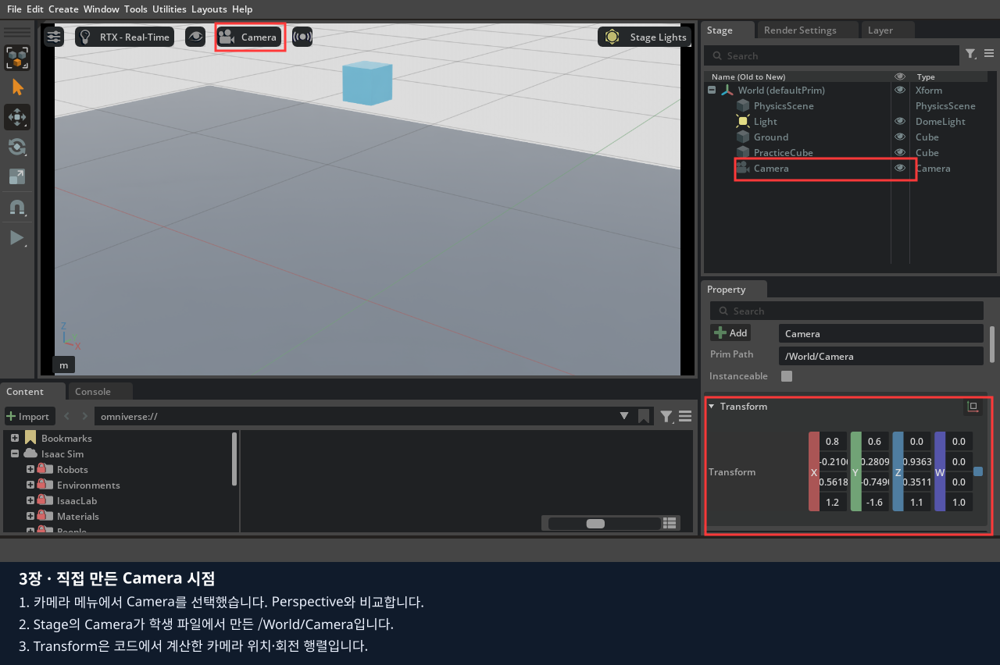

### 6.2. 같은 자리에서 화각 바꾸기

24 줄을 주석 처리하고 48 줄을 해제합니다. 창을 닫고 같은 명령으로 재실행한 뒤 Camera를 다시 선택합니다.
카메라 위치는 유지되지만 화면에 보이는 범위는 좁아지고 객체는 크게 보입니다.
`FocalLength`와 `HorizontalAperture`의 비율이 화각을 결정합니다. 둘은 USD에서 같은 렌즈 단위를 사용합니다.
**해상도는 픽셀 개수**, 화각은 보이는 각도, Clipping은 표시하는 거리 범위입니다. 서로 구분합니다.

### 6.3. 위치와 방향

```python
pose = Gf.Matrix4d().SetLookAt(eye, target, up).GetInverse()
camera.AddTransformOp().Set(pose)
```

파일의 eye는 카메라 위치, target은 바라볼 점, up은 월드의 위쪽입니다.
`SetLookAt`의 역행렬을 카메라의 월드 자세로 씁니다. eye의 X만 바꾸고 같은 target을 바라보게 하면 시선도 함께 회전합니다.
USD 카메라는 **-Z가 렌즈 정면, +Y가 위**입니다. ROS optical의 +Z 정면, +Y 아래와 다릅니다.
렌즈 중심을 맞춰도 축 방향이 잘못되면 전혀 다른 곳을 봅니다.

### 6.4. LeKiwi로 확장

기존 실습을 종료하고 본인 환경의 한 가지만 실행합니다. USB 리더는 필요 없습니다.

기존 Isaac Sim 창을 닫은 뒤 저장소 루트 터미널:

```bash
./lekiwi scene
```

좌측 Perspective, 우측 Front Camera가 기본입니다. 좌측 Viewport를 클릭하고 **C**로 전체 → front → wrist를 전환합니다.
**T**는 추적 시점, **P**는 Viewport 이미지 저장, **F8**은 로봇 초기화와 라인 안 큐브 재배치입니다.
이 단축키들은 프로젝트 코드이며 Isaac Sim 기본 기능은 아닙니다. 카메라 선택 메뉴로 같은 시점에 접근할 수도 있습니다.

### 6.5. 렌즈 좌표축과 부모 링크

| 기준 | 오른쪽/위/정면 규약 | 주의점 |
|---|---|---|
| optical frame | +X 오른쪽, +Y 아래, +Z 촬영 정면 | 설정 JSON이 사용하는 규약 |
| USD Camera | +X 오른쪽, +Y 위, -Z 촬영 정면 | 자식 Camera에 X축 180° 변환 적용 |
| 로봇 base_link | +X 전방, +Y 왼쪽, +Z 위 | 카메라의 정면축과 구분 |

**렌즈 중심은 optical frame의 원점**입니다. 외형 상자의 가운데를 원점으로 맞추면 렌즈가 어긋날 수 있습니다.
JSON에는 optical 기준 quaternion을 넣습니다. 자식 Camera의 X축 180° 변환을 다시 곱해 넣지 않습니다.

| 카메라 | 물리 부모 | 부모 기준 렌즈 중심 (m) |
|---|---|---|
| front | base_link | (0.106898279335, 0.001703025019, -0.006396) |
| wrist | wrist_link | (-0.058779995352, -0.113835885897, 0.018277254719) |

손목 카메라는 현재 **wrist_roll 이전 링크**에 달려 있습니다.
실제 카메라가 집게 회전과 함께 돌아가는 구조라면 `gripper_link`를 부모로 지정하고 변환을 다시 구해야 합니다.
이 편은 기본 자세에서 영상을 확인합니다. 여러 팔 자세에서의 실제 영상 가림 검사는
4편에서 사용자가 리더 조작을 준비한 뒤 이어서 수행합니다.

### 6.6. 도면의 soarm base 기준 TF를 반영하기

TF는 여기서 **두 좌표계 사이의 위치와 회전 관계**를 뜻합니다. ROS 설치 자체가 필수인 것은 아닙니다.
이번 기본값의 입력 치수와 도면 재현 자세는 다음과 같습니다.

| 카메라 | SOARM base 기준 렌즈 중심 (mm) | 촬영 정면 해석 |
|---|---|---|
| front | (86.91, 0, -59.28) | +X 전방 |
| wrist | (205.40, 0, 208.58) | 전방 아래 45° |

재현 자세(deg): `shoulder_pan=0, shoulder_lift=-90, elbow_flex=90, wrist_flex=0, wrist_roll=-90, gripper=0`.
이 자세는 도면을 보고 맞춘 관절각이며 실물 관절각 측정값은 아닙니다. 기본 실행 자세와도 다릅니다.
손목의 SOARM base 기준 값은 **이 자세에서만** 위 표와 일치하고, 다른 자세에서는 팔을 따라 변합니다.
`mounts.json`의 `measurement`에는 입력 치수·재현 자세·가정을 남겼습니다.
Y·정면·실제 고정 링크·측정 자세를 더 정확히 확인하면 같은 환산식으로 갱신합니다.

실측 때 아래 정보를 함께 남깁니다.

- 기준: `soarm_base_link`, 카메라의 렌즈 중심과 촬영 정면.
- translation 길이 단위: m 또는 mm를 명시.
- quaternion 순서: 이 프로젝트는 **x, y, z, w**.
- 좌표축 규약: optical인지 다른 규약인지 명시.
- 손목 카메라를 측정한 **동일 시점의 6개 관절각**과 단위.
- 카메라가 실제로 고정된 링크.

S=soarm base, L=부착 링크, C=optical frame이라 할 때:

```text
T_L_C = inverse(T_S_L(q)) × T_S_C
```

`T_A_B`는 B 좌표를 A 좌표로 바꾸는 변환입니다. q는 측정 당시 팔 자세입니다.
손목 카메라의 측정값을 soarm base에 그대로 고정하면 팔을 움직여도 카메라가 따라가지 않습니다.
측정 자세에서 **부착 링크 기준으로 환산**해야 합니다.

front의 예로, 현재 URDF의 `base_link → soarm_base_link`는
(0.019988279335, 0.001703025019, 0.052884) m이고 회전은 0입니다.
같은 축 방향으로 표현한 점이라면 base 기준 위치는 이 이동값과 soarm base 기준 위치를 더해 구합니다.
손목에는 관절 회전이 포함되므로 같은 단순 덧셈을 적용하면 안 됩니다.

#### 설정 파일의 작업 복사본 만들기

실측한 장착값을 적용할 때만 진행하는 선택 실습입니다. 기본 카메라 관찰을 마쳤다면 6.7절로 이동합니다.
아래는 **노트북의 저장소 최상위 터미널**에서 실행합니다.
기존 파일을 덮어쓰지 않는 명령입니다.

```bash
mkdir -p data/cameras
cp -n isaac_sim/assets/cameras/mounts.json data/cameras/mounts.json
```

호스트 `data/cameras/mounts.json`을 편집합니다.
이 파일은 컨테이너에서 `/data/cameras/mounts.json`으로 보입니다.
측정하지 않은 상태에서는 `calibrated: false`를 유지합니다.

```bash
LEKIWI_CAMERA_CONFIG=/data/cameras/mounts.json LEKIWI_COURSE_LAYOUT=random ./lekiwi sim
```

기존 Isaac Sim을 종료한 뒤 실행해야 합니다. JSON의 quaternion 길이는 1이어야 하며,
허용 범위와 숫자 형식이 잘못되면 로더가 오류를 냅니다. 이것만으로 실측 보정 정확성이 보장되지는 않습니다.
이번 과정에서 TF 실측값을 임의로 만들거나 원본 장착값을 보정 완료로 표시하지 않습니다.


### 6.7. 완료 기준

완료 기준: 24/48 렌즈의 화면 차이를 설명하고, front/wrist의 부모 링크·기준 프레임·렌즈 정면을 화면과 코드에서 찾을 수 있습니다.
보정 값을 수정할 때 mm → m 변환과 회전 단위를 확인합니다. 렌즈가 링크 안에 들어가면 화면이 로봇 몸체에 가려질 수 있습니다.
3편은 영상·좌표를 이해하는 실습이며 두 카메라 동기 기록은 6편에서 진행합니다.

[공식 자료](SOURCES.md) · [다음: 4편](../04_teleoperation/README.md)
