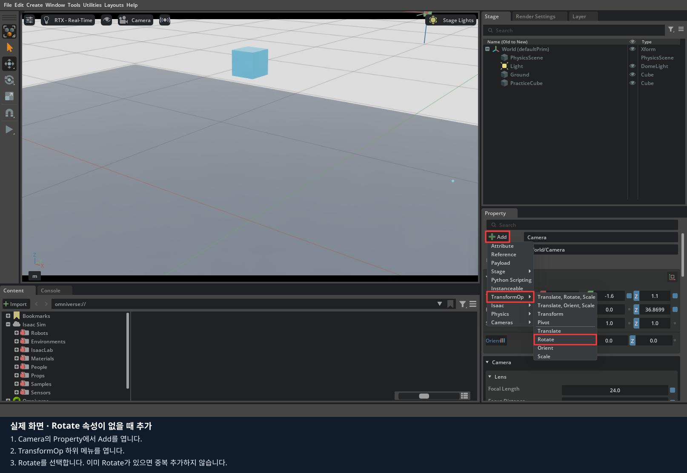
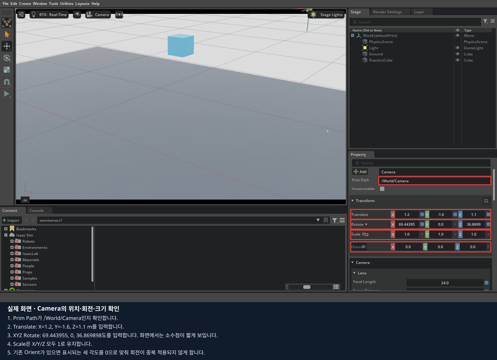

# 3장 · 마우스로 카메라 만들고 시점 바꾸기

카메라를 직접 추가하고 위치·회전·렌즈를 바꾸며 화면이 어떻게 달라지는지 관찰합니다.
**1~5절은 마우스 실습과 저장이고, 마지막 6절에서 같은 카메라의 코드와 LeKiwi 장착 카메라를 살펴봅니다.**
[기록지](worksheet.md)의 마우스 실습 부분부터 작성합니다.

## 1. 카메라가 볼 환경 만들기

마우스 실습용 빈 편집기를 사용 중이면 그대로 이어갑니다. 앞 장의 코드 예제가 열려 있으면 결과를 저장하고 종료합니다.
원격 수업은 `lesson stop`, 데스크탑은 Isaac Sim 창을 닫습니다. 이후 아래에서 본인 환경의 **한 가지 명령만** 실행합니다.
이 명령은 편집 화면만 열며, 실습 객체는 이후 메뉴로 직접 만듭니다.

원격 수업 — 브라우저 터미널:

```bash
lesson run --file /workspace/isaacsim_basic/01_object_physics/experiments/00_empty_stage.py
```

데스크탑 직접 실행 — 저장소 루트 터미널:

```bash
./lekiwi basic --script 01_object_physics/experiments/00_empty_stage.py
```

일반 Isaac Sim 설치에서는 앱을 직접 엽니다. 이전 실습이 실행 중이면 저장을 마치고 종료한 뒤 시작합니다.

`File > Open`으로 1장의 `base_scene.usda`를 열고 `File > Save As`로 `my_camera.usda`를 만듭니다.
아직 저장한 공통 바닥이 없다면 [1장](../01_object_physics/README.md) 1~2절을 먼저 마칩니다.
World 아래에 `Create > Shape > Cube`로 `PracticeCube`를 만들고 Size=0.1, Translate=`(0,0,0.7)`, Rotate=0, Scale=1을 설정합니다.
이 장의 관찰용 큐브에는 Rigid Body를 추가하지 않습니다. 카메라를 비교하는 동안 같은 위치에 머물도록 합니다.
제작 중에는 Stop 상태를 유지합니다.

## 2. Camera 생성과 위치 입력

1. World를 선택하고 상단 `Create > Camera`를 누릅니다.
2. 이름은 `Camera`, Prim Path는 `/World/Camera`인지 확인합니다.
3. Property > Transform에서 Translate=`(1.2,-1.6,1.1)` m, Scale=`(1,1,1)`을 입력합니다.
4. 기존 회전 항목을 먼저 확인합니다. `Orient`가 있으면 표시되는 세 각도를 `(0,0,0)`으로 초기화합니다. 같은 회전이 두 번 적용되지 않게 합니다.
5. **XYZ 순서의 Rotate**에 `(69.443955,0,36.869898)` 도를 입력합니다. Rotate 항목이 없다면 `Add > TransformOp > Rotate`로 추가하고 Rotate 옆 메뉴에서 XYZ 순서를 확인합니다. 이미 있으면 중복 추가하지 않습니다. Scale은 `(1,1,1)`로 유지합니다.




회전은 카메라가 `(0,0,0.35)`를 향하도록 계산한 값입니다. GUI의 회전 순서는 Transform의 Rotate 옆 메뉴에서 확인합니다.
XYZ 이외의 순서에는 위 숫자를 그대로 사용하지 않습니다. 기본 생성 Camera의 Orient 값이 남아 있으면 먼저 0으로 복원합니다.
카메라 위치가 맞아도 방향이 다르면 큐브가 화면 밖으로 나갑니다.



위 사진의 Translate·Rotate·Scale·Orient와 본인의 값을 비교합니다.

## 3. 렌즈 값을 넣고 카메라 시점 선택하기

1. Stage에서 **Camera 타입**의 객체를 선택합니다. 부모 Xform을 선택하면 렌즈 항목이 나오지 않습니다.
2. Property의 Camera 항목에 아래 값을 입력합니다.
3. Viewport 위쪽 `Perspective` 카메라 선택 메뉴에서 `/World/Camera`를 선택합니다.
4. 큐브와 바닥이 보이는지 확인합니다. 마우스로 시점을 움직이면 Camera 자세까지 바뀔 수 있으므로 비교 중에는 고정합니다.

| Camera 속성 | 값 |
|---|---|
| Projection | `perspective` |
| Focal Length | `24` |
| Horizontal Aperture | `20.955` |
| Vertical Aperture | `15.2908` |
| Clipping Range | near=`0.01`, far=`100` |


위 사진은 로봇 전방 카메라의 속성 위치를 보여 줍니다. **이번 독립 카메라에는 사진 속 수치 대신 위 표를 입력**합니다.


이 사진은 완성된 기준 장면입니다. 직접 만든 카메라에서도 같은 방향의 큐브·바닥을 볼 수 있는지 비교합니다.
Viewport의 가로세로 비율이 다르면 최종 표시 범위에도 차이가 생기므로 비교할 때 창 크기를 유지합니다.

## 4. 화각·위치·부모를 한 가지씩 바꾸기

1. 위치와 방향은 유지하고 Focal Length만 `24 → 48`로 바꿉니다. 물체가 크게 보이고 보이는 범위가 좁아지는지 기록한 뒤 24로 복원합니다.
2. 카메라 메뉴를 Perspective로 돌려놓고 Camera의 Translate X만 `1.2 → 1.5`로 바꿉니다. 다시 Camera 시점에서 비교합니다.
3. X만 바꾸면 카메라의 방향은 그대로이고 위치만 이동합니다. 큐브가 화면에서 어느 쪽으로 옮겨 보이는지 적습니다.
4. 위치를 복원하고 `File > Save As`로 `my_camera.usda`를 저장합니다.

`File > Save As`로 `my_camera_mount.usda`를 만들어 부모 좌표계 실험을 이어갑니다.
World 아래에 `Create > Xform`으로 `CameraMount`를 만들고 위치·회전 0, Scale 1로 둡니다.
Stage에서 Camera를 CameraMount 아래로 끌어 옮깁니다. Perspective 시점으로 돌아온 뒤 CameraMount의
Translate X를 `0 → 0.3`, Rotate Z를 `0 → 15`로 하나씩 바꾸고 Camera 시점에서 비교합니다.
각 실험 뒤 값을 0으로 복원합니다. 자식 카메라도 함께 움직이는지 확인합니다.
실제 로봇에서는 이 부모가 base_link나 wrist_link 역할을 합니다.

## 5. 저장하고 카메라의 역할 정리하기

Focal Length=24, 카메라 위치·회전은 2절 값, CameraMount의 위치·회전은 0으로 복원합니다.
`File > Save`로 부모 실험 장면을 저장합니다. 원래 독립 카메라 장면인 `my_camera.usda`도 보관합니다.

[기록지](worksheet.md)에 렌즈 24/48 비교 화면과 부모 객체를 움직인 결과를 적습니다.
화각은 보이는 각도, 해상도는 픽셀 개수, Clipping은 표시하는 거리 범위입니다.
카메라 위치 이동과 렌즈 값 변경이 화면에 주는 차이를 설명한 뒤 코드 실습으로 넘어갑니다.
카메라를 만들고 장면을 저장하는 것만으로 시간별 영상 파일이 수집되지는 않습니다. 영상 수집은 6장에서 진행합니다.

## 6. 마지막: 같은 작업을 코드로 구현하기

지금까지 마우스로 만들고 관찰한 내용을 코드로 연결합니다. 먼저 직접 만든 USD를 저장합니다.
원격 수업은 브라우저 터미널에서 `lesson stop`, 데스크탑은 Isaac Sim 창을 닫아 현재 실행을 종료합니다.

각 예제의 `build_scene()`은 새 장면에 객체를 만듭니다. 화면에서 저장한 USD가 Python 소스를 자동으로 바꾸지는 않습니다.

| 화면 작업 | 코드 |
|---|---|
| Create Camera | `UsdGeom.Camera.Define(stage, "/World/Camera")` |
| Translate·Rotate로 자세 지정 | `SetLookAt(eye, target, up).GetInverse()`와 `AddTransformOp()` |
| Focal Length 24/48 | `CreateFocalLengthAttr(24)` / `CreateFocalLengthAttr(48)` |
| Horizontal Aperture | `CreateHorizontalApertureAttr(20.955)` |
| Clipping Range | `CreateClippingRangeAttr(Gf.Vec2f(.01, 100))` |
| Stage에서 부모 아래로 이동 | 부모 경로 아래에 Camera 생성, 부모 기준 변환 지정 |

GUI의 Translate·Rotate와 코드의 4×4 변환 행렬은 표현 방식이 다릅니다. 같은 자세를 나타내는지 영상과 좌표로 비교합니다.
USD Camera의 정면은 -Z, 위는 +Y입니다. 로봇의 optical frame과 연결하는 규칙은 아래 LeKiwi 좌표 실습에서 이어집니다.
카메라를 생성한 것만으로 RGB 데이터셋이 저장되지는 않습니다. 매 프레임 영상 수집과 저장은 6장의 코드에서 다룹니다.


앞의 GUI 실험에서는 Camera의 X만 바꾸고 회전은 유지했습니다. 아래 코드의 `SetLookAt`에서 eye만 바꾸면
같은 target을 바라보도록 회전도 재계산됩니다. 위치만 바꾸는 실험과 같은 조건으로 혼동하지 않습니다.

### 코드 실행과 수정 순서

설치는 0장에서 마쳤다고 가정합니다. 아래 명령 중 본인 환경의 한 가지만 사용합니다.

원격 수업 — 브라우저 터미널:

```bash
lesson run 3
```

데스크탑 직접 실행 — 저장소 루트 터미널:

```bash
./lekiwi basic --chapter 3
```

1. 실행하면 Stop 상태로 열립니다. 화면의 Play로 관찰하고 Stop으로 돌아옵니다. 이 절에 연결된 Python 파일을 열고, 앞에서 클릭했던 속성에 해당하는 줄을 찾습니다.
2. 기본 실행 결과를 직접 만든 환경의 결과와 비교합니다.
3. 실행을 종료한 뒤 지정된 기본 줄에 `#`를 붙이고 비교할 줄의 `#`를 지웁니다. 들여쓰기는 유지합니다.
4. 파일을 저장하고 같은 명령으로 다시 실행합니다. 화면에서 값을 바꾸는 실험과 구분해 기록합니다.

원격 수업은 코드 수정 후 `lesson stop` → `lesson run 3`로 재실행합니다.
학생 파일은 호스트에서 저장하면 다음 실행에 반영되며, 코드만 수정할 때 Docker 이미지 재빌드는 필요 없습니다.
아래 `./lekiwi ...` 예시는 데스크탑 터미널용입니다. 원격 수업에서는 위 `lesson` 명령을 사용합니다.

### 6.1. 카메라 생성

[01_camera.py](experiments/01_camera.py)

```python
camera = UsdGeom.Camera.Define(stage, "/World/Camera")
camera.CreateFocalLengthAttr(24)
# camera.CreateFocalLengthAttr(48)
camera.CreateHorizontalApertureAttr(20.955)
camera.CreateClippingRangeAttr(Gf.Vec2f(.01, 100))
```

기본 Viewport는 Perspective입니다. Viewport 위쪽 카메라 선택 메뉴에서 `/World/Camera`를 선택합니다.
Stage에서 Camera를 선택해 Property의 Camera·Transform 항목을 코드와 비교합니다.


### 6.2. 같은 자리에서 화각 바꾸기

24 줄을 주석 처리하고 48 줄을 해제합니다. 창을 닫고 같은 명령으로 재실행한 뒤 Camera를 다시 선택합니다.
카메라 위치는 유지되지만 화면에 보이는 범위는 좁아지고 객체는 크게 보입니다.
`FocalLength`와 `HorizontalAperture`의 비율이 화각을 결정합니다. 둘은 USD에서 같은 렌즈 단위를 사용합니다.
**해상도는 픽셀 개수**, 화각은 보이는 각도, Clipping은 표시하는 거리 범위입니다. 서로 구분합니다.

### 6.3. 위치와 방향

```python
pose = Gf.Matrix4d().SetLookAt(eye, target, up).GetInverse()
camera.AddTransformOp().Set(pose)
```

파일의 eye는 카메라 위치, target은 바라볼 점, up은 월드의 위쪽입니다.
`SetLookAt`의 역행렬을 카메라의 월드 자세로 씁니다. eye의 X만 바꾸고 같은 target을 바라보게 하면 시선도 함께 회전합니다.
USD 카메라는 **-Z가 렌즈 정면, +Y가 위**입니다. ROS optical의 +Z 정면, +Y 아래와 다릅니다.
렌즈 중심을 맞춰도 축 방향이 잘못되면 전혀 다른 곳을 봅니다.

### 6.4. LeKiwi로 확장

기존 창을 닫고 다음을 실행합니다. USB 리더는 필요 없습니다.

```bash
./lekiwi scene
```

좌측 Perspective, 우측 Front Camera가 기본입니다. 좌측 Viewport를 클릭하고 **C**로 전체 → front → wrist를 전환합니다.
**T**는 추적 시점, **P**는 Viewport 이미지 저장, **F8**은 로봇 초기화와 라인 안 큐브 재배치입니다.
이 단축키들은 프로젝트 코드이며 Isaac Sim 기본 기능은 아닙니다. 카메라 선택 메뉴로 같은 시점에 접근할 수도 있습니다.

### 6.5. 렌즈 좌표축과 부모 링크

| 기준 | 오른쪽/위/정면 규약 | 주의점 |
|---|---|---|
| optical frame | +X 오른쪽, +Y 아래, +Z 촬영 정면 | 설정 JSON이 사용하는 규약 |
| USD Camera | +X 오른쪽, +Y 위, -Z 촬영 정면 | 자식 Camera에 X축 180° 변환 적용 |
| 로봇 base_link | +X 전방, +Y 왼쪽, +Z 위 | 카메라의 정면축과 구분 |

**렌즈 중심은 optical frame의 원점**입니다. 외형 상자의 가운데를 원점으로 맞추면 렌즈가 어긋날 수 있습니다.
JSON에는 optical 기준 quaternion을 넣습니다. 자식 Camera의 X축 180° 변환을 다시 곱해 넣지 않습니다.

| 카메라 | 물리 부모 | 부모 기준 렌즈 중심 (m) |
|---|---|---|
| front | base_link | (0.106898279335, 0.001703025019, -0.006396) |
| wrist | wrist_link | (-0.058779995352, -0.113835885897, 0.018277254719) |

손목 카메라는 현재 **wrist_roll 이전 링크**에 달려 있습니다.
실제 카메라가 집게 회전과 함께 돌아가는 구조라면 `gripper_link`를 부모로 지정하고 변환을 다시 구해야 합니다.
이 편은 기본 자세에서 영상을 확인합니다. 여러 팔 자세에서의 실제 영상 가림 검사는
4편에서 사용자가 리더 조작을 준비한 뒤 이어서 수행합니다.

### 6.6. 도면의 soarm base 기준 TF를 반영하기

TF는 여기서 **두 좌표계 사이의 위치와 회전 관계**를 뜻합니다. ROS 설치 자체가 필수인 것은 아닙니다.
이번 기본값의 입력 치수와 도면 재현 자세는 다음과 같습니다.

| 카메라 | SOARM base 기준 렌즈 중심 (mm) | 촬영 정면 해석 |
|---|---|---|
| front | (86.91, 0, -59.28) | +X 전방 |
| wrist | (205.40, 0, 208.58) | 전방 아래 45° |

재현 자세(deg): `shoulder_pan=0, shoulder_lift=-90, elbow_flex=90, wrist_flex=0, wrist_roll=-90, gripper=0`.
이 자세는 도면을 보고 맞춘 관절각이며 실물 관절각 측정값은 아닙니다. 기본 실행 자세와도 다릅니다.
손목의 SOARM base 기준 값은 **이 자세에서만** 위 표와 일치하고, 다른 자세에서는 팔을 따라 변합니다.
`mounts.json`의 `measurement`에는 입력 치수·재현 자세·가정을 남겼습니다.
Y·정면·실제 고정 링크·측정 자세를 더 정확히 확인하면 같은 환산식으로 갱신합니다.

실측 때 아래 정보를 함께 남깁니다.

- 기준: `soarm_base_link`, 카메라의 렌즈 중심과 촬영 정면.
- translation 길이 단위: m 또는 mm를 명시.
- quaternion 순서: 이 프로젝트는 **x, y, z, w**.
- 좌표축 규약: optical인지 다른 규약인지 명시.
- 손목 카메라를 측정한 **동일 시점의 6개 관절각**과 단위.
- 카메라가 실제로 고정된 링크.

S=soarm base, L=부착 링크, C=optical frame이라 할 때:

```text
T_L_C = inverse(T_S_L(q)) × T_S_C
```

`T_A_B`는 B 좌표를 A 좌표로 바꾸는 변환입니다. q는 측정 당시 팔 자세입니다.
손목 카메라의 측정값을 soarm base에 그대로 고정하면 팔을 움직여도 카메라가 따라가지 않습니다.
측정 자세에서 **부착 링크 기준으로 환산**해야 합니다.

front의 예로, 현재 URDF의 `base_link → soarm_base_link`는
(0.019988279335, 0.001703025019, 0.052884) m이고 회전은 0입니다.
같은 축 방향으로 표현한 점이라면 base 기준 위치는 이 이동값과 soarm base 기준 위치를 더해 구합니다.
손목에는 관절 회전이 포함되므로 같은 단순 덧셈을 적용하면 안 됩니다.

#### 설정 파일의 작업 복사본 만들기

저장소 최상위에서 실행합니다. 기존 파일을 덮어쓰지 않는 명령입니다.

```bash
mkdir -p data/cameras
cp -n isaac_sim/assets/cameras/mounts.json data/cameras/mounts.json
```

호스트 `data/cameras/mounts.json`을 편집합니다.
이 파일은 컨테이너에서 `/data/cameras/mounts.json`으로 보입니다.
측정하지 않은 상태에서는 `calibrated: false`를 유지합니다.

```bash
LEKIWI_CAMERA_CONFIG=/data/cameras/mounts.json LEKIWI_COURSE_LAYOUT=random ./lekiwi sim
```

기존 Isaac Sim을 종료한 뒤 실행해야 합니다. JSON의 quaternion 길이는 1이어야 하며,
허용 범위와 숫자 형식이 잘못되면 로더가 오류를 냅니다. 이것만으로 실측 보정 정확성이 보장되지는 않습니다.
이번 과정에서 TF 실측값을 임의로 만들거나 원본 장착값을 보정 완료로 표시하지 않습니다.


### 6.7. 완료 기준

[기록지](worksheet.md)에 24/48 렌즈의 화면 차이, front/wrist의 부모 링크, 기준 프레임과 렌즈 정면을 적습니다.
보정 값을 수정할 때 mm → m 변환과 회전 단위를 확인합니다. 렌즈가 링크 안에 들어가면 화면이 로봇 몸체에 가려질 수 있습니다.
3편은 영상·좌표를 이해하는 실습이며 두 카메라 동기 기록은 6편에서 진행합니다.

[공식 자료](SOURCES.md) · [다음: 4편](../04_teleoperation/README.md)
