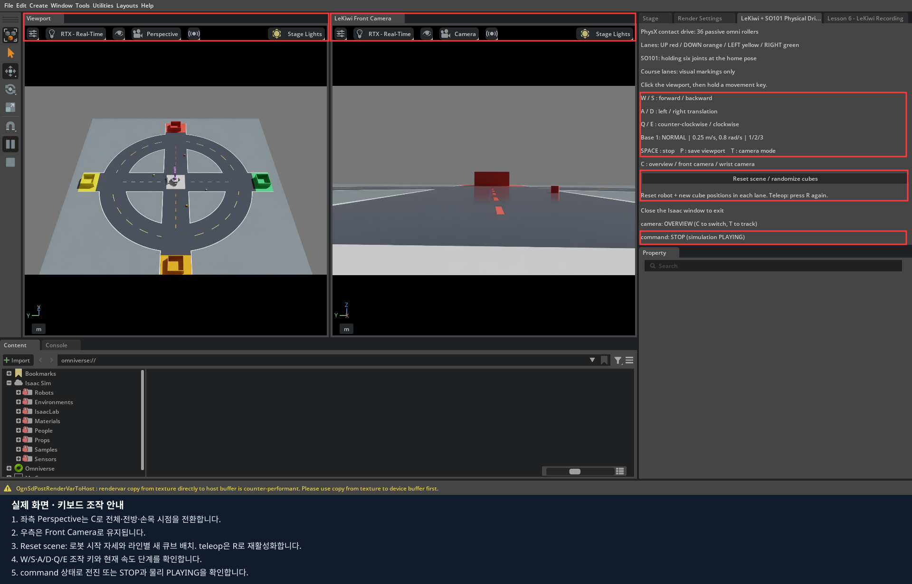
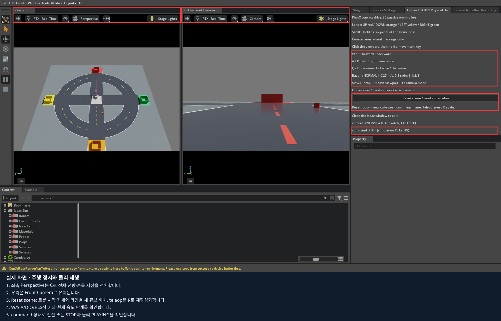
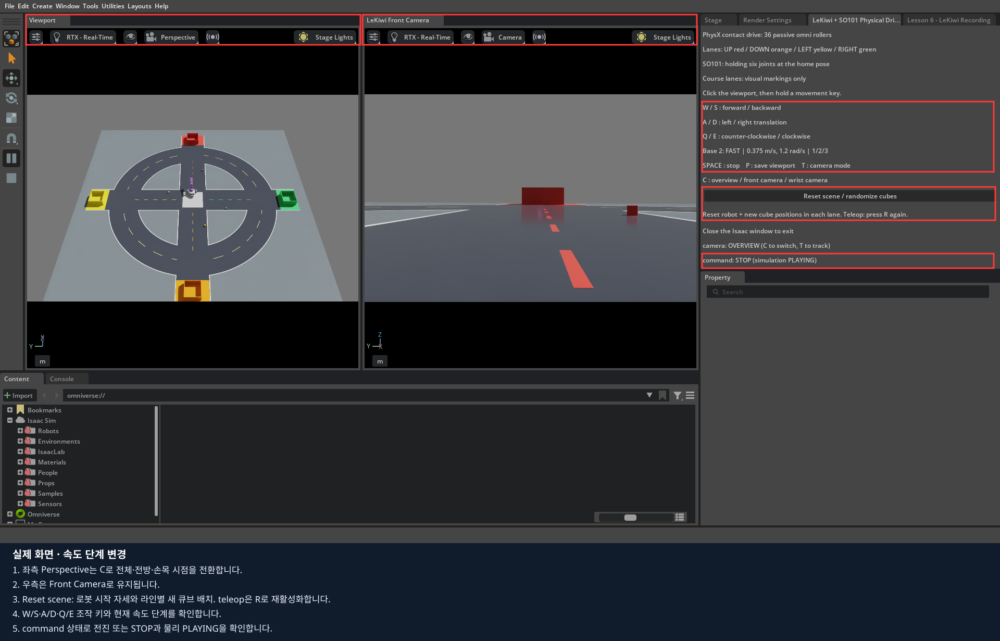

# 4편 · 키보드 주행과 SO101 리더암 조작

**목표:** 가상 베이스를 조작하고, 실제 리더의 자세를 가상 팔에 대응시키는 순서와 정지·재활성화 조건을 이해합니다.
Isaac Sim 5.1.0 / LeRobot 0.6.1 / Docker 기준입니다.
키보드 실습 30~45분, 리더 준비·방향 확인·집기 실습 60~90분을 예상합니다.

앞부분은 **실물 장비 없이** 가능합니다. 리더 실습은 수강생과 강사가 장비를 준비한 뒤 한 단계씩 진행합니다.
이 교재 제작에서는 실제 리더의 연결·보정을 새로 수행하지 않았습니다.

이 편의 LeKiwi 카메라는 3편과 같은 도면 기반 TF를 사용합니다. 새 이미지의 `sim`·`scene`·`teleop`에 함께 적용되며, 손목 카메라는 팔의 링크를 따라 움직입니다.
[1~6편의 카메라 적용 범위](../README.md#1~6편의-카메라-설정-적용-범위)를 참고하세요.

## 1. 실행 모드를 먼저 구분하기

| 명령 | 베이스 | 팔 | 실제 리더 |
|---|---|---|---|
| `./lekiwi basic --lesson joints` | 고정 교육 모형 | GUI에서 한 관절 Drive 수정 | 없음 |
| `./lekiwi sim` | 키보드로 주행 | 6개 관절 기본 자세 유지 | 없음 |
| `./lekiwi teleop --port … --id …` | R 활성화 뒤 키보드로 주행 | 리더의 절대 자세 추종 | 필요 |
| `./lekiwi test-arm` | 자동 검사 | 가상 입력으로 추종 검사 | 없음 |

**팔이 안 움직이면 실행 명령부터 확인합니다.** `sim`에서 R을 누르는 것만으로 리더에 연결되지는 않습니다.
실제 SO101 리더는 입력 장치이고, 여기서 움직이는 follower와 베이스는 Isaac Sim 안에 있습니다.
이 저장소의 명령을 실제 LeKiwi 본체 제어 명령으로 해석하지 마세요.

## 2. 실물 없이 키보드 실습 시작하기

기본 화면은 **좌측 Perspective / 우측 Front Camera** 반반 배치입니다.
`C`·`T`는 좌측 화면만 전환하고, 우측 전방 카메라는 유지합니다.
Stage 옆 조작 탭의 **Reset scene / randomize cubes**를 누르면 앱을 다시 켤 필요 없이
가상 로봇은 시작 자세, 큐브는 각 색상 라인 안의 새 위치·방향으로 배치됩니다. 바구니와 도로는 유지됩니다.
실제 리더암을 움직이는 기능은 아닙니다. teleop은 비활성화되므로 **R**을 다시 눌러 시작합니다.
녹화를 켰다면 미저장 에피소드를 먼저 저장·폐기하고 완료를 기다립니다.

[전체 설치 안내](../README.md)를 마친 뒤 저장소 최상위에서 실행합니다.
이전 Isaac Sim 창을 닫고 종료가 끝난 뒤 새 장면을 엽니다.

```bash
export LEKIWI_DOCKER_SUDO=1  # Docker에 sudo가 필요한 PC에서만
export ACCEPT_EULA=Y       # NVIDIA 라이선스를 읽고 동의한 경우
./lekiwi setup sim
LEKIWI_COURSE_LAYOUT=random ./lekiwi sim
```

로봇이 바닥에 안정화되고 조작 패널이 나타날 때까지 기다립니다. 시작 시 물리 계산이 자동 실행됩니다.
패널에 `holding six joints at the home pose`가 보이면 팔 기본 자세 유지 모드입니다.
`LeKiwi + SO101 Physical Drive` 창은 오른쪽 **Stage 옆 탭**에 자동 배치됩니다.
`sim`과 `teleop`에서 같은 위치를 사용합니다. 객체 트리는 **Stage**, 조작 안내는 실습 탭을 눌러 확인합니다.



### 한 방향씩 움직이기

1. 검색·속성 입력을 Enter로 끝내고 **Viewport를 클릭**합니다.
2. **1**을 눌러 기본 속도를 선택합니다.
3. **W를 짧게 누른 뒤 놓고**, 로봇이 전진한 결과를 확인합니다.
4. 다른 이동키도 모두 놓고 **Space**로 정지 명령을 확인합니다.
5. 다음 동작은 이전 동작의 결과를 확인한 뒤 시행합니다. S, A, D, Q, E 순서로 한 종류씩 비교합니다.

| 키 | 로봇 기준 동작 |
|---|---|
| W / S | +X 전진 / -X 후진 |
| A / D | +Y 왼쪽 / -Y 오른쪽 평행이동 |
| Q / E | 위에서 보아 반시계 / 시계 회전 |
| Space | 베이스 정지 명령, teleop에서는 팔 목표 유지·비활성화 |
| T | 전체 자유 시점 / 로봇 추적 시점 |
| C | 좌측 전체 / front / wrist 시점 |
| P | 현재 Viewport PNG 저장 |

방향은 **화면 기준이 아니라 로봇 base_link 기준**입니다. 로봇을 회전시키면 W가 화면의 위쪽과 달라질 수 있습니다.
바퀴가 바닥을 밀어 움직이므로 정지 명령 직후에도 물리적 정착 시간이 있을 수 있습니다.




`sim` 모드에서 Space는 누르는 동안 주행 명령을 0으로 만듭니다.
다른 이동키를 계속 누른 채 Space만 떼면 이동이 다시 시작될 수 있으므로 **이동키도 함께 놓습니다.**
`teleop` 모드는 Space 후 비활성화되며 R로 다시 활성화해야 합니다.
이 앱에서는 **Space가 주행 정지에만 반응하도록** 기본 타임라인 단축키와 분리했습니다.
Space를 눌러도 시뮬레이션은 계속 재생됩니다. 직접 일시정지하려면 왼쪽 Pause 버튼을 누릅니다.
패널의 `simulation PLAYING/PAUSED` 표시와 왼쪽 아이콘으로 실제 재생 상태를 확인합니다.
둘 다 물리 전원 차단 장치와 같은 의미는 아닙니다.

### 속도 단계

| 키 | 표시 | 평행이동 명령 | 회전 명령 |
|---|---|---:|---:|
| 1 | NORMAL | 0.25 m/s | 0.8 rad/s |
| 2 | FAST | 0.375 m/s | 1.2 rad/s |
| 3 | HIGH | 0.5 m/s | 1.6 rad/s |



위 값은 기본 설정의 **명령값**입니다. 실제 속도는 접촉·미끄럼·시간 진행에 따라 달라질 수 있습니다.
팔 추종 속도는 베이스 속도 단계와 별도로 설정됩니다. 처음 접근과 집기 연습은 1단계로 합니다.

## 3. SO101 리더 실습 준비

실물 리더를 사용하는 경우에만 이어갑니다. 키보드 연습을 마친 Isaac Sim 창을 닫고 종료를 확인합니다.
LeRobot 이미지도 필요합니다.

```bash
./lekiwi setup all
```

강사와 함께 리더의 고정 상태, 케이블 여유, 주변 사람과 장애물, 전원 차단 방법을 확인합니다.
연결 과정은 리더의 **토크 해제와 모터 설정 기록**을 포함합니다. 팔이 떨어지지 않도록 지지한 상태에서
터미널의 연결 확인 단계에 응답합니다. 실제 리더를 움직이거나 토크를 켜는 명령을 자동 전송하지 않습니다.

USB를 연결한 뒤 장치 이름을 읽기 전용으로 확인합니다.

```bash
ls -l /dev/serial/by-id/
```

여러 장치가 있으면 강사와 연결 대상을 식별합니다. 아래 예의 `usb-본인_SO101_장치`는
반드시 본인의 실제 경로로 바꿉니다. 같은 리더는 같은 `--id`를 계속 사용합니다.

```bash
./lekiwi teleop \
  --port /dev/serial/by-id/usb-본인_SO101_장치 \
  --id so101_leader \
  --scene random
```

## 4. 연결·보정을 한 단계씩 진행하기

화면의 안내를 읽고 해당 준비가 끝났을 때만 Enter를 누릅니다. 안내를 스크립트로 자동 응답하지 않습니다.

| 상황 | 선택 | 확인할 점 |
|---|---|---|
| 보정 파일 없음 | 새 보정 절차 진행 | 연결 안전 → 중간 자세 → 관절 범위 측정 순서 |
| 같은 리더의 유효한 보정 있음 | 재사용 질문에서 Enter | 다른 리더의 파일이 아닌지 |
| 다시 보정 필요 | 재사용 질문에서 c + Enter | 기존 파일은 백업됨 |
| 준비되지 않음 | Ctrl+C로 취소 | 다음 연결 전에 장비 상태 확인 |

기존 보정 질문은 실행할 때마다 나타납니다. 재사용을 선택해도 모터에 적용하고 읽어 확인하는 단계가 있습니다.
보정 파일이 존재한다는 이유만으로 장비 상태를 정상이라고 판단하지 않습니다.
관절 범위 측정 때 기계적 한계를 넘어 힘으로 밀지 않습니다.

준비 완료 메시지는 다음 형식입니다. **아래는 프로그램 출력 형식 예시이며 이번 제작에서 새로 촬영한 실물 로그가 아닙니다.**

```text
SO101 calibration=READY torque=OFF file=...
```

기본 파일 위치는 호스트 `data/calibration/so101_leader/so101_leader.json`입니다.
이 파일과 실제 장치 식별 정보는 교육자료 원본이나 Git에 넣지 않습니다.

## 5. 가상 팔 추종 활성화

리더 준비 완료와 Isaac Sim 화면을 모두 확인한 뒤 진행합니다.

1. 초기 가상 팔 자세와 리더 자세를 비교합니다. 활성화하면 가상 팔이 리더의 **절대 자세**로 접근합니다.
2. 실제 리더를 손으로 조작할 공간과 케이블 여유를 다시 확인합니다.
3. Viewport를 클릭하고 **R**을 누릅니다.
4. 패널의 **ACTIVE** 표시를 확인합니다. 통합 teleop에서는 이 전까지 베이스도 움직이지 않습니다.
5. 리더 관절 하나만 조금 움직이고 화면에서 해당 관절의 방향을 확인합니다.
6. 방향이 예상과 다르면 Space로 비활성화하고 원인을 확인합니다. 곧바로 R을 반복하지 않습니다.

| 관절 순서 | 확인할 이름 | 입력 의미 |
|---:|---|---|
| 1 | shoulder_pan | 리더 절대각 degree |
| 2 | shoulder_lift | 리더 절대각 degree |
| 3 | elbow_flex | 리더 절대각 degree |
| 4 | wrist_flex | 리더 절대각 degree |
| 5 | wrist_roll | 리더 절대각 degree, 기본 모델 보정 -90° |
| 6 | gripper | 리더 열림 범위 0~100 → 모델 0~1.5 rad |

팔 5개 관절의 목표는 `방향 × 리더 각도 + 모델 영점 보정` 후 rad로 변환됩니다.
R을 누른 순간의 리더 각도를 빼는 상대각 방식이 아닙니다.
모터 보정과 시뮬레이터 모델 영점 맞추기는 서로 다른 작업입니다.

방향·영점 설정은 저장소 `.env.example`의 `LEKIWI_ARM_SIGNS`, `LEKIWI_ARM_OFFSETS_DEG`를 참고합니다.
순서를 기록한 뒤 **필요한 관절 하나만** 수정하고 다음 실행에서 검증합니다.
관절 범위 밖 목표는 제한되므로 리더의 모든 자세를 완전히 복제할 수는 없습니다.

## 6. STOP·LIMIT와 지연을 읽기

| 표시 또는 상황 | 의미 | 다음 행동 |
|---|---|---|
| ACTIVE | 입력이 유효하고 추종 활성 | 한 관절씩 방향·응답 확인 |
| LIMIT | 목표가 모델 관절 한계에서 제한됨 | 리더 자세와 해당 관절 한계 확인 |
| STOP / 비활성 | Space, 오래된 입력, 연결 문제 등 | 터미널·시뮬레이터 상태를 함께 확인 |
| 입력 회복 후에도 안 움직임 | 자동 재개하지 않는 설계 | 원인 해결·현재 자세 확인 후 R |
| 목표는 바뀌는데 실제 팔이 안 따라감 | 물리/제어 단계 문제 가능 | Play 상태, 실제 관절값, 검사 로그 확인 |

입력 유효 기간은 250 ms이고, 기본 목표 변화 속도 한도는 3 rad/s입니다.
이것은 실제 팔의 충돌 안전을 보장하는 기능이 아니라 시뮬레이터 목표 입력을 제한하는 기능입니다.
화면 갱신이 느리다는 이유만으로 USB 단절이라고 단정하지 마세요.
오래된 표본·연결 끊김·잘못된 입력은 비활성화되며 R 재활성화가 필요합니다.

세션 파일은 `data/teleop/session.*/`에 있습니다.
현재 실행 터미널에서 출력한 세션 경로를 사용하고 다른 실행의 로그와 섞지 않습니다.

| 파일 | 용도 |
|---|---|
| sim.log | 시뮬레이터 시작·오류·상태 변경 |
| sim.json | armed/status, 목표 targets/goals, 실제 actual, 단위 rad |
| leader.json | 가장 최근 리더 표본 한 개 |

`leader.json`은 최신 값으로 교체되는 통신 파일입니다. 에피소드 기록이나 데이터셋이 아닙니다.
이전 표본이 모두 남는다고 가정하여 학습 데이터를 만들면 안 됩니다.

## 7. 코스에서 접근·집기·운반 연습

활성화·방향 확인을 마친 뒤 강사와 한 작업씩 진행합니다.

1. 속도 1에서 큐브 근처까지 베이스로 접근하고 이동키를 놓습니다.
2. 팔을 움직이기 전에 베이스가 안정됐는지 확인합니다.
3. 전체 시점과 front를 번갈아 보며 큐브와 집게의 상대 위치를 확인합니다.
4. 리더로 집게를 벌리고 접근한 뒤 닫습니다. 바닥·바구니와 충돌하는지 관찰합니다.
5. 큐브가 실제로 집혔는지 살짝 들어 확인한 다음 운반합니다. 자동 부착 기능은 없습니다.
6. 바구니 위에서 내려놓고 결과를 캡처합니다. 성공 판정은 교육생이 관찰해 기록합니다.

손가락 두 곳은 안쪽의 빈 공간을 보존하는 **Convex Decomposition** 충돌 형상을 사용합니다.
큐브가 빠지면 양쪽 손가락 사이에 충분히 들어왔는지 확인하고, 베이스를 멈춘 상태에서 천천히 들어 올립니다.
`./lekiwi test-gripper`는 실물 USB 없이 가상 팔의 큐브 유지·회전·놓기를 검사합니다.
손목 영상은 집게 사이를 보여 주지만 팔 자세에 따라 가림이 달라집니다. 3편의 시야 확인과 함께 전체·전방 화면도 비교합니다.
Space를 눌렀다면 팔 목표가 유지되고 추종이 해제되므로, 다음 팔 조작 전에 원인을 확인하고 R로 재활성화합니다.
도로 선은 시각 안내이고 물리 벽이 아닙니다.

## 8. 기록·종료·재실행

P는 `data/captures/lekiwi_viewport.png`를 덮어씁니다. 다음 캡처 전에 결과를 별도 이름으로 복사합니다.
이번 편은 조작과 화면 기록까지입니다. [6편](../06_lekiwi_dataset/README.md)에서는 `teleop --record`로
영상·상태·명령 수집과 LeRobot 변환을 이어갑니다. 학습·정책 실행은 별도 범위입니다.

이동키를 모두 놓고 Space로 정지한 뒤 Isaac Sim 창을 닫거나 실행 터미널에서 Ctrl+C를 누릅니다.
이번 실행의 컨테이너가 종료될 때까지 기다립니다. 광범위한 kill 명령이나 다른 터미널 종료를 사용하지 않습니다.

```bash
./lekiwi status
```

실물 리더 사용 시 종료 로그의 `Torque_Enable` 확인 결과도 읽습니다.
프로세스가 종료됐다는 사실만으로 토크가 꺼졌다고 추측하지 않습니다.
확인이 실패하면 강사와 장비 상태를 직접 확인한 뒤 다음 작업으로 넘어갑니다.

## 9. 최종 과제와 자동 검사

[기록지](worksheet.md)에 다음을 남깁니다.

- 키보드 모드: 전진·평행이동·회전·정지 결과, 속도 표시, 카메라 전환.
- 리더를 준비한 경우: 관절별 방향, 영점 차이, LIMIT 여부, Space/R 재활성화 결과.
- 접근·집기·운반 관찰과 캡처. 장비가 없으면 실물 부분은 미실시로 기록합니다.

Isaac Sim 창을 닫은 상태에서 아래 검사를 순서대로 실행할 수 있습니다.

```bash
./lekiwi test-arm      # 실제 PhysX + 가상 리더 입력, USB 미사용
./lekiwi test-physics  # 바퀴 접촉 기반 전진·평행이동·회전 검사
```

자동 검사 통과는 실물 리더 방향·영점 일치를 대신하지 않습니다.
[출처와 실제 검증 범위](SOURCES.md) · [전체 과정](../README.md)
