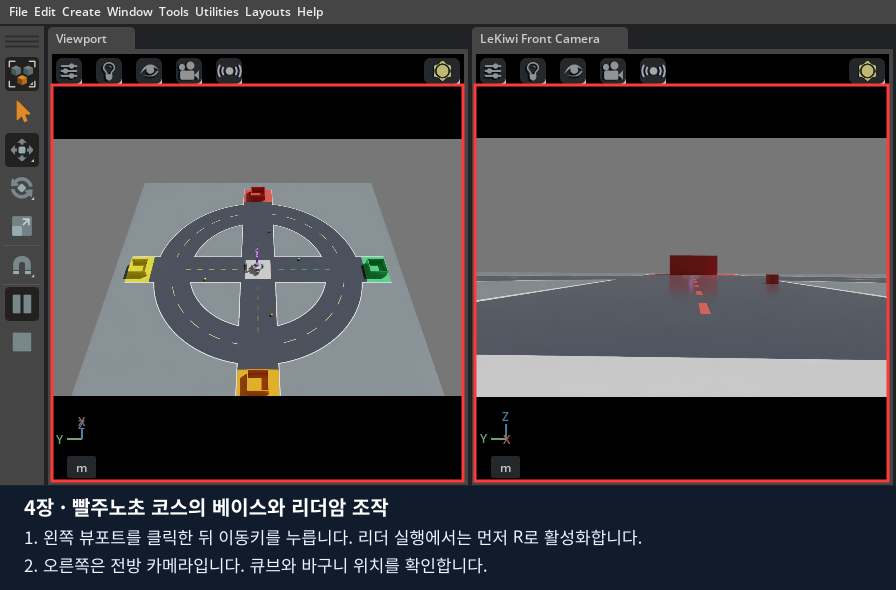

# 4장 · 빨주노초 맵에서 LeKiwi 텔레옵하기

**완성된 빨강·주황·노랑·초록 코스에서 키보드로 베이스를 운전하고, USB에 연결한 SO101 리더암으로 화면 속 팔과 집게를 조작합니다.**
1~3장에서 익힌 물리·관절·카메라를 이 로봇에서 관찰합니다. 이 장의 목표는 **직접 운전해 큐브를 같은 색 바구니에 넣는 것**입니다.
다음 [5장](../05_data_recording/README.md)에서 같은 동작을 데이터로 저장하고, [6장](../06_lekiwi_dataset/README.md)에서 변환·ACT 학습으로 이어갑니다.

모든 명령·키보드·리더 USB는 **지금 사용하는 Ubuntu 노트북 한 대**에서 진행합니다.
실제 follower 로봇은 연결하지 않습니다. 화면 속 LeKiwi만 움직입니다.

## 1. 이전 실습을 종료하고 터미널 준비하기

1. 3장 결과를 저장하고 Isaac Sim 창을 닫습니다.
2. VS Code에서 `Terminal → New Terminal`을 누릅니다.
3. 저장소 최상위 폴더인지 확인합니다. `lekiwi` 파일이 보여야 합니다.

```bash
pwd
ls lekiwi
./lekiwi status
```

`status`에 머리글만 나오면 실행 중인 컨테이너가 없는 상태입니다. 이전 실습이 남아 있으면 그 실행 터미널과 창에서 정상 종료합니다.
새 터미널에서는 0장에서 사용한 설정을 다시 적용합니다.

```bash
export ACCEPT_EULA=Y
export LEKIWI_DISPLAY_MODE=local
```

0장에서 Docker에 sudo가 필요했던 노트북은 같은 터미널에서 `export LEKIWI_DOCKER_SUDO=1`도 적용합니다.
`./lekiwi` 전체를 sudo로 실행하지 않습니다.

## 2. 완성된 빨주노초 맵 열기

처음에는 리더를 연결하지 않고 베이스 조작부터 확인합니다.

```bash
./lekiwi scene
```

첫 로딩이 끝나고 터미널에 **`LEKIWI_DRIVE result=READY`**, 화면에 로봇과 코스가 나타날 때까지 기다립니다.
실행 중인 터미널을 닫거나 같은 명령을 또 실행하지 않습니다.
이 명령은 준비된 코스를 만들고 물리 시뮬레이션을 시작합니다. File → Open으로 관절 모형을 불러오는 단계가 아닙니다.



빨간 박스는 조작할 왼쪽 화면과 관찰할 오른쪽 화면입니다. 사진은 같은 코스의 기존 실제 실행 화면을 재사용했습니다.
큐브 위치·회전은 실행마다 달라질 수 있습니다.

| 화면에서 찾을 것 | 의미 |
|---|---|
| 원형 도로와 십자 도로 | 베이스를 운전할 코스 |
| 중앙의 LeKiwi | 바퀴 달린 베이스와 로봇팔 |
| 빨강·주황·노랑·초록 큐브 네 개 | 집어 옮길 대상 |
| 같은 네 색의 바구니 | 큐브를 놓을 목적지 |
| 왼쪽 Perspective | 로봇과 코스를 전체적으로 보는 뷰포트 |
| 오른쪽 LeKiwi Front Camera | 로봇에 달린 전방 카메라 화면 |

처음 전체 시점에서는 위쪽이 빨강, 아래쪽이 주황, 왼쪽이 노랑, 오른쪽이 초록입니다. 카메라를 돌리면 화면 방향도 바뀌므로 색상으로 구분합니다.
회색 받침과 막대 하나만 보이면 관절 보충 예제를 연 상태입니다. 그 창을 닫고 위 `./lekiwi scene`으로 시작합니다.

## 3. 키보드로 베이스 운전하기

### 3.1. 키 입력을 받을 화면 선택하기

1. **왼쪽의 로봇과 도로가 보이는 큰 화면 안쪽을 한 번 클릭**합니다. VS Code 터미널이나 오른쪽 Property 입력칸을 클릭한 상태가 아니어야 합니다.
2. 키보드 입력을 영문 상태로 바꿉니다.
3. 숫자 **1**을 눌러 기본 속도를 선택합니다.
4. **W를 잠깐 누른 뒤 놓습니다.** 로봇이 앞으로 움직였다가 멈추는지 확인합니다.
5. **Space**를 눌러 정지합니다. 이어서 다른 방향도 하나씩 확인합니다.

| 키 | 동작 |
|---|---|
| W / S | 로봇 기준 전진 / 후진 |
| A / D | 로봇 기준 왼쪽 / 오른쪽 평행 이동 |
| Q / E | 반시계 / 시계 방향 회전 |
| 1 / 2 / 3 | 기본 속도 / 1.5배 / 2배 |
| Space | 베이스 정지, 리더 추종 비활성화 |
| C | 왼쪽 화면의 전체·전방·손목 시점 전환 |
| T | 왼쪽 자유 시점·로봇 추적 시점 전환 |
| P | 현재 화면 캡처 저장 |
| F8 | 로봇 시작 자세 복원, 각 색 라인 안에서 큐브 재배치 |

기본 속도는 직진 `0.25 m/s`, 회전 `0.8 rad/s`입니다. 처음에는 1로 연습합니다.
W는 항상 화면 위쪽이라는 뜻이 아니라 **로봇이 바라보는 앞쪽**입니다. Q/E로 방향을 바꾼 뒤 W의 이동 방향을 비교해 보세요.
Space는 시뮬레이션 Pause가 아닙니다. 물리는 계속 계산하며 조작 명령을 정지합니다.

### 3.2. 바구니까지 접근하고 돌아오기

1. 빨간 라인의 큐브를 찾습니다.
2. Q/E로 방향을 맞추고 W/S·A/D로 큐브 앞까지 접근합니다.
3. Space로 멈춥니다. 이 실행에서는 팔이 기본 자세를 유지하므로 아직 집을 수 없습니다.
4. C를 눌러 전방·손목 시점을 보고 다시 전체 시점으로 돌아옵니다. 오른쪽 전방 화면은 유지됩니다.
5. F8로 시작 위치와 새 큐브 배치를 확인합니다. 노트북에 따라 F8 대신 **Fn+F8**이 필요할 수 있습니다.

**확인:** 전후·좌우·회전·정지를 각각 할 수 있고, 화면에서 목표 큐브를 찾을 수 있습니다.
리더 실습으로 넘어가기 전에 Isaac Sim 창을 닫고 `./lekiwi status`로 종료를 확인합니다.

## 4. 같은 노트북에 SO101 리더암 연결하기

### 4.1. 리더를 연결하기 전 확인

강사와 리더의 고정 상태, 주변 공간, 케이블 여유, 즉시 전원 차단할 방법을 확인합니다.
**연결·보정 과정에서 모터 힘을 풀기 때문에 팔이 떨어지지 않게 지지한 뒤** 터미널의 안전 질문에 응답합니다.
이 프로그램은 리더에 자동 위치 이동이나 토크 활성화 명령을 보내지 않으며, 리더의 각도를 읽어 가상 팔에 전달합니다.
보정 때는 모터 설정 기록이 있으므로 안내를 자동 응답으로 건너뛰지 않습니다.

### 4.2. USB 장치 경로 확인

같은 노트북에 리더의 전원과 데이터 USB를 연결하고 실행합니다.

```bash
ls -l /dev/serial/by-id/
```

목록에서 **본인 SO101 리더**에 해당하는 이름을 찾습니다. 여러 장치가 보이면 강사와 연결 대상을 확인합니다.
아래 `usb-본인_SO101_장치` 전체를 목록에 나온 이름으로 바꿉니다. `-> ../../ttyACM0` 같은 화살표 뒤 설명은 복사하지 않습니다.
`--id so101_leader`는 보정 파일을 구분하는 이름이며, 같은 리더는 다음 실행에서도 같은 ID를 사용합니다.

```bash
./lekiwi teleop \
  --port /dev/serial/by-id/usb-본인_SO101_장치 \
  --id so101_leader \
  --scene random
```

각 줄 끝의 `\`는 명령이 다음 줄에도 이어진다는 뜻입니다. 마지막 줄에는 붙이지 않습니다.
0장의 설치를 마쳤다면 별도 이미지 빌드부터 다시 할 필요는 없습니다.

### 4.3. 터미널의 연결·보정 질문에 응답

| 질문 또는 상황 | 할 일 |
|---|---|
| 안전 준비 확인 | 팔을 지지하고 전원을 바로 끌 수 있게 준비한 뒤 Enter |
| 보정 파일 없음 | 안내에 따라 중간 자세 → 관절 범위 측정 진행 |
| 기존 보정 사용 질문 | 같은 리더의 보정이면 Enter |
| 새로 보정할 필요가 있음 | `c` 입력 후 Enter. 안내에 따라 다시 측정 |
| 준비되지 않았거나 장치가 불확실함 | Ctrl+C로 취소하고 강사와 확인 |

관절 범위 측정은 손으로 천천히 진행하며 기계적 한계 밖으로 억지로 밀지 않습니다.
터미널의 안내가 끝나기 전에는 다른 실행 명령을 입력하지 않습니다.

```text
SO101 calibration=READY torque=OFF file=...
```

위와 같은 준비 완료 문구와 Isaac Sim 창을 확인합니다. 위 줄은 출력 형식 예시입니다.
보정 파일은 `data/calibration/so101_leader/so101_leader.json`에 보관됩니다. 다른 사람의 파일을 복사해 쓰지 않습니다.

## 5. 리더암과 베이스를 함께 조작하기

1. 화면에 빨주노초 맵이 나타나면 가상 팔과 실제 리더의 현재 자세를 비교합니다.
2. **왼쪽 뷰포트를 클릭하고 R**을 누릅니다. 가상 팔이 리더의 절대 자세로 접근합니다.
3. 실행 터미널에서 **ACTIVE**를 확인합니다. 기록 기능을 켜지 않은 이 단계에서는 REC 표시가 없어도 정상입니다.
4. 리더 관절 하나를 조금 움직여 화면의 해당 관절이 따라오는지 확인합니다.
5. 집게를 천천히 열고 닫아 가상 집게도 같은 방향으로 동작하는지 확인합니다.
6. 이동키를 하나씩 눌러 베이스도 움직이는지 봅니다. 통합 teleop에서는 **R 활성화 전에는 베이스도 움직이지 않습니다.**

Space를 누르면 베이스와 추종이 멈춥니다. 자세·방향을 확인한 뒤 다시 R로 활성화합니다.
R은 영점을 새로 잡는 키가 아닙니다. 누르는 순간의 실제 리더 자세가 가상 팔 목표에 반영됩니다.

### 빨간 큐브를 빨간 바구니로 옮기기

1. 속도 1에서 빨간 큐브 가까이 접근합니다.
2. 이동키를 놓아 베이스를 멈춥니다. Space로 정지했다면 팔 조작 전에 R을 다시 누릅니다.
3. 리더로 팔을 뻗고 집게를 열어 큐브 양옆을 맞춥니다.
4. 집게를 닫고 조금 들어 올립니다. 큐브가 실제로 들렸는지 화면에서 확인합니다.
5. 베이스를 천천히 움직여 빨간 바구니 앞에 접근합니다.
6. 바구니 위로 팔을 옮기고 집게를 열어 놓습니다. 자동 부착이나 자동 집기 기능은 없습니다.
7. Space로 정지합니다. 다시 연습하려면 F8로 초기화한 뒤 R을 누릅니다.

이 장에서는 조작을 익힙니다. **데이터를 저장하는 F5/F6/F7/F9 절차는 5장**에서 진행합니다.

<a id="teleop-recovery"></a>

## 6. 늦어지거나 멈췄을 때 대처하기

먼저 이동키를 놓고 리더를 멈춘 뒤 Space로 가상 로봇을 정지합니다. 화면과 실행 터미널의 마지막 상태를 읽습니다.

| 상황 | 확인·복구 순서 |
|---|---|
| 키보드가 안 먹음 | 왼쪽 뷰포트 클릭 → 영문 입력 확인 → 이동키를 놓았다가 다시 누름 |
| Space 또는 F8 이후 팔·베이스가 안 움직임 | 현재 자세와 입력을 확인하고 R로 다시 활성화 |
| STOP / ARM Stopped | 입력이 돌아왔는지 확인 후 R. 멈춘 채로 R을 반복하지 않음 |
| LIMIT | 가상 관절 한계를 넘지 않는 자세로 리더를 천천히 되돌림 |
| USB 읽기 오류·리더 프로그램 종료 | 현재 실행 종료 확인 → 전원·데이터 케이블·장치 경로 확인 → 같은 teleop 명령 재실행 |
| 화면 전체가 느리거나 멈춤 | 중복 실행하지 않고 해당 세션의 `sim.log`·GPU 상태를 강사와 확인 |

리더 입력이 250 ms 이상 오래되면 추종을 해제합니다. 입력이 정상이어도 R로 직접 재개합니다.
USB 읽기 오류는 자동으로 반복 연결하지 않습니다. 리더 USB는 같은 노트북에 연결돼 있으므로 Tailscale 재접속 단계는 없습니다.
`sim.log` 위치는 실행 터미널에 나오며, 통합 teleop은 `data/teleop/session.*/sim.log`를 사용합니다.

## 7. 코드에서 속도 설정을 바꿔 보는 선택 실습

**기본 조작에는 파일 수정이 필요 없습니다.** 먼저 위 절차로 팔·베이스가 정상 동작하는지 확인합니다.
기본 속도를 더 낮추는 실습을 할 때만 아래를 진행합니다. 이 수정은 가상 베이스 속도에 적용됩니다.

1. Isaac Sim과 리더 실행을 정상 종료하고 `./lekiwi status`로 확인합니다.
2. VS Code에서 **Ctrl+P**를 누르고 `isaac_sim/keyboard_drive.py`를 입력해 엽니다.
3. **Ctrl+F**로 `LINEAR_SPEED =`를 검색합니다. 그 줄과 다음 줄은 아래와 같습니다.

```python
LINEAR_SPEED = float(os.environ.get("LEKIWI_LINEAR_SPEED", "0.25"))
ANGULAR_SPEED = float(os.environ.get("LEKIWI_ANGULAR_SPEED", "0.8"))
```

4. 숫자 문자열만 아래처럼 바꿉니다. 들여쓰기·따옴표·괄호는 유지합니다.

```python
LINEAR_SPEED = float(os.environ.get("LEKIWI_LINEAR_SPEED", "0.15"))
ANGULAR_SPEED = float(os.environ.get("LEKIWI_ANGULAR_SPEED", "0.5"))
```

5. **Ctrl+S**로 저장합니다. 이 파일은 공통 실행 코드로 이미지에 들어가므로 **sim 이미지를 다시 빌드**합니다.

```bash
./lekiwi setup sim
```

6. 키보드만 비교할 때는 `./lekiwi scene`, 리더와 비교할 때는 4.2절의 **같은 `./lekiwi teleop ...` 명령**으로 실행합니다.
7. 숫자 1을 눌러 기본 속도를 선택하고 이전과 이동 속도를 비교합니다. 실습 후 기본 `0.25`·`0.8`로 복원하려면 다시 저장·빌드합니다.

키보드 속도 배율은 [drive_controls.py](../../isaac_sim/drive_controls.py)의 `BaseSpeed`가 적용합니다.
리더 방향·모델 영점 변경은 일반 속도 실습에 포함하지 않습니다. 방향이 잘못되면 정지하고 [리더 설정 안내](../../docs/so101-teleop.md)를 강사와 확인합니다.

## 8. 마무리와 다음 장

**완료 기준:** 빨주노초 맵에서 베이스 전후·좌우·회전·정지, 리더의 팔·집게 추종, R 재개·F8 초기화를 직접 확인했습니다.
Isaac Sim 창을 닫고 리더 실행 터미널이 끝났는지 확인한 뒤 `./lekiwi status`를 실행합니다.
같은 노트북·같은 리더 경로·같은 보정 ID를 사용해 [5장 데이터 취득](../05_data_recording/README.md)으로 넘어갑니다.

[01_joint_input.py](experiments/01_joint_input.py)는 단일 관절 키보드 제어를 설명하는 **보충 예제**로 보관합니다.
`./lekiwi basic --chapter 4`는 그 보충 예제를 실행하며, 이 장의 빨주노초 맵 텔레옵 명령은 `./lekiwi teleop ...`입니다.

[출처와 검증 범위](SOURCES.md) · [전체 목차](../README.md)
