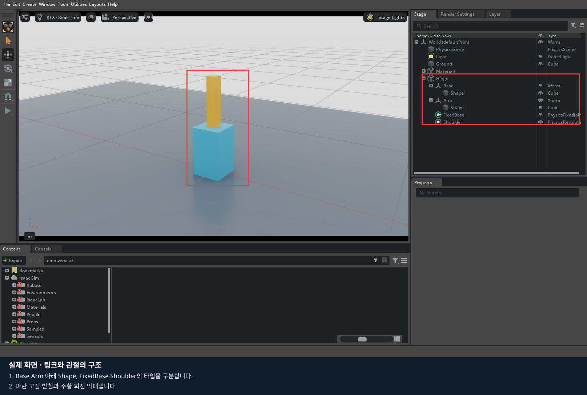
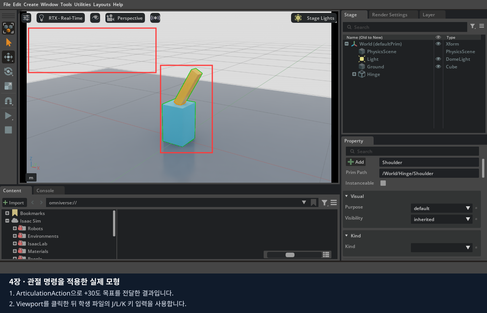
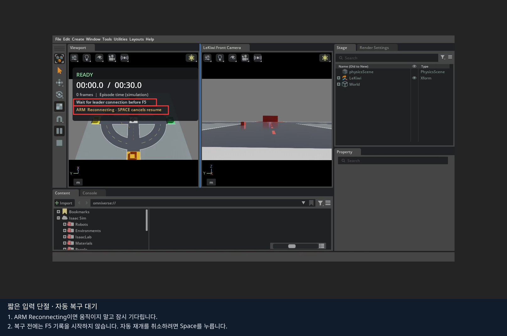
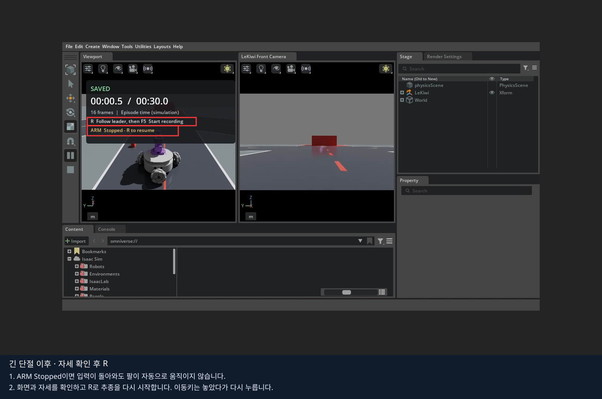
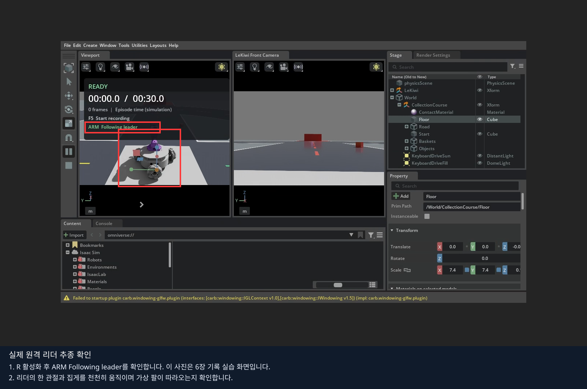

# 4장 · 관절을 직접 조작하고 입력 연결하기

2장에서 만든 팔의 목표를 마우스로 바꾸며 ‘입력한 값’과 ‘실제 움직임’을 구분합니다.
**1~3절은 화면에서 직접 조작·저장하고, 마지막 4절에서 같은 모형에 키보드 제어 코드를 연결합니다.**
LeKiwi 주행과 실물 리더 연결은 마지막 코드 실습의 확장 과정입니다.

## 1. 직접 만든 관절 모형 열기

마우스 실습용 빈 편집기를 사용 중이면 그대로 이어갑니다. 앞 장의 코드 예제가 열려 있으면 결과를 저장하고 종료합니다.
원격 수업은 `lesson stop`, 데스크탑은 Isaac Sim 창을 닫습니다. 이후 아래에서 본인 환경의 **한 가지 명령만** 실행합니다.
이 명령은 편집 화면만 열며, 실습 객체는 이후 메뉴로 직접 만듭니다.

원격 수업 — 브라우저 터미널:

```bash
lesson run --file /workspace/isaacsim_basic/01_object_physics/experiments/00_empty_stage.py
```

데스크탑 직접 실행 — 저장소 루트 터미널:

```bash
./lekiwi basic --script 01_object_physics/experiments/00_empty_stage.py
```

원격으로 새 실행을 시작했다면 `lesson status`가 READY가 될 때까지 기다린 뒤 WebRTC에서 같은 서버 주소로 다시 Connect합니다.
영상 창을 클릭한 상태에서 마우스와 키보드를 조작합니다. 이후 코드 예제를 재실행할 때도 같은 순서로 접속합니다.

일반 Isaac Sim 설치에서는 앱을 직접 엽니다. 이전 실습이 실행 중이면 저장을 마치고 종료한 뒤 시작합니다.

`File > Open`으로 2장에서 직접 만든 관절 파일을 엽니다.
Docker 수업의 경로 예시는 `/data/isaacsim_basic/my_joint.usda`입니다. 본인이 다른 이름으로 저장했다면 그 파일을 엽니다.
아직 모형이 없다면 [2장](../02_robot_joints/README.md) 1~5절에서 먼저 만듭니다.

Stage에서 `/World/Hinge`를 펼칩니다. `Base`, `Arm`, `FixedBase`, `Shoulder`가 있는지 확인합니다.
Base와 Arm 아래에는 각각 Shape가 있습니다. 관절 속성은 Shape가 아닌 Shoulder를 선택해서 바꿉니다.



사진은 2장의 완성 모형입니다. 같은 구조의 본인 파일을 열어 아래 실습을 진행합니다.

## 2. 목표 각도를 입력하고 Play로 확인하기

1. Stop 상태에서 Stage의 `/World/Hinge/Shoulder`를 클릭합니다.
2. Property의 `Physics > Drive > Angular`를 펼치고 Target Position을 찾습니다.
3. 숫자 칸을 Ctrl+클릭하고 `30`을 입력한 뒤 Enter로 확정합니다.
4. Play를 눌러 팔이 움직이는 방향과 멈춘 모습을 관찰합니다.
5. Stop을 누른 뒤 `-30`, `0`도 같은 방법으로 하나씩 확인합니다.


Target Position은 요청한 각도입니다. 실제 팔이 도달한 각도를 자동으로 보여 주는 측정 칸은 아닙니다.
이 단계에서는 J/L/K 키로 팔이 움직이지 않습니다. 기본 속성 창에서 목표를 입력하고 Play로 확인합니다.

| 직접 입력한 목표 (도) | 확인할 것 |
|---|---|
| 30 | 팔이 어느 쪽으로 움직이는가 |
| -30 | 앞 실험과 반대 방향으로 움직이는가 |
| 0 | 세워진 기준 자세로 돌아오는가 |

목표 숫자만 캡처하지 말고 실제 팔의 모습도 함께 남깁니다.

## 3. 저장하고 입력·목표·움직임 구분하기

Stop 후 Target Position=0, Target Velocity=0으로 복원합니다.
2장의 기본 Drive 값인 Stiffness=1000, Damping=50, Max Force=100을 확인합니다.
`File > Save As`로 `my_joint_control.usda`를 저장하고 [기록지](worksheet.md)의 마우스 실습 부분을 채웁니다.

화면에서 숫자를 입력한 것, Drive가 가진 목표, 물리 계산으로 팔이 움직인 결과는 서로 다른 단계입니다.
이제 같은 목표를 키 입력으로 전달하도록 코드를 연결합니다.

## 4. 마지막: 같은 작업을 코드로 구현하기

앞에서 저장한 본인 USD를 사용합니다. 기본 예제의 자동 장면 생성과 저장한 장면 열기를 모두 확인합니다.

### 코드 실행과 수정 순서

설치는 0장에서 마쳤다고 가정합니다. 아래 명령은 **다음 절의 USD 열기 설정을 마친 뒤** 본인 환경에 맞는 한 가지만 실행합니다.

원격 수업 — 브라우저 터미널:

```bash
lesson run 4
```

데스크탑 직접 실행 — 저장소 루트 터미널:

```bash
./lekiwi basic --chapter 4
```

1. 이 절에 연결된 Python 파일을 열고, 앞에서 클릭했던 속성에 해당하는 줄을 찾습니다.
2. 기본 실행 결과를 직접 만든 환경의 결과와 비교합니다.
3. 실행을 종료한 뒤 지정된 기본 줄에 `#`를 붙이고 비교할 줄의 `#`를 지웁니다. 들여쓰기는 유지합니다.
4. 파일을 저장하고 같은 명령으로 다시 실행합니다. 화면에서 값을 바꾸는 실험과 구분해 기록합니다.

원격 수업은 코드 수정 후 `lesson stop` → `lesson run 4`로 재실행합니다.
학생 파일은 호스트에서 저장하면 다음 실행에 반영되며, 코드만 수정할 때 Docker 이미지 재빌드는 필요 없습니다.
아래 `./lekiwi ...` 예시는 데스크탑 터미널용입니다. 원격 수업에서는 위 `lesson` 명령을 사용합니다.

### 4.1. 직접 만든 USD를 코드에서 열기

1. USD를 저장하고 빈 편집 화면을 종료합니다. 원격 수업에서는 `lesson stop`을 사용합니다.
2. [01_joint_input.py](experiments/01_joint_input.py)의 `main()`에서 `context.new_stage()`와 `build_scene(context.get_stage())`를 주석 처리합니다.
3. 바로 아래 준비된 `context.open_stage(...)` 두 줄을 활성화합니다. 파일 이름은 본인이 저장한 실제 경로로 바꿉니다.

```python
# context.new_stage()
# build_scene(context.get_stage())
if not context.open_stage("/data/isaacsim_basic/my_joint_control.usda"):
    raise RuntimeError("직접 만든 관절 USD를 열 수 없습니다. 저장 경로를 확인하세요.")
```

일반 설치에서는 `/data/...` 대신 본인의 절대 경로를 사용합니다.
모형의 `/World/PhysicsScene`, `/World/Hinge/FixedBase`, `/World/Hinge/Shoulder` 경로와 Articulation Root가 2장과 같아야 합니다.

파일을 저장하고 원격 수업은 `lesson run 4`, 데스크탑 직접 실행은 `./lekiwi basic --chapter 4`로 시작합니다.
Viewport를 클릭하고 J, L, K를 한 번씩 눌러 직접 만든 팔이 +30도, -30도, 0도를 향하는지 확인합니다.



이 사진은 학생 코드로 만든 기준 모형입니다. 본인이 만든 USD에서도 같은 입력·응답을 확인합니다.
제어 코드는 실행 중 목표를 계속 적용하므로 이때 Property에서 목표를 바꾸면 다음 코드 명령에 덮어써질 수 있습니다.
직접 속성을 편집하는 실험과 키보드 코드를 실행하는 실험을 나누어 진행합니다.


### 4.2. 키 입력을 관절 명령으로 바꾸기

[01_joint_input.py](experiments/01_joint_input.py)

이 예제는 가상 모형만 움직이며 자동으로 물리를 시작합니다. Viewport를 클릭한 뒤 **J:+30도 / L:-30도 / K:0도**를 누릅니다.


```python
if event.input == carb.input.KeyboardInput.J:
    target = np.deg2rad(30)
    # target = np.deg2rad(15)
robot.apply_action(ArticulationAction(joint_positions=np.array([target])))
```

J의 목표를 15도로 바꾸고 재실행합니다. 다음에는 `robot.apply_action(...)` 줄만 주석 처리합니다.
터미널에 키 입력 목표는 나오지만 새 목표가 모형에 전달되지 않는지 확인합니다. 실습 후 명령 줄을 복원합니다.

2장의 USD Drive Target Position은 degree, `ArticulationAction`의 joint_positions는 **rad**입니다.
키 입력 콜백은 목표만 바꾸고, 실제 명령은 시뮬레이션 반복문에서 적용합니다.
프레임마다 긴 파일 작업을 콜백에 넣으면 UI와 물리가 끊길 수 있습니다.


| 화면에서 한 일 | 코드에서 같은 역할 |
|---|---|
| 링크·관절 만들기 | `build_scene()` |
| File > Open으로 장면 열기 | `context.open_stage(...)` |
| Drive 목표 30도 입력 | `np.deg2rad(30)` → `ArticulationAction` |
| Play로 물리 진행 | `world.step(render=True)` |

기준 자동 생성 모형으로 복귀하려면 `open_stage` 두 줄을 다시 주석 처리하고 `new_stage`·`build_scene`을 복원합니다.
직접 만든 모형과 자동 생성 모형의 키 입력·응답을 같은 조건에서 비교합니다.

### 4.3. LeKiwi 키보드 주행

가상 관절 실습을 종료하고 본인 환경의 한 가지만 실행합니다.

원격 수업 — 브라우저 터미널:

```bash
lesson stop
lesson run 6
```

`lesson status`가 READY이면 WebRTC에서 다시 Connect합니다. 6장과 같은 LeKiwi 환경에서 키보드 주행을 연습합니다.
아직 리더는 연결하지 않으며 기록 시작 키 F5도 누르지 않습니다.

데스크탑 직접 실행 — 가상 관절 창을 닫은 뒤 저장소 루트 터미널:

```bash
./lekiwi scene
```

기본 화면은 좌측 Perspective / 우측 front입니다. 좌측 Viewport를 클릭하고 한 방향씩 조작합니다.

| 키 | 동작 |
|---|---|
| W / S | 전진 / 후진 |
| A / D | 왼쪽 / 오른쪽 평행 이동 |
| Q / E | 반시계 / 시계 회전 |
| 1 / 2 / 3 | 기본 속도 / 기본의 1.5배 / 기본의 2배 |
| SPACE | 베이스 정지, 활성화된 가상 팔 추종 중지 |
| R | 리더 연결 시 가상 팔 추종 활성화 요청 |
| F8 | 시작 자세로 초기화, 각 라인 안 큐브 위치·방향 재추첨 |
| C / T / P | 카메라 전환 / 추적 전환 / 화면 저장 |

상태와 명령은 실행한 터미널에 나옵니다. SPACE는 타임라인을 일시정지시키지 않습니다.
실제 일시정지는 표준 Pause를 사용합니다. F8 후 리더 추종은 R로 다시 활성화해야 합니다.
미저장 기록이 있으면 초기화가 차단됩니다. 6장의 저장/폐기를 끝내고 다시 시도합니다.

이 절부터의 `./lekiwi scene`·`./lekiwi teleop` 명령은 데스크탑 직접 실행 기준입니다.
원격 리더 연결은 [원격 수업 안내](../../docs/remote-classroom.md)의 서버·노트북 분리 절차를 사용합니다.

이 키들은 [keyboard_drive.py](../../isaac_sim/keyboard_drive.py)가 등록한 프로젝트 단축키입니다.
기본 Isaac Sim을 새로 설치했을 때는 학생 파일의 `subscribe_to_keyboard_events`와 `apply_action`으로 같은 원리를 구현합니다.

### 4.4. SO101 리더 실습 준비

실물 리더를 사용하는 경우에만 이어갑니다. 키보드 연습을 마친 Isaac Sim 창을 닫고 종료를 확인합니다.
원격 수업은 브라우저 터미널의 `lesson stop`으로 종료합니다.

**원격 수업:** [노트북 환경 준비](../../docs/remote-classroom.md#4-노트북에-리더암-환경-준비)에서
노트북의 저장소·Docker·CPU 리더 이미지를 준비하고, 이어지는 [실제 리더암 연결](../../docs/remote-classroom.md#5-실제-리더암-연결)을 따릅니다.
브라우저의 `lesson run 6 --teleop`과 노트북 로컬 터미널의 `./lekiwi remote leader`를 사용합니다.
USB는 노트북에 연결합니다. 노트북 명령의 `--ssh-user`에는 서버 Ubuntu 계정을 지정하며, SSH 인증 후 임시 연결 키를 자동으로 받습니다.
별도의 접속 문구를 설정하거나 입력하지 않습니다. 이 아래 데스크탑용 설치·실행 명령은 건너뛰고 4.5절의 보정 설명으로 이어갑니다.

**데스크탑 직접 실행:** 아래 절차를 사용합니다. LeRobot 이미지가 아직 없다면 한 번 준비합니다.

```bash
./lekiwi setup all
```

강사와 함께 리더의 고정 상태, 케이블 여유, 주변 사람과 장애물, 전원 차단 방법을 확인합니다.
연결 과정은 리더의 **토크 해제와 모터 설정 기록**을 포함합니다. 팔이 떨어지지 않도록 지지한 상태에서
터미널의 연결 확인 단계에 응답합니다. 실제 리더를 움직이거나 토크를 켜는 명령을 자동 전송하지 않습니다.

USB를 연결한 뒤 장치 이름을 읽기 전용으로 확인합니다.

```bash
ls -l /dev/serial/by-id/
```

여러 장치가 있으면 강사와 연결 대상을 식별합니다. 아래 예의 `usb-본인_SO101_장치`는
반드시 본인의 실제 경로로 바꿉니다. 같은 리더는 같은 `--id`를 계속 사용합니다.

```bash
./lekiwi teleop \
  --port /dev/serial/by-id/usb-본인_SO101_장치 \
  --id so101_leader \
  --scene random
```

### 4.5. 연결·보정을 한 단계씩 진행하기

화면의 안내를 읽고 해당 준비가 끝났을 때만 Enter를 누릅니다. 안내를 스크립트로 자동 응답하지 않습니다.

| 상황 | 선택 | 확인할 점 |
|---|---|---|
| 보정 파일 없음 | 새 보정 절차 진행 | 연결 안전 → 중간 자세 → 관절 범위 측정 순서 |
| 같은 리더의 유효한 보정 있음 | 재사용 질문에서 Enter | 다른 리더의 파일이 아닌지 |
| 다시 보정 필요 | 재사용 질문에서 c + Enter | 기존 파일은 백업됨 |
| 준비되지 않음 | Ctrl+C로 취소 | 다음 연결 전에 장비 상태 확인 |

기존 보정 질문은 실행할 때마다 나타납니다. 재사용을 선택해도 모터에 적용하고 읽어 확인하는 단계가 있습니다.
보정 파일이 존재한다는 이유만으로 장비 상태를 정상이라고 판단하지 않습니다.
관절 범위 측정 때 기계적 한계를 넘어 힘으로 밀지 않습니다.

준비 완료 메시지는 다음 형식입니다. **아래는 프로그램 출력 형식 예시이며 이번 제작에서 새로 촬영한 실물 로그가 아닙니다.**

```text
SO101 calibration=READY torque=OFF file=...
```

기본 파일 위치는 호스트 `data/calibration/so101_leader/so101_leader.json`입니다.
이 파일과 실제 장치 식별 정보는 교육자료 원본이나 Git에 넣지 않습니다.

### 4.6. 가상 팔 추종 활성화

리더 준비 완료와 Isaac Sim 화면을 모두 확인한 뒤 진행합니다.

1. 초기 가상 팔 자세와 리더 자세를 비교합니다. 활성화하면 가상 팔이 리더의 **절대 자세**로 접근합니다.
2. 실제 리더를 손으로 조작할 공간과 케이블 여유를 다시 확인합니다.
3. Viewport를 클릭하고 **R**을 누릅니다.
4. 터미널의 **ACTIVE** 표시를 확인합니다. 통합 teleop에서는 이 전까지 베이스도 움직이지 않습니다.
5. 리더 관절 하나만 조금 움직이고 화면에서 해당 관절의 방향을 확인합니다.
6. 방향이 예상과 다르면 Space로 비활성화하고 원인을 확인합니다. 곧바로 R을 반복하지 않습니다.

| 관절 순서 | 확인할 이름 | 입력 의미 |
|---:|---|---|
| 1 | shoulder_pan | 리더 절대각 degree |
| 2 | shoulder_lift | 리더 절대각 degree |
| 3 | elbow_flex | 리더 절대각 degree |
| 4 | wrist_flex | 리더 절대각 degree |
| 5 | wrist_roll | 리더 절대각 degree, 기본 모델 보정 -90° |
| 6 | gripper | 리더 열림 범위 0~100 → 모델 0~1.5 rad |

팔 5개 관절의 목표는 `방향 × 리더 각도 + 모델 영점 보정` 후 rad로 변환됩니다.
R을 누른 순간의 리더 각도를 빼는 상대각 방식이 아닙니다.
모터 보정과 시뮬레이터 모델 영점 맞추기는 서로 다른 작업입니다.

방향·영점 설정은 저장소 `.env.example`의 `LEKIWI_ARM_SIGNS`, `LEKIWI_ARM_OFFSETS_DEG`를 참고합니다.
순서를 기록한 뒤 **필요한 관절 하나만** 수정하고 다음 실행에서 검증합니다.
관절 범위 밖 목표는 제한되므로 리더의 모든 자세를 완전히 복제할 수는 없습니다.

### 4.7. 실습 중 늦어지거나 끊기면

먼저 이동키를 모두 놓고 리더암을 움직이지 않은 상태에서 화면을 확인합니다.
**0장에서 연결한 Tailscale은 그대로 두고**, 아래 상황에 맞춰 조작을 복구합니다.

| 표시 또는 상황 | 의미 | 다음 행동 |
|---|---|---|
| ACTIVE | 입력이 유효하고 추종 활성 | 한 관절씩 방향·응답 확인 |
| LIMIT | 목표가 모델 관절 한계에서 제한됨 | 리더 자세와 해당 관절 한계 확인 |
| RECONNECTING / ARM Reconnecting | 짧은 원격 입력 끊김으로 정지하고 새 입력을 기다림 | 잠시 기다립니다. 같은 송신기의 새 입력이 안정되면 팔 추종이 자동 재개됩니다. 취소하려면 Space |
| STOP / ARM Stopped | 긴 끊김, Space, 새 연결, 잘못된 입력 등으로 추종 해제 | 연결과 현재 자세를 확인한 뒤 영상의 Viewport를 클릭하고 R |
| 팔은 돌아왔지만 베이스가 멈춰 있음 | 끊기기 전 이동키를 해제한 상태 | 키를 모두 놓았다가 W/S·A/D·Q/E를 다시 누릅니다 |
| 영상 전체가 멈추거나 연결 화면으로 돌아감 | 영상 연결도 확인해야 함 | 아래의 영상 재접속 절차 진행 |
| 목표는 바뀌는데 실제 팔이 안 따라감 | 물리/제어 단계 문제 가능 | Play 상태, 실제 관절값, 검사 로그 확인 |

원격 실습에서는 마지막 유효 입력부터 **0.5초를 넘으면 베이스를 정지하고 팔 목표를 유지**합니다.
그 입력부터 **2초 안에 같은 연결의 새 입력 3개**가 확인되면 팔 추종이 자동 재개됩니다.
예전 동작을 몰아서 실행하지 않으며, 베이스는 이동키를 새로 눌러야 움직입니다.
2초가 지났거나 Space·화면 연결 종료·장면 초기화·송신 프로그램 재시작이 발생한 경우에는 R이 필요합니다.
로컬 USB 실습은 기존 250 ms 정지 후 R 재시작 방식입니다. USB 읽기 오류는 자동 재시도하지 않습니다.
기본 팔 목표 변화 속도 한도는 3 rad/s이며, 이 기능은 가상 로봇 입력에 적용됩니다.





위 사진은 회사 Wi-Fi 노트북과 휴대폰 핫스팟 서버 사이의 실제 송출 화면입니다.
첫 사진은 시험 입력의 짧은 단절, 두 번째는 실제 SO101 입력 통신을 3.5초 차단했다 복구한 뒤의 상태입니다.
6장 기록 실습의 상태 표시를 함께 사용한 예시이며, 4장 일반 실행에서는 터미널 상태도 확인합니다.

**영상 재접속 순서**

1. 이동키를 놓고 리더를 멈춥니다. 양쪽 PC의 인터넷·Tailscale 연결을 확인합니다.
2. 브라우저 터미널에서 `lesson status`로 실습이 실행 중인지 확인합니다.
3. 노트북의 WebRTC 클라이언트를 닫았다가 다시 열고, 같은 서버 Tailscale 주소로 **Connect**합니다.
4. 영상이 갱신되면 Viewport를 클릭하고 자세를 확인한 뒤 **R**을 누릅니다. 베이스는 이동키를 다시 누릅니다.

영상만 끊겼다면 서버 실습과 리더 프로그램을 중복 실행하지 않습니다.
리더 터미널이 종료됐거나 USB 오류를 표시할 때만 원인을 확인하고 [리더 연결 절차](../../docs/remote-classroom.md#5-실제-리더암-연결)를 다시 진행합니다.
실습 서버 자체가 종료됐다면 `lesson logs`로 원인을 확인하고 강사에게 알립니다.
녹화 중 끊겼다면 [6장: 기록 중 연결이 끊기면](../06_lekiwi_dataset/README.md#기록-중-연결이-끊기면)도 확인합니다.



위 화면은 실제 원격 리더 추종을 확인한 예시입니다. `ARM Following leader` 표시는 6장의 기록 실습 화면에서도 확인할 수 있습니다.
4장의 일반 텔레옵은 실행 터미널의 `LEKIWI_DRIVE SO101` 뒤에 나오는 상태도 함께 확인합니다.

로컬 세션 파일은 `data/teleop/session.*/`, 원격 세션 파일은 서버의 `data/remote/session.*/`에 있습니다.
현재 실행 터미널에서 출력한 세션 경로를 사용하고 다른 실행의 로그와 섞지 않습니다.

| 파일 | 용도 |
|---|---|
| sim.log | 시뮬레이터 시작·오류·상태 변경 |
| sim.json | armed/status, 목표 targets/goals, 실제 actual, 단위 rad |
| leader.json | 가장 최근 리더 표본 한 개 |

`leader.json`은 최신 값으로 교체되는 통신 파일입니다. 에피소드 기록이나 데이터셋이 아닙니다.
이전 표본이 모두 남는다고 가정하여 학습 데이터를 만들면 안 됩니다.


### 4.8. 코스에서 집기·운반

큐브가 있는 라인에 천천히 접근하고 front와 wrist 시점을 번갈아 확인합니다.
집게 양면이 큐브 옆면에 닿은 뒤 닫고, 낮은 높이로 들어 유지 여부를 확인합니다.
시각적 겹침만으로 접촉·집기 성공을 판단하지 않습니다. Collider 형상·물리 마찰·닫힘 폭·팔 속도가 영향을 줍니다.

이번 단축키 개편이 실제 리더 하드웨어를 자동으로 켜거나 보정하지는 않습니다.
기존 세션을 닫고 종료를 기다린 뒤 재실행합니다. [기록지](worksheet.md)에 입력·명령·관측의 차이를 남깁니다.

[공식 자료](SOURCES.md) · [다음: 5편](../05_data_recording/README.md)
