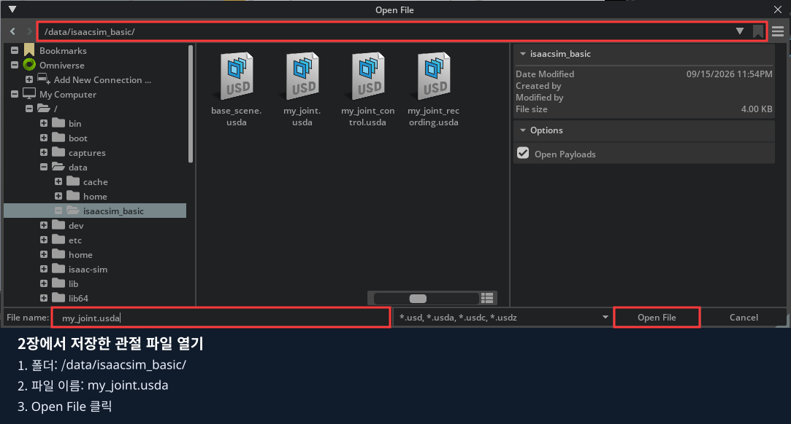
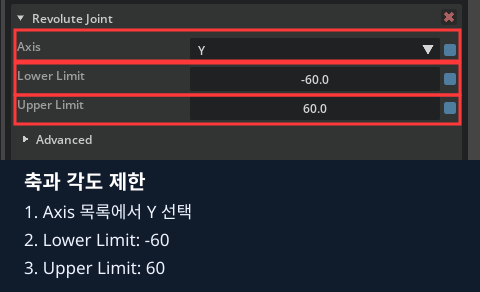
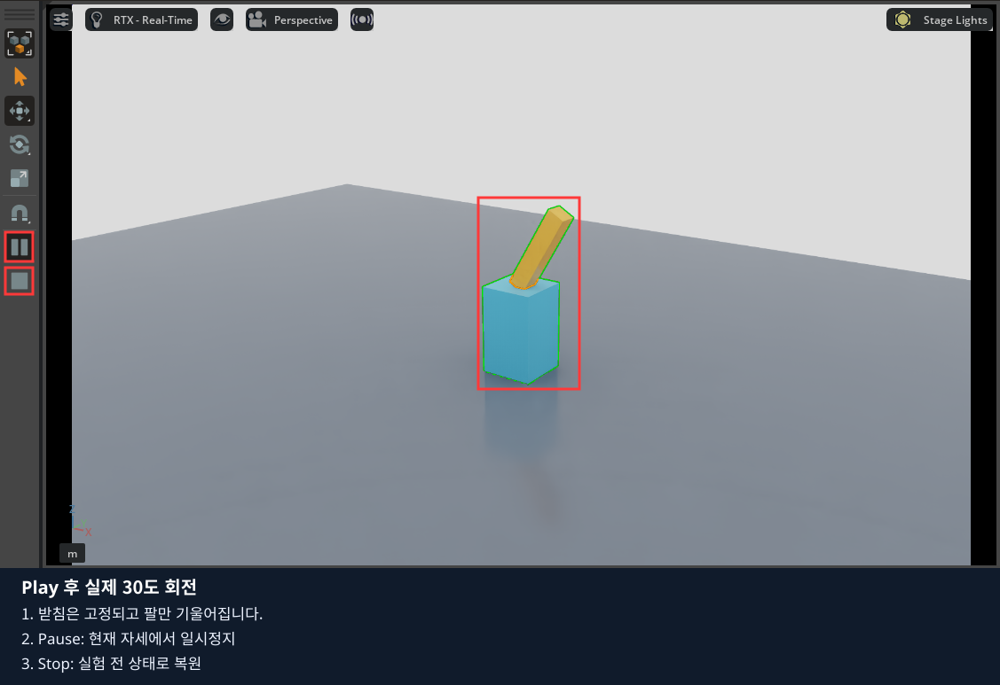
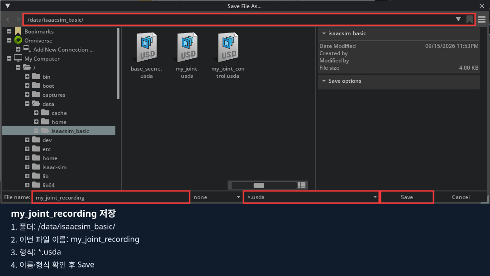

# 5장 · 장면 저장과 움직임 기록 구분하기

관절을 화면에서 움직여 본 뒤 장면을 저장하고, 마지막에 시간별 상태·명령을 기록하는 코드를 실행합니다.
**1~3절은 마우스로 관찰·저장, 마지막 4절은 JSON 기록·재생 실습입니다.**
이 장의 JSON은 데이터 구조를 배우는 예제입니다. LeRobot 학습용 RGB 데이터 수집은 6장에서 진행합니다.

## 1. 기록할 관절 모형 열기

### 1.1. 편집기와 기준 파일 열기

1. 앞 장의 키보드 제어 프로그램이 실행 중이면 종료합니다. 실행 중인 코드가 목표를 계속 바꾸면 마우스로 입력한 값이 덮어써질 수 있습니다.
2. 같은 노트북의 **저장소 최상위 폴더**에서 빈 편집기를 엽니다. 이미 빈 편집기를 사용 중이면 중복 실행하지 않습니다.

```bash
./lekiwi basic --script 01_object_physics/experiments/00_empty_stage.py
```

3. **File → Open**을 클릭합니다.


4. 파일 창의 주소에 **`/data/isaacsim_basic/`**를 입력하고 Enter를 누릅니다.
5. **File name=`my_joint.usda` → Open File** 순서로 선택합니다.



사진처럼 **2장에서 저장한 my_joint.usda**를 입력합니다.
다른 이름으로 저장했다면 실제 이름을 입력합니다. 파일이 없으면 [2장 1~5절](../02_robot_joints/README.md)을 먼저 마칩니다.

### 1.2. 모형과 관절 설정 확인

1. Stage의 **World → Hinge**를 펼칩니다.
2. Base·Arm·FixedBase·Shoulder와 Base·Arm 아래의 Shape를 확인합니다.


3. **Shoulder를 클릭**합니다. Property 경로가 `/World/Hinge/Shoulder`인지 봅니다.
4. Physics → Joint에서 **Body 0=Base, Body 1=Arm**, Revolute Joint에서 **Axis=Y, Lower=-60, Upper=60**을 확인합니다.



5. Drive → Angular에서 **Stiffness=1000, Damping=50, Max Force=100, Target Velocity=0**을 확인합니다.


설정은 Stop 상태에서 바꿉니다. 검색으로 속성을 찾았으면 다음 속성으로 넘어가기 전 검색어를 지웁니다.

## 2. 직접 조작하며 무엇을 기록할지 관찰하기

### 2.1. 목표는 같아도 상태는 달라지는지 보기

1. Shoulder를 선택한 채 Property 검색창에 **`target`**을 입력합니다.
2. **Target Position을 Ctrl+클릭 → `30` 입력 → Enter** 순서로 바꿉니다.


3. 왼쪽 **▶ Play**를 누릅니다. **누른 직후의 팔**과 **잠시 뒤 안정된 팔**을 비교합니다.
4. 목표 숫자는 계속 30이어도 팔의 실제 자세는 시간에 따라 바뀌는지 봅니다.



5. 왼쪽 **■ Stop**을 클릭합니다.
6. Target Position=`-30`으로 바꾸고 다시 Play하여 반대 방향 움직임을 확인한 뒤 Stop합니다.
7. 목표를 **`0`으로 복원**합니다.

Stop 후 선택 대상이 바뀌면 **Shoulder를 다시 선택하고 `target`을 검색**합니다.
속성 제목만 보이면 왼쪽 삼각형으로 Physics → Drive → Angular를 펼칩니다.

### 2.2. 장면·사진·시간별 데이터 구분

지금까지는 움직임을 눈으로 관찰했습니다. 별도의 기록 코드를 실행하지 않았으므로 시간별 명령과 상태 파일이 자동 생성되지는 않습니다.

| 남길 대상 | 담기는 내용 |
|---|---|
| USD 장면 | 물체·관절·속성으로 구성된 실험 환경 |
| 스크린샷 | 특정 순간 눈에 보인 화면 |
| 이번 장의 JSON 에피소드 | 시간 순서의 상태 → 명령 → 다음 상태 |

예를 들어 “목표 30도” 한 줄만으로는 팔이 언제 어디에 있었고 얼마나 빨리 움직였는지 알 수 없습니다.
다음 코드에서는 **시간, 현재 관절각, 보낸 목표, 다음 관절각**을 함께 기록합니다.

## 3. 장면을 저장하고 다시 열기

### 3.1. 기록용 장면을 별도 파일로 저장

1. Stop 상태인지 확인합니다.
2. Shoulder의 **Target Position=0, Target Velocity=0**으로 맞춥니다.
3. 상단 **File → Save As**를 클릭합니다.


4. 주소에 **`/data/isaacsim_basic/`**, File name에 **`my_joint_recording`**을 입력합니다.
5. 형식 목록에서 **`*.usda`**를 고르고 Save를 누릅니다.



6. 같은 이름이 이미 있으면 새 이름으로 저장합니다. 마지막 코드 절에도 실제 저장한 파일 이름을 입력해야 합니다.

### 3.2. 다시 열어 저장 결과 확인

1. **File → Open**으로 `/data/isaacsim_basic/my_joint_recording.usda`를 엽니다.
2. Stage의 Hinge 구조와 Shoulder의 Target Position=`0`을 확인합니다.
3. 저장한 파일이 어떤 모형인지 확인한 뒤 창을 닫습니다. 이제 아래 코드를 실행할 준비가 됐습니다.

**File → Save로 저장한 USD에는 이번 교재의 상태·명령 에피소드가 들어 있지 않습니다.**
기본 메뉴에 전용 Record 버튼을 찾을 필요가 없습니다. 시간별 JSON을 만드는 것은 다음 절의 프로그램입니다.

## 4. 마지막: 같은 작업을 코드로 구현하기

화면에서 만든 모형을 그대로 열고 상태·명령·다음 상태를 JSON으로 기록합니다.

### 코드 실행과 수정 순서

설치는 0장에서 마쳤다고 가정합니다. 아래 명령은 **다음 절의 USD 열기 설정을 마친 뒤** 저장소 루트에서 실행합니다.

같은 노트북의 저장소 루트 터미널:

```bash
./lekiwi basic --chapter 5
```

1. 이 절에 연결된 Python 파일을 열고, 앞에서 클릭했던 속성에 해당하는 줄을 찾습니다.
2. 기본 실행 결과를 직접 만든 환경의 결과와 비교합니다.
3. 실행을 종료한 뒤 지정된 기본 줄에 `#`를 붙이고 비교할 줄의 `#`를 지웁니다. 들여쓰기는 유지합니다.
4. 파일을 저장하고 같은 명령으로 다시 실행합니다. 화면에서 값을 바꾸는 실험과 결과를 비교합니다.

코드 수정 전 Isaac Sim 창을 닫고, 수정 파일을 저장한 뒤 같은 명령으로 재실행합니다.
학생 파일은 호스트에서 저장하면 다음 실행에 반영되며, 코드만 수정할 때 Docker 이미지 재빌드는 필요 없습니다.

### 4.1. 직접 만든 USD를 기록 코드에서 열기

빈 편집 화면을 종료합니다.
[01_joint_episode.py](experiments/01_joint_episode.py)의 `main()`에서 장면 생성 두 줄을 주석 처리하고
바로 아래 준비된 `open_stage` 두 줄을 활성화합니다. 실제 저장한 파일 이름을 입력합니다.

```python
# context.new_stage()
# build_scene(context.get_stage())
if not context.open_stage("/data/isaacsim_basic/my_joint_recording.usda"):
    raise RuntimeError("직접 만든 관절 USD를 열 수 없습니다. 저장 경로를 확인하세요.")
```

일반 설치에서는 본인의 절대 경로를 사용합니다. `/World/PhysicsScene`, `/World/Hinge/FixedBase`,
`/World/Hinge/Shoulder` 경로와 FixedBase의 Articulation Root는 2장과 같아야 합니다.
파일을 저장한 다음 위 실행 명령으로 시작합니다. 코드의 기본값은 새 모형을 자동 생성하는 방식입니다.

### 4.2. 기본 기록 실행

[01_joint_episode.py](experiments/01_joint_episode.py)

실행하면 자동으로 3초의 가상 움직임을 기록하고 일시정지합니다. 전용 Record 버튼이나 Lesson 탭은 없습니다.
터미널에서 `STUDENT_RECORD saved=... frames=180`을 확인합니다.
파일 경로는 실행마다 새 폴더를 사용하므로 이전 에피소드를 덮어쓰지 않습니다.


### 4.3. 한 프레임의 순서 읽기

`record()`의 반복문에서 다음 순서를 찾습니다.

```python
before = robot.get_joint_positions().tolist()
time, step = world.current_time, world.current_time_step_index
robot.apply_action(ArticulationAction(joint_positions=np.array([target])))
world.step(render=True)
after = robot.get_joint_positions().tolist()
logger.add_data({"frame_index": index, "observation": before,
                 "action": [target], "next_observation": after,
                 "next_time": world.current_time}, step, time)
```

관측은 **명령 전 t**, action은 **t에서 적용하는 목표**, 후속 관측은 **t+1/60초**입니다.
명령과 실제 관절각은 다를 수 있습니다. DataLogger는 우리가 전달한 딕셔너리와 물리 시각을 기록합니다.

`World(physics_dt=1/60, rendering_dt=1/60)`에서 한 번의 step은 물리 1/60초입니다.
벽시계의 3초와 반드시 같지는 않습니다. 느린 GPU에서는 같은 180프레임에 더 오래 걸릴 수 있습니다.

### 4.4. 기록 길이와 명령 바꾸기

`range(180)`을 360으로 바꾸면 6초입니다. 목표 식의 분모 180을 유지하면 같은 주기를 두 번 반복합니다.
진폭 .5를 주석 처리하고 .25 줄을 해제해 최대 목표 각도를 절반으로 줄입니다.
새 JSON의 action과 observation이 어떻게 달라지는지 비교합니다.
기록 중 표준 Pause/Stop을 누르면 불완전한 시간 연결을 저장하지 않도록 오류로 중단합니다.

### 4.5. 저장된 명령 재생

파일 아래 `main()`의 두 줄을 주석 해제합니다.

```python
path = record(world, robot, app, output)
if path is not None:
    replay(world, robot, app, path)
```

재실행하면 기록을 마친 뒤 `world.reset()`으로 모형을 초기화하고 파일의 action을 순서대로 적용합니다.
터미널의 `STUDENT_REPLAY frames=180 max_error_rad=...`를 확인합니다.
`replay()`는 `set_joint_positions`로 관측 상태를 강제로 복원하지 않습니다. 실제 PhysX에 같은 목표를 다시 전달합니다.

다음으로 기본 `record(...)` 호출을 주석 처리하고 파일 아래의 `Path("...episode.json")`, `replay(...)` 두 줄을 사용합니다.
경로의 예시 부분은 실제 저장 경로로 바꿉니다. 이 방법은 이전 실행의 JSON도 재생합니다.

### 4.6. 파일 열기

Docker의 `/data/...`는 호스트 저장소의 `data/...`와 연결됩니다.
터미널에 나온 파일을 편집기에서 열고 최상위 `Isaac Sim Data` 목록의 첫 두 프레임을 비교합니다.

| 항목 | 의미 |
|---|---|
| current_time / current_time_step | 명령 직전 물리 시각·스텝 |
| data.frame_index | 0부터 시작하는 기록 번호 |
| data.observation | 명령 직전 실제 관절각, rad |
| data.action | 목표 관절각, rad |
| data.next_observation | 한 물리 스텝 뒤 실제 각도 |
| data.next_time | 후속 상태의 물리 시각 |

프레임 i의 `next_observation`이 i+1의 `observation`과 같은지 확인합니다.
마지막 프레임의 후속 상태를 빼면 마지막 명령이 무엇을 만들었는지 확인하기 어렵습니다.

### 4.7. 직접 만든 모형과 자동 생성 모형 비교

현재 파일의 `open_stage` 두 줄을 주석 처리하고 `new_stage`·`build_scene` 두 줄을 복원해 재실행합니다.
이렇게 하면 같은 기준 모형을 코드로 만듭니다. 형상·질량·관절 접점·Drive·시간 간격을 같게 두고
각 실행의 프레임 수와 재생 오차를 비교합니다. 기존 에피소드 경로는 그대로 보관합니다.

| 화면에서 한 일 | 코드에서 같은 역할 |
|---|---|
| 링크·관절 제작 | `build_scene()` |
| File > Open | `context.open_stage(...)` |
| Drive 목표 입력 | `ArticulationAction` |
| Play 후 결과 관찰 | `world.step()` → `get_joint_positions()` |
| 시각별 상태·명령을 표에 적기 | `record()` → DataLogger → JSON |
| 같은 순서로 명령 다시 적용 | `replay()` |

### 4.8. 학습 데이터와의 차이

이 예제는 움직임을 사인 함수로 정합니다. 사람이 시연한 성공 작업도, 카메라 이미지도 없습니다.
JSON을 저장했다는 사실만으로 학습에 충분한 데이터가 되지는 않습니다.
6편에서는 두 RGB, 6개 팔 관절, 베이스 명령, 작업 설명과 성공 여부를 함께 기록하고 LeRobot 형식으로 변환합니다.

완료 기준: 실제 저장된 JSON에서 180/360프레임과 .5/.25 진폭의 차이를 확인하고, 터미널의 재생 오차와 저장 경로를 읽을 수 있습니다.

[공식 자료](SOURCES.md) · [다음: 6편](../06_lekiwi_dataset/README.md)
