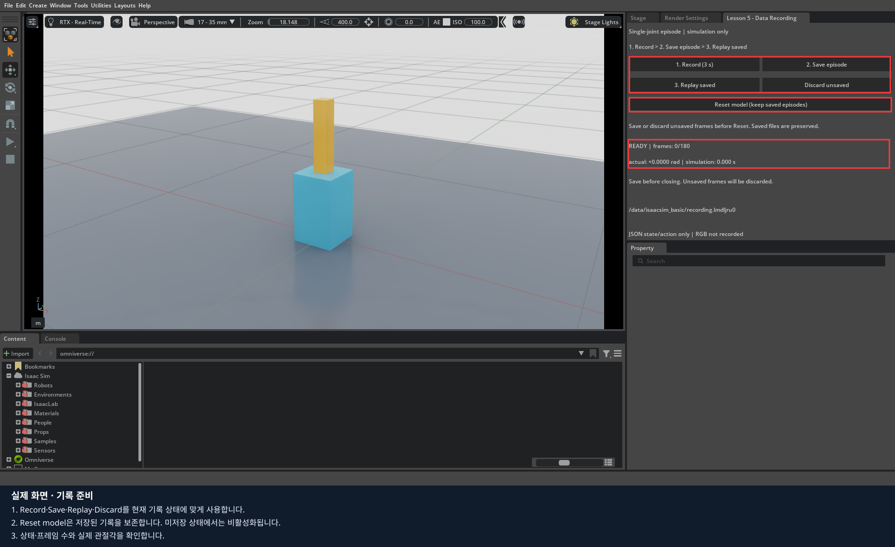
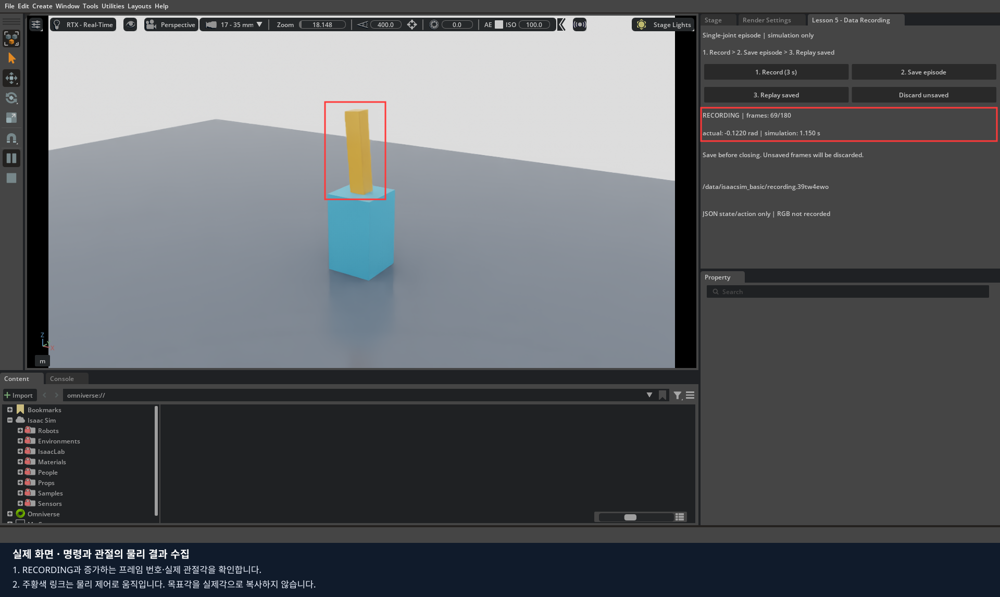
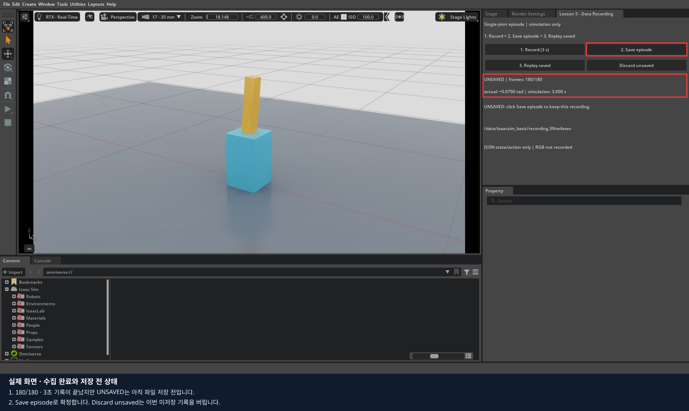
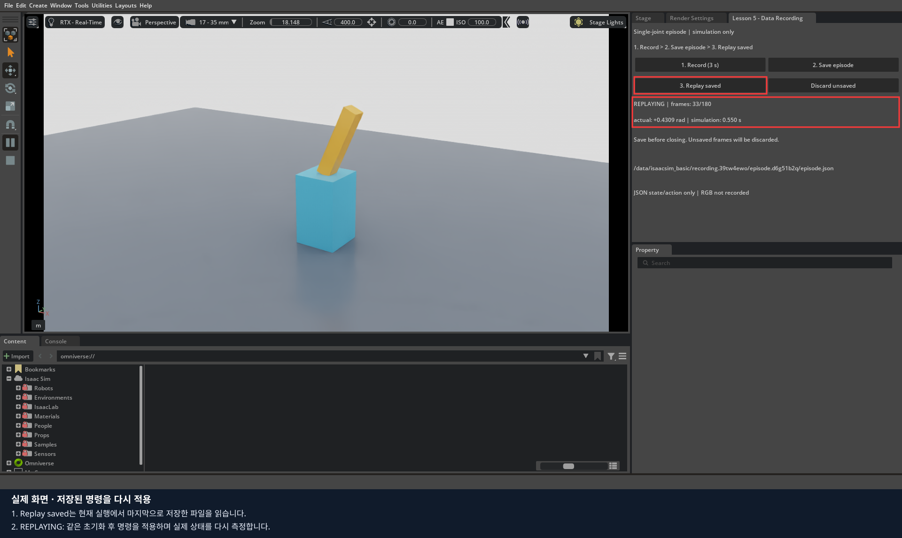
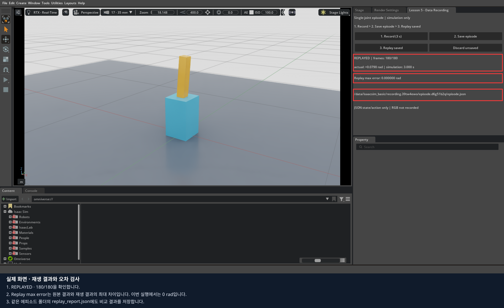

# 5편 · 관절 데이터 수집과 에피소드 저장·재생

**목표:** 관절을 움직이라는 명령과 실제로 움직인 결과를 구분하고, 한 번의 실습을 저장한 뒤 다시 재생해 검사합니다.
Isaac Sim **5.1.0 / Docker**, 예상 45~60분입니다. 2편의 한 관절 모형을 사용하며 실물 리더 없이 진행합니다.

이번 실습은 **관절 상태와 명령을 담은 JSON 기록**입니다. 전방·손목 영상 녹화, 실물 리더 시연 수집,
LeRobot 학습용 데이터셋 변환은 포함하지 않습니다. 이 실습의 버튼은 교재에 함께 제공한 코드가 만드는
`Lesson 5 - Data Recording` 창에 있으며, Isaac Sim 기본 메뉴에는 없습니다.

**본격적인 학습 데이터 수집은 LeKiwi + SOARM으로 진행합니다.** 전방·손목 영상, 실제 관절 상태,
팔·베이스 명령을 시간에 맞춰 묶는 수집·LeRobot 변환은 [6편](../06_lekiwi_dataset/README.md)에서 실습합니다.
이번 한 관절 예제는 그전에 데이터의 의미와 저장 절차를 익히는 연습입니다.

이 편은 단일 관절 JSON 기록 실습입니다. 도면을 반영한 LeKiwi 카메라 TF와 두 RGB 기록은 6편에서 같은 공통 설정으로 사용합니다.
[1~6편의 카메라 적용 범위](../README.md#1~6편의-카메라-설정-적용-범위)를 참고하세요.

## 1. 사진 한 장과 에피소드는 어떻게 다른가?

3·4편의 P 키는 현재 화면을 PNG로 저장합니다. 모방학습에 필요한 것은 보통 시간에 따른 관측과 행동의 묶음입니다.
여기서는 Record를 한 번 눌러 시작하고 Save episode로 확정하는 **3초짜리 실행 한 번**을 에피소드라고 부릅니다.

| 항목 | 이번 실습에서 의미하는 값 |
|---|---|
| 관측 `observation` | 명령 적용 직전에 측정한 실제 관절각 |
| 행동 `action` | 다음 1/60초 동안 적용할 목표 관절각 |
| 다음 관측 `next_observation` | 물리 계산을 한 번 진행한 뒤 측정한 실제 관절각 |
| 프레임 | 위 관측·행동·다음 관측과 시간 정보를 묶은 기록 한 개 |
| 에피소드 | 프레임 180개, 총 3초의 시뮬레이션 구간 |

**목표각과 실제각은 다릅니다.** 관절은 힘과 물리 계산을 통해 목표로 접근하므로 지연과 오차가 생깁니다.
목표각을 그대로 관측으로 복사하면 실제 움직임을 수집한 것이 아닙니다.

## 2. Docker에서 실습 열기

[전체 설치 안내](../README.md)를 마친 뒤 저장소 최상위에서 실행합니다.
다른 Isaac Sim 창이 열려 있으면 정상 종료하고 기다립니다.

```bash
export LEKIWI_DOCKER_SUDO=1  # Docker에 sudo가 필요한 PC에서만
export ACCEPT_EULA=Y       # NVIDIA 라이선스를 읽고 동의한 경우
./lekiwi setup sim
./lekiwi basic --lesson recording
```

LeRobot 이미지와 USB 장치는 필요하지 않습니다. 새 실행마다 별도 작업 폴더를 만들므로 이전 실습을 덮어쓰지 않습니다.
화면에 파란 받침과 주황색 관절 모형, 기록용 패널이 나타납니다.
`Lesson 5 - Data Recording` 창은 오른쪽 **Stage 옆 탭**에 자동 배치됩니다.
객체 트리를 확인하려면 **Stage**를 누르고, 기록 버튼을 사용하려면 기록 탭으로 돌아옵니다. **READY**에서는 모형이 정지해 있습니다.



패널이 모형을 가리면 제목 표시줄을 잡아 빈 공간으로 옮깁니다.
이 창의 Record 버튼이 물리 실행을 시작하므로, 시작 전에 별도로 Play를 누를 필요는 없습니다.
Record와 Replay를 누르면 **PREPARING** 동안 모형을 초기화합니다. 준비 중에도 화면이 갱신되며, 준비가 끝나면 기록 또는 재생을 시작합니다. 준비 버튼을 반복해서 누르지 않습니다.

## 3. 한 에피소드 기록하기

1. **1. Record (3 s)**를 한 번 누릅니다.
2. 초기 자세가 준비된 뒤 상태가 **RECORDING**으로 바뀌는지 확인합니다.
3. 주황색 관절이 양쪽으로 움직이고 `frames`가 증가하는 것을 관찰합니다.
4. **UNSAVED / 180/180**이 될 때까지 기다립니다. 모형은 자동으로 정지합니다.



관절 목표는 예제 코드가 생성하는 ±25°의 부드러운 주기 운동입니다. 실제 사람의 시연이나 집기 성공 데이터가 아닙니다.
화면 숫자는 **rad**이며, 25°는 약 0.4363 rad입니다. USD Drive에 입력할 때만 코드가 degree로 변환합니다.

기록 속도는 **시뮬레이션 시간으로 60 Hz**입니다. GPU가 느리면 현실에서는 3초보다 오래 걸릴 수 있습니다.
화면이 잠깐 느려졌다고 버튼을 반복해서 누르지 않습니다. 실행이 진행되는 동안 Record·Save·Replay는 비활성화됩니다.



**UNSAVED는 저장 완료가 아닙니다.** 이 상태에서 창을 닫으면 메모리의 기록은 사라집니다.
다시 시도하려면 **Discard unsaved**로 이번 기록을 버린 뒤 Record를 누릅니다.
Discard는 이전에 저장한 에피소드 파일을 삭제하지 않습니다.

## 4. 에피소드 저장하기

1. UNSAVED에서 **2. Save episode**를 누릅니다.
2. 상태가 **SAVED**로 바뀌는지 확인합니다.
3. 패널에 표시된 `episode.json`의 전체 경로를 기록지에 적습니다.


저장 전에 코드가 프레임 번호, 시간 간격, 유한한 수치, 이전 결과와 다음 입력의 연결을 검사합니다.
파일을 저장한 뒤 다시 읽어 검사하고, 메타데이터도 저장한 뒤 기록에 `episode.json` 이름을 부여합니다.
쓰기 중 중단되어 `episode.incomplete.json`만 남았다면 완료된 기록으로 사용하지 않습니다.

| 위치 | 경로 |
|---|---|
| 컨테이너 | `/data/isaacsim_basic/recording.<고유값>/episode.<고유값>/` |
| 호스트 기본값 | `data/isaacsim_basic/recording.<고유값>/episode.<고유값>/` |

`LEKIWI_DATA_DIR`를 바꿨다면 호스트에서는 그 폴더 아래의 `isaacsim_basic/`을 봅니다.
폴더 이름의 `<고유값>`을 예제 문자열 그대로 입력하지 말고 패널의 실제 경로를 사용합니다.

```text
recording.<고유값>/
  scene.usda                  이번 실행에서 사용한 관절 모형
  episode.<고유값>/
    episode.json              180개 프레임의 관측·행동·결과
    metadata.json             단위·FPS·출처·영상 포함 여부
    replay_report.json        재생을 마친 뒤 추가되는 오차 보고서
```

새 에피소드를 저장할 때마다 새 `episode.*` 폴더가 생깁니다. 기존 파일을 덮어쓰지 않습니다.
이 폴더 전체가 Git에서 제외되는 실습 결과입니다. 다른 사람에게 결과를 전달할 때는 해당 실행 폴더를 별도로 복사합니다.

## 5. 저장된 명령 재생하기

1. SAVED에서 **3. Replay saved**를 누릅니다.
2. 상태가 **REPLAYING**으로 바뀌고 관절이 다시 움직이는지 확인합니다.
3. **REPLAYED**가 되면 `Replay max error`를 읽습니다.





이 버튼은 **현재 실행에서 마지막으로 저장한 파일**을 디스크에서 다시 읽습니다.
재생 전 모형을 초기화하고 같은 준비 단계를 거친 뒤, 저장된 목표각을 순서대로 물리 제어기에 적용합니다.
각 스텝에서 다시 측정한 실제각과 원본의 `next_observation`을 비교합니다.

저장된 실제각을 강제로 대입해 화면 모양만 재현하는 방식이 아닙니다.
따라서 재생 오차는 **명령을 다시 적용했을 때 물리 결과가 얼마나 일치하는지**를 나타냅니다.
제작 PC의 자동 검사에서는 최대 오차 0 rad를 확인했지만, 다른 GPU·버전·물리 설정에서 동일한 값을 보장하지 않습니다.
자동 검사의 허용 기준은 0.01 rad 미만입니다.

이 기초 패널에는 이전 실행의 임의 파일을 고르는 기능이 없습니다.
폴더에 남은 JSON은 편집기에서 열어 조사할 수 있으며, 임의 에피소드 선택·대규모 재생은 후속 확장입니다.

## 6. JSON을 직접 읽어 보기

호스트의 파일 탐색기 또는 VS Code에서 패널이 가리킨 `episode.json`을 엽니다.
길게 한 줄로 보이면 VS Code의 **문서 서식 지정**으로 보기 좋게 표시할 수 있습니다.
분석 중 원본 숫자를 수정하지 않도록 복사본을 사용하는 것을 권장합니다.

최상위 `Isaac Sim Data` 배열의 첫 번째 항목을 확인합니다. 다음은 **구조 설명용 예시**이며 실제 측정값은 파일마다 다릅니다.

```json
{
  "current_time": 2.0,
  "current_time_step": 120,
  "data": {
    "frame_index": 0,
    "episode_time": 0.0,
    "observation": {"joint_position_rad": [0.0]},
    "action": {"joint_target_rad": [0.0]},
    "next_observation": {"joint_position_rad": [0.0]},
    "next_time": 2.0166666667
  }
}
```

| 값 | 단위·읽는 법 |
|---|---|
| `current_time` | 명령 적용 전 월드 시각, 초. 초기 자세 준비 시간이 포함됨 |
| `current_time_step` | 월드의 물리 스텝 번호 |
| `frame_index` | 이 에피소드에서 0부터 시작하는 번호 |
| `episode_time` | 이 에피소드에서 명령을 적용하기 시작한 시각, 초 |
| `observation` | 위 시각의 실제 관절각, rad |
| `action` | 이어지는 한 물리 스텝의 목표 관절각, rad |
| `next_observation` | 그 스텝을 계산한 결과, rad |
| `next_time` | 결과를 측정한 월드 시각, 초 |

`episode_time`의 마지막 값은 179/60 = 약 2.9833초입니다.
마지막 행동이 그 뒤의 1/60초 구간까지 적용되므로 **총 기록 구간은 180/60 = 3초**입니다.

두 번째 항목의 `observation`과 첫 번째 항목의 `next_observation`이 같은지 확인합니다.
이 관계가 깨졌다면 관측과 행동을 엉뚱한 시점끼리 묶었거나 중간 스텝이 빠졌을 수 있습니다.
`metadata.json`에서 `source: scripted_simulation`, `units: rad`, `fps: 60`, `rgb_recorded: false`도 확인합니다.

## 7. 이번 실습에서 사용하는 API

[공식 Data Logging 튜토리얼](https://docs.isaacsim.omniverse.nvidia.com/5.1.0/core_api_tutorials/tutorial_advanced_data_logging.html)은
DataLogger로 기록을 저장하고 읽어 재생하는 흐름을 설명합니다. 이 교재는 그 API를 한 관절 모형과 기록 패널에 적용했습니다.

| API | 이번 코드에서 사용한 곳 |
|---|---|
| `DataLogger()` | 별도 에피소드 기록기 생성 |
| `reset()` / `start()` | 새 기록 준비 |
| `add_data(data, step, time)` | 물리 스텝 전후의 값을 프레임 하나로 추가 |
| `pause()` | 기록 중지 상태 표시 |
| `save(path)` | JSON 저장 |
| `load(path)` | 저장한 JSON을 다시 읽기 |

실제 설치 코드에서 `add_data()`는 자체적으로 일시정지 상태를 검사하지 않습니다.
따라서 예제는 `is_started()`와 RECORDING 상태를 확인한 경우에만 프레임을 추가합니다.
월드의 자동 로깅 콜백과 별도의 수동 기록을 동시에 사용하지 않아 중복 프레임을 만들지 않습니다.

실습 코드: [recording.py](../recording.py). 실행은 Docker 명령으로 하며,
독립 실행용 SimulationApp 코드를 이미 열린 Script Editor에 그대로 붙여넣지 않습니다.

## 8. LeRobot 데이터셋으로 확장할 때 필요한 것

[LeRobotDataset 공식 설명](https://huggingface.co/docs/lerobot/main/lerobot-dataset-v3)은
수치 데이터·영상·메타데이터를 함께 다루는 데이터셋 형식을 설명합니다.
**이번 `episode.json`을 `./lekiwi train act`에 바로 넘길 수는 없습니다.**

| 확장 항목 | 추가로 정해야 할 내용 |
|---|---|
| 6개 관절·베이스 | 관절 순서와 rad, 베이스 속도 m/s·rad/s의 의미 |
| 전방·손목 RGB | 해상도, 카메라 시각, 노출·렌즈·가림 상태 |
| 관측과 행동 대응 | 영상·실제 관절값을 관측한 뒤 적용한 명령인지 |
| 에피소드 경계 | 시작·중단·성공·실패·리셋 기준 |
| 데이터셋 저장 | feature 규격, 에피소드 확정, 파일 종료와 재생 검사 |
| 학습·검증 분리 | 같은 에피소드의 이웃 프레임이 양쪽에 섞이지 않도록 분리 |

현재 teleop의 `leader.json`과 `sim.json`은 최신 상태 전달용으로 덮어써집니다.
이번 프레임 기록처럼 전체 이력을 보존하는 파일로 간주하면 안 됩니다.
이 실습의 주기 운동을 대량 복제해도 집기 시연 데이터가 되지는 않습니다.

## 9. 과제·종료·자동 검사

[기록지](worksheet.md)에 다음 결과를 남깁니다.

1. 첫 에피소드를 기록·저장·재생하고 실제 경로, 프레임 수, 최대 재생 오차를 적습니다.
2. 다시 Record를 누른 뒤 Discard unsaved로 취소하고, 이전 파일이 남아 있는지 확인합니다.
3. 새 에피소드를 끝까지 저장하고 서로 다른 폴더가 생겼는지 확인합니다.
4. 실제각과 목표각이 다른 프레임을 하나 찾아 그 차이를 설명합니다.
5. JSON·PNG·LeRobot 데이터셋의 목적 차이를 자신의 말로 적습니다.

왼쪽 Pause로 중간에 멈췄다면 Play로 재개합니다. 녹화 도중 Stop·장면 교체·관절 속성 편집을 했다면
Discard unsaved 후 새 Record로 처음부터 기록합니다. 시간·상태가 다른 구간을 이어 붙이지 않습니다.

필요한 에피소드를 저장한 뒤 Isaac Sim 창을 닫고 종료를 기다립니다.
자동 검사는 별도 실행에서 수행합니다.

```bash
./lekiwi test-recording
```

실제 PhysX로 180프레임 수집, 파일 재읽기, 저장 명령 재생, 오차 검사,
새 임시 기록을 버려도 기존 저장 파일이 보존되는지를 검사합니다.
마지막에 `BASIC_RECORDING_TEST result=PASS`가 나오면 통과입니다.
실물 USB나 모터는 사용하지 않습니다.
