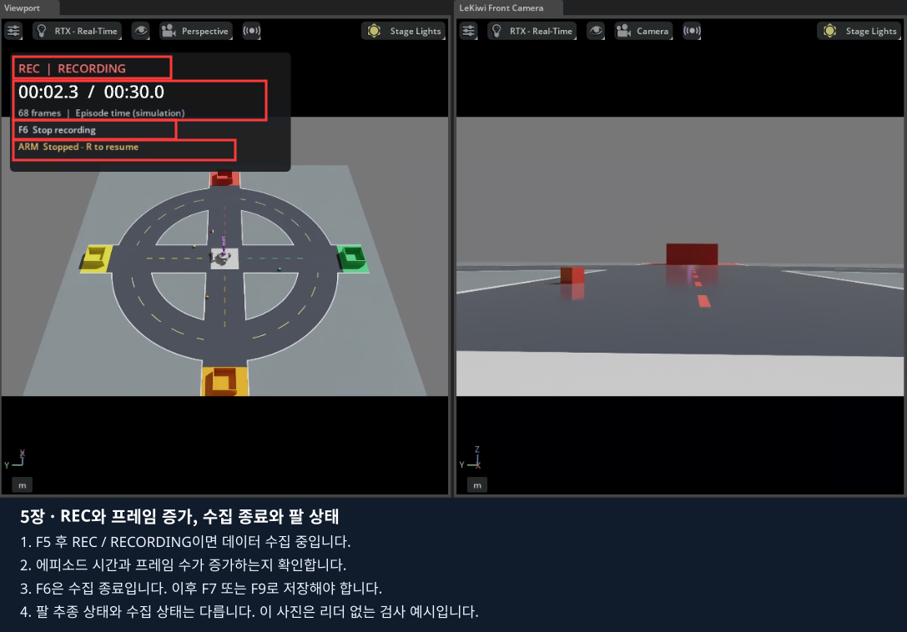

# 5장 · 빨주노초 맵에서 시연 데이터 취득하기

**4장에서 조작한 같은 LeKiwi 코스에서 리더암과 키보드로 시연하고, 두 카메라 영상·로봇 상태·명령을 함께 저장합니다.**
예제 과제는 **빨간 큐브를 빨간 바구니에 넣기**입니다. 저장한 에피소드는 다음 [6장](../06_lekiwi_dataset/README.md)의 변환·ACT 학습 입력입니다.
이 장에서 저장하는 것은 실제 LeKiwi 학습용 원본이며, 단일 관절 JSON 보충 예제와 구분합니다.

## 1. 4장 실행을 종료하고 기록 설정하기

1. 4장에서 팔·집게·베이스가 정상적으로 움직이는지 먼저 확인합니다.
2. 이동키를 놓고 Space로 정지한 뒤 Isaac Sim 창을 닫습니다. 실행 터미널이 끝났는지 확인합니다.
3. 같은 노트북의 VS Code 터미널에서 저장소 최상위 폴더인지, 이전 실행이 종료됐는지 확인합니다.

```bash
pwd
ls lekiwi
./lekiwi status
```

새 터미널이면 `export ACCEPT_EULA=Y`, `export LEKIWI_DISPLAY_MODE=local`을 다시 설정합니다.
Docker에 sudo가 필요한 노트북은 `export LEKIWI_DOCKER_SUDO=1`도 설정합니다.
리더는 같은 USB 장치와 같은 `--id`를 사용합니다.

### 1.1. 이번 기록의 길이와 과제 설명

아래 명령은 **최대 120초의 시뮬레이션 시간**을 기록하고 과제를 `빨간 큐브를 빨간 바구니에 넣기`로 저장합니다.
`usb-본인_SO101_장치`는 4장에서 확인한 실제 이름으로 바꿉니다.

```bash
LEKIWI_RECORD_SECONDS=120 LEKIWI_RECORD_TASK='빨간 큐브를 빨간 바구니에 넣기' \
  ./lekiwi teleop \
  --port /dev/serial/by-id/usb-본인_SO101_장치 \
  --id so101_leader \
  --scene random \
  --record
```

4장 명령에 **`--record`를 추가**하면 기록 기능이 켜집니다. 명령을 실행하는 것만으로 녹화가 시작되지는 않습니다.
터미널의 연결 안전 확인과 보정 재사용 질문에 응답합니다. 토크 해제 때 팔이 떨어지지 않게 지지하는 절차는 이번 실행에도 필요합니다.

| 바꿀 값 | 의미 |
|---|---|
| `LEKIWI_RECORD_SECONDS=120` | 최대 120초. 더 짧은 `30`도 가능. `0`은 F6으로 직접 끝낼 때까지 무제한 |
| `LEKIWI_RECORD_TASK='...'` | 사람이 수행할 과제 설명. 에피소드와 변환 데이터의 task에 저장 |
| `--port ...` | 본인 리더의 실제 USB 경로 |
| `--id so101_leader` | 4장에서 사용한 같은 보정 ID |

과제 문장을 바꾼다고 로봇이 자동으로 움직이지 않습니다. 같은 과제를 반복 수집할 때는 설명을 일관되게 사용합니다.
이번 명령 앞의 설정은 해당 실행에 전달되며, 다음 실행에도 같은 값을 쓰려면 같은 명령을 사용합니다.

### 1.2. 리더가 없을 때 기록 기능만 검사하기

실물 리더가 없는 경우에만 아래 방법을 사용합니다. 위 teleop과 동시에 실행하지 않습니다.

```bash
LEKIWI_RECORD_SECONDS=30 LEKIWI_RECORD_TASK='Move forward and stop' ./lekiwi record
```

이 실행은 같은 빨주노초 코스에서 키보드 베이스만 기록하며 팔은 기본 자세를 유지합니다.
**직진·정지 기록으로 집기 시연을 대신하지 않습니다.** 학습용 집기 데이터는 1.1절의 리더 실행에서 수집합니다.

## 2. 기록 전에 화면과 입력 확인하기

1. `SO101 calibration=READY torque=OFF`와 코스 화면을 확인합니다. 리더 없이 실행했다면 SO101 메시지는 없습니다.
2. 카메라 준비가 끝나 **`LEKIWI_RECORD state=READY`**가 나올 때까지 기다립니다. `WARMING UP` 동안 F5를 반복하지 않습니다.
3. 왼쪽 뷰포트를 클릭합니다. 리더 실행이면 **R**로 추종을 켭니다.
4. 어깨와 집게를 조금 움직여 따라오는지 확인합니다. 이동키도 한 방향씩 확인합니다.
5. 필요한 시작 자세를 준비합니다. 새 배치가 필요하면 기록 전 F8을 누르고, 리더 사용 시 R로 다시 활성화합니다.

왼쪽은 전체 관찰 화면, 오른쪽은 전방 카메라입니다. **손목 카메라 영상도 함께 저장**되며 C로 왼쪽 시점을 전환해 확인할 수 있습니다.
기록 도중 카메라 속성이나 물체 Transform을 바꾸지 않습니다.

## 3. F5로 기록하고 F6으로 끝내기

**왼쪽 뷰포트를 클릭한 상태**에서 진행합니다. 기능키가 노트북 밝기·음량으로 동작하면 Fn과 함께 누릅니다.

1. **F5**를 한 번 누릅니다.
2. 화면 왼쪽 위에 빨간 **REC / RECORDING**, 에피소드 시간, 증가하는 프레임 수가 나타나는지 확인합니다.
3. 4장과 같이 키보드로 접근하고 리더로 큐브를 집어 빨간 바구니에 넣습니다.
4. 시연을 마치면 이동키를 놓고 **Space**로 정지합니다.
5. **F6**을 한 번 눌러 수집 종료를 요청합니다. 자동 시간 제한에 도달했으면 이미 종료 중일 수 있습니다.
6. **FINISHING** 동안 기다린 뒤 **STOPPED / NOT SAVED** 또는 터미널의 **UNSAVED**를 확인합니다.



사진은 같은 기록기의 기존 실제 상태 표시 검사 화면입니다. 사진의 `ARM Stopped`는 리더를 연결하지 않았던 검사 조건입니다.
리더 시연에서는 팔 추종 상태도 함께 확인합니다. 사진의 프레임 수·시간을 똑같이 맞출 필요는 없습니다.

**F6은 수집 종료이며 저장 완료가 아닙니다.** 아래 저장 단계까지 마친 후 창을 닫습니다.
Space로 정지해도 기록은 별도로 종료해야 합니다. 기록 중 Isaac Sim의 Pause/Stop을 누르면 시간 연결이 끊겨 오류가 될 수 있습니다.

| 표시 | 지금 할 일 |
|---|---|
| READY | 준비를 마친 뒤 F5 |
| REC / RECORDING | 시연 진행. 시간·프레임 증가 확인 |
| FINISHING | 마지막 영상·파일 쓰기 완료 대기 |
| STOPPED / NOT SAVED, UNSAVED | F7/F9 저장 또는 F10 두 번 폐기 선택 |
| SAVING | 저장 완료 대기 |
| SAVED | 완료 경로 확인. 다음 에피소드 또는 종료 가능 |
| RECORDING ERROR | 오류 원인 확인 후 해당 미저장 기록 폐기 |

표시 시간은 **프레임 수 ÷ 30 FPS인 시뮬레이션 시간**입니다. 렌더링이 느리면 실제 벽시계 시간보다 오래 걸릴 수 있습니다.

## 4. 연습·성공 저장 또는 폐기하기

수집이 끝나고 UNSAVED가 된 상태에서 결과에 맞게 **하나만 선택**합니다.

| 키 | 언제 사용하는가 | 결과 |
|---|---|---|
| F7 | 실패했거나 기능 확인용 연습을 남길 때 | `success=false`로 저장 |
| F9 | 의도한 집기·놓기 과제를 완료한 시연 | `success=true`로 저장 |
| F10을 3초 안에 두 번 | 이번 미저장 기록을 버릴 때 | 미저장 에피소드 폐기 |

F9는 자동 성공 판정이 아닙니다. **사람이 화면에서 성공을 확인한 뒤 누릅니다.**
단절·입력 중단으로 끝난 시연은 성공 저장하지 않습니다. F10은 이미 저장한 다른 에피소드를 삭제하지 않습니다.

F7 또는 F9를 눌렀다면 **SAVING → SAVED**와 실행 터미널의 다음 형태를 확인합니다.

```text
LEKIWI_RECORD saved=/data/recordings/lekiwi.…/episode.… frames=…
```

위는 출력 형식 예시입니다. 실제 `saved` 경로와 프레임 수는 본인 출력에서 확인합니다.
저장 중에는 창을 닫거나 F8을 누르지 않습니다.

## 5. 여러 에피소드 수집하기

1. 이전 에피소드가 SAVED 또는 DISCARDED인지 확인합니다.
2. **F8**로 로봇을 시작 자세로 돌리고 각 색 라인 안에서 큐브를 다시 배치합니다.
3. 리더 사용 시 실제 자세와 가상 팔을 확인하고 **R**을 누릅니다.
4. **F5 → 시연 → F6 → F7 또는 F9**를 반복합니다.

F5만 다시 누르면 현재 자세에서 다음 기록을 시작하며, 자동으로 초기화되지 않습니다.
F8은 기록 중·미저장·저장 중에는 차단됩니다. 먼저 현재 에피소드를 정리합니다.
같은 집기 과제의 성공 시연을 여러 번 모으고, 학습에 사용할 시연은 6장에서 골라 변환합니다.

### 입력이 끊기거나 기록에 오류가 생기면

1. 이동키를 놓고 리더를 멈춘 뒤 Space로 정지합니다.
2. 아직 REC이면 F6을 눌러 종료하고 FINISHING이 끝날 때까지 기다립니다.
3. 미저장 상태이면 F7로 연습 저장하거나 F10 두 번으로 폐기합니다. 입력 중단이 있던 기록을 F9 성공으로 저장하지 않습니다.
4. [4장 입력 복구](../04_teleoperation/README.md#teleop-recovery)에 따라 USB·화면·입력을 확인합니다.
5. 정상 상태로 돌아온 뒤 **새 에피소드**를 시작합니다. 끊긴 시연에 이어 붙이지 않습니다.

실행 자체가 종료됐다면 마지막 로그를 확인합니다. `.partial` 폴더는 미완료 기록이며 학습에 사용하지 않습니다.
RGB 시간 불일치·저장 지연·용량 부족은 오류로 중단될 수 있습니다. 원인을 확인하고 다시 수집합니다.

## 6. 저장 파일과 에피소드 목록 확인하기

마지막 저장·폐기를 끝내고 Isaac Sim 창을 닫습니다. 리더 실행 터미널까지 끝난 뒤 같은 노트북의 저장소 루트에서 실행합니다.

```bash
./lekiwi status
./lekiwi dataset list
```

출력의 `episodes` 목록에서 다음을 확인합니다.

| 항목 | 확인 내용 |
|---|---|
| `id` | `lekiwi.실제세션/episode.실제에피소드` 형태. 6장에서 이 문자열을 사용 |
| `task` | 이번 시연의 과제 설명 |
| `frames` | 저장한 프레임 수. 0보다 커야 함 |
| `success` | F7 연습은 false, F9 성공은 true |
| `source` | 수집에 사용한 입력 정보 |

원본은 호스트 저장소의 다음 위치에 있습니다.

```text
data/recordings/lekiwi.XXXXXXXX/
  episode.XXXXXXXX/
    manifest.json
    frames.jsonl
    images/front/
    images/wrist/
```

Isaac Sim 컨테이너 안에서는 같은 위치가 `/data/recordings/...`로 보입니다.
VS Code 탐색기에서 `data → recordings → 본인 세션 → 본인 에피소드`를 펼칩니다.
`manifest.json`의 과제·성공 여부·프레임 정보를 읽고, `images/front`와 `images/wrist`에서 PNG를 각각 열어 실제 장면이 저장됐는지 봅니다.
파일 이름·전체 경로는 manifest에 기록된 값을 기준으로 확인합니다. 자동 생성된 파일을 손으로 고치지 않습니다.

원본 한 프레임에는 관측 상태·두 RGB·명령·명령을 적용한 다음 상태가 들어갑니다.
팔 6개 관절은 rad, 베이스 명령은 m/s·rad/s입니다. 순서는 manifest의 feature 설명을 따릅니다.
카메라 설정·초기 코스·과제·성공 여부도 함께 남습니다. Viewport의 REC 표시 자체는 카메라 영상에 저장되지 않습니다.

## 7. 기록 스크립트에서 기본값을 바꾸는 방법

1.1절 명령 앞의 환경변수로 바꿨다면 **파일 수정은 필요 없습니다.** 코드의 기본값을 직접 바꾸어 볼 때만 아래를 진행합니다.

공통 기록 코드는 기존 경로 [06_lekiwi_dataset/experiments/01_lekiwi_recording.py](../06_lekiwi_dataset/experiments/01_lekiwi_recording.py)에 있습니다.
파일 위치는 유지하며, **5장의 `record`와 `teleop --record`가 함께 사용**합니다.

1. 기록을 저장·종료하고 VS Code에서 Ctrl+P를 누릅니다.
2. `isaacsim_basic/06_lekiwi_dataset/experiments/01_lekiwi_recording.py`를 입력해 엽니다.
3. Ctrl+F로 **`task_description =`**를 검색합니다. 첫 기본 줄에 `#`를 붙이고 다음 과제 줄의 `#`를 지웁니다.

```python
# task_description = "Move forward and stop"
task_description = "빨간 큐브를 빨간 바구니에 넣기"
```

4. Ctrl+F로 **`self.duration_seconds = 30`**을 검색합니다. `RecordingPanel.__init__()` 안에서 들여쓰기를 그대로 두고 다음처럼 바꿉니다.

```python
        # self.duration_seconds = 30
        self.duration_seconds = 120
        # self.duration_seconds = 0
```

5. Ctrl+S로 저장합니다. 이 학생 파일은 실행 때 연결되므로 이미지 재빌드가 필요 없습니다.
6. 코드 기본값을 확인하려면 터미널에 남은 우선 설정을 비우고 실행합니다. `--port`는 본인 실제 경로로 바꿉니다.

```bash
unset LEKIWI_RECORD_SECONDS LEKIWI_RECORD_TASK
./lekiwi teleop \
  --port /dev/serial/by-id/usb-본인_SO101_장치 \
  --id so101_leader --scene random --record
```

리더 없는 기능 검사라면 마지막 명령 대신 `./lekiwi record`를 사용합니다.
이전처럼 명령 앞에 `LEKIWI_RECORD_SECONDS=...`·`LEKIWI_RECORD_TASK=...`를 적으면 **환경변수 값이 코드보다 우선**합니다.
기록 길이와 저장 후 task가 수정한 값인지 확인합니다. 30 FPS·상태/명령 순서·카메라 동기화 코드는 이번 실습에서 바꾸지 않습니다.

## 8. 마무리와 다음 장

**완료 기준:** 본인 시연의 SAVED 메시지, 에피소드 ID·프레임 수·과제, front/wrist 원본 영상을 확인했습니다.
이제 [6장 변환·ACT 학습·추론](../06_lekiwi_dataset/README.md)에서 그 에피소드를 학습용 형식으로 변환합니다.
데이터셋 업로드는 선택 사항이며, 같은 노트북에서 학습할 때는 로컬 변환본을 사용합니다.

[01_joint_episode.py](experiments/01_joint_episode.py)와 `./lekiwi basic --chapter 5`는 단일 관절 JSON 기록·재생 **보충 예제**입니다.
이 장의 두 카메라 학습용 데이터는 위 `./lekiwi teleop ... --record`로 취득합니다.

[출처와 검증 범위](SOURCES.md) · [전체 목차](../README.md)
