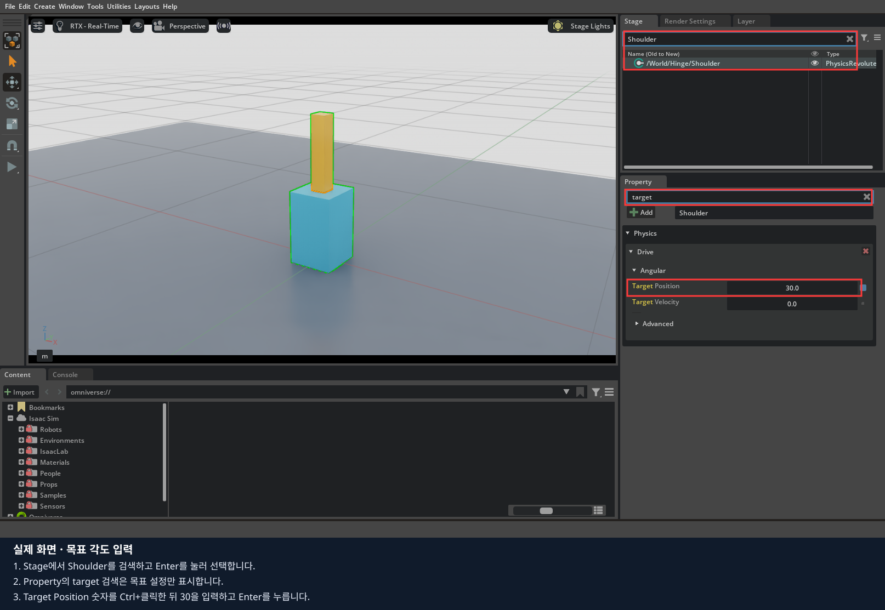
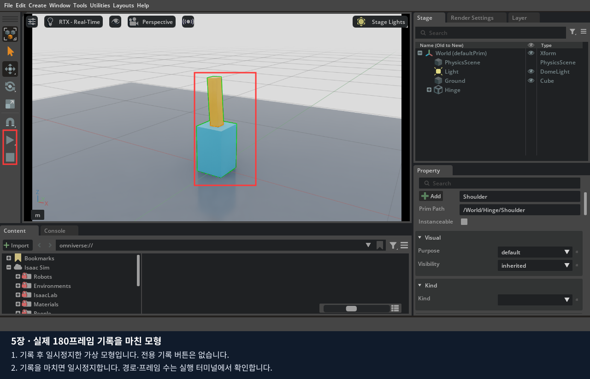

# 5장 · 장면 저장과 움직임 기록 구분하기

먼저 직접 만든 관절을 화면에서 움직여 보고 장면을 저장합니다. 이어서 시간별 상태와 명령을 기록하는 방법을 배웁니다.
**1~3절은 마우스로 모형 확인·조작·저장하고, 마지막 4절에서 같은 모형에 기록·재생 코드를 연결합니다.**
이 장의 JSON은 에피소드 구조를 배우는 예제입니다. LeRobot 학습용 RGB 데이터는 6장에서 수집합니다.

## 1. 기록할 관절 모형 열기

마우스 실습용 빈 편집기를 사용 중이면 그대로 이어갑니다. 앞 장의 코드 예제가 열려 있으면 결과를 저장하고 Isaac Sim 창을 닫습니다.
아래 명령은 **같은 노트북의 저장소 최상위 폴더(`lekiwi` 파일이 있는 곳)**에서 실행합니다.
이 명령은 편집 화면만 열며, 실습 객체는 이후 메뉴로 직접 만듭니다.

```bash
./lekiwi basic --script 01_object_physics/experiments/00_empty_stage.py
```

Isaac Sim 창이 열리고 로딩이 끝나면 Viewport를 클릭해 조작합니다. 처음 실행은 캐시 준비로 시간이 걸릴 수 있습니다.
명령을 중복 실행하지 말고, 오류가 나면 실행 터미널의 마지막 오류를 확인합니다.

일반 Isaac Sim 설치에서는 앱을 직접 엽니다. 이전 실습이 실행 중이면 저장을 마치고 종료한 뒤 시작합니다.

`File > Open`으로 2장에서 직접 만든 관절 파일을 엽니다.
Docker 수업의 경로 예시는 `/data/isaacsim_basic/my_joint.usda`입니다. 본인이 다른 이름으로 저장했다면 그 파일을 엽니다.
아직 모형이 없다면 [2장](../02_robot_joints/README.md) 1~5절에서 먼저 만듭니다.

Stage에서 `/World/Hinge`를 펼칩니다. `Base`, `Arm`, `FixedBase`, `Shoulder`가 있는지 확인합니다.
Base와 Arm 아래에는 각각 Shape가 있습니다. 관절 속성은 Shape가 아닌 Shoulder를 선택해서 바꿉니다.


사진은 2장의 완성 모형입니다. 같은 구조의 본인 파일을 열어 아래 실습을 진행합니다.

Shoulder의 Body 0=Base, Body 1=Arm, Axis=Y, 각도 제한=-60/60도를 확인합니다.
Drive는 Stiffness=1000, Damping=50, Max Force=100, Target Velocity=0으로 맞춥니다.
이 값은 2장에서 만든 기준 설정입니다.

## 2. 직접 조작하며 무엇을 기록할지 관찰하기

1. Stop 상태에서 Shoulder의 `Physics > Drive > Angular > Target Position`에 `30`을 입력합니다.
2. Play를 누른 직후와 팔이 안정된 뒤의 모습을 비교합니다. 같은 목표여도 실제 상태는 시간에 따라 달라집니다.
3. Stop한 뒤 `-30`으로 바꾸고 다시 Play합니다. 두 조건의 목표와 실제 움직임을 [기록지](worksheet.md)에 적습니다.
4. Stop 후 목표를 `0`으로 복원합니다.



여기서 남긴 사진은 관찰 기록입니다. 모든 순간의 관절각과 명령을 자동 저장한 데이터는 아닙니다.
자동 기록에는 ‘언제, 어떤 상태에서, 어떤 명령을 보냈고, 그다음 어떻게 됐는지’가 함께 필요합니다.

## 3. 장면을 저장하고 다시 열기

`File > Save As`로 `my_joint_recording.usda`를 저장합니다. Docker 수업에서는 `/data/isaacsim_basic/` 아래를 사용합니다.
기존 파일이 있으면 새 이름으로 저장합니다. 다른 장면을 열었다가 `File > Open`으로 이 파일을 다시 열어
Base·Arm·관절 구조와 목표 0도가 복원되는지 확인합니다.

| 지금 저장한 것 | 다음에 기록할 것 |
|---|---|
| USD: 물체·관절·속성으로 구성된 장면 | JSON: 시간 순서의 관절 상태와 명령 |
| File > Save As로 저장 | 마지막 절의 기록 프로그램으로 저장 |

기본 File > Save는 이 교재의 상태·명령 에피소드를 만들지 않습니다.
[기록지](worksheet.md)에 USD 경로와 확인 화면을 먼저 남긴 뒤, 아래 코드로 시간별 기록을 추가합니다.

## 4. 마지막: 같은 작업을 코드로 구현하기

화면에서 만든 모형을 그대로 열고 상태·명령·다음 상태를 JSON으로 기록합니다.

### 코드 실행과 수정 순서

설치는 0장에서 마쳤다고 가정합니다. 아래 명령은 **다음 절의 USD 열기 설정을 마친 뒤** 저장소 루트에서 실행합니다.

같은 노트북의 저장소 루트 터미널:

```bash
./lekiwi basic --chapter 5
```

1. 이 절에 연결된 Python 파일을 열고, 앞에서 클릭했던 속성에 해당하는 줄을 찾습니다.
2. 기본 실행 결과를 직접 만든 환경의 결과와 비교합니다.
3. 실행을 종료한 뒤 지정된 기본 줄에 `#`를 붙이고 비교할 줄의 `#`를 지웁니다. 들여쓰기는 유지합니다.
4. 파일을 저장하고 같은 명령으로 다시 실행합니다. 화면에서 값을 바꾸는 실험과 구분해 기록합니다.

코드 수정 전 Isaac Sim 창을 닫고, 수정 파일을 저장한 뒤 같은 명령으로 재실행합니다.
학생 파일은 호스트에서 저장하면 다음 실행에 반영되며, 코드만 수정할 때 Docker 이미지 재빌드는 필요 없습니다.

### 4.1. 직접 만든 USD를 기록 코드에서 열기

빈 편집 화면을 종료합니다.
[01_joint_episode.py](experiments/01_joint_episode.py)의 `main()`에서 장면 생성 두 줄을 주석 처리하고
바로 아래 준비된 `open_stage` 두 줄을 활성화합니다. 실제 저장한 파일 이름을 입력합니다.

```python
# context.new_stage()
# build_scene(context.get_stage())
if not context.open_stage("/data/isaacsim_basic/my_joint_recording.usda"):
    raise RuntimeError("직접 만든 관절 USD를 열 수 없습니다. 저장 경로를 확인하세요.")
```

일반 설치에서는 본인의 절대 경로를 사용합니다. `/World/PhysicsScene`, `/World/Hinge/FixedBase`,
`/World/Hinge/Shoulder` 경로와 FixedBase의 Articulation Root는 2장과 같아야 합니다.
파일을 저장한 다음 위 실행 명령으로 시작합니다. 코드의 기본값은 새 모형을 자동 생성하는 방식입니다.

### 4.2. 기본 기록 실행

[01_joint_episode.py](experiments/01_joint_episode.py)

실행하면 자동으로 3초의 가상 움직임을 기록하고 일시정지합니다. 전용 Record 버튼이나 Lesson 탭은 없습니다.
터미널에서 `STUDENT_RECORD saved=... frames=180`을 확인합니다.
파일 경로는 실행마다 새 폴더를 사용하므로 이전 에피소드를 덮어쓰지 않습니다.



### 4.3. 한 프레임의 순서 읽기

`record()`의 반복문에서 다음 순서를 찾습니다.

```python
before = robot.get_joint_positions().tolist()
time, step = world.current_time, world.current_time_step_index
robot.apply_action(ArticulationAction(joint_positions=np.array([target])))
world.step(render=True)
after = robot.get_joint_positions().tolist()
logger.add_data({"frame_index": index, "observation": before,
                 "action": [target], "next_observation": after,
                 "next_time": world.current_time}, step, time)
```

관측은 **명령 전 t**, action은 **t에서 적용하는 목표**, 후속 관측은 **t+1/60초**입니다.
명령과 실제 관절각은 다를 수 있습니다. DataLogger는 우리가 전달한 딕셔너리와 물리 시각을 기록합니다.

`World(physics_dt=1/60, rendering_dt=1/60)`에서 한 번의 step은 물리 1/60초입니다.
벽시계의 3초와 반드시 같지는 않습니다. 느린 GPU에서는 같은 180프레임에 더 오래 걸릴 수 있습니다.

### 4.4. 기록 길이와 명령 바꾸기

`range(180)`을 360으로 바꾸면 6초입니다. 목표 식의 분모 180을 유지하면 같은 주기를 두 번 반복합니다.
진폭 .5를 주석 처리하고 .25 줄을 해제해 최대 목표 각도를 절반으로 줄입니다.
새 JSON의 action과 observation이 어떻게 달라지는지 비교합니다.
기록 중 표준 Pause/Stop을 누르면 불완전한 시간 연결을 저장하지 않도록 오류로 중단합니다.

### 4.5. 저장된 명령 재생

파일 아래 `main()`의 두 줄을 주석 해제합니다.

```python
path = record(world, robot, app, output)
if path is not None:
    replay(world, robot, app, path)
```

재실행하면 기록을 마친 뒤 `world.reset()`으로 모형을 초기화하고 파일의 action을 순서대로 적용합니다.
터미널의 `STUDENT_REPLAY frames=180 max_error_rad=...`를 확인합니다.
`replay()`는 `set_joint_positions`로 관측 상태를 강제로 복원하지 않습니다. 실제 PhysX에 같은 목표를 다시 전달합니다.

다음으로 기본 `record(...)` 호출을 주석 처리하고 파일 아래의 `Path("...episode.json")`, `replay(...)` 두 줄을 사용합니다.
경로의 예시 부분은 실제 저장 경로로 바꿉니다. 이 방법은 이전 실행의 JSON도 재생합니다.

### 4.6. 파일 열기

Docker의 `/data/...`는 호스트 저장소의 `data/...`와 연결됩니다.
터미널에 나온 파일을 편집기에서 열고 최상위 `Isaac Sim Data` 목록의 첫 두 프레임을 비교합니다.

| 항목 | 의미 |
|---|---|
| current_time / current_time_step | 명령 직전 물리 시각·스텝 |
| data.frame_index | 0부터 시작하는 기록 번호 |
| data.observation | 명령 직전 실제 관절각, rad |
| data.action | 목표 관절각, rad |
| data.next_observation | 한 물리 스텝 뒤 실제 각도 |
| data.next_time | 후속 상태의 물리 시각 |

프레임 i의 `next_observation`이 i+1의 `observation`과 같은지 확인합니다.
마지막 프레임의 후속 상태를 빼면 마지막 명령이 무엇을 만들었는지 확인하기 어렵습니다.

### 4.7. 직접 만든 모형과 자동 생성 모형 비교

현재 파일의 `open_stage` 두 줄을 주석 처리하고 `new_stage`·`build_scene` 두 줄을 복원해 재실행합니다.
이렇게 하면 같은 기준 모형을 코드로 만듭니다. 형상·질량·관절 접점·Drive·시간 간격을 같게 두고
각 실행의 프레임 수와 재생 오차를 비교합니다. 기존 에피소드 경로는 그대로 보관합니다.

| 화면에서 한 일 | 코드에서 같은 역할 |
|---|---|
| 링크·관절 제작 | `build_scene()` |
| File > Open | `context.open_stage(...)` |
| Drive 목표 입력 | `ArticulationAction` |
| Play 후 결과 관찰 | `world.step()` → `get_joint_positions()` |
| 시각별 상태·명령을 표에 적기 | `record()` → DataLogger → JSON |
| 같은 순서로 명령 다시 적용 | `replay()` |

### 4.8. 학습 데이터와의 차이

이 예제는 움직임을 사인 함수로 정합니다. 사람이 시연한 성공 작업도, 카메라 이미지도 없습니다.
JSON을 저장했다는 사실만으로 학습에 충분한 데이터가 되지는 않습니다.
6편에서는 두 RGB, 6개 팔 관절, 베이스 명령, 작업 설명과 성공 여부를 함께 기록하고 LeRobot 형식으로 변환합니다.

[기록지](worksheet.md)에 180/360프레임, .5/.25 진폭, 저장·재생 오차와 실제 경로를 남깁니다.

[공식 자료](SOURCES.md) · [다음: 6편](../06_lekiwi_dataset/README.md)
