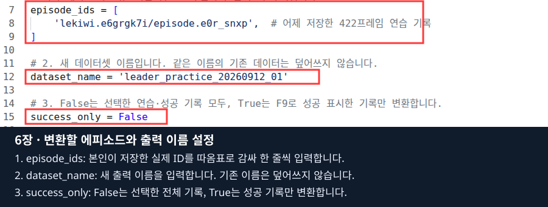

# 6장 · 시연 데이터를 변환하고 ACT 학습·추론하기

**5장에서 빨주노초 맵에서 저장한 시연을 LeRobot 데이터셋으로 변환하고, 같은 노트북에서 ACT 학습을 실행합니다.**
마지막에는 저장한 모델을 추론 스크립트로 불러와 **같은 맵의 가상 LeKiwi**를 조작합니다.
수업 순서는 **원본 선택 → 변환 → 검사 → 학습 실행 확인 → 추론**입니다. Hugging Face 업로드는 선택 사항입니다.

이 장에서는 코스·바구니·카메라를 새로 제작하지 않습니다. 4장의 조작과 5장의 데이터가 출발점입니다.
**학습은 정상 실행되는지까지 확인하고, 추론의 시작·정지·재시작과 과제 수행은 최종 리허설에서 검증**합니다.

## 1. 기록 실행을 종료하고 작업 폴더 열기

1. 5장의 마지막 에피소드를 저장하거나 폐기합니다. SAVED 또는 DISCARDED를 확인합니다.
2. Isaac Sim 창을 닫고 리더 실행 터미널도 종료됐는지 확인합니다.
3. 같은 노트북의 VS Code 터미널에서 실행합니다.

```bash
pwd
ls lekiwi
./lekiwi status
```

이후 명령은 **`lekiwi` 파일이 있는 저장소 최상위 폴더**에서 실행합니다.
새 터미널에서는 `export ACCEPT_EULA=Y`, `export LEKIWI_DISPLAY_MODE=local`을 다시 적용합니다.
Docker에 sudo가 필요한 노트북만 `export LEKIWI_DOCKER_SUDO=1`을 추가합니다.
학습·추론 중에 기존 Isaac Sim·teleop을 동시에 실행하지 않습니다.

### 사용할 파일 찾기

VS Code 탐색기에서 `isaacsim_basic → 06_lekiwi_dataset → experiments`를 펼칩니다.
또는 **Ctrl+P → 아래 전체 경로 붙여넣기 → Enter**로 엽니다.

| 순서 | 파일 | 수정할 설정 |
|---|---|---|
| 목록 | [02_dataset_list.py](experiments/02_dataset_list.py) | 수정 없이 실행 |
| 변환 | [03_convert_dataset.py](experiments/03_convert_dataset.py) | `episode_ids`, `dataset_name`, `success_only` |
| 검사 | [04_inspect_dataset.py](experiments/04_inspect_dataset.py) | `dataset_name` |
| 선택 업로드 | [05_upload_dataset.py](experiments/05_upload_dataset.py) | `dataset_name`, `repo_id`, `private` |
| ACT 학습 | [06_train_act.py](experiments/06_train_act.py) | 데이터 이름, `run_name`, 학습 횟수·배치 |
| ACT 추론 | [07_infer_act.py](experiments/07_infer_act.py) | `run_name`, `checkpoint`, `device`, `seconds` |

예를 들어 변환 파일의 전체 경로는 `isaacsim_basic/06_lekiwi_dataset/experiments/03_convert_dataset.py`입니다.
수정할 때 **Ctrl+F로 설정 이름 검색 → 파일 위쪽의 값 수정 → Ctrl+S 저장 → 터미널 명령 실행** 순서로 진행합니다.
아래 `main()` 함수의 실행 로직은 그대로 둡니다.

이 여섯 파일은 노트북의 **`python3`로 실행**합니다. 내부에서 `lekiwi`를 호출해 Docker의 LeRobot·Isaac Sim 환경을 사용합니다.
호스트 Conda에 LeRobot을 따로 설치하거나 `./lekiwi basic --chapter 6`을 실행하는 단계가 아닙니다. 그 옛 명령은 기록 환경을 엽니다.

## 2. 5장에서 저장한 에피소드 선택하기

수정 없이 다음을 실행합니다.

```bash
python3 isaacsim_basic/06_lekiwi_dataset/experiments/02_dataset_list.py
```

출력의 **`episodes`** 목록에서 본인이 수집한 과제·프레임 수·성공 여부를 확인합니다.
이미 변환된 데이터는 **`datasets`** 목록에 따로 나옵니다.

```json
{
  "id": "lekiwi.SESSION/episode.EPISODE",
  "task": "빨간 큐브를 빨간 바구니에 넣기",
  "frames": 300,
  "success": true
}
```

위는 **출력 구조 예시**입니다. `SESSION`·`EPISODE`를 그대로 쓰지 말고 본인 목록의 `id` 전체를 복사합니다.
`id`는 `/data/...`로 시작하는 절대 경로가 아닙니다.
목록이 비어 있으면 5장에서 F7/F9로 SAVED까지 완료했는지 확인합니다. `.partial`은 완성 에피소드로 표시하지 않습니다.

## 3. 변환 스크립트 수정하고 실행하기

### 3.1. episode_ids에 실제 목록의 ID 넣기

[03_convert_dataset.py](experiments/03_convert_dataset.py)를 열고 **`episode_ids = [`**를 찾습니다.
처음에는 주석만 들어 있는 빈 목록입니다. 그 안에 선택한 ID를 한 줄에 하나씩 넣습니다.

```python
episode_ids = [
    'lekiwi.SESSION/episode.EPISODE',
    # 두 번째가 있으면 아래에 실제 id를 추가합니다.
]
```

**예시 ID를 본인 실제 ID로 바꾸세요.** 따옴표로 감싸고 줄 끝에는 쉼표를 붙입니다.
실제로 쓸 항목 앞에는 `#`가 없어야 합니다. 같은 ID를 두 번 넣지 않습니다.



사진은 기존 실제 편집 화면의 설정 부분만 확대한 것입니다. 사진의 ID·이름은 과거 예시이며 그대로 복사하지 않습니다.
현재 교재는 같은 노트북의 VS Code에서 편집하고 아래 명령으로 실행합니다.

### 3.2. 출력 이름과 성공 필터 지정하기

같은 파일에서 아래 두 설정을 찾습니다.

```python
dataset_name = 'lekiwi_lesson6_01'
success_only = False
```

- `dataset_name`: 변환 결과 폴더 이름입니다. 처음에는 위 이름을 사용해도 됩니다. 이미 같은 이름으로 만들었다면 `lekiwi_lesson6_02`처럼 새 이름을 사용합니다.
- `success_only=False`: 선택한 ID의 연습·성공 기록을 모두 포함합니다. F7 연습 데이터로 변환 기능을 검사할 때도 사용할 수 있습니다.
- `success_only=True`: 선택한 ID 중 F9로 성공 표시한 기록만 포함합니다. 성공 시연이 하나도 없으면 변환할 수 없습니다.

집기 학습용으로는 같은 과제의 정상 시연을 골라 성공 필터를 사용합니다.
**과제가 다른 직진·정지 기록을 빨간 큐브 집기 데이터라고 간주하지 않습니다.**

### 3.3. 저장 후 실행하기

Ctrl+S로 저장하고 같은 노트북의 저장소 루트 터미널에서 실행합니다.

```bash
python3 isaacsim_basic/06_lekiwi_dataset/experiments/03_convert_dataset.py
```

원본 검사 → 두 카메라 MP4 생성 → 상태·영상 재열기 검사 순서로 진행합니다.
진행 중에는 같은 변환 명령을 중복 실행하지 않습니다.
완료 출력의 `name`, `frames`, `episodes`를 확인합니다. 오류가 났다면 마지막 오류부터 확인하고 다음 검사로 넘어갑니다.

| 자주 만나는 결과 | 할 일 |
|---|---|
| `episode_ids`를 채우라는 안내 | 실제 ID를 입력하고 앞의 `#`를 지운 뒤 저장 |
| 에피소드를 찾을 수 없음 | 목록 출력의 실제 ID와 철자·경로 비교 |
| 성공 기록이 없음 | F9 성공 시연을 선택하거나 기능 검사 목적이면 필터를 False로 설정 |
| 같은 데이터셋 이름이 이미 존재 | 기존 결과를 지우지 말고 새 `dataset_name` 사용 |

## 4. 변환 결과 다시 검사하기

1. [04_inspect_dataset.py](experiments/04_inspect_dataset.py)를 엽니다.
2. Ctrl+F로 `dataset_name =`을 찾습니다.
3. **3절에서 쓴 것과 정확히 같은 이름**으로 설정하고 저장합니다.

```python
dataset_name = 'lekiwi_lesson6_01'
```

```bash
python3 isaacsim_basic/06_lekiwi_dataset/experiments/04_inspect_dataset.py
```

오류 없이 완료되면 출력의 이름·프레임 수·에피소드 수와 경로를 확인합니다.
기존 브라우저 도구의 `LEKIWI_DATASET_JOB result=PASS` 문구가 이 로컬 명령에도 반드시 나오는 것은 아닙니다.
이 명령의 완료 기준은 **실제 검사 결과 JSON이 출력되고 오류 없이 종료되는 것**입니다.

변환 결과는 호스트에서 `data/datasets/<dataset_name>/`에 저장됩니다. 컨테이너에서는 `/data/datasets/<dataset_name>/`입니다.

```text
data/datasets/lekiwi_lesson6_01/
  meta/
    info.json
    stats.json
    tasks.parquet
    episodes/
  data/
  videos/
  recording_report.json
```

세부 파일은 여러 chunk로 나뉠 수 있습니다. Parquet에는 상태·명령과 인덱스가, MP4에는 front·wrist 영상이 들어갑니다.
`recording_report.json`은 이 프로젝트의 변환·검사 결과입니다.
이 변환은 프로젝트가 사용하는 **LeRobot v3 형식**이며, 학습기는 두 영상과 9차원 상태·행동 순서를 확인합니다.
폴더 이름을 수동으로 바꾸거나 통계를 임의로 수정하지 않습니다.

## 5. ACT 학습이 실행되는지 확인하기

이번 수업의 기본 확인 범위는 **학습 1회 실행과 결과 저장**입니다. 이 모델로 집기 성공을 기대하지 않습니다.
학습 전에 `./lekiwi status`로 시뮬레이터·리더 실행이 끝났는지 확인합니다.

### 5.1. 06_train_act.py 설정하기

파일을 열고 위쪽 설정을 아래처럼 맞춥니다. `dataset_name`만 본인 변환 결과에 맞춥니다.

```python
dataset_name = 'lekiwi_lesson6_01'
repo_id = None
run_name = 'act_lesson6_check_01'
steps = 1
batch_size = 1
num_workers = 0
device = 'cuda'
pretrained_backbone = False
```

| 설정 | 의미 |
|---|---|
| `dataset_name` | 검사까지 통과한 로컬 데이터셋 이름 |
| `repo_id=None` | 이번에는 Hub 대신 로컬 데이터 사용 |
| `run_name` | 새 학습 결과 폴더 이름. 기존 결과가 있으면 `_02` 등으로 변경 |
| `steps=1` | 학습 계산을 1회 실행하는 검사 |
| `batch_size=1` | 한 번에 처리할 샘플 수를 작게 설정 |
| `num_workers=0` | 데이터 읽기 추가 작업자 없이 진행 |
| `device='cuda'` | NVIDIA GPU 사용. CPU 검사는 `'cpu'` |
| `pretrained_backbone=False` | 이번 실행 검사에서는 초기 영상 특징 모델 가중치 다운로드 생략 |

`True`·`False`·`None`에는 따옴표를 붙이지 않습니다. 이름 문자열에는 따옴표가 필요합니다.
데이터셋 이름과 학습 결과 이름은 서로 다른 역할입니다.

### 5.2. 학습 스크립트 실행하기

Ctrl+S로 저장하고 실행합니다.

```bash
python3 isaacsim_basic/06_lekiwi_dataset/experiments/06_train_act.py
```

같은 터미널에서 학습 진행·손실(loss)·완료 결과를 확인합니다.
**`LEKIWI_ACT_TRAIN result=PASS`**가 나오고 다음 경로에 모델이 생겼는지 확인합니다.

```text
data/outputs/act_lesson6_check_01/
  training_result.json
  train/checkpoints/last/pretrained_model/
```

`run_name`을 바꿨다면 경로도 달라집니다. `training_result.json`의 실제 checkpoint 경로를 함께 확인합니다.
실패했거나 중단했다면 마지막 오류를 강사와 확인합니다. Ctrl+C는 이번 학습 실행을 중단하며 기존 결과를 지우는 명령이 아닙니다.
재실행 시 기존 결과를 덮어쓰지 않도록 새 `run_name`을 사용합니다.

### 5.3. 이후 충분히 학습할 때 바꿀 값

추가 학습을 할 때는 같은 파일에서 `run_name`을 새로 정하고 `steps`·`batch_size`를 늘립니다.
예를 들어 `steps=1000`, `batch_size=4`, `pretrained_backbone=True`로 바꿀 수 있지만,
이 숫자가 집기 성공을 보장하지는 않습니다. 가중치 최초 다운로드에는 인터넷이 필요합니다.
수업 중에는 강사 안내 없이 장시간 학습을 시작하지 않습니다.

GPU 메모리 부족이면 Isaac Sim이 함께 실행 중인지부터 확인합니다. 학습 손실이 출력되었다는 사실과 과제 성공률은 구분합니다.

## 6. 추론 스크립트로 같은 맵의 로봇 실행하기

**추론은 저장한 모델이 카메라 영상·상태를 읽고 다음 로봇 명령을 계산하는 단계**입니다.
학습 결과를 불러와 빨주노초 맵의 가상 LeKiwi를 조작합니다. 실제 리더·follower에는 연결하지 않습니다.
학습 프로세스가 끝났고 다른 Isaac Sim·teleop 실행도 종료됐는지 확인합니다.

### 6.1. 07_infer_act.py 설정하기

VS Code에서 Ctrl+P로 `isaacsim_basic/06_lekiwi_dataset/experiments/07_infer_act.py`를 엽니다.
파일 위쪽 설정을 아래처럼 맞춥니다.

```python
run_name = 'act_lesson6_check_01'
checkpoint = 'last'
device = 'cuda'
seconds = 30
```

| 설정 | 어떻게 입력하는가 |
|---|---|
| `run_name` | **5절에서 학습에 사용한 이름과 동일**하게 입력. dataset_name이 아님 |
| `checkpoint='last'` | 그 학습 결과의 마지막 모델. 특정 단계는 실제 저장된 단계 폴더 이름 사용 |
| `device='cuda'` | 모델 추론에 GPU 사용. CPU 모델 계산 검사는 `'cpu'` |
| `seconds=30` | R로 시작한 뒤 실행할 최대 시뮬레이션 시간, 1~3600의 정수 |

CPU로 모델 계산을 선택해도 Isaac Sim 화면 실행에는 GPU 환경이 필요합니다.
모델·정규화 통계·카메라 설정·상태와 행동 순서는 같은 학습 결과에서 읽습니다. 다른 실행의 파일을 섞어 복사하지 않습니다.

### 6.2. 저장하고 실행하기

Ctrl+S로 저장한 뒤 노트북의 저장소 루트 터미널에서 실행합니다.

```bash
python3 isaacsim_basic/06_lekiwi_dataset/experiments/07_infer_act.py
```

코스와 카메라·모델 준비가 끝날 때까지 기다립니다. 로그의 추론 준비 안내를 확인한 뒤 진행합니다.
창이 뜬 것만으로 모델이 과제를 시작한 것은 아닙니다.

1. **왼쪽 뷰포트 안쪽을 클릭**합니다.
2. 로봇·큐브 배치를 확인하고 **R**을 누릅니다. 사람이 리더로 조작하는 대신 모델의 추론이 시작됩니다.
3. 움직임을 관찰합니다. 멈추려면 **Space**를 누릅니다.
4. 배치를 다시 준비하려면 **F8**을 누릅니다. 초기화 완료를 확인한 뒤 **R**로 시작합니다.
5. 설정한 시간에 도달하면 FINISHED가 됩니다. 현재 배치에서 다시 실행하려면 R, 새 배치부터 하려면 F8 후 R입니다.

이 키는 4장과 비슷하지만, 여기서 R은 **학습 모델 실행 시작**입니다.
추론 중 W/S 등으로 운전하거나 리더 teleop을 동시에 실행하지 않습니다.

| 상태 | 뜻과 대응 |
|---|---|
| RUNNING | 모델로 조작 중. 계산을 기다리는 동안 물리 시간이 멈출 수 있음 |
| FINISHED | 지정한 실행 시간을 마침 |
| STOPPED | Space·일시정지 등으로 정지. 화면 확인 후 Play 상태에서 R |
| READY: 초기화 완료 | F8 초기화 완료. 배치 확인 후 R |
| ERROR | 마지막 오류·policy 로그를 확인하고 강사에게 알림 |

### 6.3. 종료와 문제 확인

Isaac Sim 창을 닫거나 실행 터미널에서 Ctrl+C로 종료합니다. `./lekiwi status`로 관련 실행이 끝났는지 확인합니다.
모델 로그는 시작 시 출력한 `data/policy/act.*/policy.log`, 시뮬레이션 상태는 실행 터미널의 `LEKIWI_ACT_INFERENCE`를 확인합니다.

| 문제 | 먼저 확인할 것 |
|---|---|
| 모델이나 checkpoint를 찾지 못함 | 학습 PASS 여부, 정확한 run_name, checkpoint 경로 |
| 데이터·카메라 형식 불일치 | 같은 학습 결과의 설정과 통계를 사용했는지 |
| GPU 메모리 부족 | 다른 학습·Isaac Sim 실행이 남았는지 |
| 움직이지만 큐브를 못 집음 | 1회 실행 검사 모델인지, 실제 집기 시연과 충분한 학습이 있는지 |

**최종 리허설에서 확인할 것:** 모델 로드·R 시작·Space 정지·F8 후 재시작·정상 종료.
이 과정의 통과와 집기 성공률 평가는 별개입니다. 이번 교재 수정만으로 실제 추론 성공을 보고하지 않습니다.
과거 환경의 실행 기록은 [ACT 리허설 기록](../../docs/act-rehearsal-20260913.md)을 참고합니다.

## 7. 선택: Hugging Face에 데이터셋 업로드하기

로컬 학습에는 업로드가 필요하지 않습니다. 데이터를 공유할 때만 진행합니다.

1. 변환 결과 검사를 마친 뒤 [05_upload_dataset.py](experiments/05_upload_dataset.py)를 엽니다.
2. `dataset_name`을 검사한 이름과 같게 설정합니다.
3. `repo_id`의 `account`를 **본인 Hugging Face 계정명**으로 바꾸고 새 저장소 이름을 지정합니다.

```python
dataset_name = 'lekiwi_lesson6_01'
repo_id = 'account/lekiwi_lesson6_01'
private = False
```

위 `account`는 예시 자리표시자이므로 반드시 바꿉니다. `private=False`는 공개, `True`는 비공개입니다.
저장한 뒤 실행합니다.

```bash
python3 isaacsim_basic/06_lekiwi_dataset/experiments/05_upload_dataset.py
```

터미널이 요청하면 해당 저장소에 쓰기 가능한 Hugging Face 토큰을 입력합니다. 입력 내용은 화면에 표시되지 않습니다.
토큰을 Python 파일·명령행·교재에 적지 않습니다.
완료 출력의 `url`로 들어가 데이터셋 카드·파일을 확인합니다. 데이터 미리보기 제공 여부는 Hub의 처리 상태와 접근 조건에도 영향을 받습니다.

업로드에는 README 데이터셋 카드와 LeRobot 형식 버전 태그가 포함됩니다. 데이터셋 버전 태그는 코드 저장소의 수업 브랜치와 다릅니다.

## 8. 이번 장에서 확인한 결과

- 선택한 원본 에피소드와 변환본의 이름·프레임 수·에피소드 수를 확인했습니다.
- ACT 학습 실행 검사는 PASS와 실제 저장된 모델로 확인합니다.
- 추론은 최종 리허설에서 실제 화면·시작·정지·재시작으로 확인합니다. 실행하지 않은 단계는 완료로 간주하지 않습니다.

변환 파일·학습 결과·로그는 저장소 `data/`에 남습니다. 삭제하거나 덮어쓰기 전에 필요한 결과를 보관합니다.
기록 공통 코드 `01_lekiwi_recording.py`는 기존 경로에 유지되며, 수정과 사용법은 [5장](../05_data_recording/README.md)에 있습니다.

[출처와 검증 범위](SOURCES.md) · [전체 목차](../README.md)
