# 6장 · 환경을 직접 구성하고 LeKiwi 데이터 수집하기

로봇 자산을 배치하고 큐브·열린 바구니·관찰 카메라를 직접 만든 뒤, 실제 시연 데이터 수집으로 이어갑니다.
**1~5절은 마우스로 구성·관찰·저장하고, 마지막 6절에서 같은 구성 요소의 코드와 기록·변환·학습을 다룹니다.**
앞부분은 큐브 하나·바구니 하나로 구성 원리를 익히는 실습입니다. 전체 도로·색상별 코스와
전방·손목 카메라가 있는 데이터 수집 환경은 마지막 절의 준비된 프로그램으로 엽니다.

## 1. 공통 바닥을 열고 로봇 자산 배치하기

마우스 실습용 빈 편집기를 사용 중이면 그대로 이어갑니다. 앞 장의 코드 예제가 열려 있으면 결과를 저장하고 종료합니다.
원격 수업은 `lesson stop`, 데스크탑은 Isaac Sim 창을 닫습니다. 이후 아래에서 본인 환경의 **한 가지 명령만** 실행합니다.
이 명령은 편집 화면만 열며, 실습 객체는 이후 메뉴로 직접 만듭니다.

원격 수업 — 브라우저 터미널:

```bash
lesson run --file /workspace/isaacsim_basic/01_object_physics/experiments/00_empty_stage.py
```

데스크탑 직접 실행 — 저장소 루트 터미널:

```bash
./lekiwi basic --script 01_object_physics/experiments/00_empty_stage.py
```

일반 Isaac Sim 설치에서는 앱을 직접 엽니다. 이전 실습이 실행 중이면 저장을 마치고 종료한 뒤 시작합니다.

`File > Open`으로 1장의 `base_scene.usda`를 열고 `File > Save As`로 `my_lekiwi_scene.usda`를 만듭니다.
World·PhysicsScene·Light·Ground가 있어야 합니다. 공통 바닥 파일이 없으면 [1장](../01_object_physics/README.md) 1~2절을 먼저 마칩니다.

1. Stage의 빈 곳에서 `Create > Xform`을 선택하고 이름을 `LeKiwi`로 바꿉니다. 최종 경로는 `/LeKiwi`입니다. World 아래에 생겼다면 루트로 옮겨 경로를 맞춥니다.
2. LeKiwi의 Property에서 `Add > Reference`를 선택하고 로봇 USD를 지정합니다.
3. Docker 안의 경로는 `/opt/lekiwi/isaac_sim/assets/lekiwi_soarm/usd/lekiwi_soarm.usd`입니다. 일반 설치에서는 저장소 안의 같은 파일을 선택합니다.
4. LeKiwi의 Translate를 `(0,0,0.055)` m, Rotate=0, Scale=1로 입력합니다.
5. 로봇 형상·관절이 나타나는지 확인합니다. 제공된 로봇 자산은 형상·물리·관절을 포함합니다. 같은 강체·관절을 다시 추가하지 않습니다.

로봇 자산은 부품이 묶인 USD를 재사용합니다. 복잡한 로봇 외형을 큐브로 다시 모델링하는 과정은 이 실습 범위가 아닙니다.
참조한 자산 파일 자체를 덮어쓰지 않고, 자신이 조립한 장면을 별도 USD로 저장합니다.

## 2. 바닥과 큐브 만들기

설정은 Stop 상태에서 바꿉니다. Ground의 Size=1, Scale=`(7.4,7.4,0.1)`, Translate=`(0,0,-0.071)`로 맞춥니다.
바닥 윗면 높이는 `-0.021 m`이며 Collider만 있습니다.

1. World 아래에 `Create > Shape > Cube`로 `PracticeCube`를 만듭니다.
2. Size=`0.04`, Scale=`(1,1,1)`, Rotate=`(0,0,0)`, Translate=`(0.7,0.35,0.001)`을 입력합니다.
3. `Add > Physics > Rigid Body`, `Collider`, `Mass`를 추가합니다. 질량은 `0.035` kg, Disable Gravity는 해제합니다.

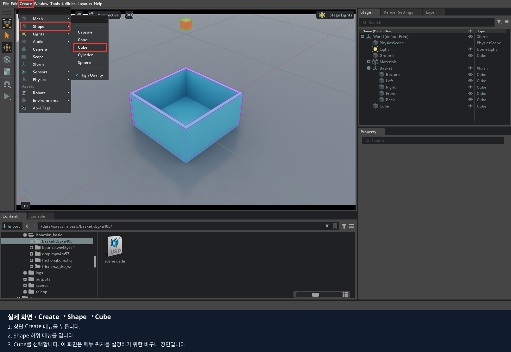

사진은 기존 바구니 장면의 메뉴 위치입니다. 이번 실습의 값은 위 표기를 따릅니다.

## 3. 바닥과 네 벽으로 열린 바구니 만들기

1. World 아래 `Create > Xform`으로 `Basket`을 만듭니다. Translate=`(1.2,0,-0.021)`, Rotate=0, Scale=1로 둡니다.
2. Basket 아래 `Create > Shape > Cube`로 다섯 객체를 만들고 아래 이름과 값을 입력합니다.
3. 모두 Size=1, Rotate=0입니다. Translate는 **Basket 기준 로컬 위치**이며 각 객체에 Collider만 추가합니다.

| 이름 | Translate (m) | Scale |
|---|---|---|
| Bottom | `(0,0,0.0075)` | `(0.44,0.44,0.015)` |
| Left | `(0,0.2125,0.09)` | `(0.41,0.015,0.18)` |
| Right | `(0,-0.2125,0.09)` | `(0.41,0.015,0.18)` |
| Front | `(0.2125,0,0.09)` | `(0.015,0.44,0.18)` |
| Back | `(-0.2125,0,0.09)` | `(0.015,0.44,0.18)` |

4. Viewport의 표시 메뉴에서 `Show By Type > Physics > Colliders > Selected`로 선택한 벽과 바닥의 접촉 형상을 확인합니다.
5. 입구가 비어 있는지 확인합니다. 바구니 전체를 덮는 하나의 Collider는 만들지 않습니다.

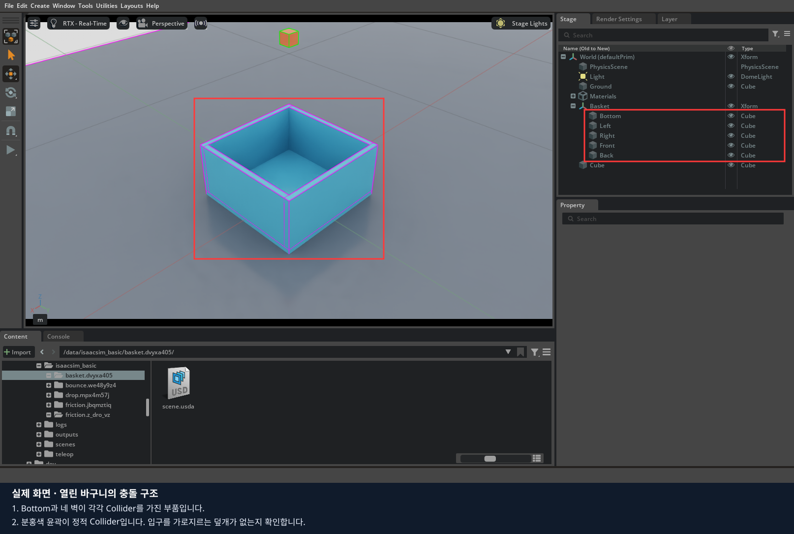

이 사진은 기존 바구니 실습의 형상 확인 화면입니다. 본인이 만든 다섯 객체도 입구를 막지 않아야 합니다.

Stage에서 World를 선택하고 낙하를 확인할 큐브를 하나 더 만듭니다. 경로는 `/World/DropCube`, Size=0.04, Scale=1, Rotate=0,
월드 Translate=`(1.2,0,0.4)`로 두고 Rigid Body·Collider·Mass=0.035를 추가합니다.
Play로 큐브가 바구니 안에 안착하는지 보고 Stop합니다. 이 확인에서는 로봇을 조작하지 않습니다.

## 4. 관찰 카메라 추가하기

1. Viewport를 Perspective로 두고 마우스로 바구니와 큐브가 함께 보이는 시점을 잡습니다.
2. Viewport 위쪽 카메라 메뉴의 `Camera > Create from View`를 선택합니다.
3. Stage에서 새 카메라 이름을 `OverviewCamera`로 바꾸고, 카메라 선택 메뉴에서 이 카메라를 선택합니다.
4. Camera 타입의 객체를 클릭해 Property의 Focal Length·Aperture·Clipping을 확인합니다.
5. Focal Length를 현재 값의 두 배로 바꿔 보이는 범위를 비교한 뒤 원래 값으로 복원합니다.

현재 시점으로 Camera를 만드는 메뉴는 [NVIDIA 5.1 카메라 안내](https://docs.isaacsim.omniverse.nvidia.com/5.1.0/robot_setup_tutorials/tutorial_gui_camera_sensors.html)에 설명되어 있습니다.

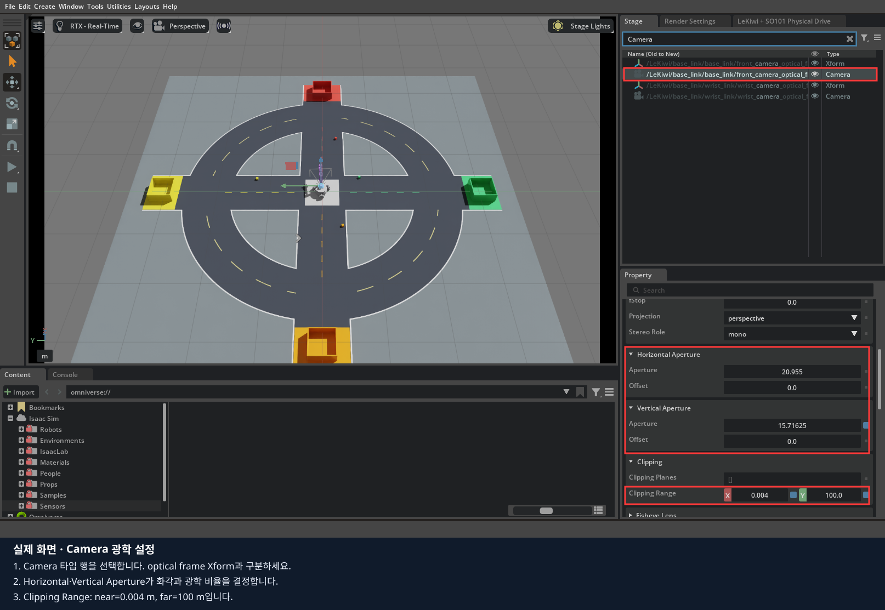

사진은 전방 카메라의 속성 위치입니다. 여기서는 직접 만든 OverviewCamera의 값을 기록합니다.
이 카메라는 장면을 관찰하는 고정 카메라입니다. 데이터 수집에 사용하는 전방·손목 카메라는 다음 코드 절에서 별도로 확인합니다.

## 5. 저장하고 직접 만든 환경 정리하기

Stop 상태에서 `File > Save`로 `my_lekiwi_scene.usda`를 저장합니다. Docker 수업에서는 `/data/isaacsim_basic/` 아래를 사용합니다.
원본 로봇 자산 파일은 덮어쓰지 않습니다. `File > Open`으로 본인의 장면을 다시 열어 로봇·큐브·바구니·카메라를 확인합니다.

[기록지](worksheet.md)에 장면 경로, 바구니 Collider 화면, 낙하 결과, 카메라 화면을 남깁니다.
바구니 입구를 하나의 충돌 형상이 막으면 큐브가 들어갈 수 없는 이유를 설명합니다.
**이 USD에는 장면이 저장됩니다. 사람의 시연이나 시간별 RGB·명령 데이터는 아직 기록하지 않았습니다.**

## 6. 마지막: 같은 작업을 코드로 구현하기

먼저 직접 만든 구성 요소가 어떤 코드에 대응하는지 확인합니다. 이어 준비된 기록 환경에서 시연·저장·변환을 진행합니다.
**현재 기록기는 앞에서 저장한 임의 USD를 여는 방식이 아닙니다.** 전체 코스·두 카메라·초기 배치 정보가 연결된 환경을 사용합니다.
앞의 간단한 제작 장면과 실제 수집 환경의 차이를 구분해 기록합니다.

| 구성·작업 | 화면으로 하는 일 | 코드에서 같은 역할 |
|---|---|---|
| 로봇 | Xform에 제공 USD를 Reference로 추가 | `keyboard_drive.py`의 `WheeledRobot(... usd_path=...)` |
| 바닥·큐브·바구니 | Shape 생성, Transform·Rigid Body·Collider 설정 | `collection_course.py`의 `build_course()`·`_build_basket()` |
| 도로·색상별 배치 | 객체를 배치하고 색상 지정 | `color_course.py`의 `build_color_geometry()`와 배치 생성 |
| 카메라 | Camera 생성·부모·렌즈 속성 설정 | `robot_cameras.py`의 `attach_cameras()` |
| 시연 | 준비된 기록 환경에서 주행·기록 키 조작 | 입력 처리와 `RecordingPanel` |
| RGB·상태·명령의 시간 연결 | 기록 상태와 로그 확인 | `before_step()`·`after_step()`·`accept_capture()` |
| LeRobot 변환·업로드·ACT | 브라우저 터미널에서 학생 스크립트 실행 | 03~07번 학생 파일 |


기록 구현은 [01_lekiwi_recording.py](experiments/01_lekiwi_recording.py)에 있습니다.
이 파일은 프로젝트 로봇 자산·EpisodeWorker·데이터 형식을 사용하므로 저장소 전체가 필요합니다.
직접 만든 USD를 저장하고 빈 편집 화면을 종료한 다음 아래로 이어갑니다.

### 코드 실행과 수정 순서

설치는 0장에서 마쳤다고 가정합니다. 아래 명령 중 본인 환경의 한 가지만 사용합니다.

원격 수업 — 브라우저 터미널:

```bash
lesson run 6
```

데스크탑 직접 실행 — 저장소 루트 터미널:

```bash
./lekiwi basic --chapter 6
```

1. 이 절에 연결된 Python 파일을 열고, 앞에서 클릭했던 속성에 해당하는 줄을 찾습니다.
2. 기본 실행 결과를 직접 만든 환경의 결과와 비교합니다.
3. 실행을 종료한 뒤 지정된 기본 줄에 `#`를 붙이고 비교할 줄의 `#`를 지웁니다. 들여쓰기는 유지합니다.
4. 파일을 저장하고 같은 명령으로 다시 실행합니다. 화면에서 값을 바꾸는 실험과 구분해 기록합니다.

원격 수업은 코드 수정 후 `lesson stop` → `lesson run 6`로 재실행합니다.
학생 파일은 호스트에서 저장하면 다음 실행에 반영되며, 코드만 수정할 때 Docker 이미지 재빌드는 필요 없습니다.
아래 `./lekiwi ...` 예시는 데스크탑 터미널용입니다. 원격 수업에서는 위 `lesson` 명령을 사용합니다.

### 6.1. 기록 환경 실행과 기본값 수정

`./lekiwi record`도 같은 기록 코드를 사용합니다. 처음에는 실물 리더 없이 키보드로 짧은 직진·정지를 기록합니다.
좌측 Perspective / 우측 front 화면이 열립니다. 별도 기록 탭은 없습니다.
터미널에서 `LEKIWI_RECORD state=READY`까지 기다립니다.

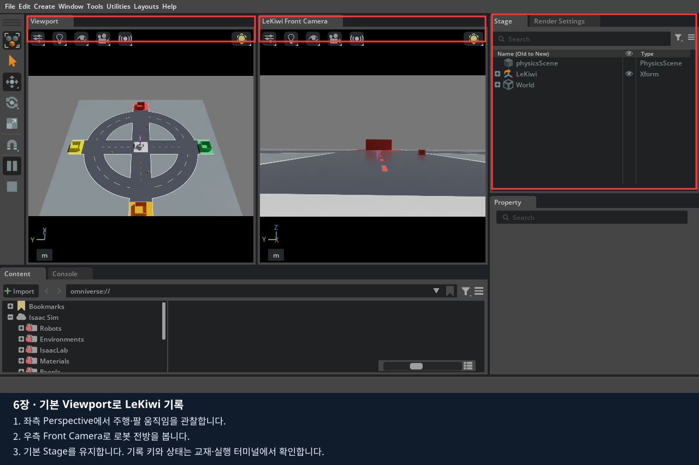


**먼저 완성된 기록 환경을 화면에서 확인합니다. 아직 F5를 누르지 않습니다.**

1. Stage의 LeKiwi를 펼쳐 로봇 링크·관절을 봅니다.
2. CollectionCourse에서 큐브·바구니를 찾고, 앞서 직접 만든 형상·질량·Collider와 비교합니다.
3. Stage 검색에서 Camera 타입을 찾아 전방·손목 카메라의 부모를 확인합니다.
4. Viewport 카메라 메뉴에서 두 시점을 각각 확인합니다. 앞의 OverviewCamera와 역할이 다릅니다.

현재 환경에서는 관찰만 합니다. 기록 도중 객체 위치·카메라 설정을 바꾸지 않습니다.

`RecordingPanel`은 이전 코드와의 호환을 위한 클래스 이름이며 UI 창을 만들지 않습니다.
생성자에서 다음 부분을 찾아 기본 30초 줄 대신 120초 또는 0 줄을 활성화합니다.

```python
self.duration_seconds = 30
# self.duration_seconds = 120
# self.duration_seconds = 0
```

0은 무제한이며 F6으로 끝냅니다. 시간은 시뮬레이션 시간 기준입니다.
파일 수정 없이 실행별 값을 지정하려면 다음처럼 합니다. 환경변수 값이 코드 기본값보다 우선합니다.

```bash
LEKIWI_RECORD_SECONDS=120 ./lekiwi record
```

파일 상단의 `task_description`은 **이번 시연에서 수행할 작업 설명**입니다. 기본 줄을 주석 처리하고 집기 과제 줄을 해제합니다.

```python
# task_description = "Move forward and stop"
task_description = "빨간 큐브를 빨간 바구니에 넣기"
```

설명은 에피소드의 `manifest.json` 안에 `task`로 저장되고, LeRobot 변환 시에도 같은 `task`로 전달됩니다.
같은 의미의 시연에는 일관된 설명을 사용합니다. 설명을 바꾸면 저장할 작업 이름이 바뀌며, 로봇이 자동으로 그 작업을 수행하는 것은 아닙니다.
`LEKIWI_RECORD_TASK` 환경변수에 비어 있지 않은 값을 지정하면 파일의 기본 설명보다 우선합니다.
지정하지 않거나 비우면 코드의 `task_description`을 사용합니다.

[브라우저 편집기 연결](../../docs/browser-classroom.md)을 마쳤다면 이 파일을 수정하고 `Ctrl+S`로 저장한 뒤,
브라우저 터미널에서 `lesson run 6 --teleop`으로 서버의 기록 실습을 실행합니다.
이미 실습이 켜져 있으면 기록의 저장·폐기를 마치고 `lesson stop` 후 재실행합니다.
화면은 노트북의 WebRTC 클라이언트에서 서버 IP로 연결하고, USB 리더 입력은 노트북의 별도 연결 프로그램에서 보냅니다.

### 6.2. 기록·저장·폐기

Viewport를 클릭한 상태에서 한 번씩 누릅니다. 파일 작업은 키 콜백이 아닌 주 반복문에서 처리합니다.

| 키 | 동작·조건 |
|---|---|
| F5 | READY / SAVED / DISCARDED에서 새 기록 시작 |
| F6 | 수집 종료 요청. 마지막 영상·파일 쓰기가 끝나면 UNSAVED |
| F7 | UNSAVED 기록을 실패·연습(success=false)으로 저장 |
| F9 | 통신 중단 없이 마친 UNSAVED 기록을 성공(success=true)으로 저장 |
| F10 두 번 | 3초 안에 두 번 눌러 이번 미저장 기록 폐기 |
| F8 | 저장·폐기 완료 후 로봇 초기화·라인별 큐브 재배치 |
| SPACE | 로봇 주행·가상 팔 추종 정지. 파일 수집은 별도로 F6 |

화면 왼쪽 위의 상태 표시에서 수집 여부와 시간을 확인합니다.

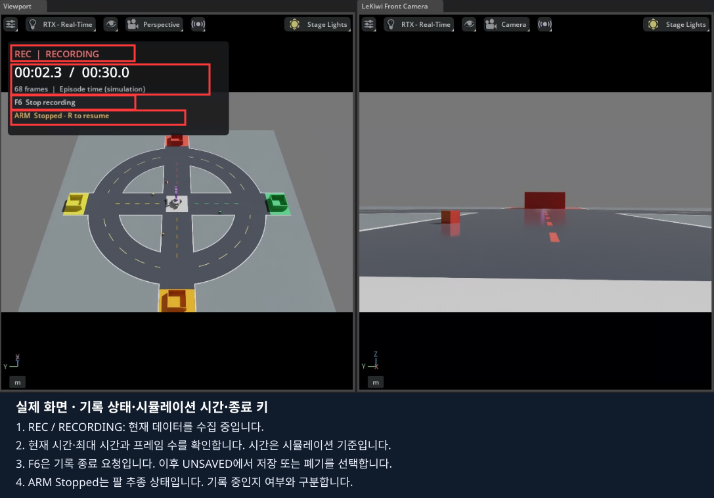

위 화면은 리더를 연결하지 않고 상태 표시를 검사한 예시입니다. `ARM Stopped`에서도 기록은 가능하며, 실제 시연에서는 팔 추종 상태도 함께 확인합니다.

| 화면 표시 | 뜻 |
|---|---|
| `READY` | F5로 새 기록을 시작할 수 있음 |
| 빨간 `REC / RECORDING` | 수집 중. 현재 에피소드 시간 / 최대 시간과 프레임 수 표시 |
| `FINISHING` | 마지막 영상과 파일 쓰기를 기다리는 중 |
| `STOPPED / NOT SAVED` | F6으로 수집을 끝냈지만 아직 저장하지 않음 |
| `SAVING` → `SAVED` | 검증·저장 진행 → 저장 완료 |
| `RECORDING ERROR` | 오류 확인 후 F10을 두 번 눌러 해당 기록 폐기 |

시간은 **수집한 프레임 수 ÷ 30 FPS인 시뮬레이션 시간**입니다. 실행이 느리면 실제 대기 시간과 다를 수 있습니다.
시간 제한이 0이면 `NO LIMIT`로 표시됩니다. 리더 입력 사용 시 `ARM Following leader` 또는
`ARM Stopped - R to resume`도 함께 표시합니다. Space로 팔을 멈춘 경우 수집 종료는 별도로 F6을 누릅니다.
원격 입력·영상 연결이 끊긴 경우에는 아래 절차에 따라 기록이 자동 중단됩니다.
상태 표시는 Viewport UI에만 그려지며 저장하는 front/wrist 영상에는 포함되지 않습니다.

1. READY를 확인하고 F5를 누릅니다.
2. 짧게 W로 전진한 뒤 이동키를 모두 놓고 SPACE로 정지합니다.
3. F6을 누릅니다. FINISHING 동안 마지막 RGB와 파일 쓰기를 기다립니다.
4. UNSAVED에서 결과를 검토하고 F7 또는 F9를 누릅니다.
5. `SAVING → SAVED`와 `LEKIWI_RECORD saved=... frames=...`를 확인합니다.

성공 표시는 자동 판정이 아닙니다. 실제 과제를 완료했을 때만 F9를 사용합니다.
F10은 이미 저장된 에피소드를 지우지 않습니다. 기록 중 Pause/Stop은 시간 연결 오류가 되므로 해당 take를 폐기하고 새로 시작합니다.
F8은 미저장·기록·저장 진행 중에 차단됩니다. 완료 후 재배치하고 리더 사용 시 R을 다시 누릅니다.

#### 기록 중 연결이 끊기면

짧은 원격 입력 끊김은 [4장의 복구 절차](../04_teleoperation/README.md#47-실습-중-늦어지거나-끊기면)에 따라 자동 복구를 기다립니다.
**팔 추종이 돌아와도 중단된 기록은 자동으로 이어 붙이지 않습니다.**
원격 리더 입력이 0.5초 넘게 끊기거나 영상 연결 종료를 감지하면 새 프레임 수집을 중지합니다.
이미 수집한 프레임의 영상·파일 쓰기를 마친 뒤 `STOPPED / NOT SAVED`로 바뀝니다.
`Connection interrupted - recording stopped`가 나오면 다음 순서로 진행합니다.

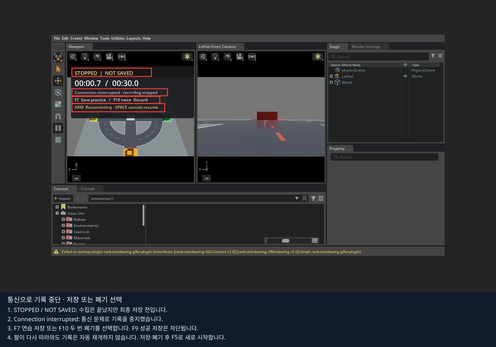

위 화면은 핫스팟 서버에서 시험 입력으로 수집하다 연결을 끊어 확인한 결과입니다.
21프레임에서 중단됐으며, 팔의 자동 복구와 기록의 저장·재시작은 별도로 처리합니다.

1. 이동키를 놓고 리더를 멈춘 뒤 `FINISHING`이 끝날 때까지 기다립니다.
2. 기록을 남기려면 **F7**로 연습 저장하고 `SAVED`를 확인합니다. 사용하지 않을 기록은 **F10을 두 번** 눌러 폐기합니다.
3. 팔 추종과 베이스 조작이 정상인지 확인합니다. `ARM Stopped`이면 자세를 확인하고 **R**을 누릅니다.
4. **F5**로 새 에피소드를 시작하고 빨간 `REC`와 프레임 증가를 확인합니다.

통신 때문에 중단된 기록에는 F9 성공 저장을 사용할 수 없습니다. 팔이 자동 복구돼도 먼저 F7 저장 또는 F10 폐기를 마쳐야 새 기록을 시작할 수 있습니다.
원격 리더 실습에서는 팔 추종이 활성화된 뒤 F5를 누릅니다. 저장할 프레임이 없거나 `RECORDING ERROR`이면 F10 두 번으로 해당 기록을 폐기합니다.
`NOT SAVED`는 최종 저장 전이므로 서버 실습을 종료하지 마세요. 영상 연결 종료를 감지하기까지는 지연이 있을 수 있습니다.

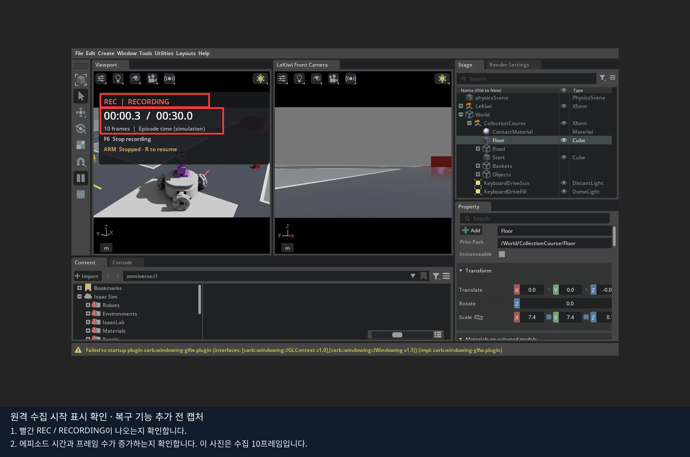

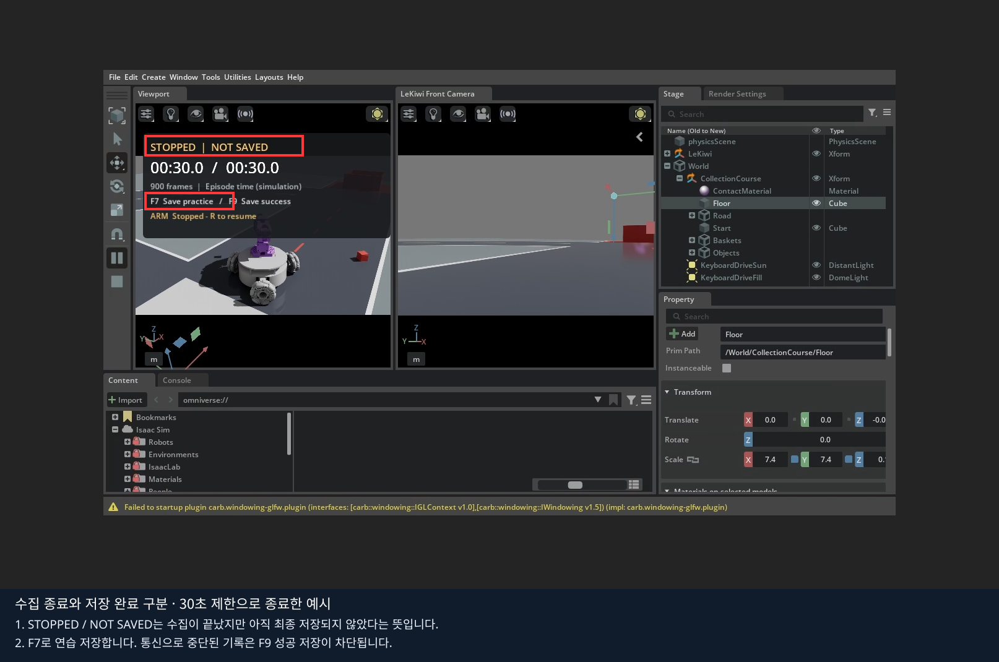

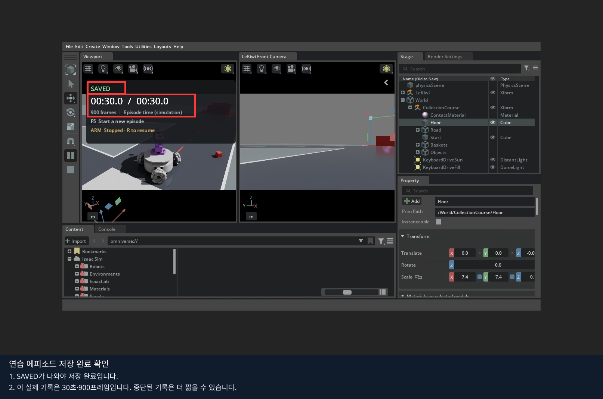

위 사진은 실제 원격 수집에서 **REC → NOT SAVED → SAVED**를 확인한 예시입니다.
해당 기록은 30초 제한으로 종료한 것이며, 새 통신 복구 기능의 화면 검증 사진은 아닙니다.

### 6.3. 원본 파일과 시간 순서

```text
/data/recordings/lekiwi.XXXXXXXX/
  episode.XXXXXXXX/
    manifest.json
    frames.jsonl
    images/front/
    images/wrist/
```

정확한 파일·카메라 경로는 manifest에 기록됩니다. `.partial`은 미완료이며 완성 데이터로 쓰지 않습니다.
한 프레임은 관측 상태 t, 두 RGB t, action t, 후속 상태 t+1/30초를 담습니다.
팔 6개 관절은 rad, 베이스 명령은 m/s·rad/s이며 순서는 manifest의 feature 설명을 따릅니다.
카메라 장착·보정값, 초기 코스, 작업 설명, 성공 여부도 manifest에 남깁니다.

PNG 저장은 백그라운드에서 수행합니다. 저장이 밀리거나 RGB 프레임이 빠지면 ERROR로 중단합니다.
프레임을 조용히 생략한 데이터셋을 만들지 않습니다. 터미널 오류와 저장 공간을 확인한 뒤 새로 수집합니다.

### 6.4. 영상이 만들어지는 코드

```python
product = rep.create.render_product(camera_path, resolution)
rgb = rep.AnnotatorRegistry.get_annotator("rgb")
rgb.attach([product.path])
rgba = np.asarray(rgb.get_data())
```

실제 파일은 front·wrist 각각에 Render Product와 RGB annotator를 연결합니다.
`get_data()`의 결과는 최신 도착 영상입니다. **현재 물리 스텝과 같은 시각이라고 가정하면 안 됩니다.**

`snapshot()`은 ReferenceTime을 카메라의 실제 시뮬레이션 촬영 시각으로 바꾸고 두 카메라의 시각이 같은지 검사합니다.
`before_step()`은 상태·명령을 보관하고, `after_step()`은 다음 상태를 연결합니다.
`accept_capture()`가 늦게 도착한 RGB를 원래 촬영 시각의 상태·명령에 연결합니다.
이 교재의 기록 실행은 렌더 완료를 기다리는 동기 설정을 사용합니다. 명령 전 t의 영상을 잠시 보관하고, 물리 스텝 후 t+dt 상태와 합쳐 저장합니다.
지연 영상도 촬영 시각으로 검사합니다. 매 프레임 타임라인 Pause/Play를 반복하지 않습니다.

다음 읽기 과제: `world.current_time`으로 모든 영상 시각을 덮어쓰면 왜 학습 데이터가 잘못될 수 있는지 설명합니다.
시간 검사는 삭제하지 말고 의미를 읽습니다.

### 6.5. LeRobot 데이터셋으로 변환하기

[브라우저 VS Code 수업](../../docs/browser-classroom.md#7-python-파일을-수정하고-데이터-변환검사)에서는 변환 설정도 Python 파일에서 수정합니다.
먼저 저장을 완료하고, 브라우저의 새 터미널에서 다음을 실행합니다.

```bash
cd 06_lekiwi_dataset/experiments
python3 02_dataset_list.py
```

[03_convert_dataset.py](experiments/03_convert_dataset.py) 상단의 `episode_ids`에 목록의 실제 `id`를 넣고,
`dataset_name`을 새 이름으로 정합니다. `success_only = False`는 선택한 연습·성공 기록 모두, `True`는 F9 성공 기록만 변환합니다.
`Ctrl+S`로 저장한 뒤 같은 터미널에서 실행합니다.

```bash
python3 03_convert_dataset.py
```

`LEKIWI_DATASET_JOB result=PASS`와 프레임·에피소드 수를 확인합니다. 변환 결과는 탐색기의 **LeRobot 데이터셋**에서 읽습니다.
[04_inspect_dataset.py](experiments/04_inspect_dataset.py)의 `dataset_name`을 같은 이름으로 저장하고 `python3 04_inspect_dataset.py`로 재검사합니다.

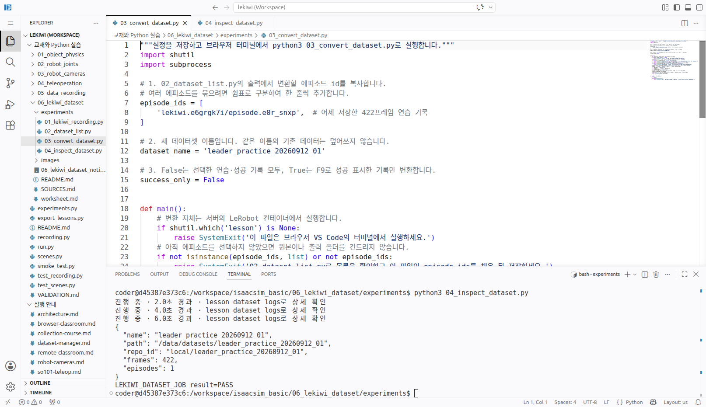

2026-09-12 실제 확인 화면입니다. 전날 수집한 **1개 에피소드·422프레임·14.07초**의 연습 기록을 변환했고, 검사 파일도 통과했습니다.
화면의 에피소드 ID와 데이터셋 이름은 이 검증의 예시이며, 학생은 자신의 목록과 새 이름을 사용합니다.

긴 작업은 `lesson dataset status` / `lesson dataset logs`로 확인합니다. 브라우저 터미널의 Ctrl+C는 대기만 끝내며 서버 변환은 계속됩니다.
다음은 **서버 호스트 터미널**에서 같은 변환을 하는 방법입니다. 브라우저에서 이미 변환했다면 중복 실행하지 않습니다.

필요한 기록을 저장한 뒤 Isaac Sim을 닫고 종료를 기다립니다.
아래 `lekiwi.XXXXXXXX`를 **터미널의 LEKIWI_RECORD directory에 나온 실행 폴더**로 바꾸고 출력 폴더는 아직 없는 새 이름을 사용합니다.

```bash
./lekiwi export-dataset \
  --input /data/recordings/lekiwi.XXXXXXXX \
  --output /data/datasets/lekiwi_lesson6_01 \
  --repo-id local/lekiwi_lesson6
```

한 실행 폴더의 완료된 에피소드를 묶습니다. `--input`에 저장된 `episode.<ID>` 폴더 하나만 지정할 수도 있습니다.
`--success-only`를 붙이면 사용자가 성공으로 표시한 기록만 선택합니다. 기본값은 연습·성공 기록을 모두 포함합니다.
출력 폴더가 이미 있으면 덮어쓰지 않고 종료합니다. 카메라 장착값이나 해상도가 다른 기록은 한 데이터셋으로 섞지 않습니다.

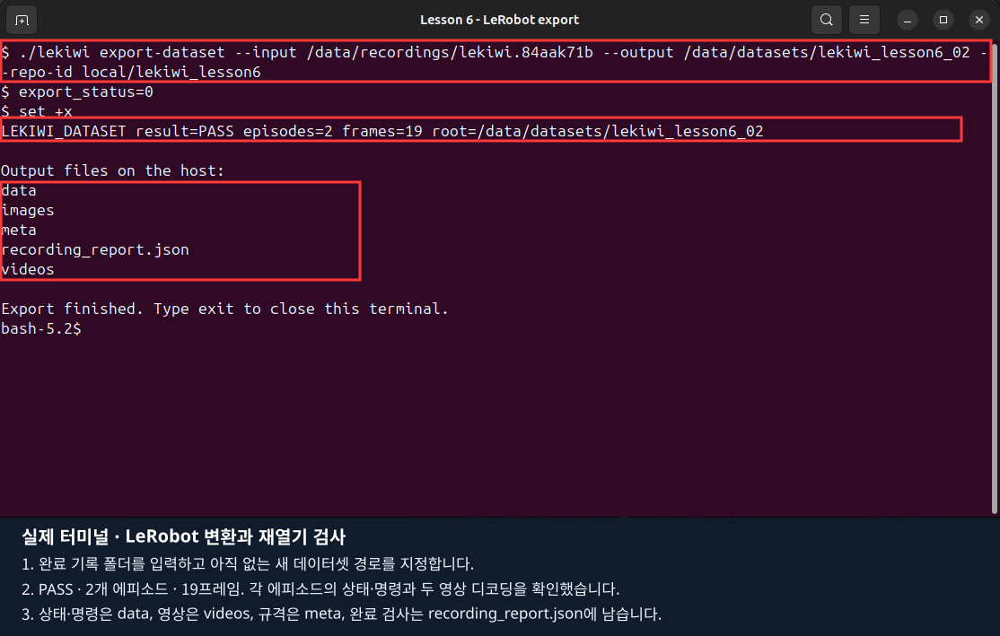

이 터미널 이미지는 앞서 검증한 **2개 에피소드·19프레임**의 과거 변환 예시이며, 위 브라우저 변환 결과와 별개입니다.

변환은 LeRobot 이미지에서 수행하므로 호스트에 LeRobot을 별도 설치하지 않습니다.
PNG를 두 카메라 영상으로 인코딩하고 상태·행동은 Parquet, 에피소드·feature 정보는 meta 아래에 저장합니다.

```text
data/datasets/lekiwi_lesson6_01/
  data/                 상태·행동 Parquet
  videos/               front·wrist 영상
  meta/                 feature·통계·에피소드 정보
  recording_report.json 변환 완료·입력 출처·카메라 설정·검사 결과
```

`LEKIWI_DATASET result=PASS`와 에피소드 수·총 프레임 수를 확인합니다.
변환 중 오류가 나면 `recording_report.json`의 완료 표시가 없습니다. 해당 출력은 완성된 데이터셋으로 사용하지 않습니다.
원본 에피소드를 확인한 뒤 새 출력 폴더로 다시 변환합니다.

변환기는 LeRobot의 `finalize()`로 파일을 닫고 다시 열어 프레임 수를 비교합니다.
각 에피소드의 처음·중간·마지막에서 실제 관측·행동과 두 영상의 디코딩을 검사합니다.
이는 **파일 검증**이며, 로봇을 움직여 같은 동작을 재현하는 물리 재생이나 정책 성능 검증은 아닙니다.
원본 JSON에는 후속 상태·카메라 시각도 남기고, LeRobot 학습 feature에는 관측 상태·두 RGB·행동을 전달합니다.

검사한 데이터를 선택적으로 Hugging Face에 올리려면 [05_upload_dataset.py](experiments/05_upload_dataset.py)의
`dataset_name`, `repo_id`, `private`를 수정하고 브라우저 VS Code 터미널에서 실행합니다.
기본값 `private = False`는 공개 업로드입니다. 비공개가 필요하면 `True`로 바꿉니다.

```bash
python3 05_upload_dataset.py
```

실행할 때 쓰기 토큰을 숨김 입력합니다. 토큰은 파일·명령행·로그에 저장하지 않습니다.
학습용 `data/`, `meta/`, `videos/`와 자동 생성한 `README.md` 카드를 업로드하고 로컬 경로가 든 `recording_report.json`은 제외합니다.
`repo_id`에는 새 저장소 이름을 사용합니다. 기존 데이터·버전 태그가 있으면 중단합니다.
모든 학습 파일·카드와 LeRobot이 읽을 `v3.0` 태그를 확인한 뒤 `LEKIWI_DATASET_JOB result=PASS`를 출력합니다.
로컬 학습만 진행한다면 이 단계는 건너뜁니다.


### 6.6. 리더 시연과 로컬 학습으로 연결

[4편](../04_teleoperation/README.md)의 장비 준비·보정을 끝낸 뒤 기존 시뮬레이터를 닫습니다.
본인 USB 경로로 다음을 실행합니다. 실물 장비의 안전 확인은 한 단계씩 수행합니다.

```bash
LEKIWI_RECORD_SECONDS=120 ./lekiwi teleop \
  --port /dev/serial/by-id/usb-본인_SO101_장치 \
  --id so101_leader --scene random --record
```

기록 옵션이 리더를 자동 활성화하지 않습니다. R 활성화 뒤 같은 F5/F6/F7/F9 키를 사용합니다.
리더 시연을 충분히 모으고 변환이 PASS인 로컬 데이터셋으로 학습합니다. Hugging Face 업로드는 선택 단계입니다.
학습·추론 명령은 [프로젝트 README](../../README.md)와 [로컬 데이터 관리](../../docs/dataset-manager.md)를 따릅니다.
짧은 저장 검사를 통과했다는 사실과 충분한 학습 데이터·정책 성능을 구분합니다.

### 6.7. ACT 학습 스크립트

[06_train_act.py](experiments/06_train_act.py) 상단에서 다음 값을 수정하고 저장합니다.

```python
dataset_name = 'lekiwi_lesson6_01'
repo_id = None
run_name = 'act_lesson6_01'
steps = 1000
batch_size = 4
```

공개 업로드 데이터를 쓰려면 `dataset_name=None`, `repo_id='계정명/데이터셋명'`으로 바꿉니다.
실행 검사만 할 때는 `steps=1`, `batch_size=1`, `pretrained_backbone=False`를 사용합니다.
본 학습에서는 `pretrained_backbone=True`로 시작하며 첫 다운로드에 인터넷 연결이 필요합니다.
GPU·드라이버·CUDA 환경은 학습할 PC에 맞게 준비합니다.

```bash
lesson stop
python3 06_train_act.py
```

다른 터미널의 `lesson train logs`에서 손실과 진행 상황을 확인합니다.
`lesson train status`로 상태를 조회하고, 서버 학습을 중단하려면 `lesson train stop`을 사용합니다.
Ctrl+C는 대기만 끝냅니다. 새 시도에는 새 `run_name`을 사용하며, 기존 결과를 지우지 않습니다.
모델은 **ACT 학습 결과**의 `<run_name>/train/checkpoints/last/pretrained_model`에 저장됩니다.

### 6.8. ACT 추론 스크립트 — 최종 리허설에서 동작 확인

[07_infer_act.py](experiments/07_infer_act.py)의 `run_name`을 학습 때와 같은 이름으로 저장합니다.
`checkpoint='last'`는 마지막 저장 모델, `seconds=30`은 시작 후 최대 시뮬레이션 시간입니다.

```bash
python3 07_infer_act.py
lesson status
```

READY가 되면 WebRTC 화면에 연결해 **R 시작 / Space 정지 / F8 초기화**를 사용합니다.
연결이 끊기거나 장면이 초기화되면 추론은 정지하며, R을 다시 눌러 시작합니다.
모델과 함께 저장한 정규화 통계·두 카메라·상태 및 행동 순서를 재사용합니다.
종료는 `lesson stop`, 오류 확인은 `lesson logs`입니다.

이번 단계에서 학습은 정상 실행 여부까지만 검사합니다. 추론의 실제 동작과 수집부터 추론까지의
전체 과정은 학습·추론 스크립트가 준비된 뒤 최종 리허설에서 확인합니다.
짧은 연습 기록이나 실행 검사 모델로 실제 과제 성공을 기대하지 않습니다.

완료 기준: [기록지](worksheet.md)에 수집 시간·프레임 수·성공 여부·저장 경로·변환 결과를 남깁니다.

[공식 자료](SOURCES.md) · [전체 목차](../README.md)
