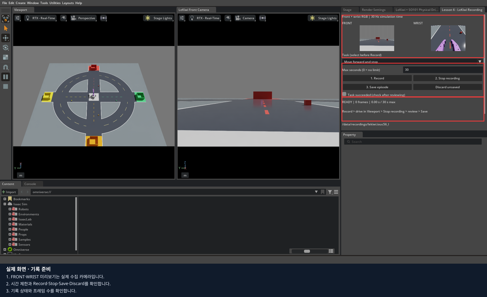
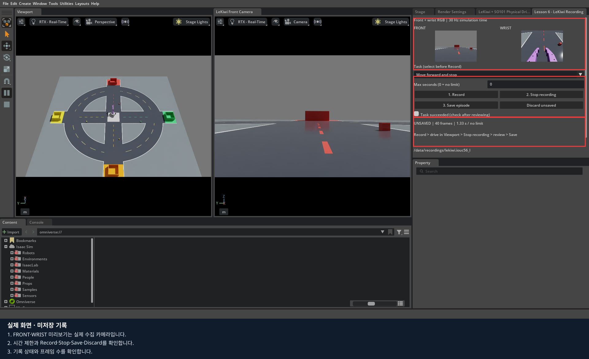
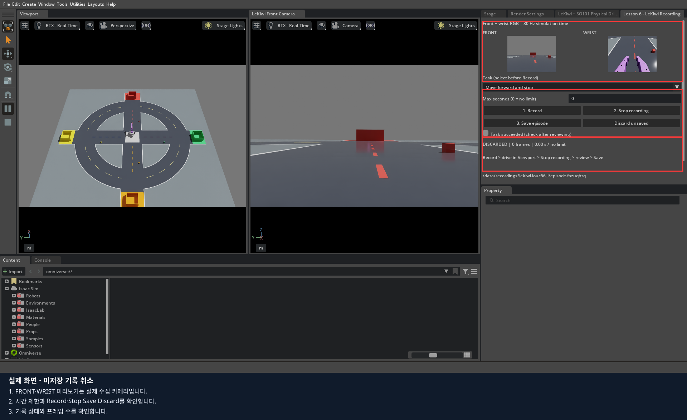
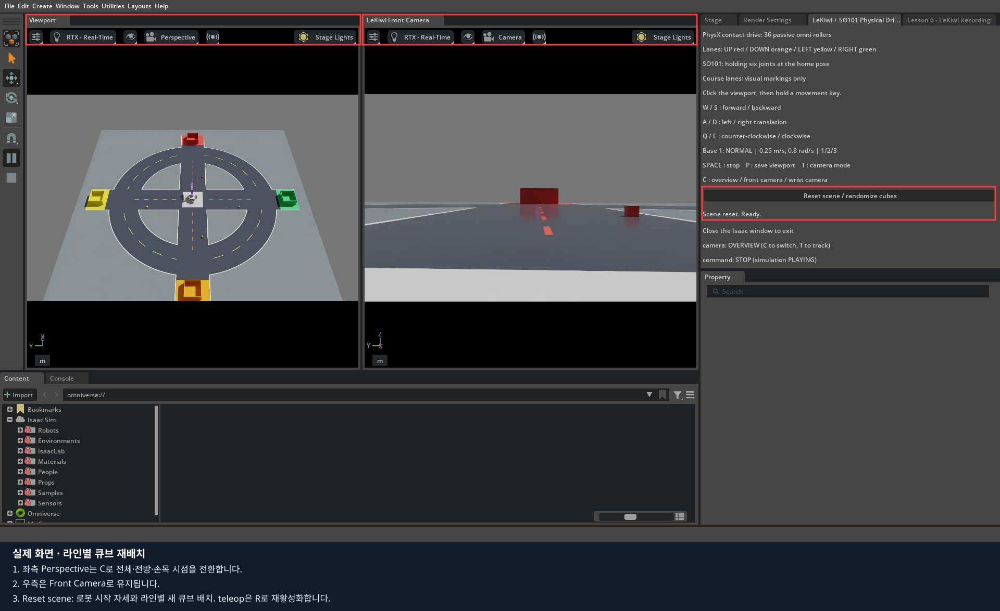

# 6편 · LeKiwi 영상·명령 수집과 LeRobot 데이터셋 만들기

**목표:** 전방·손목 RGB와 실제 관절값·베이스 속도, 적용 명령을 한 에피소드로 기록하고 검사를 통과한 기록을 로컬 LeRobot 데이터셋으로 변환합니다.
Isaac Sim 5.1.0 / LeRobot 0.6.1 Docker 기준, 키보드 기록·변환은 예상 90~120분입니다.
4편에서 준비한 리더로 시연을 수집하는 선택 실습은 30~60분을 추가로 잡습니다.

5편은 한 관절 JSON으로 에피소드 개념을 배웠습니다. 이번에는 **LeKiwi + SO101과 두 카메라**를 사용합니다.
앞부분은 실물 없이 키보드로 짧게 주행하면서 수집 경로를 검증합니다. 실제 리더는 뒷부분의 선택 실습에서만 연결합니다.
이 장에서 만드는 것은 데이터셋이며 학습·정책 실행은 다음 단계입니다.

## 1. 실행과 화면 확인

기본 뷰포트는 **좌측 Perspective / 우측 Front Camera**입니다.
Stage 옆 기록 창의 FRONT / WRIST 미리보기는 저장되는 두 카메라 영상입니다.
`C`로 좌측 시점을 바꾸어도 우측 전방 카메라와 수집 카메라는 유지됩니다.

[전체 설치 안내](../README.md)를 마친 뒤 저장소 최상위에서 실행합니다.
열려 있는 Isaac Sim은 창을 닫고 종료가 끝난 후 진행합니다.

```bash
export LEKIWI_DOCKER_SUDO=1  # Docker에 sudo가 필요한 PC에서만
export ACCEPT_EULA=Y       # NVIDIA 라이선스를 읽고 동의한 경우
./lekiwi setup all
./lekiwi record
```

`record`는 실제 USB를 열지 않습니다. 팔은 기본 자세를 유지하고 베이스는 키보드로 움직입니다.
`Lesson 6 - LeKiwi Recording`이 **Stage 옆 탭**으로 열립니다. `WARMING UP`에서 `READY`로 바뀔 때까지 기다립니다.
조작키 설명은 같은 영역의 `LeKiwi + SO101 Physical Drive` 탭에서 확인합니다.
창이 작아 아래쪽 경로가 보이지 않으면 패널 안을 스크롤하거나 Stage와 Property 사이의 경계를 아래로 드래그합니다.



- FRONT / WRIST는 서로 다른 카메라의 실제 RGB입니다. C로 Viewport 시점을 바꾸어도 수집 카메라는 바뀌지 않습니다.
- 기본 설정은 각 640×480 RGB입니다. 실제 크기는 카메라 설정의 `resolution`을 따릅니다.
- 팔 관절 6개와 베이스 속도 3개를 관측하고, 팔 목표 6개와 베이스 속도 명령 3개를 기록합니다.
- 기록 시간은 **30 Hz 시뮬레이션 시간**입니다. PC의 처리 속도가 느리면 3초 분량을 수집하는 데 실제로는 더 오래 걸릴 수 있습니다.

### 카메라를 먼저 살펴보기

전방에 도로와 물체가 보이는지 확인합니다. 손목 화면이 팔 부품에 가려지면 그 상태도 기록에 그대로 들어갑니다.
현재 카메라 장착은 3·4편과 같은 **SOARM base 기준 도면 TF**입니다. X·Z 치수는 반영했으며 Y·방향·실제 고정 링크 등의 최종 실물 확인 전까지 `calibrated=false`입니다.
본격적인 집기 시연을 쌓기 전에 [3편의 렌즈 중심·촬영 방향 확인](../03_robot_cameras/README.md)을 따라 현재 장착과 여러 팔 자세에서의 시야를 확인합니다.
이번 짧은 주행 실습에서는 가림을 관찰하고, 도면 기반 장착값과 보정 여부가 manifest에 남는 것을 확인합니다.

새로 저장하는 에피소드의 `manifest.json` 안 `camera_config`에는 적용된 장착값과 `measurement`가 함께 남습니다.
보정 전 에피소드는 이전 설정을 그대로 보존합니다. 카메라 설정이 다른 에피소드는 같은 변환 묶음에 섞지 않습니다.
기록 패널의 실제 화면 5장은 도면 TF를 적용한 실행에서 다시 촬영했습니다. 시작 화면의 기본 제한은 30초이며, 기록 예시는 0(시간 제한 없음)으로 바꾼 뒤 40프레임에서 수동 종료했습니다.

## 2. 한 번 기록하기

첫 과제는 `Move forward and stop`입니다. 과제 선택은 기록 전에만 가능합니다.
첫 저장·변환 확인에는 **1~3초 제한 또는 짧은 수동 종료**로 충분합니다. 아래 120초·300초는 설정 예시입니다.

1. **Max seconds (0 = no limit)**에 최대 수집 시간을 초 단위 정수로 입력한 뒤 **1. Record**를 누릅니다. 기본값은 `30`이고, `120`은 2분, `300`은 5분입니다. `0`은 시간 제한 없이 직접 종료할 때까지 수집합니다.
2. Viewport의 빈 하늘 부분을 클릭해 입력 포커스를 옮깁니다.
3. **1**로 기본 속도를 선택하고 **W를 짧게 누른 뒤 놓습니다.**
4. 로봇이 멈추는 것을 관찰하며 몇 프레임 더 기록합니다.
5. **2. Stop recording**을 누릅니다.


`RECORDING`의 프레임 수가 늘어나야 합니다. 키보드를 놓은 뒤의 정지 명령도 데이터에 포함됩니다.
팔이 기본 자세를 유지하는 키보드 실습은 집기 시연이 아닙니다. 이 기록을 집기 학습 데이터라고 표시하지 않습니다.

**Stop recording은 파일 수집만 멈춥니다. 로봇 주행 정지 버튼이 아닙니다.** 이동키를 먼저 모두 놓습니다.
Space는 베이스 정지에만 반응하고 시뮬레이션 재생은 유지합니다. 파일 수집을 끝내려면 기록 패널의 Stop recording을 사용합니다.
실제 리더 조작의 정지·비활성화 절차는 4편을 따릅니다.



설정한 시간은 **시뮬레이션 시간** 기준이며, 30 Hz에서 `설정 초 × 30`프레임의 관측을 모으면 새 수집을 끝내고, 마지막 영상과 파일 쓰기를 기다리는 `FINISHING`을 거쳐 `UNSAVED`로 전환합니다. 자동 저장하지 않으므로 성공 여부를 확인한 뒤 Save episode를 누릅니다. `0`이면 자동 종료하지 않으며 **Stop recording**으로 끝냅니다. 양수로 설정해도 언제든 먼저 종료할 수 있습니다.

시간 설정은 기록 전에만 변경할 수 있고, 같은 실행에서는 다음 에피소드에도 유지됩니다. 프로그램을 다시 실행하면 기본값 30초로 시작합니다. 선택한 값은 원본 `manifest.json`의 `max_duration_seconds`에 남으며 `0`은 무제한을 뜻합니다. 오래 수집할수록 두 카메라의 PNG 파일과 디스크 사용량도 늘어납니다.

## 3. 성공 여부와 저장·버리기

이번 과제의 성공 기준은 **앞으로 이동한 뒤 정지했고, 필요한 영상과 명령이 기록되었는가**입니다.
조건을 확인했을 때만 `Task succeeded`를 체크하고 **3. Save episode**를 누릅니다.
체크하지 않은 연습 기록도 저장할 수 있으며 `success=false`로 남습니다. 체크는 자동 성공 판정이 아닙니다.


저장 시 모든 프레임의 시간 대응, 두 PNG의 크기·색상 형식·SHA256을 검사합니다.
검사 중에는 **SAVING**이 표시되며 화면과 시뮬레이션은 계속 갱신됩니다.
검사가 끝난 뒤에만 완료 manifest를 기록하고 `.partial`을 제거합니다. **SAVED를 확인한 뒤 종료합니다.**
긴 기록은 검사에도 시간이 걸립니다. 제작 PC의 5분 분량(9,000프레임) 검사에는 약2분20초가 걸렸습니다. PC에 따라 달라지며, 미리보기가 갱신되고 `SAVING`이면 완료를 기다립니다. 드문 화면 지연이 남을 수 있으며 상세 수치는 [검증 기록](SOURCES.md)을 참고합니다.
화면과 터미널의 `LEKIWI_RECORD saved=...` 경로를 기록지에 적습니다.

잘못된 기록은 **Discard unsaved**로 버리고 다시 시작합니다.
파일 쓰기가 끝나는 것을 기다려 **DISCARDING → DISCARDED**로 바뀝니다.
이 버튼은 이번 미저장 기록만 지우며 이미 저장된 에피소드에는 영향을 주지 않습니다.



**새 Record는 로봇이 지금 있는 위치에서 시작합니다.** 코스·큐브·로봇을 자동 초기화하지 않습니다.
새 큐브 배치로 반복하려면 저장 또는 폐기가 완료된 뒤, Stage 옆 조작 탭의 **Reset scene / randomize cubes**를 누릅니다.
가상 로봇은 시작 자세, 큐브는 같은 색상 라인 안에서 새 위치·방향으로 배치됩니다. 바구니·도로와 저장된 에피소드는 유지됩니다.
다음 Record의 `course_layout`에는 새 배치가 기록되고, 새 `data/scenes/course.*/layout.json`도 저장됩니다.
녹화·마무리·미저장·저장·폐기 중에는 리셋이 차단됩니다. teleop 사용 시 Reset 후 **R**로 다시 활성화합니다.



정확히 동일한 과거 배치를 재현하려면 아래처럼 저장한 layout.json으로 새 실행을 시작합니다.

```bash
# 실제 저장 경로로 XXXXXXXX를 바꿉니다.
LEKIWI_COURSE_LAYOUT=/data/scenes/course.XXXXXXXX/layout.json ./lekiwi record
```

미저장 상태에서 창을 닫으면 `.partial` 디렉터리가 남습니다. 완료 기록으로 취급하지 않으며 변환에서도 제외합니다.
Pause·Stop 또는 타임라인 초기화로 기록 시간에 틈이 생기면 `ERROR`로 전환합니다.
이전 프레임을 복사하거나 시간을 다시 붙여 정상 데이터처럼 저장하지 않습니다. 미저장 기록을 버리고 Play 후 새로 기록합니다.

## 4. 파일과 한 프레임 읽기

```text
data/recordings/lekiwi.<실행별 ID>/
  episode.<ID>/
    manifest.json
    frames.jsonl
    images/front/000000.png ...
    images/wrist/000000.png ...
  episode.<다른 ID>.partial/   미완료 기록, 변환에서 제외
```

컨테이너의 `/data/recordings/...`는 호스트 저장소의 `data/recordings/...`와 같은 결과입니다.
교재와 코드는 이미지에 포함되지만 기록 파일은 Git·Docker 빌드에서 제외됩니다.

| 필드 | 의미 |
|---|---|
| `frame_index`, `timestamp` | 에피소드 내 순번과 시각, 첫 프레임은 0 |
| `simulation_time` | 관측을 읽은 시뮬레이션 시각 t |
| `observation.state` | 실제 팔 관절 6개 + 실제 베이스 속도 vx·vy·wz |
| `action` | 관측 후 적용한 팔 목표 6개 + 베이스 속도 명령 vx·vy·wz |
| `next_observation.state` | 1/30초 물리 실행 후 실제 상태 |
| `next_simulation_time` | t + 1/30초 |
| `cameras.front`, `cameras.wrist` | t에서 동기 캡처한 RGB 시각·render reference·상대 경로·SHA256 |
| `base_pose` | 관측 시 베이스의 world 위치 xyz와 쿼터니언 wxyz, 진단용 |

팔 순서는 `shoulder_pan, shoulder_lift, elbow_flex, wrist_flex, wrist_roll, gripper`입니다.
팔 관절은 **rad**, 베이스 평행이동은 **m/s**, 회전 속도는 **rad/s**입니다.
베이스 vx·vy는 로봇의 수평 base 축 기준이며 화면 방향과 다를 수 있습니다.
목표값과 실제값은 다를 수 있습니다. 접촉·추종 지연이 있기 때문입니다.

```text
RGB_front(t), RGB_wrist(t), 실제 상태(t)
                    ↓
             적용 명령 action(t)
                    ↓ 1/30초 물리 실행
               실제 상태(t+dt)
```

두 카메라는 시뮬레이션을 계속 재생하면서 렌더링합니다. 미리보기와 기록 때문에 Play/Pause를 반복하지 않습니다.
영상이 몇 프레임 늦게 도착할 수 있으므로 관측·적용 명령·다음 상태를 잠시 보관합니다.
Isaac Sim의 `ReferenceTime`을 `get_sim_time_at_time()`으로 실제 물리 시각으로 변환한 뒤, 같은 시각의 기록에 두 RGB를 연결합니다.
두 카메라의 render reference가 같아야 하며 누락된 영상을 현재 시각으로 덮어쓰거나 반복해서 저장하지 않습니다.

**Stop recording** 후에는 마지막 영상이 도착할 때까지 `FINISHING`이 잠깐 표시됩니다.
`UNSAVED`는 마지막 영상의 파일 쓰기까지 끝난 상태입니다. 성공 여부를 확인하고 저장합니다. 이 동안에도 물리는 계속 진행하므로 먼저 이동키를 놓습니다.
기록 중 타임라인의 Pause를 직접 누르면 해당 기록은 `ERROR`가 되고 자동으로 재생하지 않습니다.
**Discard unsaved**로 미완료 기록을 버린 뒤 Play를 누르고 새로 기록합니다.
일시정지 중에는 마지막 미리보기를 유지하며 새 카메라 시각을 조회하지 않습니다. 재개 직후에는 몇 프레임 준비를 기다립니다.

이미지는 화질 손실 없는 PNG로 저장하며 파일 처리는 별도로 수행합니다.
저장 장치가 밀려 대기 중인 프레임이 4개를 넘으면 해당 기록을 ERROR로 중단합니다. 프레임을 조용히 버리거나 무제한으로 메모리에 쌓지 않습니다.
이때 미완료 기록을 버리고 저장 공간·장치 처리 속도를 확인한 뒤 새로 수집합니다.

manifest에는 과제, 성공 표시, 입력 방식, 카메라 장착·보정 여부, 초기 코스 배치, feature 순서와 단위가 포함됩니다.

## 5. LeRobot 데이터셋으로 변환하기

필요한 기록을 저장한 뒤 Isaac Sim을 닫고 종료를 기다립니다.
아래 `lekiwi.XXXXXXXX`를 **기록 패널에 나온 실행 폴더**로 바꾸고 출력 폴더는 아직 없는 새 이름을 사용합니다.

```bash
./lekiwi export-dataset \
  --input /data/recordings/lekiwi.XXXXXXXX \
  --output /data/datasets/lekiwi_lesson6_01 \
  --repo-id local/lekiwi_lesson6
```

한 실행 폴더의 완료된 에피소드를 묶습니다. `--input`에 저장된 `episode.<ID>` 폴더 하나만 지정할 수도 있습니다.
`--success-only`를 붙이면 사용자가 성공으로 표시한 기록만 선택합니다. 기본값은 연습·성공 기록을 모두 포함합니다.
출력 폴더가 이미 있으면 덮어쓰지 않고 종료합니다. 카메라 장착값이나 해상도가 다른 기록은 한 데이터셋으로 섞지 않습니다.


이 터미널 이미지는 앞서 검증한 **2개 에피소드·19프레임**의 별도 변환 예시입니다. 위에서 새로 촬영한 40프레임 기록의 변환 결과는 아닙니다.

변환은 LeRobot 이미지에서 수행합니다. 호스트에 LeRobot을 설치하지 않고 GitHub/Hugging Face 업로드도 수행하지 않습니다.
PNG를 두 카메라 영상으로 인코딩하고 상태·행동은 Parquet, 에피소드·feature 정보는 meta 아래에 저장합니다.

```text
data/datasets/lekiwi_lesson6_01/
  data/                 상태·행동 Parquet
  videos/               front·wrist 영상
  meta/                 feature·통계·에피소드 정보
  recording_report.json 변환 완료·입력 출처·카메라 설정·검사 결과
```

`LEKIWI_DATASET result=PASS`와 에피소드 수·총 프레임 수를 확인합니다.
변환 중 오류가 나면 `recording_report.json`의 완료 표시가 없습니다. 해당 출력은 완성된 데이터셋으로 사용하지 않습니다.
원본 에피소드를 확인한 뒤 새 출력 폴더로 다시 변환합니다.

변환기는 LeRobot의 `finalize()`로 파일을 닫고 다시 열어 프레임 수를 비교합니다.
각 에피소드의 처음·중간·마지막에서 실제 관측·행동과 두 영상의 디코딩을 검사합니다.
이는 **파일 검증**이며, 로봇을 움직여 같은 동작을 재현하는 물리 재생이나 정책 성능 검증은 아닙니다.
원본 JSON에는 후속 상태·카메라 시각도 남기고, LeRobot 학습 feature에는 관측 상태·두 RGB·행동을 전달합니다.

## 6. 실제 리더를 사용하는 선택 실습

[4편의 준비·보정·활성화 절차](../04_teleoperation/README.md)를 먼저 완료합니다.
전원 차단 수단, 리더 지지와 작업 공간을 확인하고 한 단계씩 진행합니다.
시뮬레이터와 기존 리더 세션이 종료된 뒤 본인 장치 경로를 넣습니다.

```bash
./lekiwi teleop \
  --port /dev/serial/by-id/usb-본인_SO101_장치 \
  --id so101_leader \
  --scene random \
  --record
```

기존 안전 확인·보정 절차는 그대로 수행합니다. 기록 옵션이 리더를 자동 활성화하지 않습니다.
리더 준비와 가상 로봇 화면을 확인한 뒤 Viewport에서 R을 눌러 활성화합니다.
조작이 정상임을 확인한 뒤 과제를 선택하고 Record를 누릅니다.

기록되는 action은 리더 USB 원시값이 아니라 **방향·오프셋·관절 한계·속도 제한을 거쳐 가상 로봇에 실제 적용한 목표**입니다.
리더 입력이 만료되면 기존 watchdog이 팔 목표를 유지하고 베이스를 정지시킵니다.
통신 장애나 Pause로 중단된 시연은 성공으로 표시하지 말고 버린 뒤 원인을 확인합니다.

키보드 실습은 `source=keyboard_home_hold`, 리더 실습은 `source=so101_leader_keyboard`로 구분합니다.
실제 follower나 실제 LeKiwi 본체를 이동시키는 기능은 이 실습에 포함되지 않습니다.
이번 교재의 실물 연결 검증 범위는 [출처·검증 기록](SOURCES.md)을 확인합니다.

## 7. 문제 확인과 완료 기준

| 증상 | 확인 |
|---|---|
| READY가 되지 않음 | 두 카메라 초기화·GPU 렌더링 로그, 같은 앱 중복 실행 여부 |
| 손목 영상에 팔만 보임 | 3편의 부모 링크·렌즈 중심·정면, 실측 TF 보정 필요 여부 |
| RGB 시간 불일치 | 미저장 기록 버리기, 타임라인 Play 후 새로 기록; 오래된 프레임 재사용 금지 |
| Record 후 팔이 안 움직임 | 키보드 모드는 기본 자세 유지. 리더 모드라면 4편의 준비·R 활성화 확인 |
| Stop recording 후 주행 지속 | 수집 종료와 주행 정지는 별개. 이동키 모두 해제 |
| 변환할 에피소드가 없음 | Save 완료 여부, `.partial`, `--success-only` 선택 |
| 출력 폴더가 이미 있음 | 새 출력 이름 사용; 원본과 이전 데이터셋을 덮어쓰지 않음 |

- 2개의 짧은 에피소드를 저장하고 성공/연습 표시를 구분합니다.
- 새 기록을 버린 뒤 이전 저장 파일이 유지되는지 확인합니다.
- 한 프레임의 상태·명령·두 카메라 시각을 설명합니다.
- LeRobot 변환 결과의 프레임 수와 영상 두 개의 디코딩 검사를 확인합니다.
- 최종 검증 전 카메라 장착과 단순 주행 기록을 집기 학습용 완성 시연으로 혼동하지 않습니다.

결과는 [실습 기록지](worksheet.md)에 정리합니다.
