# 6장 · 환경을 직접 구성하고 LeKiwi 데이터 수집하기

로봇 자산을 불러오고, 큐브·열린 바구니·카메라를 직접 배치합니다.
**1~5절은 마우스 실습, 마지막 6절은 구성 요소의 코드와 시연 수집·변환·업로드·학습 실습입니다.**
앞부분은 큐브 하나와 바구니 하나로 원리를 익히는 장면입니다. 마지막에는 도로·색상별 코스·전방/손목 카메라가 있는 준비된 기록 프로그램을 엽니다.

## 1. 공통 바닥을 열고 로봇 자산 배치하기

### 1.1. 빈 편집기에서 공통 바닥 열기

1. 다른 코드 실행 창이 열려 있으면 결과를 저장하고 닫습니다. 빈 편집기가 이미 열려 있으면 그대로 사용합니다.
2. 같은 노트북의 **저장소 최상위 폴더**에서 실행합니다.

```bash
./lekiwi basic --script 01_object_physics/experiments/00_empty_stage.py
```

3. 로딩 후 **File → Open**을 클릭합니다.

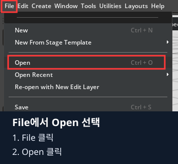

4. 파일 창의 주소에 **`/data/isaacsim_basic/`**를 입력하고 Enter를 누릅니다.
5. File name에 **`base_scene.usda`**를 입력하고 **Open File**을 클릭합니다.


6. Stage에서 World를 펼쳐 Light·PhysicsScene·Ground만 있는지 확인합니다. 없다면 [1장 2절](../01_object_physics/README.md#2-world조명중력바닥-만들기)을 먼저 마칩니다.
7. **File → Save As**로 주소는 같은 폴더, 이름은 **`my_lekiwi_scene`**, 형식은 **`*.usda`**로 저장합니다.


### 1.2. 로봇을 담을 LeKiwi 그룹 만들기

1. **Stop 상태**에서 Stage의 객체 이름이 없는 빈 영역을 클릭해 선택을 해제합니다.
2. **Create → Xform**을 클릭합니다.

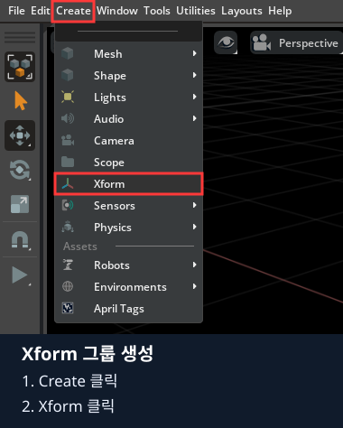

3. 새 Xform을 우클릭 → Rename으로 **`LeKiwi`**로 바꿉니다.
4. **이번 LeKiwi는 World 안쪽이 아닌 Stage 최상위**에 둡니다. World 아래에 생겼으면 Stage의 루트 빈 영역으로 끌어 옮깁니다.
5. LeKiwi를 선택하고 Property의 **Prim Path가 `/LeKiwi`**인지 확인합니다. `/World/LeKiwi`이면 한 단계 위로 옮겨야 합니다.

```text
World
├─ Light
├─ PhysicsScene
└─ Ground
LeKiwi               ← World와 같은 들여쓰기
```

지금은 빈 그룹이므로 로봇이 보이지 않아도 됩니다. 다음 단계에서 제공된 모델을 연결합니다.

### 1.3. 제공된 로봇 USD를 Reference로 연결

1. Stage에서 **LeKiwi 하나만 선택**합니다.
2. Property 위쪽 **Add → Reference**를 클릭합니다.

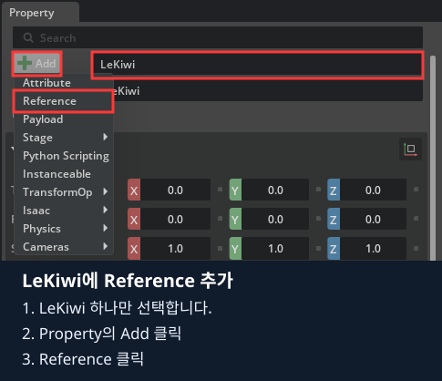

사진의 Property 이름과 Prim Path가 **LeKiwi, /LeKiwi**인지 먼저 확인합니다.

3. 참조할 파일 선택 창에서 주소를 다음 폴더로 이동합니다.

```text
/opt/lekiwi/isaac_sim/assets/lekiwi_soarm/usd/
```

4. 아래 File name에 **`lekiwi_soarm.usd`**를 입력하고 **Select**를 클릭합니다. 별도 Prim Path 선택이 요구되지 않으면 자산의 기본 Prim을 사용합니다.
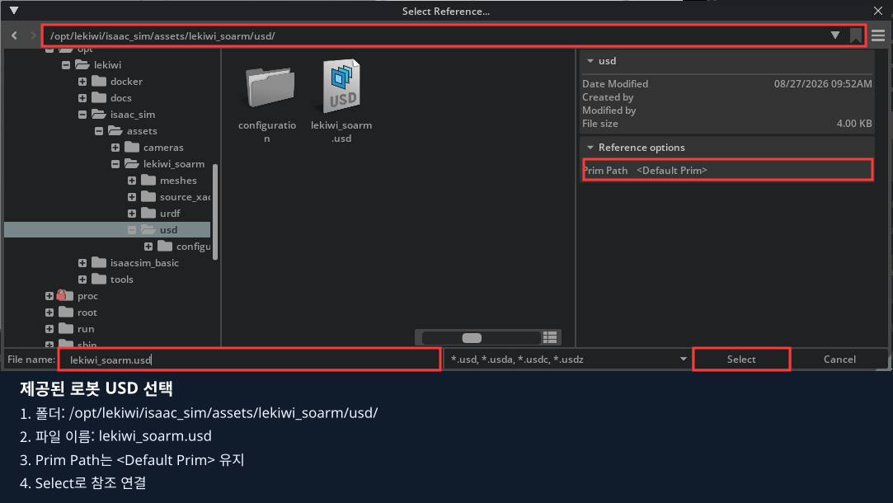

5. 잠시 기다렸다가 Stage의 LeKiwi 왼쪽 펼치기 표시를 클릭합니다. 로봇의 부품·관절과 뷰포트의 로봇 형상이 나타나는지 확인합니다.
6. Stage에서 **맨 위 LeKiwi**를 다시 클릭합니다. Transform을 다음처럼 입력합니다.

| LeKiwi의 줄 | X | Y | Z |
|---|---|---|---|
| Translate | `0` | `0` | `0.055` |
| Rotate 또는 Orient | `0` | `0` | `0` |
| Scale | `1` | `1` | `1` |

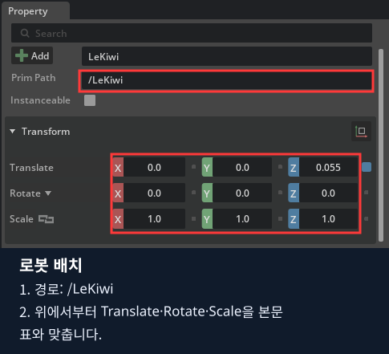

일반 설치에서는 저장소의 `isaac_sim/assets/lekiwi_soarm/usd/lekiwi_soarm.usd`를 선택합니다.
파일이 안 보이면 호스트 파일 탐색기가 아닌 **Isaac Sim 안의 파일 창**인지 확인합니다. `/opt/lekiwi/`는 수업 Docker 안의 경로입니다.
참조가 실패하면 경로와 오류를 확인합니다. 빈 그룹만 보인다고 같은 로봇을 반복해서 추가하지 않습니다.

이 자산은 형상·강체·충돌·관절을 포함합니다. 로봇 각 부품에 Rigid Body나 관절을 다시 추가하지 않습니다.
**원본 로봇 USD를 열어서 덮어쓰지 말고, 지금 만든 my_lekiwi_scene.usda에 배치를 저장**합니다.

## 2. 바닥과 큐브 만들기

### 2.1. Ground를 코스 높이에 맞추기

1. Stage에서 **World → Ground**를 클릭합니다. 로봇 아래의 다른 부품을 선택하지 않습니다.
2. Prim Path가 **`/World/Ground`**인지 확인합니다.
3. Transform 값을 입력합니다. 숫자는 Ctrl+클릭으로 바꾸고 Enter로 확정합니다.

| Ground의 줄 | X | Y | Z |
|---|---|---|---|
| Translate | `0` | `0` | `-0.071` |
| Rotate 또는 Orient | `0` | `0` | `0` |
| Scale | `7.4` | `7.4` | `0.1` |

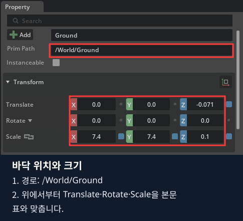

4. Property 검색창에 `size`를 입력해 **Size=`1`**을 확인합니다. 검색어를 지웁니다.
5. `collision`을 검색해 **Collision Enabled가 체크**인지 확인합니다. 바닥에는 Collider만 두고 Rigid Body는 추가하지 않습니다.

바닥 윗면은 `-0.071 + 0.1/2 = -0.021 m`입니다. 뒤에서 바구니 밑면도 이 높이에 맞춥니다.

### 2.2. PracticeCube 만들기

1. Stage에서 **World**를 클릭합니다.
2. **Create → Shape → Cube**를 선택합니다.


3. 새 Cube를 **`PracticeCube`**로 이름 바꾸고 World 아래로 옮깁니다. 경로는 **`/World/PracticeCube`**입니다.
4. Transform을 입력합니다.

| PracticeCube의 줄 | X | Y | Z |
|---|---|---|---|
| Translate | `0.7` | `0.35` | `0.001` |
| Rotate 또는 Orient | `0` | `0` | `0` |
| Scale | `1` | `1` | `1` |

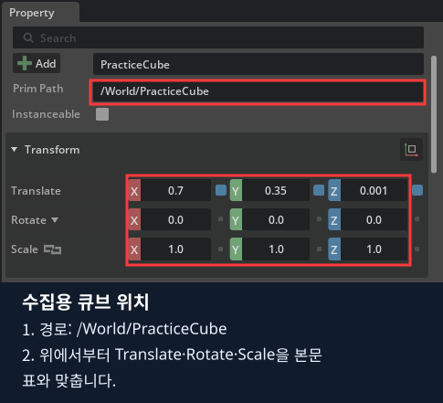

5. Property에서 `size`를 검색해 **Size=`0.04`**를 입력합니다. 한 변이 4 cm인 큐브입니다. 검색어를 지웁니다.
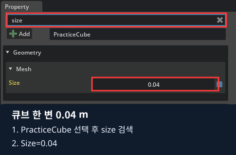

6. **PracticeCube를 선택한 채** Add → Physics에서 **Rigid Body**, **Collider**, **Mass**를 각각 추가합니다.

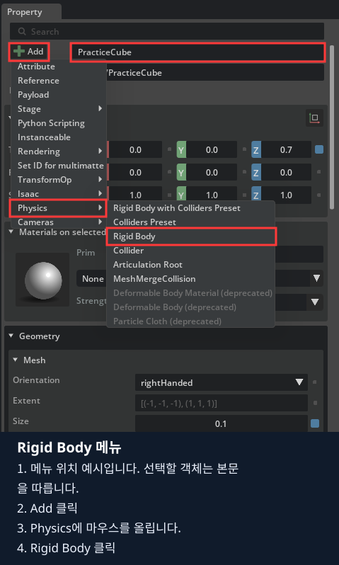

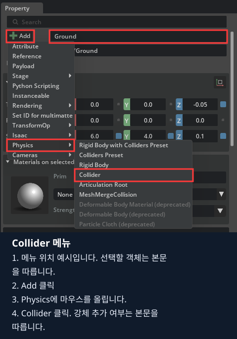


7. Property에서 `mass`를 검색해 **Mass=`0.035` kg**을 입력합니다. 검색어를 지웁니다.
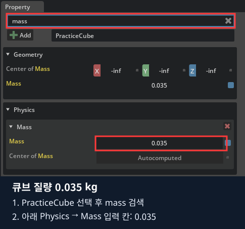

8. Rigid Body Enabled·Collision Enabled는 체크, **Disable Gravity는 해제**인지 확인합니다.

이제 로봇 옆 바닥 가까이에 작은 큐브가 있습니다. 사진과 색이 달라도 크기·위치·물리 설정을 기준으로 확인합니다.

## 3. 바닥과 네 벽으로 열린 바구니 만들기

### 3.1. Basket 그룹의 위치부터 정하기

1. Stage의 **World를 선택 → Create → Xform**으로 그룹을 만듭니다.
2. 이름을 **`Basket`**으로 바꾸고 **`/World/Basket`** 경로를 확인합니다.
3. Basket의 **Translate=`(1.2, 0, -0.021)`**, 회전=`(0,0,0)`, Scale=`(1,1,1)`을 입력합니다.

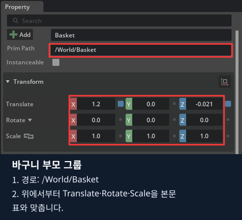

Basket 자체에는 Rigid Body나 Collider를 추가하지 않습니다. 아래 다섯 Cube가 바구니의 실제 표면입니다.

### 3.2. 바구니 밑판 Bottom 만들기

1. **Basket를 선택**하고 Create → Shape → Cube를 클릭합니다.
2. 새 Cube를 **`Bottom`**으로 이름 바꿉니다. Basket 밖에 생겼으면 Basket 위로 드래그합니다.
3. Prim Path가 **`/World/Basket/Bottom`**인지 확인한 뒤 값을 입력합니다.

| Bottom의 줄 | X | Y | Z |
|---|---|---|---|
| Translate | `0` | `0` | `0.0075` |
| Rotate 또는 Orient | `0` | `0` | `0` |
| Scale | `0.44` | `0.44` | `0.015` |

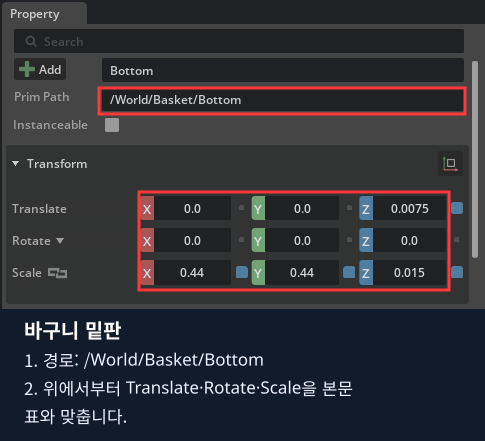

4. `size`를 검색해 **Size=`1`**로 바꾸고 검색어를 지웁니다.
5. **Bottom에 Add → Physics → Collider만 추가**합니다. Collision Enabled를 확인합니다.

위치는 **Basket 기준 로컬 위치**입니다. Bottom의 Z 칸에 바닥의 월드 높이 `-0.021`을 다시 넣지 않습니다.

### 3.3. 네 벽을 하나씩 만들기

각 벽마다 **Basket 클릭 → Create → Shape → Cube → 이름 변경 → Basket 아래 경로 확인 → 값 입력 → Collider 추가**를 반복합니다.
이름을 바꾼 것만으로 모양이 바뀌지는 않습니다. 네 벽의 Size=`1`, 회전=`0`을 모두 확인합니다.

| 이름 | Translate X / Y / Z | Scale X / Y / Z |
|---|---|---|
| `Left` | `0` / `0.2125` / `0.09` | `0.41` / `0.015` / `0.18` |
| `Right` | `0` / `-0.2125` / `0.09` | `0.41` / `0.015` / `0.18` |
| `Front` | `0.2125` / `0` / `0.09` | `0.015` / `0.44` / `0.18` |
| `Back` | `-0.2125` / `0` / `0.09` | `0.015` / `0.44` / `0.18` |

1. 먼저 Left 한 개를 완성합니다. 경로는 `/World/Basket/Left`입니다.
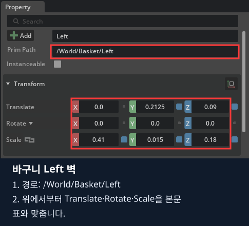

2. Basket를 다시 선택해 Right를 만들고 **Y의 마이너스 부호**를 확인합니다.
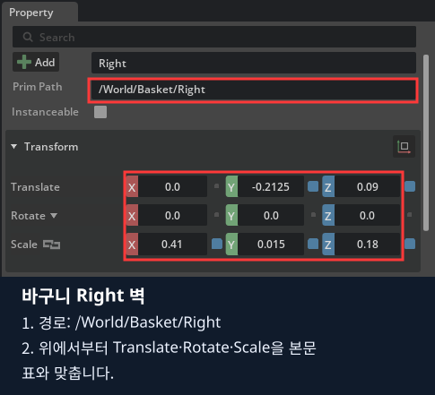

3. Basket를 다시 선택해 Front를 만듭니다. 이번에는 **Scale X가 얇고 Y가 길어집니다.**
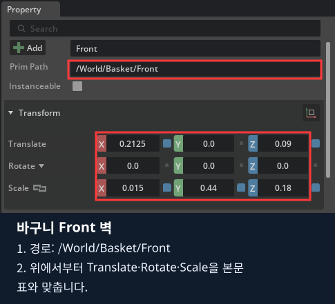

4. 마지막으로 Back을 만들고 **Translate X의 마이너스 부호**를 확인합니다.
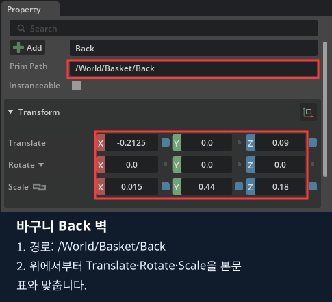

5. 네 벽에도 Collider만 추가합니다. **Rigid Body는 추가하지 않습니다.**

Stage는 다음 구조가 됩니다. 다섯 부품은 서로 부모·자식이 아니라 모두 Basket의 자식입니다.

```text
World
└─ Basket
   ├─ Bottom
   ├─ Left
   ├─ Right
   ├─ Front
   └─ Back
```

### 3.4. 입구가 열린 충돌 구조 확인

1. Stage에서 Bottom을 클릭하고 Ctrl을 누른 채 Left·Right·Front·Back을 클릭해 **다섯 Cube를 선택**합니다.
2. 뷰포트 위쪽의 **눈 모양 표시 메뉴**를 엽니다.
3. **Show By Type → Physics → Colliders → Selected**를 선택합니다.
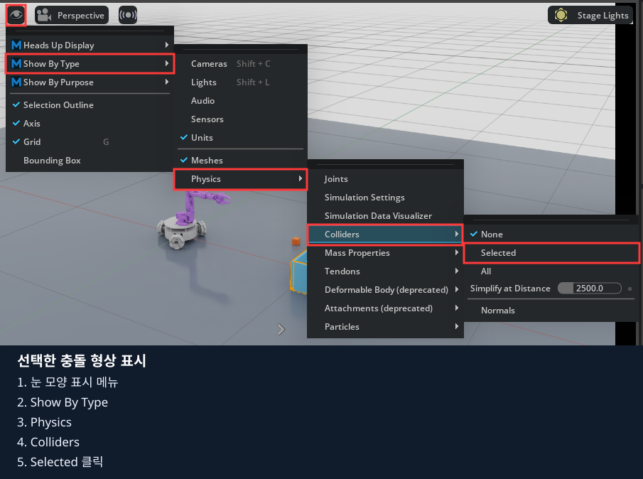

4. 다섯 부품의 충돌 윤곽이 보이는지 확인합니다. 메뉴 위치는 [NVIDIA 물리 안내](https://docs.isaacsim.omniverse.nvidia.com/5.1.0/physics/simulation_fundamentals.html)의 충돌 형상 표시 순서와 같습니다.

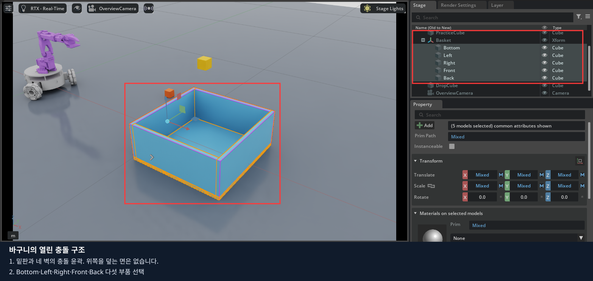

표시된 충돌 윤곽에서 **밑판과 네 벽, 열린 윗면**을 확인합니다.
위쪽 전체를 덮는 하나의 충돌 상자가 있으면 큐브가 안으로 들어가지 못합니다. Basket 부모에 큰 Collider를 추가하지 않습니다.

### 3.5. DropCube를 떨어뜨려 확인

1. 표시 메뉴를 닫고 **Stage의 World**를 클릭합니다. Basket를 선택한 채 만들지 않습니다.
2. Create → Shape → Cube로 새 물체를 만들고 **`DropCube`**로 이름 바꿉니다.
3. 경로가 **`/World/DropCube`**인지 확인합니다.
4. **Translate=`(1.2,0,0.4)`**, 회전=`0`, Scale=`1`, **Size=`0.04`**를 입력합니다.
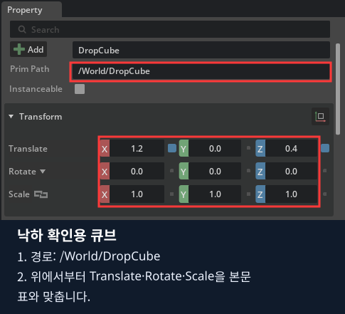

5. Rigid Body·Collider·Mass를 추가하고 **Mass=`0.035`**, Disable Gravity=해제로 맞춥니다.
6. 왼쪽 **▶ Play**를 한 번 누릅니다. DropCube가 내려와 바구니 안에 안착하는지 관찰합니다.
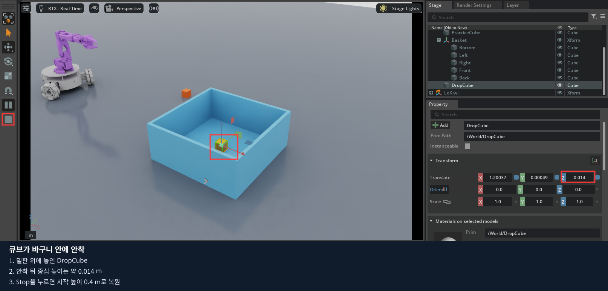

7. **■ Stop**으로 처음 높이에 되돌립니다. 이 단계에서는 키보드로 로봇을 조작하지 않습니다.

큐브가 바구니 밖에 떨어지면 경로·월드 위치를, 통과하면 Bottom과 큐브의 Collider를 확인합니다.
바구니 전체가 떨어지면 벽·밑판·Basket에 잘못 추가한 Rigid Body가 없는지 확인합니다.

## 4. 관찰 카메라 추가하기

### 4.1. 현재 시점을 카메라로 만들기

1. Stop 상태에서 뷰포트 위쪽의 활성 시점이 **Perspective**인지 확인합니다.
2. Stage의 Basket를 선택하고 뷰포트에 마우스를 놓은 뒤 **F**를 눌러 바구니를 화면에 맞춥니다.
3. 마우스 휠로 조금 뒤로 물러나 큐브와 바구니가 함께 보이게 합니다. 아직 Camera 객체를 조절하는 단계가 아닙니다.
4. 뷰포트 위쪽 **Perspective 버튼을 클릭 → 메뉴 아래쪽 Create from View**를 클릭합니다. Cameras 하위 목록과 구분합니다.

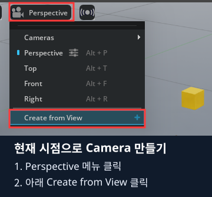
5. Stage에 생긴 새 Camera를 **`OverviewCamera`**로 이름 바꿉니다.
6. 뷰포트의 카메라 메뉴에서 **OverviewCamera**를 선택하고, 활성 시점 이름도 바뀌었는지 확인합니다.

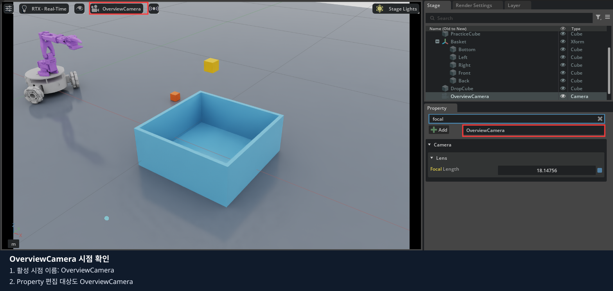

사진처럼 활성 시점 이름이 **OverviewCamera**로 바뀌어야 합니다.
Create from View는 현재 보이는 시점을 카메라로 만드는 기능입니다. [NVIDIA 카메라 안내](https://docs.isaacsim.omniverse.nvidia.com/5.1.0/robot_setup_tutorials/tutorial_gui_camera_sensors.html)에도 이 순서가 설명되어 있습니다.

### 4.2. 렌즈 변경과 복원

1. Stage에서 **OverviewCamera**를 클릭합니다. Type이 Camera인지 확인합니다.
2. Property의 **Camera → Lens → Focal Length**를 찾습니다. 기존 값을 먼저 읽습니다.

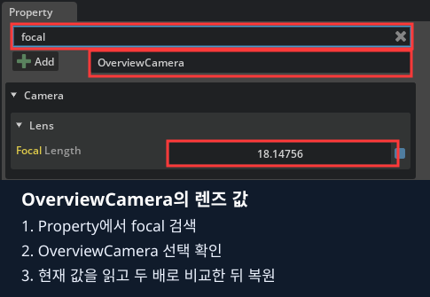

**본인 OverviewCamera의 현재 값**을 기준으로 비교합니다. Create from View로 가져온 시점에 따라 값이 달라질 수 있습니다.

3. 현재 값의 **두 배**를 입력합니다. 예를 들어 24이면 48입니다.
4. 바구니가 더 크게 보이고 주변이 덜 보이는지 확인합니다.
5. **처음 읽은 값으로 복원**합니다. 촬영 시점에서는 마우스로 카메라를 움직이지 않습니다.

OverviewCamera는 관찰용 고정 카메라입니다. 마지막 기록 프로그램의 전방·손목 카메라와는 별개입니다.

## 5. 저장하고 직접 만든 환경 정리하기

1. Stop 상태인지 확인합니다. DropCube는 처음 높이로 돌아와야 합니다.
2. Stage에서 `/LeKiwi`, World 아래 Ground·PracticeCube·Basket·DropCube와 OverviewCamera를 확인합니다.
3. **File → Save**로 `my_lekiwi_scene.usda`를 저장합니다. 처음에 사본 저장을 건너뛰었다면 Save As에서 이 이름과 `*.usda` 형식을 선택합니다.
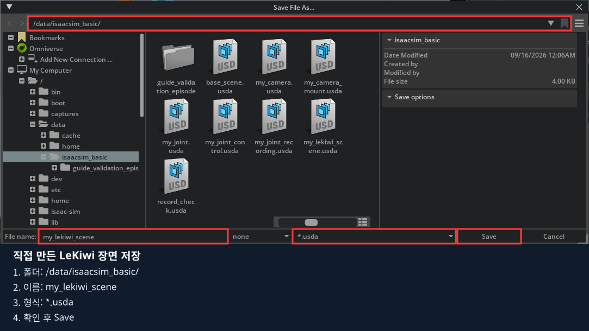

4. **File → Open**으로 `/data/isaacsim_basic/my_lekiwi_scene.usda`를 다시 엽니다.
5. 로봇·열린 바구니·큐브가 보이는지, OverviewCamera를 선택하면 시점이 바뀌는지 확인합니다.

**지금 저장한 USD는 장면입니다. 사람의 시연이나 시간별 RGB·명령 데이터는 아직 기록하지 않았습니다.**
아래 코드 절에서는 직접 만든 구성 요소를 코드와 비교하고, 실제 수집용 코스를 별도로 실행합니다.

## 6. 마지막: 같은 작업을 코드로 구현하기

먼저 직접 만든 구성 요소가 어떤 코드에 대응하는지 확인합니다. 이어 준비된 기록 환경에서 시연·저장·변환을 진행합니다.
**현재 기록기는 앞에서 저장한 임의 USD를 여는 방식이 아닙니다.** 전체 코스·두 카메라·초기 배치 정보가 연결된 환경을 사용합니다.
앞의 간단한 제작 장면과 실제 수집 환경의 차이를 확인합니다.

| 구성·작업 | 화면으로 하는 일 | 코드에서 같은 역할 |
|---|---|---|
| 로봇 | Xform에 제공 USD를 Reference로 추가 | `keyboard_drive.py`의 `WheeledRobot(... usd_path=...)` |
| 바닥·큐브·바구니 | Shape 생성, Transform·Rigid Body·Collider 설정 | `collection_course.py`의 `build_course()`·`_build_basket()` |
| 도로·색상별 배치 | 객체를 배치하고 색상 지정 | `color_course.py`의 `build_color_geometry()`와 배치 생성 |
| 카메라 | Camera 생성·부모·렌즈 속성 설정 | `robot_cameras.py`의 `attach_cameras()` |
| 시연 | 준비된 기록 환경에서 주행·기록 키 조작 | 입력 처리와 `RecordingPanel` |
| RGB·상태·명령의 시간 연결 | 기록 상태와 로그 확인 | `before_step()`·`after_step()`·`accept_capture()` |
| LeRobot 변환·업로드·ACT | 같은 노트북 터미널에서 학생 스크립트 실행 | 03~07번 학생 파일 |


기록 구현은 [01_lekiwi_recording.py](experiments/01_lekiwi_recording.py)에 있습니다.
이 파일은 프로젝트 로봇 자산·EpisodeWorker·데이터 형식을 사용하므로 저장소 전체가 필요합니다.
직접 만든 USD를 저장하고 빈 편집 화면을 종료한 다음 아래로 이어갑니다.

### 코드 실행과 수정 순서

설치는 0장에서 마쳤다고 가정합니다. 다음 명령을 저장소 루트에서 실행합니다.

같은 노트북의 저장소 루트 터미널:

```bash
./lekiwi basic --chapter 6
```

1. 이 절에 연결된 Python 파일을 열고, 앞에서 클릭했던 속성에 해당하는 줄을 찾습니다.
2. 기본 실행 결과를 직접 만든 환경의 결과와 비교합니다.
3. 실행을 종료한 뒤 지정된 기본 줄에 `#`를 붙이고 비교할 줄의 `#`를 지웁니다. 들여쓰기는 유지합니다.
4. 파일을 저장하고 같은 명령으로 다시 실행합니다. 화면에서 값을 바꾸는 실험과 결과를 비교합니다.

코드 수정 전 Isaac Sim 창을 닫고, 수정 파일을 저장한 뒤 같은 명령으로 재실행합니다.
학생 파일은 호스트에서 저장하면 다음 실행에 반영되며, 코드만 수정할 때 Docker 이미지 재빌드는 필요 없습니다.

### 6.1. 기록 환경 실행과 기본값 수정

`./lekiwi record`도 같은 기록 코드를 사용합니다. 처음에는 실물 리더 없이 키보드로 짧은 직진·정지를 기록합니다.
좌측 Perspective / 우측 front 화면이 열립니다. 별도 기록 탭은 없습니다.
터미널에서 `LEKIWI_RECORD state=READY`까지 기다립니다.


**먼저 완성된 기록 환경을 화면에서 확인합니다. 아직 F5를 누르지 않습니다.**

1. Stage의 LeKiwi를 펼쳐 로봇 링크·관절을 봅니다.
2. CollectionCourse에서 큐브·바구니를 찾고, 앞서 직접 만든 형상·질량·Collider와 비교합니다.
3. Stage 검색에서 Camera 타입을 찾아 전방·손목 카메라의 부모를 확인합니다.
4. Viewport 카메라 메뉴에서 두 시점을 각각 확인합니다. 앞의 OverviewCamera와 역할이 다릅니다.

현재 환경에서는 관찰만 합니다. 기록 도중 객체 위치·카메라 설정을 바꾸지 않습니다.

`RecordingPanel`은 이전 코드와의 호환을 위한 클래스 이름이며 UI 창을 만들지 않습니다.
생성자에서 다음 부분을 찾아 기본 30초 줄 대신 120초 또는 0 줄을 활성화합니다.

```python
self.duration_seconds = 30
# self.duration_seconds = 120
# self.duration_seconds = 0
```

0은 무제한이며 F6으로 끝냅니다. 시간은 시뮬레이션 시간 기준입니다.
파일 수정 없이 실행별 값을 지정하려면 다음처럼 합니다. 환경변수 값이 코드 기본값보다 우선합니다.

```bash
LEKIWI_RECORD_SECONDS=120 ./lekiwi record
```

파일 상단의 `task_description`은 **이번 시연에서 수행할 작업 설명**입니다. 기본 줄을 주석 처리하고 집기 과제 줄을 해제합니다.

```python
# task_description = "Move forward and stop"
task_description = "빨간 큐브를 빨간 바구니에 넣기"
```

설명은 에피소드의 `manifest.json` 안에 `task`로 저장되고, LeRobot 변환 시에도 같은 `task`로 전달됩니다.
같은 의미의 시연에는 일관된 설명을 사용합니다. 설명을 바꾸면 저장할 작업 이름이 바뀌며, 로봇이 자동으로 그 작업을 수행하는 것은 아닙니다.
`LEKIWI_RECORD_TASK` 환경변수에 비어 있지 않은 값을 지정하면 파일의 기본 설명보다 우선합니다.
지정하지 않거나 비우면 코드의 `task_description`을 사용합니다.

노트북의 편집기에서 이 파일을 수정하고 `Ctrl+S`로 저장합니다.
이미 실습이 켜져 있으면 기록의 저장·폐기를 마친 뒤 Isaac Sim 창을 닫고 `./lekiwi basic --chapter 6`으로 재실행합니다.
지금은 키보드 기록 검사입니다. 실제 리더 시연은 6.6절에서 같은 노트북의 USB에 리더를 연결해 실행합니다.

### 6.2. 기록·저장·폐기

Viewport를 클릭한 상태에서 한 번씩 누릅니다. 파일 작업은 키 콜백이 아닌 주 반복문에서 처리합니다.

| 키 | 동작·조건 |
|---|---|
| F5 | READY / SAVED / DISCARDED에서 새 기록 시작 |
| F6 | 수집 종료 요청. 마지막 영상·파일 쓰기가 끝나면 UNSAVED |
| F7 | UNSAVED 기록을 실패·연습(success=false)으로 저장 |
| F9 | 통신 중단 없이 마친 UNSAVED 기록을 성공(success=true)으로 저장 |
| F10 두 번 | 3초 안에 두 번 눌러 이번 미저장 기록 폐기 |
| F8 | 저장·폐기 완료 후 로봇 초기화·라인별 큐브 재배치 |
| SPACE | 로봇 주행·가상 팔 추종 정지. 파일 수집은 별도로 F6 |

화면 왼쪽 위의 상태 표시에서 수집 여부와 시간을 확인합니다.


위 화면은 리더를 연결하지 않고 상태 표시를 검사한 예시입니다. `ARM Stopped`에서도 기록은 가능하며, 실제 시연에서는 팔 추종 상태도 함께 확인합니다.

| 화면 표시 | 뜻 |
|---|---|
| `READY` | F5로 새 기록을 시작할 수 있음 |
| 빨간 `REC / RECORDING` | 수집 중. 현재 에피소드 시간 / 최대 시간과 프레임 수 표시 |
| `FINISHING` | 마지막 영상과 파일 쓰기를 기다리는 중 |
| `STOPPED / NOT SAVED` | F6으로 수집을 끝냈지만 아직 저장하지 않음 |
| `SAVING` → `SAVED` | 검증·저장 진행 → 저장 완료 |
| `RECORDING ERROR` | 오류 확인 후 F10을 두 번 눌러 해당 기록 폐기 |

시간은 **수집한 프레임 수 ÷ 30 FPS인 시뮬레이션 시간**입니다. 실행이 느리면 실제 대기 시간과 다를 수 있습니다.
시간 제한이 0이면 `NO LIMIT`로 표시됩니다. 리더 입력 사용 시 `ARM Following leader` 또는
`ARM Stopped - R to resume`도 함께 표시합니다. Space로 팔을 멈춘 경우 수집 종료는 별도로 F6을 누릅니다.
입력이 멈췄거나 USB 오류가 나면 아래 절차로 기록을 정리합니다.
상태 표시는 Viewport UI에만 그려지며 저장하는 front/wrist 영상에는 포함되지 않습니다.

1. READY를 확인하고 F5를 누릅니다.
2. 짧게 W로 전진한 뒤 이동키를 모두 놓고 SPACE로 정지합니다.
3. F6을 누릅니다. FINISHING 동안 마지막 RGB와 파일 쓰기를 기다립니다.
4. UNSAVED에서 결과를 검토하고 F7 또는 F9를 누릅니다.
5. `SAVING → SAVED`와 `LEKIWI_RECORD saved=... frames=...`를 확인합니다.

성공 표시는 자동 판정이 아닙니다. 실제 과제를 완료했을 때만 F9를 사용합니다.
F10은 이미 저장된 에피소드를 지우지 않습니다. 기록 중 Pause/Stop은 시간 연결 오류가 되므로 해당 take를 폐기하고 새로 시작합니다.
F8은 미저장·기록·저장 진행 중에 차단됩니다. 완료 후 재배치하고 리더 사용 시 R을 다시 누릅니다.

#### 기록 중 입력이 멈추면

팔이 멈춘 것과 데이터 수집이 끝난 것은 다릅니다. 화면의 `REC`·프레임 수를 확인합니다.

1. 이동키를 놓고 리더를 멈춘 뒤 **Space**로 가상 로봇을 정지합니다.
2. `REC`이면 **F6**으로 수집을 끝내고 `FINISHING`이 완료될 때까지 기다립니다.
3. `NOT SAVED`이면 **F7**로 연습 저장하거나 **F10 두 번**으로 폐기합니다. 문제가 있던 시연을 성공으로 표시하지 않습니다.
4. [4장 입력 복구](../04_teleoperation/README.md#47-실습-중-늦어지거나-멈추면)에 따라 USB·팔 추종을 확인합니다.
5. 화면과 입력이 정상인 상태에서 **F5**로 새 에피소드를 시작합니다. 기존 기록을 이어 붙이지 않습니다.

USB 오류로 실행 자체가 종료됐다면 로그를 확인하고, 미완료 `.partial` 폴더는 학습에 사용하지 않습니다.
실행 중인 기록은 저장·폐기를 마치기 전에 창을 닫지 않습니다.

### 6.3. 원본 파일과 시간 순서

```text
/data/recordings/lekiwi.XXXXXXXX/
  episode.XXXXXXXX/
    manifest.json
    frames.jsonl
    images/front/
    images/wrist/
```

정확한 파일·카메라 경로는 manifest에 기록됩니다. `.partial`은 미완료이며 완성 데이터로 쓰지 않습니다.
한 프레임은 관측 상태 t, 두 RGB t, action t, 후속 상태 t+1/30초를 담습니다.
팔 6개 관절은 rad, 베이스 명령은 m/s·rad/s이며 순서는 manifest의 feature 설명을 따릅니다.
카메라 장착·보정값, 초기 코스, 작업 설명, 성공 여부도 manifest에 남깁니다.

PNG 저장은 백그라운드에서 수행합니다. 저장이 밀리거나 RGB 프레임이 빠지면 ERROR로 중단합니다.
프레임을 조용히 생략한 데이터셋을 만들지 않습니다. 터미널 오류와 저장 공간을 확인한 뒤 새로 수집합니다.

### 6.4. 영상이 만들어지는 코드

```python
product = rep.create.render_product(camera_path, resolution)
rgb = rep.AnnotatorRegistry.get_annotator("rgb")
rgb.attach([product.path])
rgba = np.asarray(rgb.get_data())
```

실제 파일은 front·wrist 각각에 Render Product와 RGB annotator를 연결합니다.
`get_data()`의 결과는 최신 도착 영상입니다. **현재 물리 스텝과 같은 시각이라고 가정하면 안 됩니다.**

`snapshot()`은 ReferenceTime을 카메라의 실제 시뮬레이션 촬영 시각으로 바꾸고 두 카메라의 시각이 같은지 검사합니다.
`before_step()`은 상태·명령을 보관하고, `after_step()`은 다음 상태를 연결합니다.
`accept_capture()`가 늦게 도착한 RGB를 원래 촬영 시각의 상태·명령에 연결합니다.
이 교재의 기록 실행은 렌더 완료를 기다리는 동기 설정을 사용합니다. 명령 전 t의 영상을 잠시 보관하고, 물리 스텝 후 t+dt 상태와 합쳐 저장합니다.
지연 영상도 촬영 시각으로 검사합니다. 매 프레임 타임라인 Pause/Play를 반복하지 않습니다.

다음 읽기 과제: `world.current_time`으로 모든 영상 시각을 덮어쓰면 왜 학습 데이터가 잘못될 수 있는지 설명합니다.
시간 검사는 삭제하지 말고 의미를 읽습니다.

### 6.5. LeRobot 데이터셋으로 변환하고 업로드하기

기록을 저장하고 Isaac Sim 창을 닫습니다. 이후 명령도 **같은 노트북**에서 실행합니다.
VS Code에서 아래 학생 파일의 설정을 수정하고 저장합니다. 이 절의 `python3` 파일들은 Docker 실행기에 설정을 전달하므로 호스트에 LeRobot을 설치하지 않습니다.

저장소 루트의 터미널에서 목록을 확인합니다.

```bash
python3 isaacsim_basic/06_lekiwi_dataset/experiments/02_dataset_list.py
```

[03_convert_dataset.py](experiments/03_convert_dataset.py)의 `episode_ids`에 목록의 실제 `id`를 넣습니다.
`dataset_name`은 새 이름으로 정합니다. `success_only=False`는 선택한 연습·성공 기록 모두, `True`는 F9 성공 기록만 변환합니다.
예시의 ID를 그대로 쓰지 말고 본인 목록에서 복사합니다.

```bash
python3 isaacsim_basic/06_lekiwi_dataset/experiments/03_convert_dataset.py
```

변환 결과의 `name`, `episodes`, `frames`를 확인합니다.
[04_inspect_dataset.py](experiments/04_inspect_dataset.py)의 `dataset_name`을 같은 값으로 저장한 뒤 검사합니다.

```bash
python3 isaacsim_basic/06_lekiwi_dataset/experiments/04_inspect_dataset.py
```

**완료 기준:** 오류 없이 종료되고, 검사 결과에 선택한 데이터셋 이름·에피소드·프레임 수·features가 표시됩니다.
`data/datasets/<dataset_name>/recording_report.json`의 완료 보고서도 확인합니다.


사진은 이전에 검사한 **2개 에피소드·19프레임**의 변환 예시입니다. 이번 수집의 값은 본인 터미널과 보고서에서 확인합니다.

```text
data/datasets/lekiwi_lesson6_01/
  data/                 상태·행동 Parquet
  videos/               front·wrist 영상
  meta/                 feature·통계·에피소드 정보
  recording_report.json 변환 완료·입력 출처·카메라 설정·검사 결과
```

변환기는 LeRobot의 `finalize()`로 파일을 닫고 다시 열어 프레임 수와 두 영상의 디코딩을 검사합니다.
카메라 장착값·해상도가 다른 기록을 섞지 않으며 기존 출력 폴더를 덮어쓰지 않습니다.
실패했다면 원본·오류를 확인하고 새 출력 이름으로 시도합니다. 이는 파일 검사이며 정책 성능이나 물리 재생 검사는 아닙니다.
프로그램이 실행되는 동안 터미널을 유지합니다. Ctrl+C로 중단했다면 오류·출력 폴더를 확인하고, 완료 보고서가 없는 데이터를 사용하지 않습니다.

**선택: Hugging Face 업로드.** 로컬 데이터로 학습한다면 건너뜁니다.
[05_upload_dataset.py](experiments/05_upload_dataset.py)의 `dataset_name`, `repo_id`, `private`를 수정합니다.
`repo_id`의 `account`를 본인 계정으로 바꾸고 새 저장소 이름을 사용합니다. 기본값 `private=False`는 공개 업로드입니다.

```bash
python3 isaacsim_basic/06_lekiwi_dataset/experiments/05_upload_dataset.py
```

Docker 준비 후 터미널에 나타나는 입력란에 Hugging Face 쓰기 토큰을 입력합니다. 화면에는 표시하지 않으며 코드·명령행에 적지 않습니다.
학습용 `data/`, `meta/`, `videos/`와 자동 생성한 데이터셋 카드를 업로드합니다. 로컬 경로가 있는 보고서는 제외합니다.
결과에 데이터셋 `url`이 출력되면 브라우저에서 카드와 파일을 확인합니다. LeRobot 형식 버전인 `v3.0` 태그도 확인한 뒤 완료를 보고합니다.
기존 데이터·버전 태그가 있으면 중단하므로 다른 자료를 덮어쓰지 않습니다.

### 6.6. 같은 노트북에 리더암을 연결해 시연 수집하기

**USB 연결·시뮬레이션·키보드 조작 모두 지금 사용하는 노트북 한 대에서 진행합니다.**
현재 기록을 저장하고 Isaac Sim 창을 닫습니다. `./lekiwi status`에서 이전 실행이 끝났는지 확인합니다.

1. [4장 4.4~4.5절](../04_teleoperation/README.md#44-so101-리더-실습-준비)의 고정 상태·케이블·전원 차단 방법을 확인합니다. 토크 해제 시 팔을 지지하고, 장비 준비 안내에 직접 응답합니다.
2. SO101 리더 USB를 이 노트북에 연결하고 실제 장치 경로를 확인합니다.

```bash
ls -l /dev/serial/by-id/
```

3. 아래 `usb-본인_SO101_장치`를 실제 경로로 바꿉니다. 같은 리더는 기존 보정과 같은 `--id`를 사용합니다. 저장소 루트에서 실행합니다.

```bash
LEKIWI_RECORD_SECONDS=120 LEKIWI_RECORD_TASK='빨간 큐브를 빨간 바구니에 넣기' \
  ./lekiwi teleop --port /dev/serial/by-id/usb-본인_SO101_장치 \
  --id so101_leader --scene random --record
```

4. 터미널의 연결·보정 질문을 한 단계씩 완료합니다. 토크 해제와 보정 재사용·재측정 확인은 자동으로 생략하지 않습니다.
5. `SO101 calibration=READY torque=OFF`와 Isaac Sim 창을 확인합니다. 팔 자세가 안전한지 확인하고 Viewport를 클릭한 뒤 **R**로 가상 팔 추종을 켭니다.
6. 리더의 어깨와 집게를 천천히 움직여 화면의 팔과 집게가 따라오는지 확인합니다. **W/S 전후, A/D 좌우, Q/E 회전**, **Space 정지**도 한 방향씩 확인합니다.
7. **F5 → 시연 → F6 → F7(연습) 또는 F9(성공)** 순서로 저장하고 `SAVED`를 확인합니다. 리더만 움직여서는 기록이 시작되지 않습니다.

새 데이터를 수집했다면 **6.5절로 돌아가 새 에피소드 ID를 선택하고 변환·검사**합니다.
종료 시 Space로 가상 로봇을 멈추고, 리더를 안전하게 지지한 상태에서 창을 닫습니다. 터미널의 토크 종료 확인과 컨테이너 종료를 확인합니다.

### 6.7. ACT 학습 스크립트

시뮬레이션과 리더 세션을 정상 종료한 뒤 진행합니다. 학습할 때 리더 연결은 필요하지 않습니다.
[06_train_act.py](experiments/06_train_act.py)의 `dataset_name`을 변환·검사한 이름으로, `run_name`은 새 이름으로 저장합니다.

```python
dataset_name = 'lekiwi_lesson6_01'
repo_id = None
run_name = 'act_lesson6_check_01'
steps = 1
batch_size = 1
pretrained_backbone = False
```

위는 **학습이 실행되고 모델이 저장되는지만 확인하는 설정**입니다. 실제 과제 성능을 학습하는 횟수가 아닙니다.
본 학습은 충분한 시연과 별도의 `run_name`을 사용하고 횟수·배치 크기를 정합니다.
`pretrained_backbone=True`이면 최초 가중치 다운로드에 인터넷이 필요합니다. 공개 Hub 데이터는 `dataset_name=None`, `repo_id='계정명/데이터셋명'`으로 선택합니다.

저장소 루트에서 실행합니다.

```bash
python3 isaacsim_basic/06_lekiwi_dataset/experiments/06_train_act.py
```

같은 터미널에서 진행·손실·오류를 확인합니다. Ctrl+C는 학습 프로세스와 이번 학습 컨테이너를 종료합니다.
**완료 기준:** `LEKIWI_ACT_TRAIN result=PASS`와 `data/outputs/<run_name>/train/checkpoints/last/pretrained_model/`의 모델을 확인합니다.
중단·실패했다면 원인을 확인하고 새 `run_name`으로 실행합니다. 기존 결과를 삭제하거나 덮어쓰지 않습니다.
GPU·메모리 환경에 따른 실행은 해당 노트북에서 확인하며, 학습 중 Isaac Sim을 동시에 실행하지 않습니다.

### 6.8. ACT 추론 스크립트

[07_infer_act.py](experiments/07_infer_act.py)의 `run_name`을 학습 결과와 같은 이름으로 저장합니다.
`checkpoint='last'`는 마지막 모델, `seconds=30`은 R을 누른 뒤 진행할 최대 시뮬레이션 시간입니다.

```bash
python3 isaacsim_basic/06_lekiwi_dataset/experiments/07_infer_act.py
```

같은 노트북에 Isaac Sim 창이 열리면 Viewport에서 **R 시작 / Space 정지 / F8 초기화**를 사용합니다.
모델·정규화 통계·카메라 설정·상태와 행동 순서를 같은 학습 결과에서 읽습니다. 실제 follower를 움직이는 기능은 없습니다.
종료는 Isaac Sim 창 닫기 또는 실행 터미널의 Ctrl+C입니다.
모델 오류는 시작 때 출력한 `data/policy/act.*/policy.log`, 시뮬레이션 상태는 실행 터미널의 `LEKIWI_ACT_INFERENCE`에서 확인합니다.

| 표시 | 다음 행동 |
|---|---|
| RUNNING | 추론 중. 모델 계산을 기다리는 동안 물리 시간이 멈출 수 있습니다 |
| FINISHED | 지정한 시간을 마쳤습니다. 다시 시작하려면 R |
| STOPPED | Space·일시정지 등으로 정지했습니다. 화면·자세를 확인하고 Play 상태에서 R |
| READY: 초기화 완료 | F8로 새 장면을 준비했습니다. 배치를 확인한 뒤 R |
| ERROR | 로그에서 원인을 확인하고 강사에게 알립니다 |

추론의 실제 화면·시작·정지·재시작과 전체 수집 흐름은 최종 리허설에서 검증합니다.
과거 환경의 확인 범위는 [ACT 리허설 기록](../../docs/act-rehearsal-20260913.md)에 있습니다. 이번 노트북 실행 확인과 구분합니다.
실행 검사 모델로 집기 과제 성공을 기대하지 않습니다.

완료 기준: 실제 저장된 에피소드와 변환 결과에서 프레임 수·저장 경로를 확인합니다. 학습 실행과 추론은 각각 로그와 실제 동작으로 확인하며, 실행하지 않은 단계는 완료로 판단하지 않습니다.

[공식 자료](SOURCES.md) · [전체 목차](../README.md)
